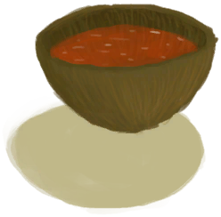

# Chine Rose Effect  
> "Lowers stress  
> China Rose can be found in the <b>Highland Jungles</b> of the island.  Its flowers are edible and can be soaked in boiling water to make a special <b>Tea</b> with relaxing and immune system boosting properties.  They can also be <b>Worn</b> in your hair or used by bees to make <b>Honey</b>.   
  

<b>Base Value: </b> 0 
  

<b>Value Range: </b> 0 ~ 48 
  

<b>Base Rate: </b> -1 / /TP 
  
## Statuses  

<table><tr style="height:2em;"><td style="background-color:#F0F0F0;text-align:center;width:180px;font-size:1.4em;font-weight:bold;vertical-align:middle;">
1 ～ 24

2% ～ 50%
</td><td colspan=2 style="font-size:1.1em;vertical-align:middle;background-color:#F9F9F9;">
<b>

Moderate China Rose Effect</b>

</td></tr><tr><td colspan=2><b>Effect：</b>[

[Stress](Stress.md)](Stress.md)addition<b>-2</b>, [

[Wakefulness](Wakefulness.md)](Wakefulness.md)addition<b>-0.5</b>, [

[Morale](Morale.md)](Morale.md)addition<b>+0.25</b>, [

[Weight](Weight.md)](Weight.md)addition<b>-0.25</b>, [

[Immune System](ImmuneSystem.md)](ImmuneSystem.md)<b>+10</b></td></tr><tr><td colspan=2></td></tr><tr style="height:2em;"><td style="background-color:#F0F0F0;text-align:center;width:180px;font-size:1.4em;font-weight:bold;vertical-align:middle;">
25 ～ 48

52% ～ 100%
</td><td colspan=2 style="font-size:1.1em;vertical-align:middle;background-color:#F9F9F9;">
<b>

Strong China Rose Effect</b>

</td></tr><tr><td colspan=2><b>Effect：</b>[

[Stress](Stress.md)](Stress.md)addition<b>-4</b>, [

[Wakefulness](Wakefulness.md)](Wakefulness.md)addition<b>-1</b>, [

[Morale](Morale.md)](Morale.md)addition<b>+0.5</b>, [

[Weight](Weight.md)](Weight.md)addition<b>-0.5</b>, [

[Immune System](ImmuneSystem.md)](ImmuneSystem.md)<b>+30</b></td></tr><tr><td colspan=2></td></tr></table>
  
## Change By  
<table class="table table-bordered" data-toggle="table"  ><thead style=""><tr ><th  style="text-align:left;vertical-align:top;"  >From</th><th  style="text-align:left;vertical-align:top;"  >Operation</th><th  style="text-align:left;vertical-align:top;"  data-sortable="true"  >Value</th></tr></thead><tr ><td  style="text-align:left;vertical-align:top;"  >[

[China Rose Tea](LQ_ChinaRoseTea.md)](LQ_ChinaRoseTea.md)</td><td  style="text-align:left;vertical-align:top;"  >Drink</td><td  style="text-align:left;vertical-align:top;"  >24</td></tr><tr ><td  style="text-align:left;vertical-align:top;"  >[

[China Rose](ChinaRoseFlowers.md)](ChinaRoseFlowers.md)</td><td  style="text-align:left;vertical-align:top;"  >Eat</td><td  style="text-align:left;vertical-align:top;"  >2</td></tr></tbody></table>  
  

