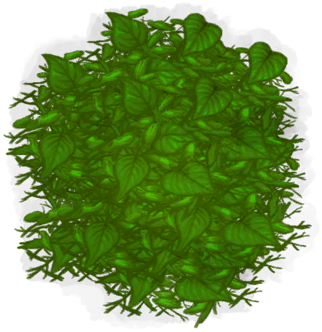

# Cleared Cinchona Tree  
> No more bark here.  
  
<table class="table table-bordered" data-toggle="table"  data-show-header="false"><thead style="display:none"><tr ><th  style="width:50%;text-align:left;vertical-align:top;"  data-sortable="true"  >title</th><th  style="width:50%;text-align:left;vertical-align:top;"  ></th></tr></thead><tr ><td  style="width:50%;text-align:left;vertical-align:top;"  ></td><td  style="width:50%;text-align:left;vertical-align:top;"  >

<a href="CinchonaTreeCleared.md" style="color:black">Cleared Cinchona Tree</a>

"Cinchona Trees grow in the <b>Jungle</b> and <b>Highland Jungles</b> of the island.  Their dried bark can be used to create <b>Quinine</b></td></tr></tbody></table>  
  
## Got From  

Transform

[Cinchona Tree](CinchonaTree.md)

  
  
## Drag With  

<table style="margin-bottom:0px;"><tr><td style="width:40%;text-align:left; background-color:#FEFEFE"><b>With：</b>[“Axe”](tag_Axe.md)</td><td style="width:40%;font-size:1em;font-weight:bold;background-color:#FEFEFE">Cut Tree (15m) [“HandAction(Group)”](HandAction.md)</td></tr><tr><td colspan="2"><b>Require：</b>[

[Light](Light.md)](Light.md): <b>10-100</b></td></tr><tr style="background-color:#FFFFFF"><td style=""><b>Receiving：</b>Usage  <b>-1(-2%)</b></td><td style=""><b>Self：</b>→Dismiss</td></tr><tr><td colspan="2"><b>StatChange：</b>[

[Stamina](Stamina.md)](Stamina.md)<b>-1</b>, [

[Hand Damage](HandDamage.md)](HandDamage.md)<b>+20</b></td></tr><tr><td colspan="2">[

[Sticks](Sticks.md)](Sticks.md)(<b>+1～+2</b>), [

[Long Stick](StickLong.md)](StickLong.md)(<b>+1</b>), [

[Fresh Leaves](LeavesFresh.md)](LeavesFresh.md)(<b>+4～+12</b>)</td></tr></table>
  
  

