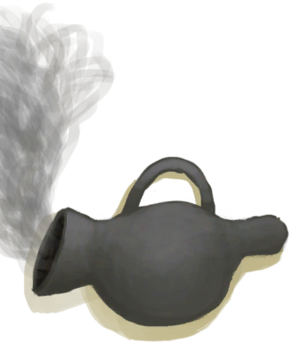
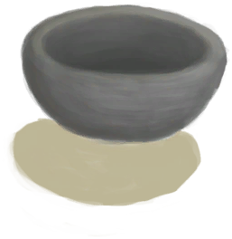

# Clay  
> A lump of Clay.  
  
<table class="table table-bordered" data-toggle="table"  data-show-header="false"><thead style="display:none"><tr ><th  style="width:50%;text-align:left;vertical-align:top;"  >title</th><th  style="width:50%;text-align:left;vertical-align:top;"  ></th></tr></thead><tr ><td  style="width:50%;text-align:left;vertical-align:top;"  >**Weight：**150  **Tag：**	[“Heavy”](tag_Heavy.md)</td><td  style="width:50%;text-align:left;vertical-align:top;"  >

<a href="Clay.md" style="color:black">Clay</a>

Clay can be made by crushing <b>Dirt</b> and then adding <b>Water</b> or simply by crushing <b>Mud</b>.  It is an extremely useful material that can be used for crafting numerous <b>Liquid Containers</b> and structures.</td></tr></tbody></table>  
  
## Got From  

Make Clay

[Mud Pile](MudPile.md)

** With：**[“Hammer”](tag_Hammer.md)Make Clay

[Mud Pile](MudPile.md)

Scrap

[Unfired Clay Bowl](ClayBowlUnfired.md)

** With：**[“Water”](tag_WaterAny.md)Mix with Water

[Fine Dirt](FineDirt.md)

Scrap

[Decoration Mold](MoldCopperDecoration.md)

  
  
## Drag With  

<table style="margin-bottom:0px;"><tr><td style="width:40%;text-align:left; background-color:#FEFEFE"><b>With：</b>[“Temper”](tag_Temper.md)</td><td style="width:40%;font-size:1em;font-weight:bold;background-color:#FEFEFE">Craft Bowl (15m) [“HandAction(Group)”](HandAction.md)</td></tr><tr><td colspan="2"><b>Require：</b>[

[Light](Light.md)](Light.md): <b>10-100</b></td></tr><tr style="background-color:#FFFFFF"><td style=""><b>Receiving：</b>→Dismiss</td><td style=""><b>Self：</b>→ [

[Unfired Clay Bowl](ClayBowlUnfired.md)](ClayBowlUnfired.md)</td></tr></table>
  
  
## Use In BluePrint  

<a href="Bp_BeeSmoker.md" style="color:black">Bee Smoker</a>

<a href="Bp_Cellar.md" style="color:black">Cellar</a>

<a href="Bp_Forge.md" style="color:black">Forge</a>

<a href="Bp_KilnAdvanced.md" style="color:black">Advanced Kiln</a>

<a href="Bp_MoldDecoration.md" style="color:black">Decoration Mold</a>

<a href="Bp_NiterBed.md" style="color:black">Niter Bed</a>

<a href="Bp_SaltBed.md" style="color:black">Salt Bed</a>

<a href="Bp_SupplyChest.md" style="color:black">Supply Chest</a>

<a href="Bp_WaterReservoir.md" style="color:black">Water Reservoir</a>

<a href="Bp_WateringTrough.md" style="color:black">Watering Trough</a>

<a href="Bp_Alembic.md" style="color:black">Alembic</a>

<a href="Bp_ClayBowl.md" style="color:black">Clay Bowl</a>

<a href="Bp_ClayFirePit.md" style="color:black">Clay Fire Pit</a>

<a href="Bp_ClayJar.md" style="color:black">Clay Jar</a>

<a href="Bp_ClayPotCooler.md" style="color:black">Clay Pot Cooler</a>

<a href="Bp_ClayVase.md" style="color:black">Clay Vase</a>

<a href="Bp_CookingPot.md" style="color:black">Cooking Pot</a>

<a href="Bp_GlazedVase.md" style="color:black">Glazed Vase</a>

  
  
  

