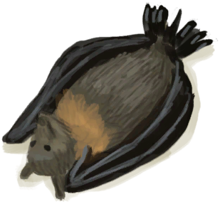
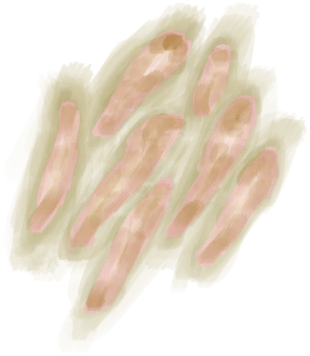
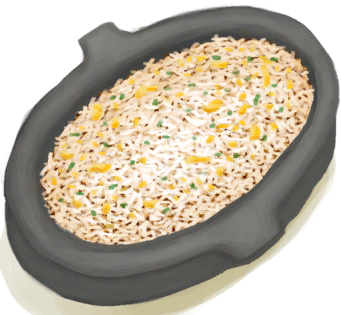

# Clay Fire Pit  
> Should be able to cook with this on a raft without burning the whole thing down.  
  
<table class="table table-bordered" data-toggle="table"  data-show-header="false"><thead style="display:none"><tr ><th  style="width:50%;text-align:left;vertical-align:top;"  >title</th><th  style="width:50%;text-align:left;vertical-align:top;"  ></th></tr></thead><tr ><td  style="width:50%;text-align:left;vertical-align:top;"  >** Cannot Be Trashed **  **Weight：**500  **Tag：**	[“Fire”](tag_Fire.md), [“Heavy”](tag_Heavy.md)  **Slots：**2  **过滤器：**[“Cookable”](tag_Cookable.md) , [“Water Container”](tag_WaterContainer.md)  ** Effect: ** [

[Cold Insulation](InsulationCold.md)](InsulationCold.md)<b>+20</b> [

[Wetness](Wetness.md)](Wetness.md)addition<b>-2</b> [

[Light](Light.md)](Light.md)<b>+25</b> [

[Bug Population](BugPopulation.md)](BugPopulation.md)<b>-1</b></td><td  style="width:50%;text-align:left;vertical-align:top;"  >

<a href="ClayFirePit.md" style="color:black">Clay Fire Pit</a>

A portable <b>Campfire</b> provided you can carry its weight.   It should allow you to keep a fire on a <b>Raft</b> without burning it down.</td></tr></tbody></table>  
  
## Got From  

** With：**[Lit Tinder](TinderLit.md)Light Fire

[Clay Fire Pit(Off)](ClayFirePitExtinguished.md)

  
  
## Action  

<table><tr><td rowspan="2" style="width:200px;text-align:center;font-size:1.3em;font-weight:bold">

Take Embers

15m

</td><td></td></tr><tr><td><b>Self：</b>Fuel  <b>-16(-16.67%)</b>, 

  <b>-16(-100%)</b></td></tr><tr><td colspan="2"><b>Require：</b>

: <b>16(100%)</b></td></tr><tr><td colspan="2">[

[Embers](Embers.md)](Embers.md)(<b>+1</b>)</td></tr></table>
  

<table><tr><td rowspan="2" style="width:200px;text-align:center;font-size:1.3em;font-weight:bold">

Extinguish Fire

</td><td></td></tr><tr><td><b>Self：</b>→ [

[Clay Fire Pit(Off)](ClayFirePitExtinguished.md)](ClayFirePitExtinguished.md)</td></tr></table>
  
  
  
## Drag With  

<table style="margin-bottom:0px;"><tr><td style="width:40%;text-align:left; background-color:#FEFEFE"><b>With：</b>[

[Coconut Shell](CoconutShell.md)](CoconutShell.md)</td><td style="width:40%;font-size:1em;font-weight:bold;background-color:#FEFEFE">Feed Coconut  </td></tr><tr style="background-color:#FFFFFF"><td style=""><b>Receiving：</b>→Dismiss</td><td style=""><b>Self：</b>Fuel  <b>+3(3.13%)</b></td></tr></table>
  

<table style="margin-bottom:0px;"><tr><td style="width:40%;text-align:left; background-color:#FEFEFE"><b>With：</b>[

[Wood](Wood.md)](Wood.md)</td><td style="width:40%;font-size:1em;font-weight:bold;background-color:#FEFEFE">Feed Firewood  </td></tr><tr style="background-color:#FFFFFF"><td style=""><b>Receiving：</b>→Dismiss</td><td style=""><b>Self：</b>Fuel  <b>+28(29.17%)</b></td></tr></table>
  

<table style="margin-bottom:0px;"><tr><td style="width:40%;text-align:left; background-color:#FEFEFE"><b>With：</b>[“Fuel”](tag_Fuel.md)</td><td style="width:40%;font-size:1em;font-weight:bold;background-color:#FEFEFE">Feed Fuel  </td></tr><tr style="background-color:#FFFFFF"><td style=""><b>Receiving：</b>→Dismiss</td><td style=""><b>Self：</b>Fuel  <b>+7(7.29%)</b></td></tr></table>
  

<table style="margin-bottom:0px;"><tr><td style="width:40%;text-align:left; background-color:#FEFEFE"><b>With：</b>[

[Charcoal](Charcoal.md)](Charcoal.md) | [

[Embers](Embers.md)](Embers.md)</td><td style="width:40%;font-size:1em;font-weight:bold;background-color:#FEFEFE">Feed Charcoal  </td></tr><tr style="background-color:#FFFFFF"><td style=""><b>Receiving：</b>→Dismiss</td><td style=""><b>Self：</b>Fuel  <b>+7(7.29%)</b>, 

  <b>+7(43.75%)</b></td></tr></table>
  

<table style="margin-bottom:0px;"><tr><td style="width:40%;text-align:left; background-color:#FEFEFE"><b>With：</b>[

[Snake Grass](SnakeGrass.md)](SnakeGrass.md)</td><td style="width:40%;font-size:1em;font-weight:bold;background-color:#FEFEFE">Feed Snakegrass (15m) </td></tr><tr style="background-color:#FFFFFF"><td style=""><b>Receiving：</b>→Dismiss</td><td style=""><b>Self：</b></td></tr><tr><td colspan="2"><b>StatChange：</b>[

[Bug Repellent](BugRepellentApplied.md)](BugRepellentApplied.md)<b>+25</b></td></tr></table>
  

<table style="margin-bottom:0px;"><tr><td style="width:40%;text-align:left; background-color:#FEFEFE"><b>With：</b>[“Tinder”](tag_Tinder.md)</td><td style="width:40%;font-size:1em;font-weight:bold;background-color:#FEFEFE">Light Tinder  </td></tr><tr style="background-color:#FFFFFF"><td style=""><b>Receiving：</b>→ [

[Lit Tinder](TinderLit.md)](TinderLit.md)</td><td style=""><b>Self：</b></td></tr></table>
  

<table style="margin-bottom:0px;"><tr><td style="width:40%;text-align:left; background-color:#FEFEFE"><b>With：</b>[“Leaves”](tag_Leaves.md)</td><td style="width:40%;font-size:1em;font-weight:bold;background-color:#FEFEFE">Feed Leaves  </td></tr><tr style="background-color:#FFFFFF"><td style=""><b>Receiving：</b>→Dismiss</td><td style=""><b>Self：</b>Fuel  <b>+2(2.08%)</b></td></tr></table>
  

<table style="margin-bottom:0px;"><tr><td style="width:40%;text-align:left; background-color:#FEFEFE"><b>With：</b>[

[Long Stick](StickLong.md)](StickLong.md)</td><td style="width:40%;font-size:1em;font-weight:bold;background-color:#FEFEFE">Make Rustic Spear (45m) </td></tr><tr style="background-color:#FFFFFF"><td style=""><b>Receiving：</b>→ [

[Rustic Spear](SpearRustic.md)](SpearRustic.md)</td><td style=""><b>Self：</b></td></tr><tr><td colspan="2"><b>StatChange：</b>[

[Morale](Morale.md)](Morale.md)<b>+1</b></td></tr></table>
  

<table style="margin-bottom:0px;"><tr><td style="width:40%;text-align:left; background-color:#FEFEFE"><b>With：</b>[

[Coconut Husk](CoconutHusk.md)](CoconutHusk.md)</td><td style="width:40%;font-size:1em;font-weight:bold;background-color:#FEFEFE">Feed Husk  </td></tr><tr style="background-color:#FFFFFF"><td style=""><b>Receiving：</b>→Dismiss</td><td style=""><b>Self：</b>Fuel  <b>+3(3.13%)</b></td></tr></table>
  
  
## Drag To  

[Fuel Jerrycan](JerrycanFuel.md)

  
  
## Transform  

<table style="margin-bottom:0px;"><tr><td  colspan=2 style="font-size:1em;font-weight:bold;background-color:#FEFEFE">Bat</td><td style="text-align:right; background-color:#FEFEFE">[

[Cooking(Skill)](Skill_Cooking.md)](Skill_Cooking.md)<b>+0.25</b></td></tr><tr style="background-color:#FFFFFF"><td style="width:30%;font-size:1em;text-align:right;vertical-align:middle;">[

[Dead Bat](Bat.md)](Bat.md)</td><td style="text-align:center;width:20%;vertical-align:middle;">
30m

Bat
</td><td style="text-align:left;vertical-align:middle;">[

[Roasted Bat](BatCooked.md)](BatCooked.md)(<b>+1</b>)</td></tr></table>
  

<table style="margin-bottom:0px;"><tr><td  colspan=2 style="font-size:1em;font-weight:bold;background-color:#FEFEFE">Bird</td><td style="text-align:right; background-color:#FEFEFE">[

[Cooking(Skill)](Skill_Cooking.md)](Skill_Cooking.md)<b>+0.25</b></td></tr><tr style="background-color:#FFFFFF"><td style="width:30%;font-size:1em;text-align:right;vertical-align:middle;">[

[Bird Meat](BirdMeat.md)](BirdMeat.md)</td><td style="text-align:center;width:20%;vertical-align:middle;">
30m

Bird
</td><td style="text-align:left;vertical-align:middle;">[

[Cooked Bird Meat](BirdMeatCooked.md)](BirdMeatCooked.md)(<b>+1</b>)</td></tr></table>
  

<table style="margin-bottom:0px;"><tr><td  colspan=2 style="font-size:1em;font-weight:bold;background-color:#FEFEFE">Boar</td><td style="text-align:right; background-color:#FEFEFE">[

[Cooking(Skill)](Skill_Cooking.md)](Skill_Cooking.md)<b>+0.25</b></td></tr><tr style="background-color:#FFFFFF"><td style="width:30%;font-size:1em;text-align:right;vertical-align:middle;">[

[Boar Meat](BoarMeat.md)](BoarMeat.md)</td><td style="text-align:center;width:20%;vertical-align:middle;">
30m

Boar
</td><td style="text-align:left;vertical-align:middle;">[

[Cooked Boar Meat](BoarMeatCooked.md)](BoarMeatCooked.md)(<b>+1</b>)</td></tr></table>
  

<table style="margin-bottom:0px;"><tr><td  colspan=2 style="font-size:1em;font-weight:bold;background-color:#FEFEFE">Boiling Citronella Mix</td><td style="text-align:right; background-color:#FEFEFE"></td></tr><tr style="background-color:#FFFFFF"><td style="width:30%;font-size:1em;text-align:right;vertical-align:middle;">[

[Citronella Oil Mix](LQ_OilCitronellaMix.md)](LQ_OilCitronellaMix.md)</td><td style="text-align:center;width:20%;vertical-align:middle;">
1h

Boiling Citronella Mix
</td><td style="text-align:left;vertical-align:middle;">→ [

[Citronella Oil](LQ_OilCitronella.md)](LQ_OilCitronella.md)</td></tr></table>
  

<table style="margin-bottom:0px;"><tr><td  colspan=2 style="font-size:1em;font-weight:bold;background-color:#FEFEFE">Boiling Glue</td><td style="text-align:right; background-color:#FEFEFE"></td></tr><tr style="background-color:#FFFFFF"><td style="width:30%;font-size:1em;text-align:right;vertical-align:middle;">[

[Uncooked Glue](GlueUncooked.md)](GlueUncooked.md)</td><td style="text-align:center;width:20%;vertical-align:middle;">
2h

Boiling Glue
</td><td style="text-align:left;vertical-align:middle;">[

[Cooked Glue](GlueCooked.md)](GlueCooked.md)(<b>+1</b>)</td></tr></table>
  

<table style="margin-bottom:0px;"><tr><td  colspan=2 style="font-size:1em;font-weight:bold;background-color:#FEFEFE">Boiling Rice</td><td style="text-align:right; background-color:#FEFEFE"></td></tr><tr style="background-color:#FFFFFF"><td style="width:30%;font-size:1em;text-align:right;vertical-align:middle;">[

[Soaked Rice](LQ_SoakedRice.md)](LQ_SoakedRice.md)</td><td style="text-align:center;width:20%;vertical-align:middle;">
30m

Boiling Rice
</td><td style="text-align:left;vertical-align:middle;">[

[Rice](RiceCooked.md)](RiceCooked.md)(<b>+1</b>)→ [

[Rice Water](LQ_WaterRice.md)](LQ_WaterRice.md)</td></tr><tr style="text-align:left;background-color:#FEFEFE"><td colspan="3"><b></b>** Require Container：** [“Container Metal”](tag_ContainerMetal.md)</td></tr></table>
  

<table style="margin-bottom:0px;"><tr><td  colspan=2 style="font-size:1em;font-weight:bold;background-color:#FEFEFE">Boiling Rice</td><td style="text-align:right; background-color:#FEFEFE"></td></tr><tr style="background-color:#FFFFFF"><td style="width:30%;font-size:1em;text-align:right;vertical-align:middle;">[

[Soaked Rice](LQ_SoakedRice.md)](LQ_SoakedRice.md)</td><td style="text-align:center;width:20%;vertical-align:middle;">
45m

Boiling Rice
</td><td style="text-align:left;vertical-align:middle;">[

[Rice](RiceCooked.md)](RiceCooked.md)(<b>+1</b>)→ [

[Rice Water](LQ_WaterRice.md)](LQ_WaterRice.md)</td></tr></table>
  

<table style="margin-bottom:0px;"><tr><td  colspan=2 style="font-size:1em;font-weight:bold;background-color:#FEFEFE">Boiling Salt</td><td style="text-align:right; background-color:#FEFEFE"></td></tr><tr style="background-color:#FFFFFF"><td style="width:30%;font-size:1em;text-align:right;vertical-align:middle;">[

[Salt Water](LQ_WaterSalt.md)](LQ_WaterSalt.md)</td><td style="text-align:center;width:20%;vertical-align:middle;">
2h

Boiling Salt
</td><td style="text-align:left;vertical-align:middle;">[

[Salt](Salt.md)](Salt.md)(<b>+1</b>)LiquidQuantity  <b>-1200</b></td></tr><tr style="text-align:left;background-color:#FEFEFE"><td colspan="3"><b></b>** Require Durability：** 含水量: <b>1150～999999</b></td></tr></table>
  

<table style="margin-bottom:0px;"><tr><td  colspan=2 style="font-size:1em;font-weight:bold;background-color:#FEFEFE">Boiling Sap</td><td style="text-align:right; background-color:#FEFEFE"></td></tr><tr style="background-color:#FFFFFF"><td style="width:30%;font-size:1em;text-align:right;vertical-align:middle;">[

[Sap](LQ_Sap.md)](LQ_Sap.md)</td><td style="text-align:center;width:20%;vertical-align:middle;">
1h

Boiling Sap
</td><td style="text-align:left;vertical-align:middle;">[

[Sugar](Sugar.md)](Sugar.md)(<b>+2</b>)LiquidQuantity  <b>-300</b></td></tr><tr style="text-align:left;background-color:#FEFEFE"><td colspan="3"><b></b>** Require Durability：** 含水量: <b>250～999999</b></td></tr></table>
  

<table style="margin-bottom:0px;"><tr><td  colspan=2 style="font-size:1em;font-weight:bold;background-color:#FEFEFE">Boiling Water</td><td style="text-align:right; background-color:#FEFEFE"></td></tr><tr style="background-color:#FFFFFF"><td style="width:30%;font-size:1em;text-align:right;vertical-align:middle;">[“Water for Crops”](tag_WaterFresh.md)</td><td style="text-align:center;width:20%;vertical-align:middle;">
15m

Boiling Water
</td><td style="text-align:left;vertical-align:middle;">→ [

[Boiling Water](LQ_WaterBoiling.md)](LQ_WaterBoiling.md)</td></tr><tr style="text-align:left;background-color:#FEFEFE"><td colspan="3"><b></b>** Require Container：** [“Container Metal”](tag_ContainerMetal.md)</td></tr></table>
  

<table style="margin-bottom:0px;"><tr><td  colspan=2 style="font-size:1em;font-weight:bold;background-color:#FEFEFE">Boiling Water</td><td style="text-align:right; background-color:#FEFEFE"></td></tr><tr style="background-color:#FFFFFF"><td style="width:30%;font-size:1em;text-align:right;vertical-align:middle;">[“Water for Crops”](tag_WaterFresh.md)</td><td style="text-align:center;width:20%;vertical-align:middle;">
30m

Boiling Water
</td><td style="text-align:left;vertical-align:middle;">→ [

[Boiling Water](LQ_WaterBoiling.md)](LQ_WaterBoiling.md)</td></tr></table>
  

<table style="margin-bottom:0px;"><tr><td  colspan=2 style="font-size:1em;font-weight:bold;background-color:#FEFEFE">Boiling Water</td><td style="text-align:right; background-color:#FEFEFE"></td></tr><tr style="background-color:#FFFFFF"><td style="width:30%;font-size:1em;text-align:right;vertical-align:middle;">[

[Boiling Water](LQ_WaterBoiling.md)](LQ_WaterBoiling.md)</td><td style="text-align:center;width:20%;vertical-align:middle;">
15m

Boiling Water
</td><td style="text-align:left;vertical-align:middle;">Fuel  <b>+2</b></td></tr></table>
  

<table style="margin-bottom:0px;"><tr><td  colspan=2 style="font-size:1em;font-weight:bold;background-color:#FEFEFE">Boiling Yam</td><td style="text-align:right; background-color:#FEFEFE"></td></tr><tr style="background-color:#FFFFFF"><td style="width:30%;font-size:1em;text-align:right;vertical-align:middle;">[

[Soaked Yam](LQ_SoakedYam.md)](LQ_SoakedYam.md)</td><td style="text-align:center;width:20%;vertical-align:middle;">
45m

Boiling Yam
</td><td style="text-align:left;vertical-align:middle;">[

[Boiled Yam](YamBoiled.md)](YamBoiled.md)(<b>+1</b>)LiquidQuantity  <b>-300</b></td></tr><tr style="text-align:left;background-color:#FEFEFE"><td colspan="3"><b></b>** Require Container：** [“Container Metal”](tag_ContainerMetal.md)</td></tr></table>
  

<table style="margin-bottom:0px;"><tr><td  colspan=2 style="font-size:1em;font-weight:bold;background-color:#FEFEFE">Boiling Yam</td><td style="text-align:right; background-color:#FEFEFE"></td></tr><tr style="background-color:#FFFFFF"><td style="width:30%;font-size:1em;text-align:right;vertical-align:middle;">[

[Soaked Yam](LQ_SoakedYam.md)](LQ_SoakedYam.md)</td><td style="text-align:center;width:20%;vertical-align:middle;">
1h

Boiling Yam
</td><td style="text-align:left;vertical-align:middle;">[

[Boiled Yam](YamBoiled.md)](YamBoiled.md)(<b>+1</b>)LiquidQuantity  <b>-300</b></td></tr></table>
  

<table style="margin-bottom:0px;"><tr><td  colspan=2 style="font-size:1em;font-weight:bold;background-color:#FEFEFE">Bonefish</td><td style="text-align:right; background-color:#FEFEFE">[

[Cooking(Skill)](Skill_Cooking.md)](Skill_Cooking.md)<b>+0.25</b></td></tr><tr style="background-color:#FFFFFF"><td style="width:30%;font-size:1em;text-align:right;vertical-align:middle;">[

[Bonefish Meat](BonefishMeat.md)](BonefishMeat.md)</td><td style="text-align:center;width:20%;vertical-align:middle;">
30m

Bonefish
</td><td style="text-align:left;vertical-align:middle;">[

[Cooked Bonefish](BonefishCooked.md)](BonefishCooked.md)(<b>+1</b>)</td></tr></table>
  

<table style="margin-bottom:0px;"><tr><td  colspan=2 style="font-size:1em;font-weight:bold;background-color:#FEFEFE">Butter Baked Oysters</td><td style="text-align:right; background-color:#FEFEFE">[

[Cooking(Skill)](Skill_Cooking.md)](Skill_Cooking.md)<b>+0.25</b></td></tr><tr style="background-color:#FFFFFF"><td style="width:30%;font-size:1em;text-align:right;vertical-align:middle;">[

[Uncooked Oysters](ButterBakedOystersUncooked.md)](ButterBakedOystersUncooked.md)</td><td style="text-align:center;width:20%;vertical-align:middle;">
30m

Butter Baked Oysters
</td><td style="text-align:left;vertical-align:middle;">[

[Butter Baked Oysters](ButterBakedOystersCooked.md)](ButterBakedOystersCooked.md)(<b>+1</b>)</td></tr></table>
  

<table style="margin-bottom:0px;"><tr><td  colspan=2 style="font-size:1em;font-weight:bold;background-color:#FEFEFE">Candied Ginger</td><td style="text-align:right; background-color:#FEFEFE">[

[Cooking(Skill)](Skill_Cooking.md)](Skill_Cooking.md)<b>+0.25</b></td></tr><tr style="background-color:#FFFFFF"><td style="width:30%;font-size:1em;text-align:right;vertical-align:middle;">[

[Uncooked Candied Ginger](CandiedGingerUncooked.md)](CandiedGingerUncooked.md)</td><td style="text-align:center;width:20%;vertical-align:middle;">
45m

Candied Ginger
</td><td style="text-align:left;vertical-align:middle;">[

[Candied Ginger](CandiedGingerCooked.md)](CandiedGingerCooked.md)(<b>+1</b>)</td></tr></table>
  

<table style="margin-bottom:0px;"><tr><td  colspan=2 style="font-size:1em;font-weight:bold;background-color:#FEFEFE">Charred Remains</td><td style="text-align:right; background-color:#FEFEFE"></td></tr><tr style="background-color:#FFFFFF"><td style="width:30%;font-size:1em;text-align:right;vertical-align:middle;">[

[Roasted Bat](BatCooked.md)](BatCooked.md) [

[Cooked Bird Meat](BirdMeatCooked.md)](BirdMeatCooked.md) [

[Cooked Boar Meat](BoarMeatCooked.md)](BoarMeatCooked.md) [

[Cooked Bonefish](BonefishCooked.md)](BonefishCooked.md) [

[Roasted Coconut Meat](CoconutMeatCooked.md)](CoconutMeatCooked.md) [

[Cooked Conch Meat](ConchMeatCooked.md)](ConchMeatCooked.md) [

[Cooked Soft Conch Meat](ConchMeatSoftCooked.md)](ConchMeatSoftCooked.md) [

[Cooked Crab](CrabCooked.md)](CrabCooked.md) [

[Boiled Egg](EggBoiled.md)](EggBoiled.md) [

[Roasted Egg](EggCooked.md)](EggCooked.md) [

[Cooked Fish Scraps](FishScrapsCooked.md)](FishScrapsCooked.md) [

[Cooked Fish Slices](FishSlicesCooked.md)](FishSlicesCooked.md) [

[Cooked Goatfish](GoatfishCooked.md)](GoatfishCooked.md) [

[Cooked Goat Meat](GoatMeatCooked.md)](GoatMeatCooked.md) [

[Cooked Grouper](GrouperMeatCooked.md)](GrouperMeatCooked.md) [

[Cooked Herring](HerringCooked.md)](HerringCooked.md) [

[Roasted Lizard](LizardCooked.md)](LizardCooked.md) [

[Cooked Macaque Meat](MacaqueMeatCooked.md)](MacaqueMeatCooked.md) [

[Cooked Lizard Meat](MonitorMeatCooked.md)](MonitorMeatCooked.md) [

[Roasted Mouse](MouseCooked.md)](MouseCooked.md) [

[Roasted Mudskipper](MudskipperCooked.md)](MudskipperCooked.md) [

[Cooked Oyster](OysterMeatCooked.md)](OysterMeatCooked.md) [

[Cooked Parrot Fish](ParrotFishCooked.md)](ParrotFishCooked.md) [

[Roasted Prawns](PrawnsCooked.md)](PrawnsCooked.md) [

[Sago Flatbread](SagoFlatbread.md)](SagoFlatbread.md) [

[Cooked Seahound](SeahoundCooked.md)](SeahoundCooked.md) [

[Cooked Shark](SharkCooked.md)](SharkCooked.md) [

[Cooked Snake Meat](SnakeCooked.md)](SnakeCooked.md) [

[Cooked Threadfin](ThreadfinCooked.md)](ThreadfinCooked.md) [

[Roasted Tropical Almond](TropicalAlmondsRoasted.md)](TropicalAlmondsRoasted.md) [

[Cooked Urchin](UrchinMeatCooked.md)](UrchinMeatCooked.md)</td><td style="text-align:center;width:20%;vertical-align:middle;">
30m

Charred Remains
</td><td style="text-align:left;vertical-align:middle;">[

[Charred Remains](CharredRemains.md)](CharredRemains.md)(<b>+1</b>)</td></tr></table>
  

<table style="margin-bottom:0px;"><tr><td  colspan=2 style="font-size:1em;font-weight:bold;background-color:#FEFEFE">Coconut Fish</td><td style="text-align:right; background-color:#FEFEFE">[

[Cooking(Skill)](Skill_Cooking.md)](Skill_Cooking.md)<b>+0.25</b></td></tr><tr style="background-color:#FFFFFF"><td style="width:30%;font-size:1em;text-align:right;vertical-align:middle;">[

[Uncooked Coconut Fish](CoconutFishUncooked.md)](CoconutFishUncooked.md)</td><td style="text-align:center;width:20%;vertical-align:middle;">
45m

Coconut Fish
</td><td style="text-align:left;vertical-align:middle;">[

[Coconut Fish](CoconutFish.md)](CoconutFish.md)(<b>+1</b>)</td></tr></table>
  

<table style="margin-bottom:0px;"><tr><td  colspan=2 style="font-size:1em;font-weight:bold;background-color:#FEFEFE">Coconut Meat</td><td style="text-align:right; background-color:#FEFEFE">[

[Cooking(Skill)](Skill_Cooking.md)](Skill_Cooking.md)<b>+0.25</b></td></tr><tr style="background-color:#FFFFFF"><td style="width:30%;font-size:1em;text-align:right;vertical-align:middle;">[

[Coconut Meat](CoconutMeat.md)](CoconutMeat.md)</td><td style="text-align:center;width:20%;vertical-align:middle;">
30m

Coconut Meat
</td><td style="text-align:left;vertical-align:middle;">[

[Roasted Coconut Meat](CoconutMeatCooked.md)](CoconutMeatCooked.md)(<b>+1</b>)</td></tr></table>
  

<table style="margin-bottom:0px;"><tr><td  colspan=2 style="font-size:1em;font-weight:bold;background-color:#FEFEFE">Coffee</td><td style="text-align:right; background-color:#FEFEFE">[

[Cooking(Skill)](Skill_Cooking.md)](Skill_Cooking.md)<b>+0.25</b></td></tr><tr style="background-color:#FFFFFF"><td style="width:30%;font-size:1em;text-align:right;vertical-align:middle;">[

[Coffee Beans](CoffeeBeans.md)](CoffeeBeans.md)</td><td style="text-align:center;width:20%;vertical-align:middle;">
30m

Coffee
</td><td style="text-align:left;vertical-align:middle;">[

[Roasted Coffee Beans](CoffeeRoastedBeans.md)](CoffeeRoastedBeans.md)(<b>+1</b>)</td></tr></table>
  

<table style="margin-bottom:0px;"><tr><td  colspan=2 style="font-size:1em;font-weight:bold;background-color:#FEFEFE">Conch Meat</td><td style="text-align:right; background-color:#FEFEFE">[

[Cooking(Skill)](Skill_Cooking.md)](Skill_Cooking.md)<b>+0.25</b></td></tr><tr style="background-color:#FFFFFF"><td style="width:30%;font-size:1em;text-align:right;vertical-align:middle;">[

[Conch Meat](ConchMeat.md)](ConchMeat.md)</td><td style="text-align:center;width:20%;vertical-align:middle;">
30m

Conch Meat
</td><td style="text-align:left;vertical-align:middle;">[

[Cooked Conch Meat](ConchMeatCooked.md)](ConchMeatCooked.md)(<b>+1</b>)</td></tr></table>
  

<table style="margin-bottom:0px;"><tr><td  colspan=2 style="font-size:1em;font-weight:bold;background-color:#FEFEFE">Cook Jerrycan</td><td style="text-align:right; background-color:#FEFEFE"></td></tr><tr style="background-color:#FFFFFF"><td style="width:30%;font-size:1em;text-align:right;vertical-align:middle;">[

[Fuel Jerrycan](JerrycanFuel.md)](JerrycanFuel.md)</td><td style="text-align:center;width:20%;vertical-align:middle;">
30m

Cook Jerrycan
</td><td style="text-align:left;vertical-align:middle;">[

[BOOOOOM!!(Event)](Event_JerrycanExplosion.md)](Event_JerrycanExplosion.md)(<b>+1</b>)</td></tr></table>
  

<table style="margin-bottom:0px;"><tr><td  colspan=2 style="font-size:1em;font-weight:bold;background-color:#FEFEFE">Crab</td><td style="text-align:right; background-color:#FEFEFE">[

[Cooking(Skill)](Skill_Cooking.md)](Skill_Cooking.md)<b>+0.25</b></td></tr><tr style="background-color:#FFFFFF"><td style="width:30%;font-size:1em;text-align:right;vertical-align:middle;">[

[Crab](Crab.md)](Crab.md)</td><td style="text-align:center;width:20%;vertical-align:middle;">
30m

Crab
</td><td style="text-align:left;vertical-align:middle;">[

[Cooked Crab](CrabCooked.md)](CrabCooked.md)(<b>+1</b>)</td></tr></table>
  

<table style="margin-bottom:0px;"><tr><td  colspan=2 style="font-size:1em;font-weight:bold;background-color:#FEFEFE">Drunken Crab</td><td style="text-align:right; background-color:#FEFEFE">[

[Cooking(Skill)](Skill_Cooking.md)](Skill_Cooking.md)<b>+0.25</b></td></tr><tr style="background-color:#FFFFFF"><td style="width:30%;font-size:1em;text-align:right;vertical-align:middle;">[

[Uncooked Drunken Crab](DrunkenCrabUncooked.md)](DrunkenCrabUncooked.md)</td><td style="text-align:center;width:20%;vertical-align:middle;">
30m

Drunken Crab
</td><td style="text-align:left;vertical-align:middle;">[

[Drunken Crab](DrunkenCrab.md)](DrunkenCrab.md)(<b>+1</b>)</td></tr></table>
  

<table style="margin-bottom:0px;"><tr><td  colspan=2 style="font-size:1em;font-weight:bold;background-color:#FEFEFE">Dry Mud</td><td style="text-align:right; background-color:#FEFEFE"></td></tr><tr style="background-color:#FFFFFF"><td style="width:30%;font-size:1em;text-align:right;vertical-align:middle;">[

[Mud Pile](MudPile.md)](MudPile.md)</td><td style="text-align:center;width:20%;vertical-align:middle;">
1h

Dry Mud
</td><td style="text-align:left;vertical-align:middle;">[

[Dirt Pile](DirtPile.md)](DirtPile.md)(<b>+1</b>)</td></tr></table>
  

<table style="margin-bottom:0px;"><tr><td  colspan=2 style="font-size:1em;font-weight:bold;background-color:#FEFEFE">Egg</td><td style="text-align:right; background-color:#FEFEFE">[

[Cooking(Skill)](Skill_Cooking.md)](Skill_Cooking.md)<b>+0.25</b></td></tr><tr style="background-color:#FFFFFF"><td style="width:30%;font-size:1em;text-align:right;vertical-align:middle;">[

[Egg](Egg.md)](Egg.md) [

[Fertilized Egg](EggPartridgeFertilized.md)](EggPartridgeFertilized.md)</td><td style="text-align:center;width:20%;vertical-align:middle;">
15m

Egg
</td><td style="text-align:left;vertical-align:middle;">[

[Roasted Egg](EggCooked.md)](EggCooked.md)(<b>+1</b>)</td></tr></table>
  

<table style="margin-bottom:0px;"><tr><td  colspan=2 style="font-size:1em;font-weight:bold;background-color:#FEFEFE">Egg Fried Rice</td><td style="text-align:right; background-color:#FEFEFE">[

[Cooking(Skill)](Skill_Cooking.md)](Skill_Cooking.md)<b>+0.25</b></td></tr><tr style="background-color:#FFFFFF"><td style="width:30%;font-size:1em;text-align:right;vertical-align:middle;">[

[Uncooked Egg Fried Rice](EggFriedRiceUncooked.md)](EggFriedRiceUncooked.md)</td><td style="text-align:center;width:20%;vertical-align:middle;">
30m

Egg Fried Rice
</td><td style="text-align:left;vertical-align:middle;">[

[Egg Fried Rice](EggFriedRice.md)](EggFriedRice.md)(<b>+1</b>)</td></tr></table>
  

<table style="margin-bottom:0px;"><tr><td  colspan=2 style="font-size:1em;font-weight:bold;background-color:#FEFEFE">Fire Clay Bowl</td><td style="text-align:right; background-color:#FEFEFE"></td></tr><tr style="background-color:#FFFFFF"><td style="width:30%;font-size:1em;text-align:right;vertical-align:middle;">[

[Unfired Clay Bowl](ClayBowlUnfired.md)](ClayBowlUnfired.md)</td><td style="text-align:center;width:20%;vertical-align:middle;">
3h

Fire Clay Bowl
</td><td style="text-align:left;vertical-align:middle;">[

[Clay Bowl](ClayBowl.md)](ClayBowl.md)(<b>+1</b>)</td></tr></table>
  

<table style="margin-bottom:0px;"><tr><td  colspan=2 style="font-size:1em;font-weight:bold;background-color:#FEFEFE">Fish N Chips</td><td style="text-align:right; background-color:#FEFEFE">[

[Cooking(Skill)](Skill_Cooking.md)](Skill_Cooking.md)<b>+0.25</b></td></tr><tr style="background-color:#FFFFFF"><td style="width:30%;font-size:1em;text-align:right;vertical-align:middle;">[

[Uncooked Fish N' Chips](FishNChipsUncooked.md)](FishNChipsUncooked.md)</td><td style="text-align:center;width:20%;vertical-align:middle;">
45m

Fish N Chips
</td><td style="text-align:left;vertical-align:middle;">[

[Fish N' Chips](FishNChips.md)](FishNChips.md)(<b>+1</b>)</td></tr></table>
  

<table style="margin-bottom:0px;"><tr><td  colspan=2 style="font-size:1em;font-weight:bold;background-color:#FEFEFE">Fish Omelette</td><td style="text-align:right; background-color:#FEFEFE">[

[Cooking(Skill)](Skill_Cooking.md)](Skill_Cooking.md)<b>+0.25</b></td></tr><tr style="background-color:#FFFFFF"><td style="width:30%;font-size:1em;text-align:right;vertical-align:middle;">[

[Uncooked Fish Omelette](FishOmeletteUncooked.md)](FishOmeletteUncooked.md)</td><td style="text-align:center;width:20%;vertical-align:middle;">
30m

Fish Omelette
</td><td style="text-align:left;vertical-align:middle;">[

[Fish Omelette](FishOmelette.md)](FishOmelette.md)(<b>+1</b>)</td></tr></table>
  

<table style="margin-bottom:0px;"><tr><td  colspan=2 style="font-size:1em;font-weight:bold;background-color:#FEFEFE">Fish Scraps</td><td style="text-align:right; background-color:#FEFEFE">[

[Cooking(Skill)](Skill_Cooking.md)](Skill_Cooking.md)<b>+0.25</b></td></tr><tr style="background-color:#FFFFFF"><td style="width:30%;font-size:1em;text-align:right;vertical-align:middle;">[

[Fish Scraps](FishScraps.md)](FishScraps.md)</td><td style="text-align:center;width:20%;vertical-align:middle;">
30m

Fish Scraps
</td><td style="text-align:left;vertical-align:middle;">[

[Cooked Fish Scraps](FishScrapsCooked.md)](FishScrapsCooked.md)(<b>+0</b>)→ [

[Cooked Fish Scraps](FishScrapsCooked.md)](FishScrapsCooked.md)</td></tr></table>
  

<table style="margin-bottom:0px;"><tr><td  colspan=2 style="font-size:1em;font-weight:bold;background-color:#FEFEFE">Fish Slices</td><td style="text-align:right; background-color:#FEFEFE">[

[Cooking(Skill)](Skill_Cooking.md)](Skill_Cooking.md)<b>+0.25</b></td></tr><tr style="background-color:#FFFFFF"><td style="width:30%;font-size:1em;text-align:right;vertical-align:middle;">[

[Fish Slices](FishSlices.md)](FishSlices.md)</td><td style="text-align:center;width:20%;vertical-align:middle;">
30m

Fish Slices
</td><td style="text-align:left;vertical-align:middle;">[

[Cooked Fish Slices](FishSlicesCooked.md)](FishSlicesCooked.md)(<b>+0</b>)→ [

[Cooked Fish Slices](FishSlicesCooked.md)](FishSlicesCooked.md)</td></tr></table>
  

<table style="margin-bottom:0px;"><tr><td  colspan=2 style="font-size:1em;font-weight:bold;background-color:#FEFEFE">Fried Bananas</td><td style="text-align:right; background-color:#FEFEFE">[

[Cooking(Skill)](Skill_Cooking.md)](Skill_Cooking.md)<b>+0.25</b></td></tr><tr style="background-color:#FFFFFF"><td style="width:30%;font-size:1em;text-align:right;vertical-align:middle;">[

[Uncooked Fried Bananas](FriedBananasUncooked.md)](FriedBananasUncooked.md)</td><td style="text-align:center;width:20%;vertical-align:middle;">
45m

Fried Bananas
</td><td style="text-align:left;vertical-align:middle;">[

[Cooked Fried Bananas](FriedBananasCooked.md)](FriedBananasCooked.md)(<b>+1</b>)</td></tr></table>
  

<table style="margin-bottom:0px;"><tr><td  colspan=2 style="font-size:1em;font-weight:bold;background-color:#FEFEFE">Fried Puffballs</td><td style="text-align:right; background-color:#FEFEFE">[

[Cooking(Skill)](Skill_Cooking.md)](Skill_Cooking.md)<b>+0.25</b></td></tr><tr style="background-color:#FFFFFF"><td style="width:30%;font-size:1em;text-align:right;vertical-align:middle;">[

[Uncooked Fried Puffballs](FriedPuffballsUncooked.md)](FriedPuffballsUncooked.md)</td><td style="text-align:center;width:20%;vertical-align:middle;">
30m

Fried Puffballs
</td><td style="text-align:left;vertical-align:middle;">[

[Fried Puffballs](FriedPuffballs.md)](FriedPuffballs.md)(<b>+1</b>)</td></tr></table>
  

<table style="margin-bottom:0px;"><tr><td  colspan=2 style="font-size:1em;font-weight:bold;background-color:#FEFEFE">Glue Heat Up</td><td style="text-align:right; background-color:#FEFEFE"></td></tr><tr style="background-color:#FFFFFF"><td style="width:30%;font-size:1em;text-align:right;vertical-align:middle;">[

[Dry Glue](GlueDry.md)](GlueDry.md)</td><td style="text-align:center;width:20%;vertical-align:middle;">
15m

Glue Heat Up
</td><td style="text-align:left;vertical-align:middle;">[

[Glue](Glue.md)](Glue.md)(<b>+1</b>)</td></tr></table>
  

<table style="margin-bottom:0px;"><tr><td  colspan=2 style="font-size:1em;font-weight:bold;background-color:#FEFEFE">Goat</td><td style="text-align:right; background-color:#FEFEFE">[

[Cooking(Skill)](Skill_Cooking.md)](Skill_Cooking.md)<b>+0.25</b></td></tr><tr style="background-color:#FFFFFF"><td style="width:30%;font-size:1em;text-align:right;vertical-align:middle;">[

[Goat Meat](GoatMeat.md)](GoatMeat.md)</td><td style="text-align:center;width:20%;vertical-align:middle;">
30m

Goat
</td><td style="text-align:left;vertical-align:middle;">[

[Cooked Goat Meat](GoatMeatCooked.md)](GoatMeatCooked.md)(<b>+1</b>)</td></tr></table>
  

<table style="margin-bottom:0px;"><tr><td  colspan=2 style="font-size:1em;font-weight:bold;background-color:#FEFEFE">Goat Stew</td><td style="text-align:right; background-color:#FEFEFE">[

[Cooking(Skill)](Skill_Cooking.md)](Skill_Cooking.md)<b>+0.25</b></td></tr><tr style="background-color:#FFFFFF"><td style="width:30%;font-size:1em;text-align:right;vertical-align:middle;">[

[Uncooked Goat Stew](GoatStewUncooked.md)](GoatStewUncooked.md)</td><td style="text-align:center;width:20%;vertical-align:middle;">
2h

Goat Stew
</td><td style="text-align:left;vertical-align:middle;">[

[Goat Stew](GoatStew.md)](GoatStew.md)(<b>+1</b>)</td></tr></table>
  

<table style="margin-bottom:0px;"><tr><td  colspan=2 style="font-size:1em;font-weight:bold;background-color:#FEFEFE">Goatfish</td><td style="text-align:right; background-color:#FEFEFE">[

[Cooking(Skill)](Skill_Cooking.md)](Skill_Cooking.md)<b>+0.25</b></td></tr><tr style="background-color:#FFFFFF"><td style="width:30%;font-size:1em;text-align:right;vertical-align:middle;">[

[Goatfish](Goatfish.md)](Goatfish.md)</td><td style="text-align:center;width:20%;vertical-align:middle;">
30m

Goatfish
</td><td style="text-align:left;vertical-align:middle;">[

[Cooked Goatfish](GoatfishCooked.md)](GoatfishCooked.md)(<b>+1</b>)</td></tr></table>
  

<table style="margin-bottom:0px;"><tr><td  colspan=2 style="font-size:1em;font-weight:bold;background-color:#FEFEFE">Grouper</td><td style="text-align:right; background-color:#FEFEFE">[

[Cooking(Skill)](Skill_Cooking.md)](Skill_Cooking.md)<b>+0.25</b></td></tr><tr style="background-color:#FFFFFF"><td style="width:30%;font-size:1em;text-align:right;vertical-align:middle;">[

[Grouper Meat](GrouperMeat.md)](GrouperMeat.md)</td><td style="text-align:center;width:20%;vertical-align:middle;">
30m

Grouper
</td><td style="text-align:left;vertical-align:middle;">[

[Cooked Grouper](GrouperMeatCooked.md)](GrouperMeatCooked.md)(<b>+1</b>)</td></tr></table>
  

<table style="margin-bottom:0px;"><tr><td  colspan=2 style="font-size:1em;font-weight:bold;background-color:#FEFEFE">Heating Up Glue</td><td style="text-align:right; background-color:#FEFEFE"></td></tr><tr style="background-color:#FFFFFF"><td style="width:30%;font-size:1em;text-align:right;vertical-align:middle;">[

[Dry Glue](GlueDry.md)](GlueDry.md)</td><td style="text-align:center;width:20%;vertical-align:middle;">
2h

Heating Up Glue
</td><td style="text-align:left;vertical-align:middle;">[

[Glue](Glue.md)](Glue.md)(<b>+1</b>)</td></tr></table>
  

<table style="margin-bottom:0px;"><tr><td  colspan=2 style="font-size:1em;font-weight:bold;background-color:#FEFEFE">Herring</td><td style="text-align:right; background-color:#FEFEFE">[

[Cooking(Skill)](Skill_Cooking.md)](Skill_Cooking.md)<b>+0.25</b></td></tr><tr style="background-color:#FFFFFF"><td style="width:30%;font-size:1em;text-align:right;vertical-align:middle;">[

[Herring](Herring.md)](Herring.md)</td><td style="text-align:center;width:20%;vertical-align:middle;">
30m

Herring
</td><td style="text-align:left;vertical-align:middle;">[

[Cooked Herring](HerringCooked.md)](HerringCooked.md)(<b>+1</b>)</td></tr></table>
  

<table style="margin-bottom:0px;"><tr><td  colspan=2 style="font-size:1em;font-weight:bold;background-color:#FEFEFE">Honey Candy</td><td style="text-align:right; background-color:#FEFEFE">[

[Cooking(Skill)](Skill_Cooking.md)](Skill_Cooking.md)<b>+0.25</b></td></tr><tr style="background-color:#FFFFFF"><td style="width:30%;font-size:1em;text-align:right;vertical-align:middle;">[

[Uncooked Honey Candy](HoneyCandyUncooked.md)](HoneyCandyUncooked.md)</td><td style="text-align:center;width:20%;vertical-align:middle;">
1h30m

Honey Candy
</td><td style="text-align:left;vertical-align:middle;">[

[Honey Candy](HoneyCandyCooked.md)](HoneyCandyCooked.md)(<b>+1</b>)</td></tr></table>
  

<table style="margin-bottom:0px;"><tr><td  colspan=2 style="font-size:1em;font-weight:bold;background-color:#FEFEFE">Honey Glazed Pork</td><td style="text-align:right; background-color:#FEFEFE">[

[Cooking(Skill)](Skill_Cooking.md)](Skill_Cooking.md)<b>+0.25</b></td></tr><tr style="background-color:#FFFFFF"><td style="width:30%;font-size:1em;text-align:right;vertical-align:middle;">[

[Uncooked Honey Glazed Pork](HoneyGlazedPorkUncooked.md)](HoneyGlazedPorkUncooked.md)</td><td style="text-align:center;width:20%;vertical-align:middle;">
1h30m

Honey Glazed Pork
</td><td style="text-align:left;vertical-align:middle;">[

[Honey Glazed Pork](HoneyGlazedPork.md)](HoneyGlazedPork.md)(<b>+1</b>)</td></tr></table>
  

<table style="margin-bottom:0px;"><tr><td  colspan=2 style="font-size:1em;font-weight:bold;background-color:#FEFEFE">Island Chicken</td><td style="text-align:right; background-color:#FEFEFE">[

[Cooking(Skill)](Skill_Cooking.md)](Skill_Cooking.md)<b>+0.25</b></td></tr><tr style="background-color:#FFFFFF"><td style="width:30%;font-size:1em;text-align:right;vertical-align:middle;">[

[Uncooked Island Chicken](IslandChickenUncooked.md)](IslandChickenUncooked.md)</td><td style="text-align:center;width:20%;vertical-align:middle;">
45m

Island Chicken
</td><td style="text-align:left;vertical-align:middle;">[

[Island Chicken](IslandChicken.md)](IslandChicken.md)(<b>+1</b>)</td></tr></table>
  

<table style="margin-bottom:0px;"><tr><td  colspan=2 style="font-size:1em;font-weight:bold;background-color:#FEFEFE">Lizard</td><td style="text-align:right; background-color:#FEFEFE">[

[Cooking(Skill)](Skill_Cooking.md)](Skill_Cooking.md)<b>+0.25</b></td></tr><tr style="background-color:#FFFFFF"><td style="width:30%;font-size:1em;text-align:right;vertical-align:middle;">[

[Lizard](Lizard.md)](Lizard.md)</td><td style="text-align:center;width:20%;vertical-align:middle;">
30m

Lizard
</td><td style="text-align:left;vertical-align:middle;">[

[Roasted Lizard](LizardCooked.md)](LizardCooked.md)(<b>+1</b>)</td></tr></table>
  

<table style="margin-bottom:0px;"><tr><td  colspan=2 style="font-size:1em;font-weight:bold;background-color:#FEFEFE">Lizard Fry</td><td style="text-align:right; background-color:#FEFEFE">[

[Cooking(Skill)](Skill_Cooking.md)](Skill_Cooking.md)<b>+0.25</b></td></tr><tr style="background-color:#FFFFFF"><td style="width:30%;font-size:1em;text-align:right;vertical-align:middle;">[

[Uncooked Lizard Fry](LizardFryUncooked.md)](LizardFryUncooked.md)</td><td style="text-align:center;width:20%;vertical-align:middle;">
30m

Lizard Fry
</td><td style="text-align:left;vertical-align:middle;">[

[Lizard Fry](LizardFry.md)](LizardFry.md)(<b>+1</b>)</td></tr></table>
  

<table style="margin-bottom:0px;"><tr><td  colspan=2 style="font-size:1em;font-weight:bold;background-color:#FEFEFE">Macaque</td><td style="text-align:right; background-color:#FEFEFE">[

[Cooking(Skill)](Skill_Cooking.md)](Skill_Cooking.md)<b>+0.25</b></td></tr><tr style="background-color:#FFFFFF"><td style="width:30%;font-size:1em;text-align:right;vertical-align:middle;">[

[Macaque Meat](MacaqueMeat.md)](MacaqueMeat.md)</td><td style="text-align:center;width:20%;vertical-align:middle;">
30m

Macaque
</td><td style="text-align:left;vertical-align:middle;">[

[Cooked Macaque Meat](MacaqueMeatCooked.md)](MacaqueMeatCooked.md)(<b>+1</b>)</td></tr></table>
  

<table style="margin-bottom:0px;"><tr><td  colspan=2 style="font-size:1em;font-weight:bold;background-color:#FEFEFE">Macaque Skewers</td><td style="text-align:right; background-color:#FEFEFE">[

[Cooking(Skill)](Skill_Cooking.md)](Skill_Cooking.md)<b>+0.25</b></td></tr><tr style="background-color:#FFFFFF"><td style="width:30%;font-size:1em;text-align:right;vertical-align:middle;">[

[Uncooked Macaque Skewers](MacaqueSkewersUncooked.md)](MacaqueSkewersUncooked.md)</td><td style="text-align:center;width:20%;vertical-align:middle;">
30m

Macaque Skewers
</td><td style="text-align:left;vertical-align:middle;">[

[Macaque Skewers](MacaqueSkewers.md)](MacaqueSkewers.md)(<b>+1</b>)</td></tr></table>
  

<table style="margin-bottom:0px;"><tr><td  colspan=2 style="font-size:1em;font-weight:bold;background-color:#FEFEFE">Make Lye</td><td style="text-align:right; background-color:#FEFEFE"></td></tr><tr style="background-color:#FFFFFF"><td style="width:30%;font-size:1em;text-align:right;vertical-align:middle;">[

[Ash Water](LQ_AshWater.md)](LQ_AshWater.md)</td><td style="text-align:center;width:20%;vertical-align:middle;">
30m

Make Lye
</td><td style="text-align:left;vertical-align:middle;">→ [

[Lye](LQ_Lye.md)](LQ_Lye.md)</td></tr></table>
  

<table style="margin-bottom:0px;"><tr><td  colspan=2 style="font-size:1em;font-weight:bold;background-color:#FEFEFE">Make Oil</td><td style="text-align:right; background-color:#FEFEFE"></td></tr><tr style="background-color:#FFFFFF"><td style="width:30%;font-size:1em;text-align:right;vertical-align:middle;">[

[Coconut Milk](LQ_CoconutMilk.md)](LQ_CoconutMilk.md)</td><td style="text-align:center;width:20%;vertical-align:middle;">
1h15m

Make Oil
</td><td style="text-align:left;vertical-align:middle;">→ [

[Oil](LQ_Oil.md)](LQ_Oil.md)</td></tr><tr style="text-align:left;background-color:#FEFEFE"><td colspan="3"><b></b>** Require Container：** [“Container Metal”](tag_ContainerMetal.md)</td></tr></table>
  

<table style="margin-bottom:0px;"><tr><td  colspan=2 style="font-size:1em;font-weight:bold;background-color:#FEFEFE">Make Oil</td><td style="text-align:right; background-color:#FEFEFE"></td></tr><tr style="background-color:#FFFFFF"><td style="width:30%;font-size:1em;text-align:right;vertical-align:middle;">[

[Coconut Milk](LQ_CoconutMilk.md)](LQ_CoconutMilk.md)</td><td style="text-align:center;width:20%;vertical-align:middle;">
2h

Make Oil
</td><td style="text-align:left;vertical-align:middle;">→ [

[Oil](LQ_Oil.md)](LQ_Oil.md)</td></tr></table>
  

<table style="margin-bottom:0px;"><tr><td  colspan=2 style="font-size:1em;font-weight:bold;background-color:#FEFEFE">Make Soap</td><td style="text-align:right; background-color:#FEFEFE"></td></tr><tr style="background-color:#FFFFFF"><td style="width:30%;font-size:1em;text-align:right;vertical-align:middle;">[

[Soap Mix](LQ_SoapMix.md)](LQ_SoapMix.md)</td><td style="text-align:center;width:20%;vertical-align:middle;">
30m

Make Soap
</td><td style="text-align:left;vertical-align:middle;">→ [

[Soap](SoapDry.md)](SoapDry.md)</td></tr></table>
  

<table style="margin-bottom:0px;"><tr><td  colspan=2 style="font-size:1em;font-weight:bold;background-color:#FEFEFE">Monitor</td><td style="text-align:right; background-color:#FEFEFE">[

[Cooking(Skill)](Skill_Cooking.md)](Skill_Cooking.md)<b>+0.25</b></td></tr><tr style="background-color:#FFFFFF"><td style="width:30%;font-size:1em;text-align:right;vertical-align:middle;">[

[Lizard Meat](MonitorMeat.md)](MonitorMeat.md)</td><td style="text-align:center;width:20%;vertical-align:middle;">
30m

Monitor
</td><td style="text-align:left;vertical-align:middle;">[

[Cooked Lizard Meat](MonitorMeatCooked.md)](MonitorMeatCooked.md)(<b>+1</b>)</td></tr></table>
  

<table style="margin-bottom:0px;"><tr><td  colspan=2 style="font-size:1em;font-weight:bold;background-color:#FEFEFE">Mouse</td><td style="text-align:right; background-color:#FEFEFE">[

[Cooking(Skill)](Skill_Cooking.md)](Skill_Cooking.md)<b>+0.25</b></td></tr><tr style="background-color:#FFFFFF"><td style="width:30%;font-size:1em;text-align:right;vertical-align:middle;">[

[Dead Mouse](Mouse.md)](Mouse.md)</td><td style="text-align:center;width:20%;vertical-align:middle;">
30m

Mouse
</td><td style="text-align:left;vertical-align:middle;">[

[Roasted Mouse](MouseCooked.md)](MouseCooked.md)(<b>+1</b>)</td></tr></table>
  

<table style="margin-bottom:0px;"><tr><td  colspan=2 style="font-size:1em;font-weight:bold;background-color:#FEFEFE">Mudskipper</td><td style="text-align:right; background-color:#FEFEFE">[

[Cooking(Skill)](Skill_Cooking.md)](Skill_Cooking.md)<b>+0.25</b></td></tr><tr style="background-color:#FFFFFF"><td style="width:30%;font-size:1em;text-align:right;vertical-align:middle;">[

[Mudskipper](Mudskipper.md)](Mudskipper.md)</td><td style="text-align:center;width:20%;vertical-align:middle;">
30m

Mudskipper
</td><td style="text-align:left;vertical-align:middle;">[

[Roasted Mudskipper](MudskipperCooked.md)](MudskipperCooked.md)(<b>+1</b>)</td></tr></table>
  

<table style="margin-bottom:0px;"><tr><td  colspan=2 style="font-size:1em;font-weight:bold;background-color:#FEFEFE">Oyster</td><td style="text-align:right; background-color:#FEFEFE">[

[Cooking(Skill)](Skill_Cooking.md)](Skill_Cooking.md)<b>+0.25</b></td></tr><tr style="background-color:#FFFFFF"><td style="width:30%;font-size:1em;text-align:right;vertical-align:middle;">[

[Oyster Meat](OysterMeat.md)](OysterMeat.md)</td><td style="text-align:center;width:20%;vertical-align:middle;">
30m

Oyster
</td><td style="text-align:left;vertical-align:middle;">[

[Cooked Oyster](OysterMeatCooked.md)](OysterMeatCooked.md)(<b>+1</b>)</td></tr></table>
  

<table style="margin-bottom:0px;"><tr><td  colspan=2 style="font-size:1em;font-weight:bold;background-color:#FEFEFE">Parrotfish</td><td style="text-align:right; background-color:#FEFEFE">[

[Cooking(Skill)](Skill_Cooking.md)](Skill_Cooking.md)<b>+0.25</b></td></tr><tr style="background-color:#FFFFFF"><td style="width:30%;font-size:1em;text-align:right;vertical-align:middle;">[

[Parrot Fish](ParrotFish.md)](ParrotFish.md)</td><td style="text-align:center;width:20%;vertical-align:middle;">
30m

Parrotfish
</td><td style="text-align:left;vertical-align:middle;">[

[Cooked Parrot Fish](ParrotFishCooked.md)](ParrotFishCooked.md)(<b>+1</b>)</td></tr></table>
  

<table style="margin-bottom:0px;"><tr><td  colspan=2 style="font-size:1em;font-weight:bold;background-color:#FEFEFE">Pork Feast</td><td style="text-align:right; background-color:#FEFEFE">[

[Cooking(Skill)](Skill_Cooking.md)](Skill_Cooking.md)<b>+0.25</b></td></tr><tr style="background-color:#FFFFFF"><td style="width:30%;font-size:1em;text-align:right;vertical-align:middle;">[

[Uncooked Hearty Feast](HeartyFeastUncooked.md)](HeartyFeastUncooked.md)</td><td style="text-align:center;width:20%;vertical-align:middle;">
45m

Pork Feast
</td><td style="text-align:left;vertical-align:middle;">[

[Hearty Feast](HeartyFeast.md)](HeartyFeast.md)(<b>+1</b>)</td></tr></table>
  

<table style="margin-bottom:0px;"><tr><td  colspan=2 style="font-size:1em;font-weight:bold;background-color:#FEFEFE">Prawns</td><td style="text-align:right; background-color:#FEFEFE">[

[Cooking(Skill)](Skill_Cooking.md)](Skill_Cooking.md)<b>+0.25</b></td></tr><tr style="background-color:#FFFFFF"><td style="width:30%;font-size:1em;text-align:right;vertical-align:middle;">[

[Prawns](Prawns.md)](Prawns.md)</td><td style="text-align:center;width:20%;vertical-align:middle;">
30m

Prawns
</td><td style="text-align:left;vertical-align:middle;">[

[Roasted Prawns](PrawnsCooked.md)](PrawnsCooked.md)(<b>+0</b>)→ [

[Roasted Prawns](PrawnsCooked.md)](PrawnsCooked.md)</td></tr></table>
  

<table style="margin-bottom:0px;"><tr><td  colspan=2 style="font-size:1em;font-weight:bold;background-color:#FEFEFE">Protein Bars</td><td style="text-align:right; background-color:#FEFEFE">[

[Cooking(Skill)](Skill_Cooking.md)](Skill_Cooking.md)<b>+0.25</b></td></tr><tr style="background-color:#FFFFFF"><td style="width:30%;font-size:1em;text-align:right;vertical-align:middle;">[

[Uncooked Protein Bars](ProteinBarUncooked.md)](ProteinBarUncooked.md)</td><td style="text-align:center;width:20%;vertical-align:middle;">
1h

Protein Bars
</td><td style="text-align:left;vertical-align:middle;">[

[Cooked Protein Bars](ProteinBarsCooked.md)](ProteinBarsCooked.md)(<b>+1</b>)</td></tr></table>
  

<table style="margin-bottom:0px;"><tr><td  colspan=2 style="font-size:1em;font-weight:bold;background-color:#FEFEFE">Sago Cake</td><td style="text-align:right; background-color:#FEFEFE">[

[Cooking(Skill)](Skill_Cooking.md)](Skill_Cooking.md)<b>+0.25</b></td></tr><tr style="background-color:#FFFFFF"><td style="width:30%;font-size:1em;text-align:right;vertical-align:middle;">[

[Uncooked Sago Cake](SagoCakeUncooked.md)](SagoCakeUncooked.md)</td><td style="text-align:center;width:20%;vertical-align:middle;">
1h30m

Sago Cake
</td><td style="text-align:left;vertical-align:middle;">[

[Sago Cake](SagoCake.md)](SagoCake.md)(<b>+1</b>)</td></tr></table>
  

<table style="margin-bottom:0px;"><tr><td  colspan=2 style="font-size:1em;font-weight:bold;background-color:#FEFEFE">Sago Flatbread</td><td style="text-align:right; background-color:#FEFEFE">[

[Cooking(Skill)](Skill_Cooking.md)](Skill_Cooking.md)<b>+0.25</b></td></tr><tr style="background-color:#FFFFFF"><td style="width:30%;font-size:1em;text-align:right;vertical-align:middle;">[

[Sago Flour](SagoFlour.md)](SagoFlour.md)</td><td style="text-align:center;width:20%;vertical-align:middle;">
30m

Sago Flatbread
</td><td style="text-align:left;vertical-align:middle;">[

[Sago Flatbread](SagoFlatbread.md)](SagoFlatbread.md)(<b>+1</b>)</td></tr></table>
  

<table style="margin-bottom:0px;"><tr><td  colspan=2 style="font-size:1em;font-weight:bold;background-color:#FEFEFE">Sago Slime</td><td style="text-align:right; background-color:#FEFEFE">[

[Cooking(Skill)](Skill_Cooking.md)](Skill_Cooking.md)<b>+0.25</b></td></tr><tr style="background-color:#FFFFFF"><td style="width:30%;font-size:1em;text-align:right;vertical-align:middle;">[

[Uncooked Sago Slime](SagoSlimeUncooked.md)](SagoSlimeUncooked.md)</td><td style="text-align:center;width:20%;vertical-align:middle;">
1h

Sago Slime
</td><td style="text-align:left;vertical-align:middle;">[

[Cooked Sago Slime](SagoSlimeCooked.md)](SagoSlimeCooked.md)(<b>+1</b>)</td></tr></table>
  

<table style="margin-bottom:0px;"><tr><td  colspan=2 style="font-size:1em;font-weight:bold;background-color:#FEFEFE">Scrappy Soup</td><td style="text-align:right; background-color:#FEFEFE">[

[Cooking(Skill)](Skill_Cooking.md)](Skill_Cooking.md)<b>+0.25</b></td></tr><tr style="background-color:#FFFFFF"><td style="width:30%;font-size:1em;text-align:right;vertical-align:middle;">[

[Uncooked Bone Broth](BoneBrothUncooked.md)](BoneBrothUncooked.md)</td><td style="text-align:center;width:20%;vertical-align:middle;">
1h30m

Scrappy Soup
</td><td style="text-align:left;vertical-align:middle;">[

[Bone Broth](BoneBroth.md)](BoneBroth.md)(<b>+1</b>)</td></tr></table>
  

<table style="margin-bottom:0px;"><tr><td  colspan=2 style="font-size:1em;font-weight:bold;background-color:#FEFEFE">Seahound</td><td style="text-align:right; background-color:#FEFEFE">[

[Cooking(Skill)](Skill_Cooking.md)](Skill_Cooking.md)<b>+0.25</b></td></tr><tr style="background-color:#FFFFFF"><td style="width:30%;font-size:1em;text-align:right;vertical-align:middle;">[

[Seahound Meat](Seahoundmeat.md)](Seahoundmeat.md)</td><td style="text-align:center;width:20%;vertical-align:middle;">
30m

Seahound
</td><td style="text-align:left;vertical-align:middle;">[

[Cooked Seahound](SeahoundCooked.md)](SeahoundCooked.md)(<b>+1</b>)</td></tr></table>
  

<table style="margin-bottom:0px;"><tr><td  colspan=2 style="font-size:1em;font-weight:bold;background-color:#FEFEFE">Shark</td><td style="text-align:right; background-color:#FEFEFE">[

[Cooking(Skill)](Skill_Cooking.md)](Skill_Cooking.md)<b>+0.25</b></td></tr><tr style="background-color:#FFFFFF"><td style="width:30%;font-size:1em;text-align:right;vertical-align:middle;">[

[Shark Meat](SharkMeat.md)](SharkMeat.md)</td><td style="text-align:center;width:20%;vertical-align:middle;">
30m

Shark
</td><td style="text-align:left;vertical-align:middle;">[

[Cooked Shark](SharkCooked.md)](SharkCooked.md)(<b>+1</b>)</td></tr></table>
  

<table style="margin-bottom:0px;"><tr><td  colspan=2 style="font-size:1em;font-weight:bold;background-color:#FEFEFE">Snake</td><td style="text-align:right; background-color:#FEFEFE">[

[Cooking(Skill)](Skill_Cooking.md)](Skill_Cooking.md)<b>+0.25</b></td></tr><tr style="background-color:#FFFFFF"><td style="width:30%;font-size:1em;text-align:right;vertical-align:middle;">[

[Skinned Snake](SnakeSkinned.md)](SnakeSkinned.md)</td><td style="text-align:center;width:20%;vertical-align:middle;">
30m

Snake
</td><td style="text-align:left;vertical-align:middle;">[

[Cooked Snake Meat](SnakeCooked.md)](SnakeCooked.md)(<b>+1</b>)</td></tr></table>
  

<table style="margin-bottom:0px;"><tr><td  colspan=2 style="font-size:1em;font-weight:bold;background-color:#FEFEFE">Soft Conch Meat</td><td style="text-align:right; background-color:#FEFEFE">[

[Cooking(Skill)](Skill_Cooking.md)](Skill_Cooking.md)<b>+0.25</b></td></tr><tr style="background-color:#FFFFFF"><td style="width:30%;font-size:1em;text-align:right;vertical-align:middle;">[

[Soft Conch Meat](ConchMeatSoft.md)](ConchMeatSoft.md)</td><td style="text-align:center;width:20%;vertical-align:middle;">
30m

Soft Conch Meat
</td><td style="text-align:left;vertical-align:middle;">[

[Cooked Soft Conch Meat](ConchMeatSoftCooked.md)](ConchMeatSoftCooked.md)(<b>+1</b>)</td></tr></table>
  

<table style="margin-bottom:0px;"><tr><td  colspan=2 style="font-size:1em;font-weight:bold;background-color:#FEFEFE">Threadfin</td><td style="text-align:right; background-color:#FEFEFE">[

[Cooking(Skill)](Skill_Cooking.md)](Skill_Cooking.md)<b>+0.25</b></td></tr><tr style="background-color:#FFFFFF"><td style="width:30%;font-size:1em;text-align:right;vertical-align:middle;">[

[Threadfin Meat](ThreadfinMeat.md)](ThreadfinMeat.md)</td><td style="text-align:center;width:20%;vertical-align:middle;">
30m

Threadfin
</td><td style="text-align:left;vertical-align:middle;">[

[Cooked Threadfin](ThreadfinCooked.md)](ThreadfinCooked.md)(<b>+1</b>)</td></tr></table>
  

<table style="margin-bottom:0px;"><tr><td  colspan=2 style="font-size:1em;font-weight:bold;background-color:#FEFEFE">Tropical Almonds</td><td style="text-align:right; background-color:#FEFEFE">[

[Cooking(Skill)](Skill_Cooking.md)](Skill_Cooking.md)<b>+0.25</b></td></tr><tr style="background-color:#FFFFFF"><td style="width:30%;font-size:1em;text-align:right;vertical-align:middle;">[

[Tropical Almond Kernels](TropicalAlmondKernels.md)](TropicalAlmondKernels.md)</td><td style="text-align:center;width:20%;vertical-align:middle;">
30m

Tropical Almonds
</td><td style="text-align:left;vertical-align:middle;">[

[Roasted Tropical Almond](TropicalAlmondsRoasted.md)](TropicalAlmondsRoasted.md)(<b>+1</b>)</td></tr></table>
  

<table style="margin-bottom:0px;"><tr><td  colspan=2 style="font-size:1em;font-weight:bold;background-color:#FEFEFE">Urchin</td><td style="text-align:right; background-color:#FEFEFE">[

[Cooking(Skill)](Skill_Cooking.md)](Skill_Cooking.md)<b>+0.25</b></td></tr><tr style="background-color:#FFFFFF"><td style="width:30%;font-size:1em;text-align:right;vertical-align:middle;">[

[Urchin Meat](UrchinMeat.md)](UrchinMeat.md)</td><td style="text-align:center;width:20%;vertical-align:middle;">
30m

Urchin
</td><td style="text-align:left;vertical-align:middle;">[

[Cooked Urchin](UrchinMeatCooked.md)](UrchinMeatCooked.md)(<b>+1</b>)</td></tr></table>
  

<table style="margin-bottom:0px;"><tr><td  colspan=2 style="font-size:1em;font-weight:bold;background-color:#FEFEFE">Yam Curry</td><td style="text-align:right; background-color:#FEFEFE">[

[Cooking(Skill)](Skill_Cooking.md)](Skill_Cooking.md)<b>+0.25</b></td></tr><tr style="background-color:#FFFFFF"><td style="width:30%;font-size:1em;text-align:right;vertical-align:middle;">[

[Uncooked Yam Curry](YamCurryUncooked.md)](YamCurryUncooked.md)</td><td style="text-align:center;width:20%;vertical-align:middle;">
45m

Yam Curry
</td><td style="text-align:left;vertical-align:middle;">[

[Yam Curry](YamCurry.md)](YamCurry.md)(<b>+1</b>)</td></tr></table>
  

<table style="margin-bottom:0px;"><tr><td  colspan=2 style="font-size:1em;font-weight:bold;background-color:#FEFEFE">Yam Jam</td><td style="text-align:right; background-color:#FEFEFE">[

[Cooking(Skill)](Skill_Cooking.md)](Skill_Cooking.md)<b>+0.25</b></td></tr><tr style="background-color:#FFFFFF"><td style="width:30%;font-size:1em;text-align:right;vertical-align:middle;">[

[Uncooked Yam Jam](YamJamUncooked.md)](YamJamUncooked.md)</td><td style="text-align:center;width:20%;vertical-align:middle;">
45m

Yam Jam
</td><td style="text-align:left;vertical-align:middle;">[

[Cooked Yam Jam](YamJamCooked.md)](YamJamCooked.md)(<b>+1</b>)</td></tr></table>
  
## Durability   

<table style="margin-bottom:0px;"><tr><td style="width:30%;text-align:left; background-color:#FEFEFE;font-size:1.3em;font-weight:bold;">Fuel</td><td style="font-size:1em;background-color:#FEFEFE">Starting：32 , Max：96 -1/TP , Duration ：1d</td></tr><tr style="background-color:#FFFFFF"><td colspan=2>** On Zero： ** Self: → [

[Clay Fire Pit(Off)](ClayFirePitExtinguished.md)](ClayFirePitExtinguished.md)</td></tr></table>
  

<table style="margin-bottom:0px;"><tr><td style="width:30%;text-align:left; background-color:#FEFEFE;font-size:1.3em;font-weight:bold;">

</td><td style="font-size:1em;background-color:#FEFEFE">Starting：0 , Max：16 +1/TP , Duration ：4h</td></tr><tr style="background-color:#FFFFFF"><td colspan=2></td></tr></table>
  
## Passive Effects  
<table class="table table-bordered" data-toggle="table"  ><thead style=""><tr ><th  style="text-align:left;vertical-align:top;"  >Name</th><th  style="text-align:left;vertical-align:top;"  >Condition</th><th  style="text-align:left;vertical-align:top;"  data-sortable="true"  >Change(Each TP)</th><th  style="text-align:left;vertical-align:top;"  >Status</th></tr></thead><tr ><td  style="text-align:left;vertical-align:top;"  >Hot</td><td  style="text-align:left;vertical-align:top;"  >** Require Stat：** [

[Sheltered](Sheltered.md)](Sheltered.md): <b>1-1</b></td><td  style="text-align:left;vertical-align:top;"  ></td><td  style="text-align:left;vertical-align:top;"  >[

[Temperature](TemperaturePerceived.md)](TemperaturePerceived.md)<b>+10</b></td></tr></tbody></table>  
  

