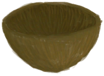

# Clay Fire Pit  
> Should be able to cook with this on a raft without burning the whole thing down.  
  
<table class="table table-bordered" data-toggle="table"  data-show-header="false"><thead style="display:none"><tr ><th  style="width:50%;text-align:left;vertical-align:top;"  >title</th><th  style="width:50%;text-align:left;vertical-align:top;"  ></th></tr></thead><tr ><td  style="width:50%;text-align:left;vertical-align:top;"  >** Cannot Be Trashed **  **Weight：**500  **Tag：**	[“Fire”](tag_Fire.md), [“Heavy”](tag_Heavy.md)  **Slots：**2  **过滤器：**[“Cookable”](tag_Cookable.md) , [“Water Container”](tag_WaterContainer.md)</td><td  style="width:50%;text-align:left;vertical-align:top;"  >

<a href="ClayFirePitExtinguished.md" style="color:black">Clay Fire Pit</a>

A portable <b>Campfire</b> provided you can carry its weight.   It should allow you to keep a fire on a <b>Raft</b> without burning it down.</td></tr></tbody></table>  
  
## Got From  

Extinguish Fire

[Clay Fire Pit](ClayFirePit.md)

Transform

[Clay Fire Pit](ClayFirePit.md)

Fire Clay Fire Pit

[Unfired Clay Fire Pit](ClayFirePitUnfired.md)

Fire Clay Fire Pit

[Unfired Clay Fire Pit](ClayFirePitUnfired.md)

  
  
## Action  

<table><tr><td rowspan="2" style="width:200px;text-align:center;font-size:1.3em;font-weight:bold">

Take Charcoal and Ash

15m

</td><td></td></tr><tr><td><b>Self：</b>Fuel  <b>-16(-16.67%)</b>, 

  <b>-16(-100%)</b></td></tr><tr><td colspan="2"><b>Require：</b>

: <b>16(100%)</b></td></tr><tr><td colspan="2">[

[Charcoal](Charcoal.md)](Charcoal.md)(<b>+1</b>), [

[Ash](Ash.md)](Ash.md)(<b>+2</b>)</td></tr></table>
  
  
  
## Drag With  

<table style="margin-bottom:0px;"><tr><td style="width:40%;text-align:left; background-color:#FEFEFE"><b>With：</b>[

[Coconut Shell](CoconutShell.md)](CoconutShell.md)</td><td style="width:40%;font-size:1em;font-weight:bold;background-color:#FEFEFE">Feed Coconut  </td></tr><tr style="background-color:#FFFFFF"><td style=""><b>Receiving：</b>→Dismiss</td><td style=""><b>Self：</b>Fuel  <b>+3(3.13%)</b></td></tr></table>
  

<table style="margin-bottom:0px;"><tr><td style="width:40%;text-align:left; background-color:#FEFEFE"><b>With：</b>[

[Wood](Wood.md)](Wood.md)</td><td style="width:40%;font-size:1em;font-weight:bold;background-color:#FEFEFE">Feed Firewood  </td></tr><tr style="background-color:#FFFFFF"><td style=""><b>Receiving：</b>→Dismiss</td><td style=""><b>Self：</b>Fuel  <b>+28(29.17%)</b></td></tr></table>
  

<table style="margin-bottom:0px;"><tr><td style="width:40%;text-align:left; background-color:#FEFEFE"><b>With：</b>[“Fuel”](tag_Fuel.md)</td><td style="width:40%;font-size:1em;font-weight:bold;background-color:#FEFEFE">Feed Fuel  </td></tr><tr style="background-color:#FFFFFF"><td style=""><b>Receiving：</b>→Dismiss</td><td style=""><b>Self：</b>Fuel  <b>+7(7.29%)</b></td></tr></table>
  

<table style="margin-bottom:0px;"><tr><td style="width:40%;text-align:left; background-color:#FEFEFE"><b>With：</b>[

[Charcoal](Charcoal.md)](Charcoal.md)</td><td style="width:40%;font-size:1em;font-weight:bold;background-color:#FEFEFE">Feed Charcoal  </td></tr><tr style="background-color:#FFFFFF"><td style=""><b>Receiving：</b>→Dismiss</td><td style=""><b>Self：</b>Fuel  <b>+7(7.29%)</b>, 

  <b>+7(43.75%)</b></td></tr></table>
  

<table style="margin-bottom:0px;"><tr><td style="width:40%;text-align:left; background-color:#FEFEFE"><b>With：</b>[“Leaves”](tag_Leaves.md)</td><td style="width:40%;font-size:1em;font-weight:bold;background-color:#FEFEFE">Feed Leaves  </td></tr><tr style="background-color:#FFFFFF"><td style=""><b>Receiving：</b>→Dismiss</td><td style=""><b>Self：</b>Fuel  <b>+2(2.08%)</b></td></tr></table>
  

<table style="margin-bottom:0px;"><tr><td style="width:40%;text-align:left; background-color:#FEFEFE"><b>With：</b>[

[Embers](Embers.md)](Embers.md)</td><td style="width:40%;font-size:1em;font-weight:bold;background-color:#FEFEFE">Feed Embers  </td></tr><tr style="background-color:#FFFFFF"><td style=""><b>Receiving：</b>→Dismiss</td><td style=""><b>Self：</b>Fuel  <b>+14(14.58%)</b>, 

  <b>+14(87.5%)</b></td></tr></table>
  

<table style="margin-bottom:0px;"><tr><td style="width:40%;text-align:left; background-color:#FEFEFE"><b>With：</b>[

[Coconut Husk](CoconutHusk.md)](CoconutHusk.md)</td><td style="width:40%;font-size:1em;font-weight:bold;background-color:#FEFEFE">Feed Husk  </td></tr><tr style="background-color:#FFFFFF"><td style=""><b>Receiving：</b>→Dismiss</td><td style=""><b>Self：</b>Fuel  <b>+3(3.13%)</b></td></tr></table>
  

<table style="margin-bottom:0px;"><tr><td style="width:40%;text-align:left; background-color:#FEFEFE"><b>With：</b>[

[Lit Tinder](TinderLit.md)](TinderLit.md)</td><td style="width:40%;font-size:1em;font-weight:bold;background-color:#FEFEFE">Light Fire  </td></tr><tr style="background-color:#FFFFFF"><td style=""><b>Receiving：</b>→Dismiss</td><td style=""><b>Self：</b>→ [

[Clay Fire Pit](ClayFirePit.md)](ClayFirePit.md), Fuel  <b>+1(1.04%)</b></td></tr></table>
  
  
## Drag To  

[Fuel Jerrycan](JerrycanFuel.md)

  
  
## Durability   

<table style="margin-bottom:0px;"><tr><td style="width:30%;text-align:left; background-color:#FEFEFE;font-size:1.3em;font-weight:bold;">Fuel</td><td style="font-size:1em;background-color:#FEFEFE">Starting：0 , Max：96 -</td></tr><tr style="background-color:#FFFFFF"><td colspan=2></td></tr></table>
  

<table style="margin-bottom:0px;"><tr><td style="width:30%;text-align:left; background-color:#FEFEFE;font-size:1.3em;font-weight:bold;">

</td><td style="font-size:1em;background-color:#FEFEFE">Starting：0 , Max：16 -</td></tr><tr style="background-color:#FFFFFF"><td colspan=2></td></tr></table>
  

