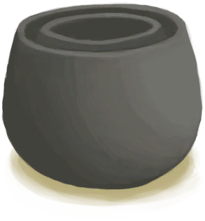

# Clay Pot Cooler  
> Needs water to work.  
  
<table class="table table-bordered" data-toggle="table"  data-show-header="false"><thead style="display:none"><tr ><th  style="width:50%;text-align:left;vertical-align:top;"  >title</th><th  style="width:50%;text-align:left;vertical-align:top;"  ></th></tr></thead><tr ><td  style="width:50%;text-align:left;vertical-align:top;"  >** Can Be Renamed **  **Weight：**750  **Tag：**	[“Large”](tag_Large.md), [“Heavy”](tag_Heavy.md)  **Slots：**12  **过滤器：**[“Feed”](tag_Feed.md) , [“Cookable”](tag_MealCookingpot.md) , [“Cookable”](tag_Cookable.md) , [“Spoilable Coconut”](tag_CoconutSpoilable.md) , ~~[“Spillable”](tag_Spillable.md)~~  **WeightCapacity：**1500  **WeightRedution：**-1500</td><td  style="width:50%;text-align:left;vertical-align:top;"  >

<a href="ClayPotCoolerOff.md" style="color:black">Clay Pot Cooler</a>

"By using the process of evaporation this two-stage ceramic device can keep foods colder and thus fresher longer. Make sure to wet the device regularly</td></tr></tbody></table>  
  
## Got From  

Transform

[Clay Pot Cooler(On)](ClayPotCoolerOn.md)

Place

[Clay Pot Cooler](ClayPotCoolerUndeployed.md)

  
  
## Action  

<table><tr><td rowspan="2" style="width:200px;text-align:center;font-size:1.3em;font-weight:bold">

Empty and Move

15m

</td><td></td></tr><tr><td><b>Self：</b>→ [

[Clay Pot Cooler](ClayPotCoolerUndeployed.md)](ClayPotCoolerUndeployed.md)</td></tr></table>
  
  
  
## Drag With  

<table style="margin-bottom:0px;"><tr><td style="width:40%;text-align:left; background-color:#FEFEFE"><b>With：</b>[

[Salt Water](LQ_WaterSalt.md)](LQ_WaterSalt.md) | [“Water for Crops”](tag_WaterFresh.md)</td><td style="width:40%;font-size:1em;font-weight:bold;background-color:#FEFEFE">Fill  </td></tr><tr style="background-color:#FFFFFF"><td style=""><b>Receiving：</b></td><td style=""><b>Self：</b>→ [

[Clay Pot Cooler(On)](ClayPotCoolerOn.md)](ClayPotCoolerOn.md), 

  <b>+192(28.07%)</b></td></tr></table>
  
  
## Durability   

<table style="margin-bottom:0px;"><tr><td style="width:30%;text-align:left; background-color:#FEFEFE;font-size:1.3em;font-weight:bold;">

</td><td style="font-size:1em;background-color:#FEFEFE">Starting：0 , Max：684 -1/TP , Duration ：7d3h</td></tr><tr style="background-color:#FFFFFF"><td colspan=2></td></tr></table>
  

