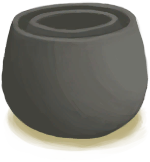

# Clay Pot Cooler  
> To store food and make it last longer.  
  
<table class="table table-bordered" data-toggle="table"  data-show-header="false"><thead style="display:none"><tr ><th  style="width:50%;text-align:left;vertical-align:top;"  >title</th><th  style="width:50%;text-align:left;vertical-align:top;"  ></th></tr></thead><tr ><td  style="width:50%;text-align:left;vertical-align:top;"  >**Weight：**750  **Tag：**	[“Large”](tag_Large.md), [“Heavy”](tag_Heavy.md)</td><td  style="width:50%;text-align:left;vertical-align:top;"  >

<a href="ClayPotCoolerUndeployed.md" style="color:black">Clay Pot Cooler</a>

"By using the process of evaporation this two-stage ceramic device can keep foods colder and thus fresher longer. Make sure to wet the device regularly</td></tr></tbody></table>  
  
## Got From  

Clay Pot Cooler

[Unfired Clay Pot Cooler](ClayPotCoolerUnfired.md)

Clay Pot Cooler

[Unfired Clay Pot Cooler](ClayPotCoolerUnfired.md)

Empty and Move

[Clay Pot Cooler(Off)](ClayPotCoolerOff.md)

Empty and Move

[Clay Pot Cooler(On)](ClayPotCoolerOn.md)

  
  
## Action  

<table><tr><td rowspan="2" style="width:200px;text-align:center;font-size:1.3em;font-weight:bold">

Place

15m

</td><td></td></tr><tr><td><b>Self：</b>→ [

[Clay Pot Cooler(Off)](ClayPotCoolerOff.md)](ClayPotCoolerOff.md)</td></tr><tr><td colspan="2"><b>Require：</b>~~In [

[Raft(Environment)](Env_Raft.md)](Env_Raft.md)~~</td></tr></table>
  
  
  

