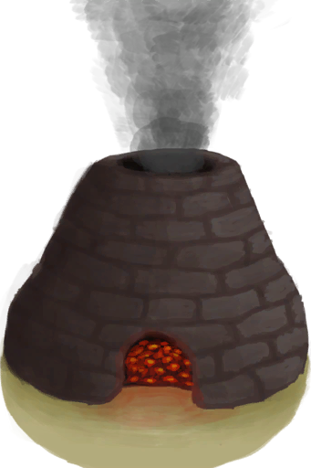

# Unfired Clay Vase  
> It needs to be fired in a kiln.  
  
<table class="table table-bordered" data-toggle="table"  data-show-header="false"><thead style="display:none"><tr ><th  style="width:50%;text-align:left;vertical-align:top;"  >title</th><th  style="width:50%;text-align:left;vertical-align:top;"  ></th></tr></thead><tr ><td  style="width:50%;text-align:left;vertical-align:top;"  >**Weight：**250  **Tag：**	[“Cookable”](tag_Cookable.md), [“Large”](tag_Large.md), [“Clay”](tag_Clay.md), [“Spillable”](tag_Spillable.md), [“Heavy”](tag_Heavy.md)</td><td  style="width:50%;text-align:left;vertical-align:top;"  >

<a href="ClayVaseUnfired.md" style="color:black">Unfired Clay Vase</a>

A large vase capable of holding <b>4 portions</b> of water.  It's design limits its content's exposed surface making liquids inside evaporate slower.  It can be made with <b>Clay and Temper</b> and fired in any <b>Kiln</b>.</td></tr></tbody></table>  
  
## Got From  

Craft BluePrint

[Clay Vase(BluePrint)](Bp_ClayVase.md)

Craft Vase

[Unfired Clay Bowl](ClayBowlUnfired.md)

Finish Vase

[Unfinished Clay Vase](ClayVaseUnfinished.md)(未实装)

  
  
## Drag To  

[Smoker](Smoker.md)

[Smoker](SmokerPlastic.md)

  
  
## Use To Transform  
<table class="table table-bordered" data-toggle="table"  ><thead style=""><tr ><th  style="text-align:left;vertical-align:top;"  >Transform to</th><th  style="text-align:left;vertical-align:top;"  >Container</th></tr></thead><tr ><td  style="text-align:left;vertical-align:top;"  >[

[Clay Vase](ClayVase.md)](ClayVase.md)</td><td  style="text-align:left;vertical-align:top;"  >[

[Kiln](Kiln.md)](Kiln.md)</td></tr><tr ><td  style="text-align:left;vertical-align:top;"  >[

[Clay Vase](ClayVase.md)](ClayVase.md)</td><td  style="text-align:left;vertical-align:top;"  >[

[Advanced Kiln](KilnAdvanced.md)](KilnAdvanced.md)</td></tr></tbody></table>  
  

