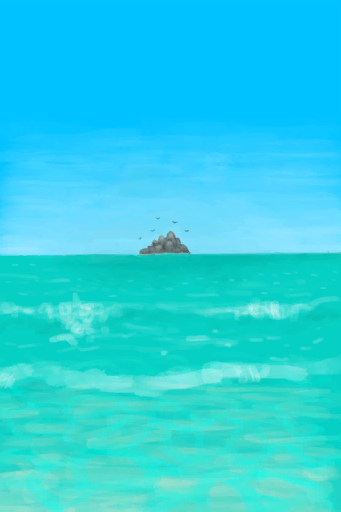
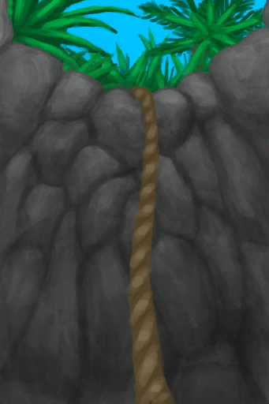
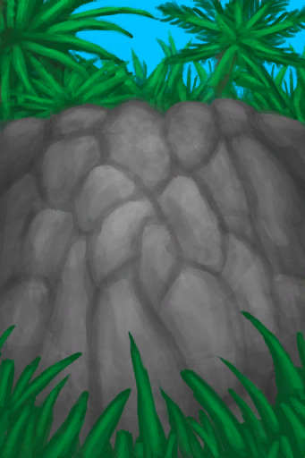

# “ClimbAction(Group)”  

Swim [

[Secret Cove](Path_BirdRockToCove.md)](Path_BirdRockToCove.md)

Swim [

[Desolate Beach(Bird Rock)](Path_BirdRockToDesolateBeach.md)](Path_BirdRockToDesolateBeach.md)

Swim [

[Rocks(Bird Rock)](Path_BirdRockToRocks.md)](Path_BirdRockToRocks.md)

Swim [

[Bird Rock(Secret Cove)](Path_CoveToBirdRock.md)](Path_CoveToBirdRock.md)

Swim [

[Bird Rock(Desolate Beach)](Path_DesolateBeachToBirdRock.md)](Path_DesolateBeachToBirdRock.md)

Swim [

[Bird Rock](Path_RocksToBirdRock.md)](Path_RocksToBirdRock.md)

Dive [

[Seawater(Flooded Chamber)](Sea_Cave.md)](Sea_Cave.md)

Climb Down [

[Shaft](ShaftCrystalChamberToFloodedChamber.md)](ShaftCrystalChamberToFloodedChamber.md)

Climb Up [

[Shaft](ShaftFloodedChamberToCrystalChamber.md)](ShaftFloodedChamberToCrystalChamber.md)

Train Climbing [

[Shaft](ShaftFloodedChamberToCrystalChamber.md)](ShaftFloodedChamberToCrystalChamber.md)

Climb Down [

[Shaft(High Chamber)](ShaftHighChamberToMidChamber.md)](ShaftHighChamberToMidChamber.md)

Climb Up [

[Shaft](ShaftLowChamberToMidChamber.md)](ShaftLowChamberToMidChamber.md)

Train Climbing [

[Shaft](ShaftLowChamberToMidChamber.md)](ShaftLowChamberToMidChamber.md)

Climb Up [

[Shaft](ShaftMidChamberToHighChamber.md)](ShaftMidChamberToHighChamber.md)

Climb Down [

[Shaft(High Chamber)](ShaftMidChamberToLowChamber.md)](ShaftMidChamberToLowChamber.md)

Enter [

[Underwater Cave](UnderwaterEntrance.md)](UnderwaterEntrance.md)

Exit [

[Underwater Exit](UnderwaterExit.md)](UnderwaterExit.md)

Climb down [

[Hole](HighlandHoleEntrance.md)](HighlandHoleEntrance.md)

Climb Up [

[Exit](HighlandHoleExit.md)](HighlandHoleExit.md)

Dive [

[Sea(Atoll)](Sea_Atoll.md)](Sea_Atoll.md)

Dive [

[Sea(Bay)](Sea_Bay.md)](Sea_Bay.md)

Dive [

[Sea(Beach)](Sea_Beach.md)](Sea_Beach.md)

Dive [

[Sea(Secret Cove)](Sea_Cove.md)](Sea_Cove.md)

Dive [

[Sea(Desolate Beach)](Sea_DesolateBeach.md)](Sea_DesolateBeach.md)

Dive [

[Sea(Mangrove Forest)](Sea_Mangroves.md)](Sea_Mangroves.md)

Dive [

[Sea](Sea_Raft.md)](Sea_Raft.md)

Dive [

[Sea(Bird Rock)](Sea_Rocks.md)](Sea_Rocks.md)

Explore the shipwreck [

[Shipwreck(Bird Rock)](Shipwreck.md)](Shipwreck.md)

Climb Up [

[To Jungle Highlands(Secret Cove)](Path_CoveToJungleHighlands.md)](Path_CoveToJungleHighlands.md)

Train Climbing [

[To Jungle Highlands(Secret Cove)](Path_CoveToJungleHighlands.md)](Path_CoveToJungleHighlands.md)

Climb Down [

[To Secret Cove(Jungle Highlands)](Path_JungleHighlandsToCove.md)](Path_JungleHighlandsToCove.md)

Climb Down [

[To Valley Cliffs](Path_JungleHighlandsToValley.md)](Path_JungleHighlandsToValley.md)

Climb [

[To Wetlands Cliff](Path_JungleHighlandsToWetlands.md)](Path_JungleHighlandsToWetlands.md)

Climb Up [

[To Jungle Highlands](Path_ValleyToJungleHighlands.md)](Path_ValleyToJungleHighlands.md)

Train Climbing [

[To Jungle Highlands](Path_ValleyToJungleHighlands.md)](Path_ValleyToJungleHighlands.md)

Climb Up [

[To Jungle Highlands(Wetlands)](Path_WetlandsToJungleHighlands.md)](Path_WetlandsToJungleHighlands.md)

Train Climbing [

[To Jungle Highlands(Wetlands)](Path_WetlandsToJungleHighlands.md)](Path_WetlandsToJungleHighlands.md)

Train Climbing [

[Cleared Palm Tree](PalmTreeCleared.md)](PalmTreeCleared.md)

Climb [

[Palm Tree](PalmTreeNew.md)](PalmTreeNew.md)

Train Climbing [

[Palm Tree](PalmTreeNew.md)](PalmTreeNew.md)

Climb [

[Palm Tree](PalmTreeNewMultiEventOld.md)](PalmTreeNewMultiEventOld.md)

Train Climbing [

[Palm Tree](PalmTreeNewMultiEventOld.md)](PalmTreeNewMultiEventOld.md)

Climb [

[Palm Tree](PalmTreeOld.md)](PalmTreeOld.md)

Train Climbing [

[Palm Tree](PalmTreeOld.md)](PalmTreeOld.md)

Climb [

[Sap Station](PalmTreeSapStation.md)](PalmTreeSapStation.md)

Train Climbing [

[Sap Station](PalmTreeSapStation.md)](PalmTreeSapStation.md)

Climb [

[Empty Sap Station(Empty)](PalmTreeSapStationEmpty.md)](PalmTreeSapStationEmpty.md)

Train Climbing [

[Empty Sap Station(Empty)](PalmTreeSapStationEmpty.md)](PalmTreeSapStationEmpty.md)

Climb [

[Seagull Nest](SeagullNest.md)](SeagullNest.md)

Demolish [

[Forge(Off)](ForgeExtinguished.md)](ForgeExtinguished.md)

Demolish [

[Advanced Kiln(Off)](KilnAdvancedExtinguished.md)](KilnAdvancedExtinguished.md)

Demolish [

[Kiln(Off)](KilnExtinguished.md)](KilnExtinguished.md)

  
  

