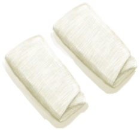

# Cloth  
> "A piece of cloth  
  
<table class="table table-bordered" data-toggle="table"  data-show-header="false"><thead style="display:none"><tr ><th  style="width:50%;text-align:left;vertical-align:top;"  >title</th><th  style="width:50%;text-align:left;vertical-align:top;"  ></th></tr></thead><tr ><td  style="width:50%;text-align:left;vertical-align:top;"  >** Cannot Be Trashed **  **Weight：**50</td><td  style="width:50%;text-align:left;vertical-align:top;"  >

<a href="Cloth.md" style="color:black">Cloth</a>

"Cloth can be made by weaving cords on a <b>Loom</b> and can be used for numerous clothing and utility items. It comes in 4 different sizes: Small</td></tr></tbody></table>  
  
## Got From  

** With：**[Small Cloth](ClothSmall.md)Enlarge Cloth

[Loom](Loom.md)

** With：**[Large Cloth](ClothLarge.md)Unweave Cloth

[Loom (Empty)(Empty)](LoomEmpty.md)

Rip Cloth

[Large Cloth](ClothLarge.md)

Rip off cloth

[Hawaiian Shirt](HawaiianShirt.md)

Transform

[Hawaiian Shirt](HawaiianShirt.md)

Rip off cloth

[Hoodie](HoodieRetromation.md)

Transform

[Hoodie](HoodieRetromation.md)

Transform

[Makeshift Mask](MaskMakeshift.md)

Rip off cloth

[Military Pants](MilitaryPants.md)

Transform

[Military Pants](MilitaryPants.md)

Rip off cloth

[Cloth Pants](PantsCloth.md)

Rip off cloth

[Shorts](Shorts.md)

Transform

[Shorts](Shorts.md)

Rip off cloth

[T-Shirt](T-Shirt.md)

Transform

[T-Shirt](T-Shirt.md)

Dismantle

[Tourniquet](Tourniquet.md)

Transform

[Tourniquet](Tourniquet.md)

Rip off cloth

[Underwear](Underwear.md)

Transform

[Underwear](Underwear.md)

Recover Cloth

[Improvised Dressing](ImprovisedDressing.md)

Transform

[Improvised Dressing](ImprovisedDressing.md)

Harvest

[Skeleton(Hole)](Skeleton.md)

** With：**[Stone Axe](StoneAxe.md)Cut Down

[Sap Station](PalmTreeSapStation.md)(未实装)

** With：**[“Axe”](tag_Axe.md)Cut Down

[Sap Station](PalmTreeSapStation.md)(未实装)

** With：**[Stone Axe](StoneAxe.md)Cut Down

[Empty Sap Station(Empty)](PalmTreeSapStationEmpty.md)(未实装)

** With：**[“Axe”](tag_Axe.md)Cut Down

[Empty Sap Station(Empty)](PalmTreeSapStationEmpty.md)(未实装)

** With：**[“Hammer”](tag_Hammer.md)Demolish

[Water Filter](WaterFilter.md)

  
  
## Action  

<table><tr><td rowspan="2" style="width:200px;text-align:center;font-size:1.3em;font-weight:bold">

Rip Cloth

15m

</td><td>[“HandAction(Group)”](HandAction.md)</td></tr><tr><td><b>Self：</b>→Dismiss</td></tr><tr><td colspan="2">[

[Small Cloth](ClothSmall.md)](ClothSmall.md)(<b>+2</b>)</td></tr></table>
  

<table><tr><td rowspan="2" style="width:200px;text-align:center;font-size:1.3em;font-weight:bold">

Craft Bandage

15m

</td><td>[“HandAction(Group)”](HandAction.md)</td></tr><tr><td><b>Self：</b>→ [

[Improvised Dressing](ImprovisedDressing.md)](ImprovisedDressing.md)</td></tr><tr><td colspan="2"><b>StatChange：</b>[

[Morale](Morale.md)](Morale.md)<b>+2</b>, [

[Tailoring(Skill)](Skill_Tailoring.md)](Skill_Tailoring.md)<b>+0.5</b></td></tr></table>
  

<table><tr><td rowspan="2" style="width:200px;text-align:center;font-size:1.3em;font-weight:bold">

Craft Foot Wrappings

15m

</td><td>[“HandAction(Group)”](HandAction.md)</td></tr><tr><td><b>Self：</b>→ [

[Foot Wrappings](FootWrappings.md)](FootWrappings.md)</td></tr><tr><td colspan="2"><b>StatChange：</b>[

[Morale](Morale.md)](Morale.md)<b>+2</b>, [

[Tailoring(Skill)](Skill_Tailoring.md)](Skill_Tailoring.md)<b>+0.5</b></td></tr></table>
  

<table><tr><td rowspan="2" style="width:200px;text-align:center;font-size:1.3em;font-weight:bold">

Craft Hand Wrappings

30m

</td><td>[“HandAction(Group)”](HandAction.md)</td></tr><tr><td><b>Self：</b>→ [

[Hand Wrappings](HandWrappings.md)](HandWrappings.md)</td></tr><tr><td colspan="2"><b>StatChange：</b>[

[Morale](Morale.md)](Morale.md)<b>+2</b>, [

[Tailoring(Skill)](Skill_Tailoring.md)](Skill_Tailoring.md)<b>+0.5</b></td></tr></table>
  
  
  
## Drag With  

<table style="margin-bottom:0px;"><tr><td style="width:40%;text-align:left; background-color:#FEFEFE"><b>With：</b>[

[Sticks](Sticks.md)](Sticks.md)</td><td style="width:40%;font-size:1em;font-weight:bold;background-color:#FEFEFE">Craft Tourniquet (15m) [“HandAction(Group)”](HandAction.md)</td></tr><tr><td colspan="2"><b>Require：</b>[

[Light](Light.md)](Light.md): <b>10-100</b></td></tr><tr style="background-color:#FFFFFF"><td style=""><b>Receiving：</b>→Dismiss</td><td style=""><b>Self：</b>→ [

[Tourniquet](Tourniquet.md)](Tourniquet.md)</td></tr></table>
  
  
## Drag To  

[Loom](Loom.md)

[Loom (Empty)(Empty)](LoomEmpty.md)

[Head (Inner)(BluePrint)](InnerHeadBlueprint.md)

[Left Foot (Inner)(BluePrint)](InnerLeftFootBlueprint.md)

[Left Hand(BluePrint)](LeftHandBlueprint.md)

[Right Hand(BluePrint)](RightHandBlueprint.md)

  
  
## Use In BluePrint  

<a href="Bp_Torch.md" style="color:black">Torch</a>

<a href="Bp_Tourniquet.md" style="color:black">Tourniquet</a>

<a href="Bp_WaterFilter.md" style="color:black">Water Filter</a>

  
  
  

