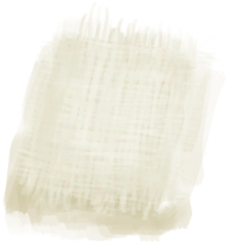
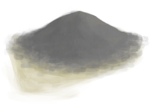
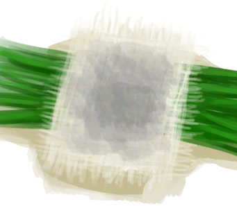

# Small Cloth  
> "A small piece of cloth  
  
<table class="table table-bordered" data-toggle="table"  data-show-header="false"><thead style="display:none"><tr ><th  style="width:50%;text-align:left;vertical-align:top;"  >title</th><th  style="width:50%;text-align:left;vertical-align:top;"  ></th></tr></thead><tr ><td  style="width:50%;text-align:left;vertical-align:top;"  >** Cannot Be Trashed **  **Weight：**25</td><td  style="width:50%;text-align:left;vertical-align:top;"  >

<a href="ClothSmall.md" style="color:black">Small Cloth</a>

"Cloth can be made by weaving cords on a <b>Loom</b> and can be used for numerous clothing and utility items. It comes in 4 different sizes: Small</td></tr></tbody></table>  
  
## Got From  

Make Cloth

[Loom](Loom.md)

** With：**[Cloth](Cloth.md)Unweave Cloth

[Loom (Empty)(Empty)](LoomEmpty.md)

Scrap Dressing

[Ash Dressing](AshDressing.md)

Transform

[Ash Dressing](AshDressing.md)

Rip Cloth

[Cloth](Cloth.md)

Rip Cloth

[Large Cloth](ClothLarge.md)

Rip Cloth

[Very Large Cloth](ClothVeryLarge.md)

Rip off cloth

[Foot Wrappings](FootWrappings.md)

Transform

[Foot Wrappings](FootWrappings.md)

Rip off cloth

[Hand Wrappings](HandWrappings.md)

Transform

[Hand Wrappings](HandWrappings.md)

Transform

[Survival Hat](HatSurvival.md)

Rip off cloth

[Head Wrappings](HeadWrappings.md)

Rip off cloth

[Socks](Socks.md)

Transform

[Socks](Socks.md)

Transform

[Wound Dressing](WoundDressing.md)

  
  
## Drag With  

<table style="margin-bottom:0px;"><tr><td style="width:40%;text-align:left; background-color:#FEFEFE"><b>With：</b>[

[Ash](Ash.md)](Ash.md)</td><td style="width:40%;font-size:1em;font-weight:bold;background-color:#FEFEFE">Make Ash Dressing (15m) [“HandAction(Group)”](HandAction.md)</td></tr><tr><td colspan="2"><b>Require：</b>[

[Light](Light.md)](Light.md): <b>10-100</b></td></tr><tr style="background-color:#FFFFFF"><td style=""><b>Receiving：</b>→Dismiss</td><td style=""><b>Self：</b>→ [

[Ash Dressing](AshDressing.md)](AshDressing.md)</td></tr></table>
  
  
## Drag To  

[Loom](Loom.md)

[Loom (Empty)(Empty)](LoomEmpty.md)

  
  
## Use In BluePrint  

<a href="Bp_AshDressing.md" style="color:black">Ash Dressing</a>

<a href="Bp_Sling.md" style="color:black">Sling</a>

<a href="Bp_Cheese.md" style="color:black">Cheese</a>

  
  
  

