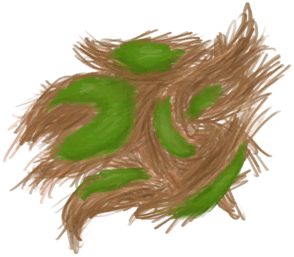

# Coconut Husk  
> I should be able to extract fibers out of it.  
  
<table class="table table-bordered" data-toggle="table"  data-show-header="false"><thead style="display:none"><tr ><th  style="width:50%;text-align:left;vertical-align:top;"  >title</th><th  style="width:50%;text-align:left;vertical-align:top;"  ></th></tr></thead><tr ><td  style="width:50%;text-align:left;vertical-align:top;"  >**Weight：**15  **Tag：**	[“Fuel”](tag_Fuel.md), [“Poor Fibers”](tag_FibersPoor.md)</td><td  style="width:50%;text-align:left;vertical-align:top;"  >

<a href="CoconutHusk.md" style="color:black">Coconut Husk</a>

"Gathered from <b>coconuts</b> when peeling them with a stone or a sharp tool. You can extract <b>fibers</b> from it</td></tr></tbody></table>  
  
## Got From  

** With：**[“Cutter”](tag_Cutter.md) , [“Spear T1”](tag_Spear.md)Peel

[Husked Coconut](CoconutHusked.md)

** With：**[“Axe”](tag_Axe.md)Peel

[Husked Coconut](CoconutHusked.md)

** With：**[“Hammer”](tag_Hammer.md)Peel

[Husked Coconut](CoconutHusked.md)

** With：**[Husked Coconut](CoconutHusked.md)Peel Coconut

[Macaque Friend](MacaqueFriend.md)

  
  
## Action  

<table><tr><td rowspan="2" style="width:200px;text-align:center;font-size:1.3em;font-weight:bold">

Extract Fibers

15m

</td><td>[“HandAction(Group)”](HandAction.md)</td></tr><tr><td><b>Self：</b>→Dismiss</td></tr><tr><td colspan="2"><b>StatChange：</b>[

[Stress](Stress.md)](Stress.md)<b>-10</b> addition<b>-1</b></td></tr><tr><td colspan="2">[

[Fibers](Fibers.md)](Fibers.md)(<b>+2</b>)</td></tr></table>
  
  
  
## Drag To  

[Compost Bin](CompostBin.md)

[Alembic(Off)](AlembicOff.md)

[Alembic(On)](AlembicOn.md)

[Campfire](Campfire.md)

[Campfire(Off)](CampfireExtinguished.md)

[Clay Fire Pit](ClayFirePit.md)

[Clay Fire Pit(Off)](ClayFirePitExtinguished.md)

[Fire](Fire.md)

[Fire(Off)](FireExtinguished.md)

[Forge](Forge.md)

[Forge(Off)](ForgeExtinguished.md)

[Kiln](Kiln.md)

[Advanced Kiln](KilnAdvanced.md)

[Advanced Kiln(Off)](KilnAdvancedExtinguished.md)

[Kiln(Off)](KilnExtinguished.md)

[Stove](Stove.md)

[Stove(Off)](StoveExtinguished.md)

[Goat Feeder](GoatFeeder.md)

[Goat Feeder(Empty)](GoatFeederEmpty.md)

[Goat](GoatEnclosureFemale.md)

[Juvenile Goat](GoatEnclosureKid.md)

[Lactating Goat](GoatEnclosureLactating.md)

[Male Goat](GoatEnclosureMale.md)

[Goat](GoatTiedFemale.md)

[Lactating Goat](GoatTiedFemaleLactating.md)

[Juvenile Goat](GoatTiedKid.md)

[Male Goat](GoatTiedMale.md)

  
  
## Use In BluePrint  

<a href="Bp_CoconutSandals.md" style="color:black">Coconut Sandals</a>

  
  
  

