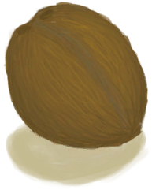

# Husked Coconut  
> I need to find a way to puncture it.  
  
<table class="table table-bordered" data-toggle="table"  data-show-header="false"><thead style="display:none"><tr ><th  style="width:50%;text-align:left;vertical-align:top;"  >title</th><th  style="width:50%;text-align:left;vertical-align:top;"  ></th></tr></thead><tr ><td  style="width:50%;text-align:left;vertical-align:top;"  >**Weight：**200</td><td  style="width:50%;text-align:left;vertical-align:top;"  >

<a href="CoconutHusked.md" style="color:black">Husked Coconut</a>

"Coconuts can be found on most of the <b>Beaches</b> of the island</td></tr></tbody></table>  
  
## Got From  

Continue

[Success!(Event)](Event_CoconutHit.md)(未实装)

Continue

[Palm Tree(Event)](Event_PalmTree.md)

Take Coconuts

[Palm Tree(Event)](Event_PalmTree1.md)

Take Coconuts

[Palm Tree(Event)](Event_PalmTree2.md)

Take Coconuts

[Palm Tree(Event)](Event_PalmTree3.md)

Take Coconuts

[Palm Tree(Event)](Event_PalmTree4.md)(未实装)

Take Coconuts

[Sap Station(Event)](Event_SapStation.md)(未实装)

Nice

[Failure!(Event)](Event_SwimmingFailed.md)(未实装)

Go for a Walk

[Bay](Bay.md)

Go for a Walk

[Beach](Beach.md)

Explore

[Desolate Beach](DesolateBeach.md)

Explore

[Jungle Outskirts(Outskirts)](Outskirts.md)

Climb

[Palm Tree](PalmTreeNew.md)

** With：**[Stone](Stone.md)Throw Rock

[Palm Tree](PalmTreeNew.md)

** With：**[Macaque Friend](MacaqueFriend.md)Send Macaque

[Palm Tree](PalmTreeNew.md)

Transform

[Palm Tree](PalmTreeNew.md)

Transform

[Palm Tree](PalmTreeNewMultiEventOld.md)

Transform

[Palm Tree](PalmTreeOld.md)(未实装)

** With：**[Stone Axe](StoneAxe.md)Cut Down

[Palm Tree](PalmTree_IH.md)(未实装)

** With：**[Copper Axe](AxeCopper.md)Cut Down

[Palm Tree](PalmTree_IH.md)(未实装)

Climb fo Coconuts

[Palm Tree](PalmTree_Unique.md)(未实装)

Climb for Coconuts

[Palm Tree](PalmTree_Unique.md)(未实装)

** With：**[Stone Axe](StoneAxe.md)Cut Down

[Palm Tree](PalmTree_Unique.md)(未实装)

** With：**[Copper Axe](AxeCopper.md)Cut Down

[Palm Tree](PalmTree_Unique.md)(未实装)

  
  
## Drag With  

<table style="margin-bottom:0px;"><tr><td style="width:40%;text-align:left; background-color:#FEFEFE"><b>With：</b>[“Cutter”](tag_Cutter.md) | [“Spear T1”](tag_Spear.md)</td><td style="width:40%;font-size:1em;font-weight:bold;background-color:#FEFEFE">Peel (15m) [“HandAction(Group)”](HandAction.md)</td></tr><tr><td colspan="2"><b>Require：</b>[

[Light](Light.md)](Light.md): <b>10-100</b></td></tr><tr style="background-color:#FFFFFF"><td style=""><b>Receiving：</b>Usage  <b>-1(-0.67%)</b></td><td style=""><b>Self：</b>→ [

[Coconut](Coconut.md)](Coconut.md)</td></tr><tr><td colspan="2"><b>StatChange：</b>[

[Stamina](Stamina.md)](Stamina.md)<b>-2</b>, [

[Stress](Stress.md)](Stress.md)<b>-10</b> addition<b>-1</b></td></tr><tr><td colspan="2">[

[Coconut Husk](CoconutHusk.md)](CoconutHusk.md)(<b>+1</b>)</td></tr></table>
  

<table style="margin-bottom:0px;"><tr><td style="width:40%;text-align:left; background-color:#FEFEFE"><b>With：</b>[“Axe”](tag_Axe.md)</td><td style="width:40%;font-size:1em;font-weight:bold;background-color:#FEFEFE">Peel (15m) [“HandAction(Group)”](HandAction.md)</td></tr><tr><td colspan="2"><b>Require：</b>[

[Light](Light.md)](Light.md): <b>10-100</b></td></tr><tr style="background-color:#FFFFFF"><td style=""><b>Receiving：</b>Usage  <b>-1(-2%)</b></td><td style=""><b>Self：</b>→ [

[Coconut](Coconut.md)](Coconut.md)</td></tr><tr><td colspan="2"><b>StatChange：</b>[

[Stamina](Stamina.md)](Stamina.md)<b>-2</b>, [

[Stress](Stress.md)](Stress.md)<b>-10</b> addition<b>-1</b></td></tr><tr><td colspan="2">[

[Coconut Husk](CoconutHusk.md)](CoconutHusk.md)(<b>+1</b>)</td></tr></table>
  

<table style="margin-bottom:0px;"><tr><td style="width:40%;text-align:left; background-color:#FEFEFE"><b>With：</b>[“Hammer”](tag_Hammer.md)</td><td style="width:40%;font-size:1em;font-weight:bold;background-color:#FEFEFE">Peel (30m) [“HandAction(Group)”](HandAction.md)</td></tr><tr><td colspan="2"><b>Require：</b>[

[Light](Light.md)](Light.md): <b>10-100</b></td></tr><tr style="background-color:#FFFFFF"><td style=""><b>Receiving：</b></td><td style=""><b>Self：</b>→ [

[Coconut](Coconut.md)](Coconut.md)</td></tr><tr><td colspan="2"><b>StatChange：</b>[

[Stamina](Stamina.md)](Stamina.md)<b>-4</b>, [

[Stress](Stress.md)](Stress.md)<b>-10</b> addition<b>-1</b></td></tr><tr><td colspan="2">[

[Coconut Husk](CoconutHusk.md)](CoconutHusk.md)(<b>+1</b>)</td></tr></table>
  
  
## Drag To  

[Empty Crop Plot(Empty)](CropPlotEmpty.md)

[Macaque Friend](MacaqueFriend.md)

  
  

