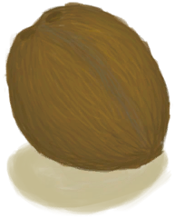

# Rotten Coconut  
> This has gone bad.  
  
<table class="table table-bordered" data-toggle="table"  data-show-header="false"><thead style="display:none"><tr ><th  style="width:50%;text-align:left;vertical-align:top;"  >title</th><th  style="width:50%;text-align:left;vertical-align:top;"  ></th></tr></thead><tr ><td  style="width:50%;text-align:left;vertical-align:top;"  >**Weight：**100  ** Effect: ** [

[Discomfort](Discomfort.md)](Discomfort.md)<b>+25</b></td><td  style="width:50%;text-align:left;vertical-align:top;"  >

<a href="CoconutRotten.md" style="color:black">Rotten Coconut</a>

"Coconuts can be found on most of the <b>Beaches</b> of the island</td></tr></tbody></table>  
  
## Got From  

Transform

[Perforated Coconut](CoconutPerforated.md)

  
  
## Drag With  

<table style="margin-bottom:0px;"><tr><td style="width:40%;text-align:left; background-color:#FEFEFE"><b>With：</b>[“Hammer”](tag_Hammer.md)</td><td style="width:40%;font-size:1em;font-weight:bold;background-color:#FEFEFE">Crack open  [“HandAction(Group)”](HandAction.md)</td></tr><tr><td colspan="2"><b>Require：</b>[

[Light](Light.md)](Light.md): <b>10-100</b></td></tr><tr style="background-color:#FFFFFF"><td style=""><b>Receiving：</b></td><td style=""><b>Self：</b>→Dismiss</td></tr><tr><td colspan="2">[

[Coconut Shell](CoconutShell.md)](CoconutShell.md)(<b>+2</b>), [

[Rotten Remains](RottenRemains.md)](RottenRemains.md)(<b>+2</b>)</td></tr></table>
  
  

