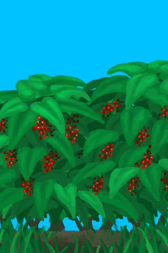

# Coffee Bush  
> I could harvest coffee beans from here.  
  
<table class="table table-bordered" data-toggle="table"  data-show-header="false"><thead style="display:none"><tr ><th  style="width:50%;text-align:left;vertical-align:top;"  data-sortable="true"  >title</th><th  style="width:50%;text-align:left;vertical-align:top;"  ></th></tr></thead><tr ><td  style="width:50%;text-align:left;vertical-align:top;"  ></td><td  style="width:50%;text-align:left;vertical-align:top;"  >

<a href="CoffeePlant.md" style="color:black">Coffee Bush</a>

"The most popular beverage in the world!  <b>Coffee Plants</b> can be found in the <b>Jungle Highlands</b> or grown in crop plots.  Harvest their <b>Berries</b> and extract the <b>beans</b> from them.  Then</td></tr></tbody></table>  
  
## Got From  

Transform

[Coffee Crop Plot](CropPlotCoffee.md)

Explore

[Jungle Highlands](JungleHighlands.md)

  
  
## Action  

<table><tr><td rowspan="2" style="width:200px;text-align:center;font-size:1.3em;font-weight:bold">

Harvest

30m

</td><td>[“HandAction(Group)”](HandAction.md)</td></tr><tr><td><b>Self：</b>→Dismiss</td></tr><tr><td colspan="2"><b>Require：</b>[

[Light](Light.md)](Light.md): <b>10-100</b></td></tr><tr><td colspan="2"><b>StatChange：</b>[

[Herbology(Skill)](Skill_Herbology.md)](Skill_Herbology.md)<b>+0.5</b></td></tr><tr><td colspan="2">[

[Coffee Berries](CoffeeBerries.md)](CoffeeBerries.md)(<b>+2～+3</b>)</td></tr></table>
  
  
  

