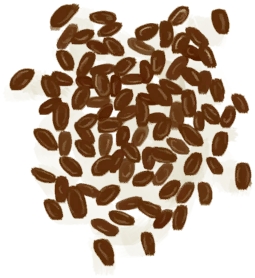
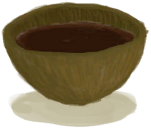

# Roasted Coffee Beans  
> Add hot water and Voila! Coffee!  
  
<table class="table table-bordered" data-toggle="table"  data-show-header="false"><thead style="display:none"><tr ><th  style="width:50%;text-align:left;vertical-align:top;"  >title</th><th  style="width:50%;text-align:left;vertical-align:top;"  ></th></tr></thead><tr ><td  style="width:50%;text-align:left;vertical-align:top;"  >**Weight：**100  **Tag：**	[“Cookable”](tag_Cookable.md)</td><td  style="width:50%;text-align:left;vertical-align:top;"  >

<a href="CoffeeRoastedBeans.md" style="color:black">Roasted Coffee Beans</a>

"The most popular beverage in the world!  <b>Coffee Plants</b> can be found in the <b>Jungle Highlands</b> or grown in crop plots.  Harvest their <b>Berries</b> and extract the <b>beans</b> from them.  Then</td></tr></tbody></table>  
  
## Got From  

Coffee

[Coffee Beans](CoffeeBeans.md)

Coffee

[Coffee Beans](CoffeeBeans.md)

Coffee

[Coffee Beans](CoffeeBeans.md)

Coffee

[Coffee Beans](CoffeeBeans.md)

Coffee

[Coffee Beans](CoffeeBeans.md)

  
  
## Drag With  

<table style="margin-bottom:0px;"><tr><td style="width:40%;text-align:left; background-color:#FEFEFE"><b>With：</b>[

[Boiling Water](LQ_WaterBoiling.md)](LQ_WaterBoiling.md)</td><td style="width:40%;font-size:1em;font-weight:bold;background-color:#FEFEFE">Make Coffee  </td></tr><tr style="background-color:#FFFFFF"><td style=""><b>Receiving：</b>→ [

[Coffee](LQ_Coffee.md)](LQ_Coffee.md)</td><td style=""><b>Self：</b>→Dismiss</td></tr></table>
  
  

