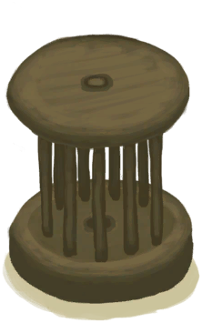
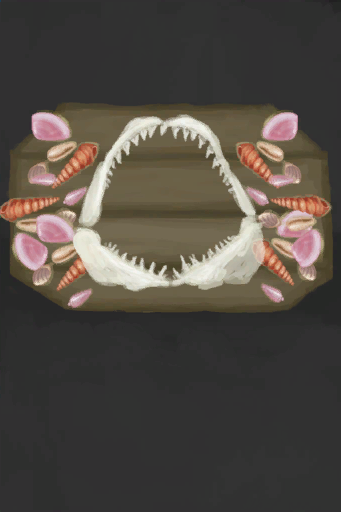
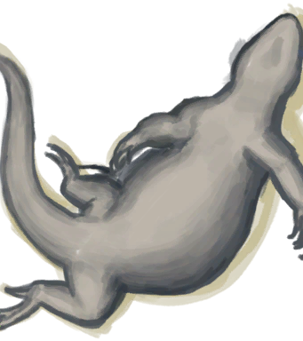
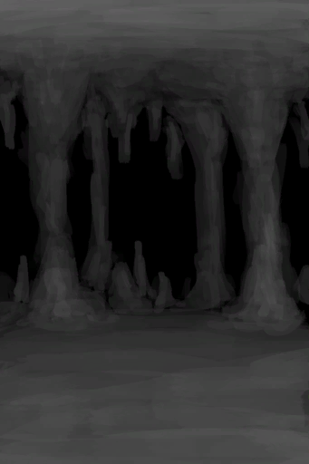
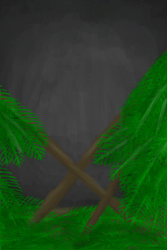

# Comfort  
> "How safe  
> "Being in a comfortable place will help increase your <b>Morale and Mental Structure</b> while lowering your <b>Stress and Loneliness</b>.  A comfortable place is one that is safe  
  

<b>Base Value: </b> 0 
  

<b>Value Range: </b> 0 ~ 2500 
  

<b>Base Rate: </b> - 
  
## Statuses  

<table><tr style="height:2em;"><td style="background-color:#F0F0F0;text-align:center;width:180px;font-size:1.4em;font-weight:bold;vertical-align:middle;">
100 ～ 250

4% ～ 10%
</td><td colspan=2 style="font-size:1.1em;vertical-align:middle;background-color:#F9F9F9;">
<b>

Minimal Comfort</b>

</td></tr><tr><td colspan=2><b>Effect：</b>[

[Mental Structure](Structure.md)](Structure.md)addition<b>+1</b>, [

[Stress](Stress.md)](Stress.md)addition<b>-0.5</b></td></tr><tr><td colspan=2></td></tr><tr style="height:2em;"><td style="background-color:#F0F0F0;text-align:center;width:180px;font-size:1.4em;font-weight:bold;vertical-align:middle;">
251 ～ 500

10% ～ 20%
</td><td colspan=2 style="font-size:1.1em;vertical-align:middle;background-color:#F9F9F9;">
<b>

Low Comfort</b>

&nbsp;&nbsp;I should make this place feel more like a home.
</td></tr><tr><td colspan=2><b>Effect：</b>[

[Mental Structure](Structure.md)](Structure.md)addition<b>+2</b>, [

[Stress](Stress.md)](Stress.md)addition<b>-0.5</b>, [

[Morale](Morale.md)](Morale.md)addition<b>+0.25</b></td></tr><tr><td colspan=2></td></tr><tr style="height:2em;"><td style="background-color:#F0F0F0;text-align:center;width:180px;font-size:1.4em;font-weight:bold;vertical-align:middle;">
501 ～ 1000

20% ～ 40%
</td><td colspan=2 style="font-size:1.1em;vertical-align:middle;background-color:#F9F9F9;">
<b>

Medium Comfort</b>

&nbsp;&nbsp;I should furnish and decorate this place further.
</td></tr><tr><td colspan=2><b>Effect：</b>[

[Mental Structure](Structure.md)](Structure.md)addition<b>+3</b>, [

[Stress](Stress.md)](Stress.md)addition<b>-0.75</b>, [

[Morale](Morale.md)](Morale.md)addition<b>+0.5</b>, [

[Loneliness](Loneliness.md)](Loneliness.md)addition<b>-0.5</b></td></tr><tr><td colspan=2></td></tr><tr style="height:2em;"><td style="background-color:#F0F0F0;text-align:center;width:180px;font-size:1.4em;font-weight:bold;vertical-align:middle;">
1001 ～ 1750

40% ～ 70%
</td><td colspan=2 style="font-size:1.1em;vertical-align:middle;background-color:#F9F9F9;">
<b>

High Comfort</b>

&nbsp;&nbsp;A nice home. I feel comfortable here.
</td></tr><tr><td colspan=2><b>Effect：</b>[

[Mental Structure](Structure.md)](Structure.md)addition<b>+4</b>, [

[Stress](Stress.md)](Stress.md)addition<b>-1</b>, [

[Morale](Morale.md)](Morale.md)addition<b>+0.75</b>, [

[Loneliness](Loneliness.md)](Loneliness.md)addition<b>-1</b></td></tr><tr><td colspan=2></td></tr><tr style="height:2em;"><td style="background-color:#F0F0F0;text-align:center;width:180px;font-size:1.4em;font-weight:bold;vertical-align:middle;">
1751 ～ 2500

70% ～ 100%
</td><td colspan=2 style="font-size:1.1em;vertical-align:middle;background-color:#F9F9F9;">
<b>

Maximum Comfort</b>

&nbsp;&nbsp;Home sweet home. There's no place like it.
</td></tr><tr><td colspan=2><b>Effect：</b>[

[Mental Structure](Structure.md)](Structure.md)addition<b>+5</b>, [

[Stress](Stress.md)](Stress.md)addition<b>-1.25</b>, [

[Morale](Morale.md)](Morale.md)addition<b>+1</b>, [

[Loneliness](Loneliness.md)](Loneliness.md)addition<b>-2</b></td></tr><tr><td colspan=2></td></tr></table>
  
## Related Cards  
[Discomfort](Discomfort.md)  |  [Sheltered](Sheltered.md)  
## Change By  
<table class="table table-bordered" data-toggle="table"  ><thead style=""><tr ><th  style="text-align:left;vertical-align:top;"  >From</th><th  style="text-align:left;vertical-align:top;"  >Operation</th><th  style="text-align:left;vertical-align:top;"  data-sortable="true"  >Value</th></tr></thead><tr ><td  style="text-align:left;vertical-align:top;"  >[

[Wooden Bed](BedWooden.md)](BedWooden.md)</td><td  style="text-align:left;vertical-align:top;"  >Passive Effects</td><td  style="text-align:left;vertical-align:top;"  >250</td></tr><tr ><td  style="text-align:left;vertical-align:top;"  >[

[Stitched-Hide Floor](Imp_RaftStitchedHideFloor.md)](Imp_RaftStitchedHideFloor.md)</td><td  style="text-align:left;vertical-align:top;"  >Passive Effects</td><td  style="text-align:left;vertical-align:top;"  >250</td></tr><tr ><td  style="text-align:left;vertical-align:top;"  >[

[Stitched-Hide Floor](Imp_StitchedHideFloor.md)](Imp_StitchedHideFloor.md)</td><td  style="text-align:left;vertical-align:top;"  >Passive Effects</td><td  style="text-align:left;vertical-align:top;"  >250</td></tr><tr ><td  style="text-align:left;vertical-align:top;"  >[

[White Washed Walls](Imp_WhiteWashedWalls.md)](Imp_WhiteWashedWalls.md)</td><td  style="text-align:left;vertical-align:top;"  >Passive Effects</td><td  style="text-align:left;vertical-align:top;"  >250</td></tr><tr ><td  style="text-align:left;vertical-align:top;"  >[

[Raft Shelter](RaftShelter.md)](RaftShelter.md)</td><td  style="text-align:left;vertical-align:top;"  >Passive Effects</td><td  style="text-align:left;vertical-align:top;"  >250</td></tr><tr ><td  style="text-align:left;vertical-align:top;"  >[

[Stove](Stove.md)](Stove.md)</td><td  style="text-align:left;vertical-align:top;"  >Passive</td><td  style="text-align:left;vertical-align:top;"  >150</td></tr><tr ><td  style="text-align:left;vertical-align:top;"  >[

[Stove(Off)](StoveExtinguished.md)](StoveExtinguished.md)</td><td  style="text-align:left;vertical-align:top;"  >Passive</td><td  style="text-align:left;vertical-align:top;"  >150</td></tr><tr ><td  style="text-align:left;vertical-align:top;"  >[

[Table](Table.md)](Table.md)</td><td  style="text-align:left;vertical-align:top;"  >Passive Effects</td><td  style="text-align:left;vertical-align:top;"  >150</td></tr><tr ><td  style="text-align:left;vertical-align:top;"  >[

[Door](Imp_Door.md)](Imp_Door.md)</td><td  style="text-align:left;vertical-align:top;"  >Passive Effects</td><td  style="text-align:left;vertical-align:top;"  >150</td></tr><tr ><td  style="text-align:left;vertical-align:top;"  >[

[Mermaid nest](MermaidNest.md)](MermaidNest.md)</td><td  style="text-align:left;vertical-align:top;"  >Passive Effects</td><td  style="text-align:left;vertical-align:top;"  >100</td></tr><tr ><td  style="text-align:left;vertical-align:top;"  >[

[Drum](Drum.md)](Drum.md)</td><td  style="text-align:left;vertical-align:top;"  >Passive</td><td  style="text-align:left;vertical-align:top;"  >100</td></tr><tr ><td  style="text-align:left;vertical-align:top;"  >[

[Blooming Alien Growth](AlienGrowth.md)](AlienGrowth.md)</td><td  style="text-align:left;vertical-align:top;"  >Passive Effects</td><td  style="text-align:left;vertical-align:top;"  >100</td></tr><tr ><td  style="text-align:left;vertical-align:top;"  >[

[Alien Growth](AlienGrowthCleared.md)](AlienGrowthCleared.md)</td><td  style="text-align:left;vertical-align:top;"  >Passive Effects</td><td  style="text-align:left;vertical-align:top;"  >100</td></tr><tr ><td  style="text-align:left;vertical-align:top;"  >[

[Chair](ChairPlaced.md)](ChairPlaced.md)</td><td  style="text-align:left;vertical-align:top;"  >Passive Effects</td><td  style="text-align:left;vertical-align:top;"  >75</td></tr><tr ><td  style="text-align:left;vertical-align:top;"  >[

[Pottery Wheel](PotteryWheel.md)](PotteryWheel.md)</td><td  style="text-align:left;vertical-align:top;"  >Passive</td><td  style="text-align:left;vertical-align:top;"  >75</td></tr><tr ><td  style="text-align:left;vertical-align:top;"  >[

[Seat](SeatAttached.md)](SeatAttached.md)</td><td  style="text-align:left;vertical-align:top;"  >Passive Effects</td><td  style="text-align:left;vertical-align:top;"  >75</td></tr><tr ><td  style="text-align:left;vertical-align:top;"  >[

[Seat](SeatPlaced.md)](SeatPlaced.md)</td><td  style="text-align:left;vertical-align:top;"  >Passive Effects</td><td  style="text-align:left;vertical-align:top;"  >75</td></tr><tr ><td  style="text-align:left;vertical-align:top;"  >[

[Home Sign](Imp_HomeSign.md)](Imp_HomeSign.md)</td><td  style="text-align:left;vertical-align:top;"  >Passive Effects</td><td  style="text-align:left;vertical-align:top;"  >75</td></tr><tr ><td  style="text-align:left;vertical-align:top;"  >[

[Sea Trophy](Imp_SeaTrophy.md)](Imp_SeaTrophy.md)</td><td  style="text-align:left;vertical-align:top;"  >Passive Effects</td><td  style="text-align:left;vertical-align:top;"  >75</td></tr><tr ><td  style="text-align:left;vertical-align:top;"  >[

[Jasmine Candle(On)](CandleJasmineOn.md)](CandleJasmineOn.md)</td><td  style="text-align:left;vertical-align:top;"  >Passive Effects</td><td  style="text-align:left;vertical-align:top;"  >75</td></tr><tr ><td  style="text-align:left;vertical-align:top;"  >[

[Rustic Bed](BedRustic.md)](BedRustic.md)</td><td  style="text-align:left;vertical-align:top;"  >Passive Effects</td><td  style="text-align:left;vertical-align:top;"  >50</td></tr><tr ><td  style="text-align:left;vertical-align:top;"  >[

[Jasmine Flowers](ClayJarJasmine.md)](ClayJarJasmine.md)</td><td  style="text-align:left;vertical-align:top;"  >Passive Effects</td><td  style="text-align:left;vertical-align:top;"  >50</td></tr><tr ><td  style="text-align:left;vertical-align:top;"  >[

[Bookshelf](Bookshelf.md)](Bookshelf.md)</td><td  style="text-align:left;vertical-align:top;"  >Passive Effects</td><td  style="text-align:left;vertical-align:top;"  >50</td></tr><tr ><td  style="text-align:left;vertical-align:top;"  >[

[Jasmine Flowers](PlasticBottleJasmine.md)](PlasticBottleJasmine.md)</td><td  style="text-align:left;vertical-align:top;"  >Passive Effects</td><td  style="text-align:left;vertical-align:top;"  >25</td></tr><tr ><td  style="text-align:left;vertical-align:top;"  >[

[Lizard Drum](LizardDrum.md)](LizardDrum.md)</td><td  style="text-align:left;vertical-align:top;"  >Passive Effects</td><td  style="text-align:left;vertical-align:top;"  >25</td></tr><tr ><td  style="text-align:left;vertical-align:top;"  >[

[Citronella Candle(On)](CandleCitronellaOn.md)](CandleCitronellaOn.md)</td><td  style="text-align:left;vertical-align:top;"  >Passive Effects</td><td  style="text-align:left;vertical-align:top;"  >25</td></tr><tr ><td  style="text-align:left;vertical-align:top;"  >[

[Bookshelf](Bookshelf.md)](Bookshelf.md)</td><td  style="text-align:left;vertical-align:top;"  >Passive</td><td  style="text-align:left;vertical-align:top;"  >15</td></tr><tr ><td  style="text-align:left;vertical-align:top;"  >[

[Shelf](Shelf.md)](Shelf.md)</td><td  style="text-align:left;vertical-align:top;"  >Passive</td><td  style="text-align:left;vertical-align:top;"  >15</td></tr><tr ><td  style="text-align:left;vertical-align:top;"  >[

[Bookshelf](Bookshelf.md)](Bookshelf.md)</td><td  style="text-align:left;vertical-align:top;"  >Passive</td><td  style="text-align:left;vertical-align:top;"  >10</td></tr><tr ><td  style="text-align:left;vertical-align:top;"  >[

[Shelf](Shelf.md)](Shelf.md)</td><td  style="text-align:left;vertical-align:top;"  >Passive</td><td  style="text-align:left;vertical-align:top;"  >10</td></tr><tr ><td  style="text-align:left;vertical-align:top;"  >[

[Bat Cave](CaveBats.md)](CaveBats.md)</td><td  style="text-align:left;vertical-align:top;"  >Passive Effects</td><td  style="text-align:left;vertical-align:top;"  >-100</td></tr><tr ><td  style="text-align:left;vertical-align:top;"  >[

[Grasslands Cave(Cave)](CaveGrasslands.md)](CaveGrasslands.md)</td><td  style="text-align:left;vertical-align:top;"  >Passive Effects</td><td  style="text-align:left;vertical-align:top;"  >-100</td></tr><tr ><td  style="text-align:left;vertical-align:top;"  >[

[Tunnel](Tunnel.md)](Tunnel.md)</td><td  style="text-align:left;vertical-align:top;"  >Passive Effects</td><td  style="text-align:left;vertical-align:top;"  >-100</td></tr><tr ><td  style="text-align:left;vertical-align:top;"  >[

[Macaque Den](MacaqueDen.md)](MacaqueDen.md)</td><td  style="text-align:left;vertical-align:top;"  >Passive Effects</td><td  style="text-align:left;vertical-align:top;"  >-100</td></tr><tr ><td  style="text-align:left;vertical-align:top;"  >[

[Roof Damage](Dmg_RaftDamage.md)](Dmg_RaftDamage.md)(未实装)</td><td  style="text-align:left;vertical-align:top;"  >Passive Effects</td><td  style="text-align:left;vertical-align:top;"  >-250</td></tr><tr ><td  style="text-align:left;vertical-align:top;"  >[

[Roof Damage](Dmg_RoofDamage.md)](Dmg_RoofDamage.md)</td><td  style="text-align:left;vertical-align:top;"  >Passive Effects</td><td  style="text-align:left;vertical-align:top;"  >-250</td></tr><tr ><td  style="text-align:left;vertical-align:top;"  >[

[Boar Carcass](BoarCarcass.md)](BoarCarcass.md)</td><td  style="text-align:left;vertical-align:top;"  >Passive Effects</td><td  style="text-align:left;vertical-align:top;"  >-250</td></tr><tr ><td  style="text-align:left;vertical-align:top;"  >[

[Piglet Carcass](BoarCarcassPiglet.md)](BoarCarcassPiglet.md)</td><td  style="text-align:left;vertical-align:top;"  >Passive Effects</td><td  style="text-align:left;vertical-align:top;"  >-250</td></tr><tr ><td  style="text-align:left;vertical-align:top;"  >[

[Goat Carcass](GoatCarcassFemale.md)](GoatCarcassFemale.md)</td><td  style="text-align:left;vertical-align:top;"  >Passive Effects</td><td  style="text-align:left;vertical-align:top;"  >-250</td></tr><tr ><td  style="text-align:left;vertical-align:top;"  >[

[Juvenile Goat Carcass](GoatCarcassKid.md)](GoatCarcassKid.md)</td><td  style="text-align:left;vertical-align:top;"  >Passive Effects</td><td  style="text-align:left;vertical-align:top;"  >-250</td></tr><tr ><td  style="text-align:left;vertical-align:top;"  >[

[Goat Carcass](GoatCarcassMale.md)](GoatCarcassMale.md)</td><td  style="text-align:left;vertical-align:top;"  >Passive Effects</td><td  style="text-align:left;vertical-align:top;"  >-250</td></tr><tr ><td  style="text-align:left;vertical-align:top;"  >[

[Lizard Carcass](MonitorCarcass.md)](MonitorCarcass.md)</td><td  style="text-align:left;vertical-align:top;"  >Passive Effects</td><td  style="text-align:left;vertical-align:top;"  >-250</td></tr><tr ><td  style="text-align:left;vertical-align:top;"  >[Cave(Environment)](Env_CaveSea.md)</td><td  style="text-align:left;vertical-align:top;"  >Passive Effects</td><td  style="text-align:left;vertical-align:top;"  >-250</td></tr><tr ><td  style="text-align:left;vertical-align:top;"  >[

[Damp Chamber](DampChamber.md)](DampChamber.md)</td><td  style="text-align:left;vertical-align:top;"  >Passive Effects</td><td  style="text-align:left;vertical-align:top;"  >-500</td></tr><tr ><td  style="text-align:left;vertical-align:top;"  >[

[Flooded Chamber](FloodedChamber.md)](FloodedChamber.md)</td><td  style="text-align:left;vertical-align:top;"  >Passive Effects</td><td  style="text-align:left;vertical-align:top;"  >-500</td></tr><tr ><td  style="text-align:left;vertical-align:top;"  >[

[High Chamber](HighChamber.md)](HighChamber.md)</td><td  style="text-align:left;vertical-align:top;"  >Passive Effects</td><td  style="text-align:left;vertical-align:top;"  >-500</td></tr><tr ><td  style="text-align:left;vertical-align:top;"  >[

[Low Chamber(High Chamber)](LowChamber.md)](LowChamber.md)</td><td  style="text-align:left;vertical-align:top;"  >Passive Effects</td><td  style="text-align:left;vertical-align:top;"  >-500</td></tr><tr ><td  style="text-align:left;vertical-align:top;"  >[

[Medium Chamber(High Chamber)](MidChamber.md)](MidChamber.md)</td><td  style="text-align:left;vertical-align:top;"  >Passive Effects</td><td  style="text-align:left;vertical-align:top;"  >-500</td></tr><tr ><td  style="text-align:left;vertical-align:top;"  >[

[Narrow Tunnel(High Chamber)](NarrowTunnel.md)](NarrowTunnel.md)</td><td  style="text-align:left;vertical-align:top;"  >Passive Effects</td><td  style="text-align:left;vertical-align:top;"  >-500</td></tr><tr ><td  style="text-align:left;vertical-align:top;"  >[

[Dark Cave(Environment)](Env_CaveDark.md)](Env_CaveDark.md)</td><td  style="text-align:left;vertical-align:top;"  >Passive Effects</td><td  style="text-align:left;vertical-align:top;"  >-500</td></tr><tr ><td  style="text-align:left;vertical-align:top;"  >[Tidal Cave(Environment)](Env_CaveTidal.md)</td><td  style="text-align:left;vertical-align:top;"  >Passive Effects</td><td  style="text-align:left;vertical-align:top;"  >-500</td></tr><tr ><td  style="text-align:left;vertical-align:top;"  >[

[Collapsed Roof(Mud Hut)](Dmg_RoofCollapsed.md)](Dmg_RoofCollapsed.md)</td><td  style="text-align:left;vertical-align:top;"  >Passive Effects</td><td  style="text-align:left;vertical-align:top;"  >-2000</td></tr></tbody></table>  
  

