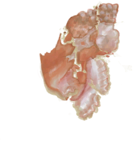

# Crushed Conch  
> Can be used as temper or burned inside the Kiln to get  quicklime.  
  
<table class="table table-bordered" data-toggle="table"  data-show-header="false"><thead style="display:none"><tr ><th  style="width:50%;text-align:left;vertical-align:top;"  >title</th><th  style="width:50%;text-align:left;vertical-align:top;"  ></th></tr></thead><tr ><td  style="width:50%;text-align:left;vertical-align:top;"  >**Weight：**15  **Tag：**	[“Temper”](tag_Temper.md), [“Seashell”](tag_Seashell.md)</td><td  style="width:50%;text-align:left;vertical-align:top;"  >

<a href="ConchBroken.md" style="color:black">Crushed Conch</a>

"A beautiful seashell that holds an edible mollusc inside. Smash it with a <b>stone or a hammer</b> to separate the meat from the shell.  The meat is quite elastic and will taste better if it is <b>softened with a hammer first</b>. It can then be <b>cooked or put in recipes.</b>  The shell can either be used as temper to make <b>mud bricks and clay crafts</b></td></tr></tbody></table>  
  
## Got From  

** With：**[“Hammer”](tag_Hammer.md)Break Conch

[Conch](Conch.md)

** With：**[“Hammer”](tag_Hammer.md)Break Conch

[Giant Conch](GiantConch.md)

  
  
## Drag To  

[Mud Pile](MudPile.md)

[Clay](Clay.md)

  
  
## Use In BluePrint  

<a href="Bp_MoldAxe.md" style="color:black">Axe Mold</a>

<a href="Bp_MoldKnife.md" style="color:black">Knife Mold</a>

<a href="Bp_MoldShovel.md" style="color:black">Shovel Mold</a>

<a href="Bp_MoldSpear.md" style="color:black">Spear Mold</a>

<a href="Bp_Alembic.md" style="color:black">Alembic</a>

<a href="Bp_ClayBowl.md" style="color:black">Clay Bowl</a>

<a href="Bp_ClayFirePit.md" style="color:black">Clay Fire Pit</a>

<a href="Bp_ClayJar.md" style="color:black">Clay Jar</a>

<a href="Bp_ClayPotCooler.md" style="color:black">Clay Pot Cooler</a>

<a href="Bp_ClayVase.md" style="color:black">Clay Vase</a>

<a href="Bp_CookingPot.md" style="color:black">Cooking Pot</a>

<a href="Bp_GlazedVase.md" style="color:black">Glazed Vase</a>

  
  
  
## Use To Transform  
<table class="table table-bordered" data-toggle="table"  ><thead style=""><tr ><th  style="text-align:left;vertical-align:top;"  >Transform to</th><th  style="text-align:left;vertical-align:top;"  >Container</th></tr></thead><tr ><td  style="text-align:left;vertical-align:top;"  >[

[Quicklime](Quicklime.md)](Quicklime.md)</td><td  style="text-align:left;vertical-align:top;"  >[

[Kiln](Kiln.md)](Kiln.md)</td></tr><tr ><td  style="text-align:left;vertical-align:top;"  >[

[Quicklime](Quicklime.md)](Quicklime.md)</td><td  style="text-align:left;vertical-align:top;"  >[

[Advanced Kiln](KilnAdvanced.md)](KilnAdvanced.md)</td></tr></tbody></table>  
  

