# Cooking Pot  
> A cooking pot for preparing more advanced meals.  
  
<table class="table table-bordered" data-toggle="table"  data-show-header="false"><thead style="display:none"><tr ><th  style="width:50%;text-align:left;vertical-align:top;"  >title</th><th  style="width:50%;text-align:left;vertical-align:top;"  ></th></tr></thead><tr ><td  style="width:50%;text-align:left;vertical-align:top;"  >**Weight：**250  **Tag：**	[“Water Container”](tag_WaterContainer.md), [“Clay”](tag_Clay.md), [“Cookable”](tag_Cookable.md), [“Container Sealed”](tag_ContainerSealed.md), [“Heavy”](tag_Heavy.md), [“Spillable”](tag_Spillable.md)  **LiquidCapacity：**600</td><td  style="width:50%;text-align:left;vertical-align:top;"  >

<a href="CookingPot.md" style="color:black">Cooking Pot</a>

Made with <b>clay and temper</b> and fired in a <b>kiln.</b>  A sealed pot perfect to cook meals in. Serves as the basis for many <b>advanced cooking recipes.</b>  Can also serve as a closed <b>liquid container</b> if needed.</td></tr></tbody></table>  
  
## Got From  

Fire Cooking Pot

[Unfired Cooking Pot](CookingPotUnfired.md)

Fire Cooking Pot

[Unfired Cooking Pot](CookingPotUnfired.md)

Transform

[Bone Broth](BoneBroth.md)

Throw Away

[Uncooked Bone Broth](BoneBrothUncooked.md)

Transform

[Uncooked Bone Broth](BoneBrothUncooked.md)

Take Oysters

[Butter Baked Oysters](ButterBakedOystersCooked.md)

Transform

[Butter Baked Oysters](ButterBakedOystersCooked.md)

Transform

[Uncooked Oysters](ButterBakedOystersUncooked.md)

Take

[Candied Ginger](CandiedGingerCooked.md)

Transform

[Candied Ginger](CandiedGingerCooked.md)

Transform

[Uncooked Candied Ginger](CandiedGingerUncooked.md)

Eat

[Coconut Fish](CoconutFish.md)

Transform

[Coconut Fish](CoconutFish.md)

Transform

[Uncooked Coconut Fish](CoconutFishUncooked.md)

Eat

[Drunken Crab](DrunkenCrab.md)

Transform

[Drunken Crab](DrunkenCrab.md)

Transform

[Uncooked Drunken Crab](DrunkenCrabUncooked.md)

Transform

[Egg Fried Rice](EggFriedRice.md)

Transform

[Uncooked Egg Fried Rice](EggFriedRiceUncooked.md)

Eat

[Fish N' Chips](FishNChips.md)

Transform

[Fish N' Chips](FishNChips.md)

Transform

[Uncooked Fish N' Chips](FishNChipsUncooked.md)

Eat

[Fish Omelette](FishOmelette.md)

Transform

[Fish Omelette](FishOmelette.md)

Transform

[Uncooked Fish Omelette](FishOmeletteUncooked.md)

Take

[Cooked Fried Bananas](FriedBananasCooked.md)

Transform

[Cooked Fried Bananas](FriedBananasCooked.md)

Transform

[Uncooked Fried Bananas](FriedBananasUncooked.md)

Eat

[Fried Puffballs](FriedPuffballs.md)

Transform

[Fried Puffballs](FriedPuffballs.md)

Transform

[Uncooked Fried Puffballs](FriedPuffballsUncooked.md)

Take Glue

[Cooked Glue](GlueCooked.md)

Empty

[Uncooked Glue](GlueUncooked.md)

Transform

[Goat Stew](GoatStew.md)

Throw Away

[Uncooked Goat Stew](GoatStewUncooked.md)

Transform

[Uncooked Goat Stew](GoatStewUncooked.md)

Eat

[Hearty Feast](HeartyFeast.md)

Transform

[Hearty Feast](HeartyFeast.md)

Transform

[Uncooked Hearty Feast](HeartyFeastUncooked.md)

Take

[Honey Candy](HoneyCandyCooked.md)

Transform

[Honey Candy](HoneyCandyCooked.md)

Transform

[Uncooked Honey Candy](HoneyCandyUncooked.md)

Eat

[Honey Glazed Pork](HoneyGlazedPork.md)

Transform

[Honey Glazed Pork](HoneyGlazedPork.md)

Transform

[Uncooked Honey Glazed Pork](HoneyGlazedPorkUncooked.md)

Eat

[Island Chicken](IslandChicken.md)

Transform

[Island Chicken](IslandChicken.md)

Transform

[Uncooked Island Chicken](IslandChickenUncooked.md)

Transform

[Lizard Fry](LizardFry.md)

Transform

[Uncooked Lizard Fry](LizardFryUncooked.md)

Eat

[Macaque Skewers](MacaqueSkewers.md)

Transform

[Macaque Skewers](MacaqueSkewers.md)

Transform

[Uncooked Macaque Skewers](MacaqueSkewersUncooked.md)

Transform

[Uncooked Protein Bars](ProteinBarUncooked.md)

Take Bars

[Cooked Protein Bars](ProteinBarsCooked.md)

Transform

[Cooked Protein Bars](ProteinBarsCooked.md)

Transform

[Sago Cake](SagoCake.md)

Transform

[Uncooked Sago Cake](SagoCakeUncooked.md)

Take Sago Slime

[Cooked Sago Slime](SagoSlimeCooked.md)

Transform

[Cooked Sago Slime](SagoSlimeCooked.md)

Transform

[Uncooked Sago Slime](SagoSlimeUncooked.md)

Transform

[Yam Curry](YamCurry.md)

Transform

[Uncooked Yam Curry](YamCurryUncooked.md)

Take

[Cooked Yam Jam](YamJamCooked.md)

Transform

[Cooked Yam Jam](YamJamCooked.md)

Transform

[Uncooked Yam Jam](YamJamUncooked.md)

** With：**[“Cookable”](tag_MealCookingpot.md)Feed

[Grandfather](Grandfather.md)

** With：**[“Cookable”](tag_MealCookingpot.md)Feed

[Grandfather](GrandfatherHealthy.md)

  
  
## Action  

<table><tr><td rowspan="2" style="width:200px;text-align:center;font-size:1.3em;font-weight:bold">

Collect Rain

</td><td></td></tr><tr><td></td></tr><tr><td colspan="2"><b>Require：</b>[

[Rain Value](RainValue.md)](RainValue.md): <b>1-5</b></td></tr><tr><td colspan="2">[Water](LQ_Water.md)(<b>+50</b>)</td></tr></table>
  
  
  
## Drag To  

[Bee Skep](BeeSkep.md)

[Swarming Bee Skep](BeeSkepSwarming.md)

[Trapped Macaque](CageTrapMacaque.md)

[Sow](BoarEnclosureFemale.md)

[Boar](BoarEnclosureMale.md)

[Piglet](BoarEnclosurePiglet.md)

[Sow](BoarTiedFemale.md)

[Boar](BoarTiedMale.md)

[Piglet](BoarTiedPiglet.md)

[Dog Friend](DogFriend.md)

[Goat](GoatEnclosureFemale.md)

[Juvenile Goat](GoatEnclosureKid.md)

[Lactating Goat](GoatEnclosureLactating.md)

[Male Goat](GoatEnclosureMale.md)

[Goat](GoatTiedFemale.md)

[Lactating Goat](GoatTiedFemaleLactating.md)

[Juvenile Goat](GoatTiedKid.md)

[Male Goat](GoatTiedMale.md)

[Grandfather](Grandfather.md)

[Grandfather](GrandfatherHealthy.md)

[Macaque Friend](MacaqueFriend.md)

[Wounded Macaque](MacaqueWounded.md)

[Sago Flatbread](SagoFlatbread.md)

[Water Ration](WaterRation.md)

[Dry Puddle(Wetlands)](Puddle.md)

[Reservoir](WaterReservoir.md)

[Reservoir(Full)](WaterReservoirFull.md)

[Reservoir (irrigating)](WaterReservoirIrrigating.md)

  
  
## Use In BluePrint  

<a href="Bp_Glue.md" style="color:black">Glue</a>

<a href="Bp_BoneBroth.md" style="color:black">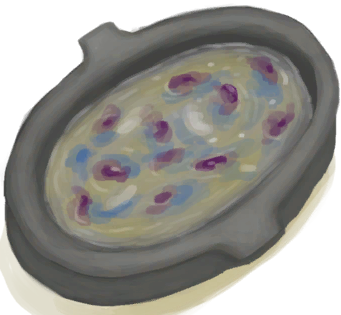Bone Broth</a>

<a href="Bp_ButterBakedOysters.md" style="color:black">Butter Baked Oysters</a>

<a href="Bp_CandiedGinger.md" style="color:black">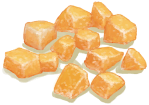Candied Ginger</a>

<a href="Bp_CoconutFish.md" style="color:black">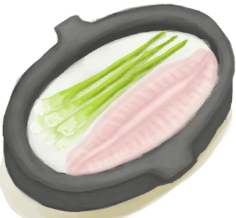Coconut Fish</a>

<a href="Bp_DrunkenCrab.md" style="color:black">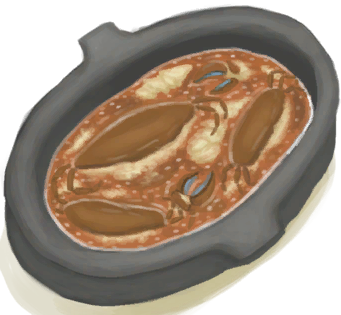Drunken Crab</a>

<a href="Bp_EggFriedRice.md" style="color:black">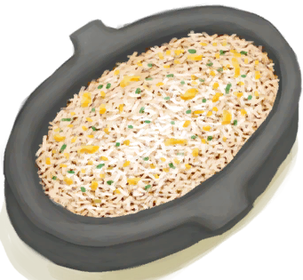Egg Fried Rice</a>

<a href="Bp_FishNChips.md" style="color:black">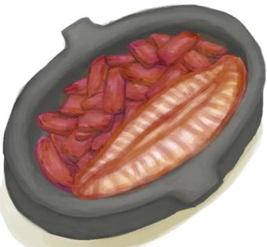Fish N' Chips</a>

<a href="Bp_FishOmelette.md" style="color:black">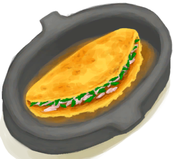Fish Omelette</a>

<a href="Bp_FriedBananas.md" style="color:black">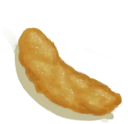Fried Bananas</a>

<a href="Bp_FriedPuffballs.md" style="color:black">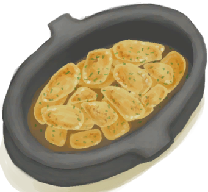Fried Puffballs</a>

<a href="Bp_GoatStew.md" style="color:black">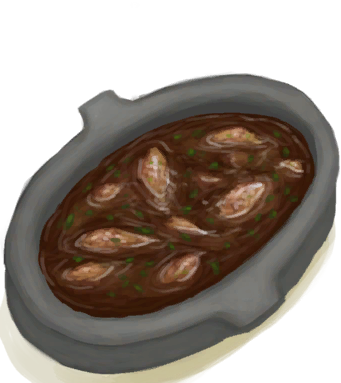Goat Stew</a>

<a href="Bp_HeartyFeast.md" style="color:black">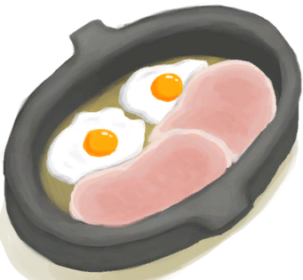Hearty Feast</a>

<a href="Bp_HoneyCandy.md" style="color:black">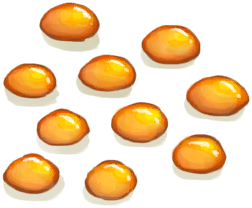Honey Candy</a>

<a href="Bp_HoneyGlazedPork.md" style="color:black">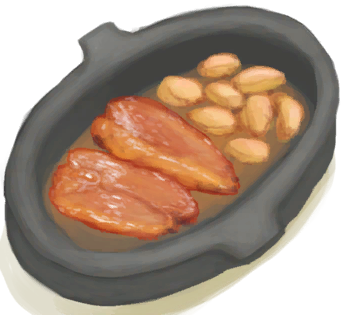Honey Glazed Pork</a>

<a href="Bp_IslandChicken.md" style="color:black">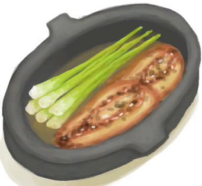Island Chicken</a>

<a href="Bp_LizardFry.md" style="color:black">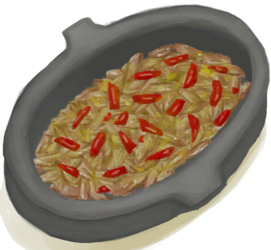Lizard Fry</a>

<a href="Bp_MacaqueSkewers.md" style="color:black">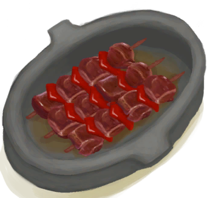Macaque Skewers</a>

<a href="Bp_ProteinBar.md" style="color:black">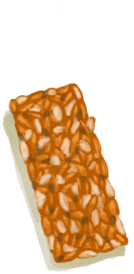Protein Bar</a>

<a href="Bp_SagoCake.md" style="color:black">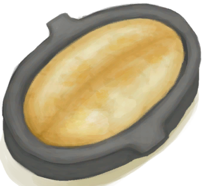Sago Cake</a>

<a href="Bp_SagoSlime.md" style="color:black">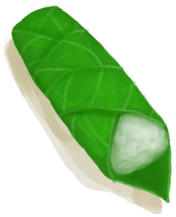Sago Slime</a>

<a href="Bp_YamCurry.md" style="color:black">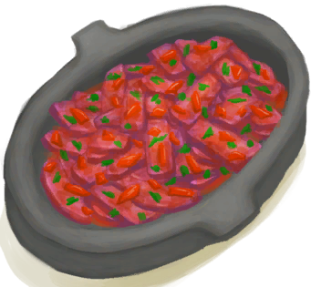Yam Curry</a>

<a href="Bp_YamJam.md" style="color:black">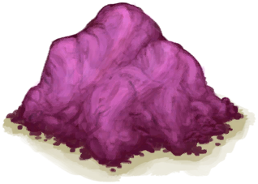Yam Jam</a>

  
  
  

