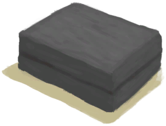

# Copper  
> Ready to be cast in molds to make tools.  
  
<table class="table table-bordered" data-toggle="table"  data-show-header="false"><thead style="display:none"><tr ><th  style="width:50%;text-align:left;vertical-align:top;"  >title</th><th  style="width:50%;text-align:left;vertical-align:top;"  ></th></tr></thead><tr ><td  style="width:50%;text-align:left;vertical-align:top;"  >**Weight：**100</td><td  style="width:50%;text-align:left;vertical-align:top;"  >

<a href="Copper.md" style="color:black">Copper</a>

"Copper Ore can be found in the Highland Areas of the island</td></tr></tbody></table>  
  
## Got From  

Smelt Copper

[Copper Ore](CopperOre.md)

Smelt Small Tool

[“Small Copper Object”](tag_CopperSmall.md)

Smelt Large Tool

[“Big Copper Object”](tag_CopperBig.md)

Smelt Copper

[Copper Ore](CopperOre.md)

Smelt Small Tool

[“Small Copper Object”](tag_CopperSmall.md)

Smelt Large Tool

[“Big Copper Object”](tag_CopperBig.md)

Scrap

[Decoration Mold](MoldCopperDecoration.md)

  
  
## Use In BluePrint  

<a href="Bp_CopperSheet.md" style="color:black">Copper Sheet</a>

<a href="Bp_MoldAxe.md" style="color:black">Axe Mold</a>

<a href="Bp_MoldDecoration.md" style="color:black">Decoration Mold</a>

<a href="Bp_MoldKnife.md" style="color:black">Knife Mold</a>

<a href="Bp_MoldShovel.md" style="color:black">Shovel Mold</a>

<a href="Bp_MoldSpear.md" style="color:black">Spear Mold</a>

  
  
  

