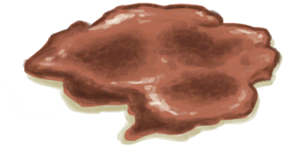
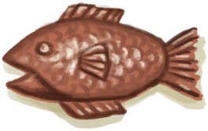
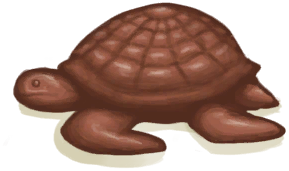
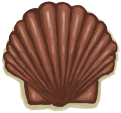

# Copper Decoration  
> Shold break it to get the decoration inside.  
  
<table class="table table-bordered" data-toggle="table"  data-show-header="false"><thead style="display:none"><tr ><th  style="width:50%;text-align:left;vertical-align:top;"  >title</th><th  style="width:50%;text-align:left;vertical-align:top;"  ></th></tr></thead><tr ><td  style="width:50%;text-align:left;vertical-align:top;"  >**Weight：**150</td><td  style="width:50%;text-align:left;vertical-align:top;"  >

<a href="CopperDecoration_Mold.md" style="color:black">Copper Decoration</a>

</td></tr></tbody></table>  
  
## Got From  

Decoration

[Decoration Mold](MoldCopperDecoration.md)

Decoration

[Decoration Mold](MoldCopperDecoration.md)

  
  
## Drag With  

<table style="margin-bottom:0px;"><tr><td style="width:40%;text-align:left; background-color:#FEFEFE"><b>With：</b>[“Hammer”](tag_Hammer.md)</td><td style="width:40%;font-size:1em;font-weight:bold;background-color:#FEFEFE">Crack Open (30m) [“HandAction(Group)”](HandAction.md), [“CraftAction(Group)”](CraftAction.md)</td></tr><tr><td colspan="2"><b>Require：</b>[

[Light](Light.md)](Light.md): <b>10-100</b></td></tr><tr style="background-color:#FFFFFF"><td style=""><b>Receiving：</b></td><td style=""><b>Self：</b>→Dismiss</td></tr><tr><td colspan="2"><b>StatChange：</b>[

[Hand Damage](HandDamage.md)](HandDamage.md)<b>+5</b>, [

[Morale](Morale.md)](Morale.md)<b>+25</b>, [

[Stress](Stress.md)](Stress.md)<b>-10</b></td></tr><tr><td colspan="2">

<table style="margin-bottom:3px;"><tr><td rowspan=2 style="text-align:center" width="80px">
Base Weight

800
</td><td style="font-size:0.6em;line-height:0.6em;font-weight:bold">Failure</td></tr><tr><td>[

[Copper Mess](CopperDecoration_Failed.md)](CopperDecoration_Failed.md)(<b>+1</b>)</td></tr><tr><td colspan=2><li>[

[Metalworking(Skill)](Skill_Metalworking.md)](Skill_Metalworking.md) in <b>1～150</b>, weight<b>+0～-790</b></li></td></tr></table>

<table style="margin-bottom:3px;"><tr><td rowspan=2 style="text-align:center" width="80px">
Base Weight

50
</td><td style="font-size:0.6em;line-height:0.6em;font-weight:bold">Fish</td></tr><tr><td>[

[Copper Fish](CopperDecoration_Fish.md)](CopperDecoration_Fish.md)(<b>+1</b>)</td></tr></table>

<table style="margin-bottom:3px;"><tr><td rowspan=2 style="text-align:center" width="80px">
Base Weight

50
</td><td style="font-size:0.6em;line-height:0.6em;font-weight:bold">Turtle</td></tr><tr><td>[

[Copper Turtle](CopperDecoration_Turtle.md)](CopperDecoration_Turtle.md)(<b>+1</b>)</td></tr></table>

<table style="margin-bottom:3px;"><tr><td rowspan=2 style="text-align:center" width="80px">
Base Weight

50
</td><td style="font-size:0.6em;line-height:0.6em;font-weight:bold">Seashell</td></tr><tr><td>[

[Copper Seashell](CopperDecoration_Seashell.md)](CopperDecoration_Seashell.md)(<b>+1</b>)</td></tr></table>
<button class="btn btn-secondary btn-sm" style="" data-toggle="modal" onclick="setCollectionDataBase64('eyJ0aXRsZSI6IlNpbXVsYXRvcjogQ3JhY2sgT3BlbiAoQ29wcGVyIERlY29yYXRpb24pIiwiY29sbGVjdGlvbnMiOlt7ImRyb3AiOiI8ZGl2IHN0eWxlPVwid2lkdGg6MjVweDtkaXNwbGF5OmlubGluZS1ibG9jazt0ZXh0LWFsaWduOmNlbnRlclwiPjxpbWcgZGVjb2Rpbmc9XCJhc3luY1wiIHNyYz1cIlNwcml0ZS9Db3BwZXJEZWNvcmF0aW9uX0ZhaWxlZC5wbmdcIiBocmVmPVwiYS5tZFwiIHN0eWxlPVwibWF4LXdpZHRoOjI1cHg7bWF4LWhlaWdodDoyNXB4O1wiPjwvZGl2PkNvcHBlciBNZXNzIiwiYmFzZSI6ODAwLCJjb25kaXRpb24iOlt7ImtleSI6IlNraWxsX01ldGFsd29ya2luZyIsInRpdGxlIjoiTWV0YWx3b3JraW5nKFNraWxsKSIsInR5cGUiOiJyYW5nZSIsIm1heCI6WzAsMTUwXSwicmFuZ2UiOlsxLDE1MF0sIndlaWdodCI6WzAsLTc5MF0sImRlZmF1bHRWYWx1ZSI6MCwid2hlbk91dE9mUmFuZ2UiOjB9XX0seyJkcm9wIjoiPGRpdiBzdHlsZT1cIndpZHRoOjI1cHg7ZGlzcGxheTppbmxpbmUtYmxvY2s7dGV4dC1hbGlnbjpjZW50ZXJcIj48aW1nIGRlY29kaW5nPVwiYXN5bmNcIiBzcmM9XCJTcHJpdGUvQ29wcGVyRGVjb3JhdGlvbl9GaXNoLnBuZ1wiIGhyZWY9XCJhLm1kXCIgc3R5bGU9XCJtYXgtd2lkdGg6MjVweDttYXgtaGVpZ2h0OjI1cHg7XCI+PC9kaXY+Q29wcGVyIEZpc2giLCJiYXNlIjo1MCwiY29uZGl0aW9uIjpbXX0seyJkcm9wIjoiPGRpdiBzdHlsZT1cIndpZHRoOjI1cHg7ZGlzcGxheTppbmxpbmUtYmxvY2s7dGV4dC1hbGlnbjpjZW50ZXJcIj48aW1nIGRlY29kaW5nPVwiYXN5bmNcIiBzcmM9XCJTcHJpdGUvQ29wcGVyRGVjb3JhdGlvbl9UdXJ0bGUucG5nXCIgaHJlZj1cImEubWRcIiBzdHlsZT1cIm1heC13aWR0aDoyNXB4O21heC1oZWlnaHQ6MjVweDtcIj48L2Rpdj5Db3BwZXIgVHVydGxlIiwiYmFzZSI6NTAsImNvbmRpdGlvbiI6W119LHsiZHJvcCI6IjxkaXYgc3R5bGU9XCJ3aWR0aDoyNXB4O2Rpc3BsYXk6aW5saW5lLWJsb2NrO3RleHQtYWxpZ246Y2VudGVyXCI+PGltZyBkZWNvZGluZz1cImFzeW5jXCIgc3JjPVwiU3ByaXRlL0NvcHBlckRlY29yYXRpb25fU2Vhc2hlbGwucG5nXCIgaHJlZj1cImEubWRcIiBzdHlsZT1cIm1heC13aWR0aDoyNXB4O21heC1oZWlnaHQ6MjVweDtcIj48L2Rpdj5Db3BwZXIgU2Vhc2hlbGwiLCJiYXNlIjo1MCwiY29uZGl0aW9uIjpbXX1dfQ==')" data-target="#modelCollectionSimulator">Simulator</button>
</td></tr></table>
  
  

