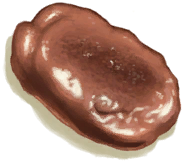

# Copper Ore  
> Should smelt it in a forge or more powerful kiln.  
  
<table class="table table-bordered" data-toggle="table"  data-show-header="false"><thead style="display:none"><tr ><th  style="width:50%;text-align:left;vertical-align:top;"  >title</th><th  style="width:50%;text-align:left;vertical-align:top;"  ></th></tr></thead><tr ><td  style="width:50%;text-align:left;vertical-align:top;"  >**Weight：**100</td><td  style="width:50%;text-align:left;vertical-align:top;"  >

<a href="CopperOre.md" style="color:black">Copper Ore</a>

"Copper Ore can be found in the Highland Areas of the island</td></tr></tbody></table>  
  
## Got From  

** With：**[“Hammer”](tag_Hammer.md)Mine

[Copper Vein(High Chamber)](CopperVein.md)

** With：**[Dynamite(On)](DynamiteOn.md)Boom!

[Copper Vein(High Chamber)](CopperVein.md)

** With：**[“Hammer”](tag_Hammer.md)Crack

[Geode](Geode.md)

Explore

[Acid Lake(Volcano)](AcidLake.md)

Explore

[Eastern Highlands](HighlandsEastern.md)

Explore

[Volcano](Volcano.md)

  
  
## Use To Transform  
<table class="table table-bordered" data-toggle="table"  ><thead style=""><tr ><th  style="text-align:left;vertical-align:top;"  >Transform to</th><th  style="text-align:left;vertical-align:top;"  >Container</th></tr></thead><tr ><td  style="text-align:left;vertical-align:top;"  >[

[Copper](Copper.md)](Copper.md)</td><td  style="text-align:left;vertical-align:top;"  >[

[Forge](Forge.md)](Forge.md)</td></tr><tr ><td  style="text-align:left;vertical-align:top;"  >[

[Copper](Copper.md)](Copper.md)</td><td  style="text-align:left;vertical-align:top;"  >[

[Advanced Kiln](KilnAdvanced.md)](KilnAdvanced.md)</td></tr></tbody></table>  
  

