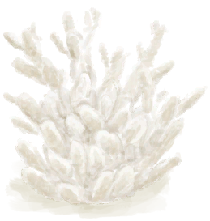

# Coral  
> A pretty looking piece of Coral. Could look good on a shelf!  
  
<table class="table table-bordered" data-toggle="table"  data-show-header="false"><thead style="display:none"><tr ><th  style="width:50%;text-align:left;vertical-align:top;"  >title</th><th  style="width:50%;text-align:left;vertical-align:top;"  ></th></tr></thead><tr ><td  style="width:50%;text-align:left;vertical-align:top;"  >**Weight：**100  **Tag：**	[“Decoration”](tag_Decoration.md), [“Decoration Advanced”](tag_DecorationAdv.md), [“Pretty”](tag_Pretty.md)</td><td  style="width:50%;text-align:left;vertical-align:top;"  >

<a href="Coral.md" style="color:black">Coral</a>

"Coral can be found by <b>diving in the bay.</b>  It doesn't have any practical uses</td></tr></tbody></table>  
  
## Got From  

Dive

[Sea(Bay)](Sea_Bay.md)

  
  

