# Fiber Cord  
> I should craft something with it or get more cord and spin it into a yarn.  
  
<table class="table table-bordered" data-toggle="table"  data-show-header="false"><thead style="display:none"><tr ><th  style="width:50%;text-align:left;vertical-align:top;"  >title</th><th  style="width:50%;text-align:left;vertical-align:top;"  ></th></tr></thead><tr ><td  style="width:50%;text-align:left;vertical-align:top;"  >**Weight：**10  **Tag：**	[“Cord”](tag_Cord.md)</td><td  style="width:50%;text-align:left;vertical-align:top;"  >

<a href="CordFiber.md" style="color:black">Fiber Cord</a>

"Fiber cord is made by braiding together pieces of <b>fiber</b> extracted from <b>coconut husk and snakegrass.</b>  Spinning fiber cords together will make <b>yarn</b></td></tr></tbody></table>  
  
## Got From  

Dismantle

[Bedroll](BedRoll.md)

Transform

[Bedroll](BedRoll.md)

Dismantle

[Rustic Bed](BedRustic.md)

Deconstruct

[Shelter](Shelter.md)

Transform

[Shelter](Shelter.md)

Deconstruct

[Sheltered Leaf Bed](ShelteredLeafBed.md)

Transform

[Sheltered Leaf Bed](ShelteredLeafBed.md)

Dismantle

[Boar Feeder](BoarFeeder.md)

Dismantle

[Boar Feeder(Empty)](BoarFeederEmpty.md)

Deconstruct

[Cage Trap](CageTrap.md)

Dismantle

[Compost Bin](CompostBin.md)

Dissasemble

[Drying Rack](DryingRack.md)

Deconstruct

[Fish Trap](FishTrap.md)

Dismantle

[Goat Feeder](GoatFeeder.md)

Dismantle

[Goat Feeder(Empty)](GoatFeederEmpty.md)

Disassemble Loom

[Loom (Empty)(Empty)](LoomEmpty.md)

** With：**[Small Cloth](ClothSmall.md)Unweave Cloth

[Loom (Empty)(Empty)](LoomEmpty.md)

** With：**[Cloth](Cloth.md)Unweave Cloth

[Loom (Empty)(Empty)](LoomEmpty.md)

** With：**[Large Cloth](ClothLarge.md)Unweave Cloth

[Loom (Empty)(Empty)](LoomEmpty.md)

** With：**[“Cutter”](tag_Cutter.md)Cut plastic sheet

[Deployed Parachute](ParachuteDeployed.md)

Dismantle

[Partridge Feeder](PartridgeFeeder.md)

Dismantle

[Partridge Feeder(Empty)](PartridgeFeederEmpty.md)

Deconstruct

[Scarecrow](Scarecrow.md)

Transform

[Scarecrow](Scarecrow.md)

Disassemble trap

[Snare Trap](SnareTrap.md)

Disassemble trap

[Snare Trap](SnareTrapTriggered.md)

Remove Cord

[Threaded Needle](BoneNeedleThreaded.md)

Dismantle

[Rustic Bow](BowRustic.md)

Transform

[Rustic Bow](BowRustic.md)

Dismantle

[Bee Suit](BeeSuit.md)

Transform

[Bee Suit](BeeSuit.md)

Transform

[Coconut Sandals](CoconutSandals.md)

Break

[Flower Necklace](FlowerNecklace.md)

Transform

[Flower Necklace](FlowerNecklace.md)

Break

[Leaf Skirt](LeafSKirt.md)

Transform

[Leaf Skirt](LeafSKirt.md)

Dismantle

[Leather Pants](LeatherPants.md)

Transform

[Leather Pants](LeatherPants.md)

Dismantle

[Leather Shoes](LeatherShoes.md)

Transform

[Leather Shoes](LeatherShoes.md)

Break

[Pearl Necklace](PearlNecklace.md)

Transform

[Pearl Necklace](PearlNecklace.md)

Dismantle

[Raincoat](Raincoat.md)

Transform

[Raincoat](Raincoat.md)

Transform

[Seagull Charm](SeagullCharm.md)

Break

[Seashell Necklace](SeashellNecklace.md)

Transform

[Seashell Necklace](SeashellNecklace.md)

Dismantle

[Shark Headpiece](SharkHeadpiece.md)

Transform

[Shirt](ShirtFiber.md)

Transform

[Splint](Splint.md)

Dismantle

[Straw Cape](StrawCape.md)

Transform

[Straw Cape](StrawCape.md)

Transform

[Improvised Tourniquet](TourniquetRustic.md)

Transform

[Bellows](Bellows.md)

Remove Cord

[Threaded Needle](CopperNeedleThreaded.md)

** With：**[Fibers](Fibers.md)Cord

[Fibers](Fibers.md)

Dismantle

[Satchel](Satchel.md)

Dismantle

[Satchel](SatchelHunter.md)

Dismantle

[Supply Chest](SupplyChestRaft.md)

Dismantle

[Travois](Travois.md)

Dismantle

[Copper Axe](AxeCopper.md)

Transform

[Copper Axe](AxeCopper.md)

Transform

[Flint Axe](AxeFlint.md)

Break

[Scrap Axe](AxeScrap.md)

Transform

[Scrap Axe](AxeScrap.md)

Dismantle

[Broom](Broom.md)

Transform

[Fishing Line](FishingLine.md)

Transform

[Fishing Line (baited)](FishingLineBait.md)

Transform

[Fishing Line](FishingLineRustic.md)

Transform

[Fishing Line (baited)](FishingLineRusticBait.md)

Transform

[Fishing Rod](FishingRod.md)

Transform

[Fishing Rod (baited)](FishingRodBait.md)

Dismantle

[Copper Shovel](ShovelCopper.md)

Transform

[Copper Shovel](ShovelCopper.md)

Break

[Scrap Shovel](ShovelScrap.md)

Transform

[Scrap Shovel](ShovelScrap.md)

Transform

[Wooden Shovel](ShovelWooden.md)

Get Cord

[Spindled Cord](SpindleFiber.md)

Remove Cord

[Threaded Needle](WoodenNeedleThreaded.md)

Divide into cords

[Yarn](YarnFiber.md)

Clear

[Debris(Mud Hut)](Debris.md)

Harvest

[Floating Debris](FloatingDebris.md)

** With：**[Stone Axe](StoneAxe.md)Cut Down

[Sap Station](PalmTreeSapStation.md)(未实装)

** With：**[“Axe”](tag_Axe.md)Cut Down

[Sap Station](PalmTreeSapStation.md)(未实装)

** With：**[Stone Axe](StoneAxe.md)Cut Down

[Empty Sap Station(Empty)](PalmTreeSapStationEmpty.md)(未实装)

** With：**[“Axe”](tag_Axe.md)Cut Down

[Empty Sap Station(Empty)](PalmTreeSapStationEmpty.md)(未实装)

  
  
## Drag With  

<table style="margin-bottom:0px;"><tr><td style="width:40%;text-align:left; background-color:#FEFEFE"><b>With：</b>[

[Fiber Cord](CordFiber.md)](CordFiber.md)</td><td style="width:40%;font-size:1em;font-weight:bold;background-color:#FEFEFE">Make Yarn (15m) [“HandAction(Group)”](HandAction.md)</td></tr><tr><td colspan="2"><b>Require：</b>[

[Light](Light.md)](Light.md): <b>10-100</b></td></tr><tr style="background-color:#FFFFFF"><td style=""><b>Receiving：</b>→Dismiss</td><td style=""><b>Self：</b>→ [

[Yarn](YarnFiber.md)](YarnFiber.md)</td></tr><tr><td colspan="2"><b>StatChange：</b>[

[Tailoring(Skill)](Skill_Tailoring.md)](Skill_Tailoring.md)<b>+0.5</b></td></tr></table>
  
  
## Drag To  

[Fish Trap](RaftFishTrap.md)

[Scarecrow](Scarecrow.md)

[Bone Needle](BoneNeedle.md)

[Copper Needle](CopperNeedle.md)

[Fiber Cord](CordFiber.md)

[Supply Chest](SupplyChestRaft.md)

[Sticks](Sticks.md)

[Wooden Needle](WoodenNeedle.md)

[Broken Sail](SailBroken_Raft.md)

[Lowered Sail](SailDown_Raft.md)

  
  
## Use In BluePrint  

<a href="Bp_BedRustic.md" style="color:black">Rustic Bed</a>

<a href="Bp_BedWooden.md" style="color:black">Wooden Bed</a>

<a href="Bp_BeeSmoker.md" style="color:black">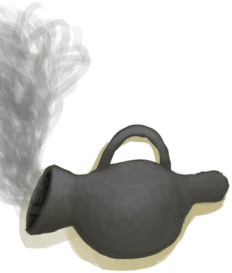Bee Smoker</a>

<a href="Bp_BoneKnife.md" style="color:black">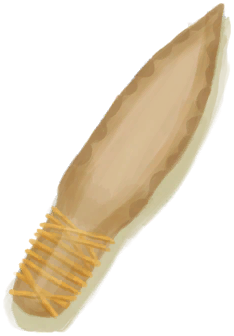Bone Knife</a>

<a href="Bp_Bow.md" style="color:black">Bow</a>

<a href="Bp_BowDrill.md" style="color:black">Bow Drill</a>

<a href="Bp_Broom.md" style="color:black">Broom</a>

<a href="Bp_CageTrap.md" style="color:black">Cage Trap</a>

<a href="Bp_Candles.md" style="color:black">Candles</a>

<a href="Bp_CandlesCitronella.md" style="color:black">Citronella Candles</a>

<a href="Bp_CandlesJasmine.md" style="color:black">Jasmine Candles</a>

<a href="Bp_Cellar.md" style="color:black">Cellar</a>

<a href="Bp_CeremonialDagger.md" style="color:black">Ceremonial Dagger</a>

<a href="Bp_Chest.md" style="color:black">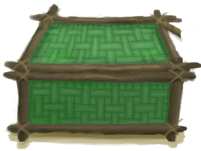Chest</a>

<a href="Bp_Cistern.md" style="color:black">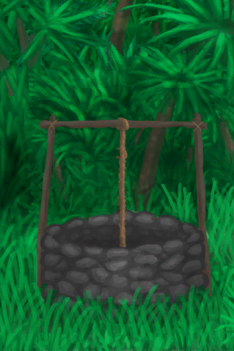Cistern</a>

<a href="Bp_CompostBin.md" style="color:black">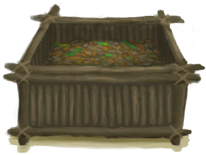Compost Bin</a>

<a href="Bp_CopperAxe.md" style="color:black">Copper Axe</a>

<a href="Bp_CopperShovel.md" style="color:black">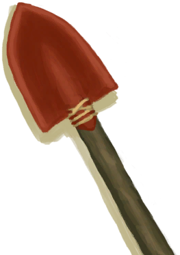Copper Shovel</a>

<a href="Bp_CopperSpear.md" style="color:black">Copper Spear</a>

<a href="Bp_Drum.md" style="color:black">Drum</a>

<a href="Bp_DryingRack.md" style="color:black">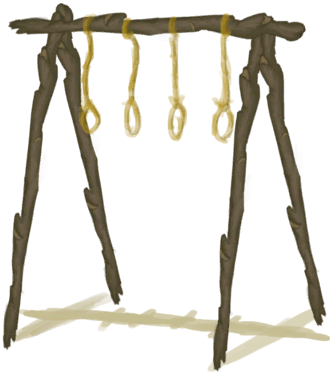Drying Rack</a>

<a href="Bp_Dynamite.md" style="color:black">Dynamite</a>

<a href="Bp_Enclosure.md" style="color:black">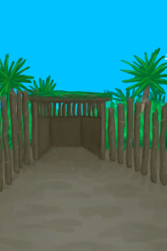Enclosure</a>

<a href="Bp_FishBait.md" style="color:black">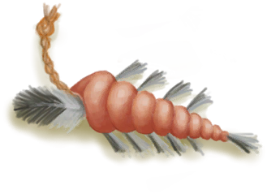Fish Bait</a>

<a href="Bp_FishTrap.md" style="color:black">Fish Trap</a>

<a href="Bp_FishingLine.md" style="color:black">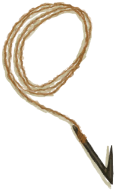Fishing Line</a>

<a href="Bp_FishingRod.md" style="color:black">Fishing Rod</a>

<a href="Bp_FishingSpear.md" style="color:black">Fishing Spear</a>

<a href="Bp_FlintAxe.md" style="color:black">Flint Axe</a>

<a href="Bp_FlintKnife.md" style="color:black">Flint Knife</a>

<a href="Bp_FlintSpear.md" style="color:black">Flint Spear</a>

<a href="Bp_GoatFeeder.md" style="color:black">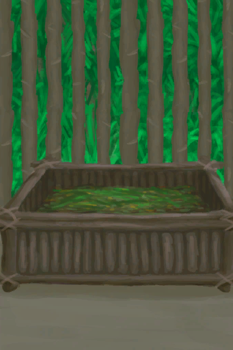Goat Feeder</a>

<a href="Bp_Harpoon.md" style="color:black">Harpoon</a>

<a href="Bp_LizardDrum.md" style="color:black">Lizard Drum</a>

<a href="Bp_Loom.md" style="color:black">Loom</a>

<a href="Bp_MudHut.md" style="color:black">Mud Hut</a>

<a href="Bp_ObsidianKnife.md" style="color:black">Obsidian Knife</a>

<a href="Bp_ObsidianSpear.md" style="color:black">Obsidian Spear</a>

<a href="Bp_PartridgeFeeder.md" style="color:black">Partridge Feeder</a>

<a href="Bp_Raft.md" style="color:black">Raft</a>

<a href="Bp_RaftFishTrap.md" style="color:black">Fish Trap</a>

<a href="Bp_RaftShelter.md" style="color:black">Raft Shelter</a>

<a href="Bp_Scarecrow.md" style="color:black">Scarecrow</a>

<a href="Bp_ScrapAxe.md" style="color:black">Scrap Axe</a>

<a href="Bp_ScrapKnife.md" style="color:black">Scrap Knife</a>

<a href="Bp_ScrapShovel.md" style="color:black">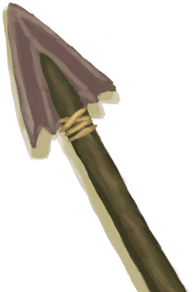Scrap Shovel</a>

<a href="Bp_ScrapSpear.md" style="color:black">Scrap Spear</a>

<a href="Bp_Shed.md" style="color:black">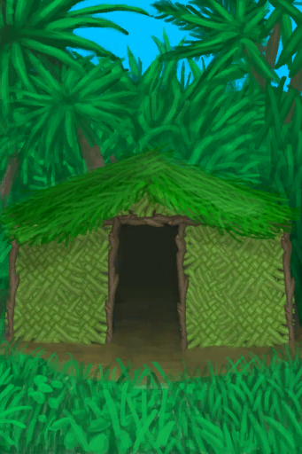Shed</a>

<a href="Bp_Shelter.md" style="color:black">Shelter</a>

<a href="Bp_Sling.md" style="color:black">Sling</a>

<a href="Bp_SnareTrap.md" style="color:black">Snare Trap</a>

<a href="Bp_Splint.md" style="color:black">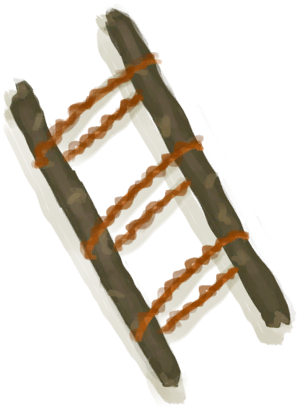Splint</a>

<a href="Bp_SupplyChest.md" style="color:black">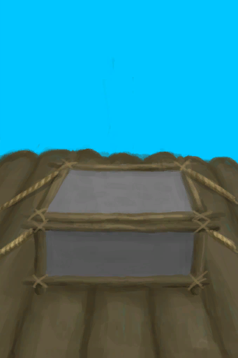Supply Chest</a>

<a href="Bp_TourniquetRustic.md" style="color:black">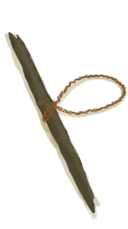Improvised Tourniquet</a>

<a href="Bp_Travois.md" style="color:black">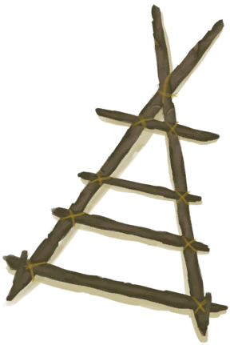Travois</a>

<a href="Bp_Well.md" style="color:black">Well</a>

<a href="Bp_WoodenShovel.md" style="color:black">Wooden Shovel</a>

<a href="Bp_Bedroll.md" style="color:black">Bedroll</a>

<a href="Bp_BeeSuit.md" style="color:black">Bee Suit</a>

<a href="Bp_Bellows.md" style="color:black">Bellows</a>

<a href="Bp_CoconutSandals.md" style="color:black">Coconut Sandals</a>

<a href="Bp_CopperBottle.md" style="color:black">Copper Bottle</a>

<a href="Bp_CopperJar.md" style="color:black">Copper Jar</a>

<a href="Bp_FlowerNecklace.md" style="color:black">Flower Necklace</a>

<a href="Bp_GasMask.md" style="color:black">Gas Mask</a>

<a href="Bp_LeafSkirt.md" style="color:black">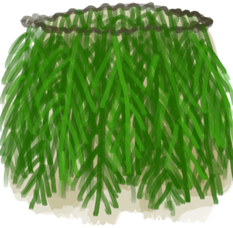Leaf Skirt</a>

<a href="Bp_LeatherBackpack.md" style="color:black">Leather Backpack</a>

<a href="Bp_LeatherGloves.md" style="color:black">Leather Gloves</a>

<a href="Bp_LeatherPants.md" style="color:black">Leather Pants</a>

<a href="Bp_LeatherShoes.md" style="color:black">Leather Shoes</a>

<a href="Bp_PearlNecklace.md" style="color:black">Pearl Necklace</a>

<a href="Bp_Quiver.md" style="color:black">Quiver</a>

<a href="Bp_Raincoat.md" style="color:black">Raincoat</a>

<a href="Bp_Sack.md" style="color:black">Sack</a>

<a href="Bp_Satchel.md" style="color:black">Satchel</a>

<a href="Bp_SeagullCharm.md" style="color:black">Seagull Charm</a>

<a href="Bp_SeashellNecklace.md" style="color:black">Seashell Necklace</a>

<a href="Bp_SharkHeadpiece.md" style="color:black">Shark Headpiece</a>

<a href="Bp_Shirt.md" style="color:black">Shirt</a>

<a href="Bp_StrawCape.md" style="color:black">Straw Cape</a>

<a href="Bp_Waterskin.md" style="color:black">Waterskin</a>

  
  
  

