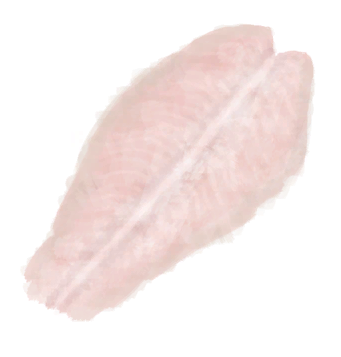
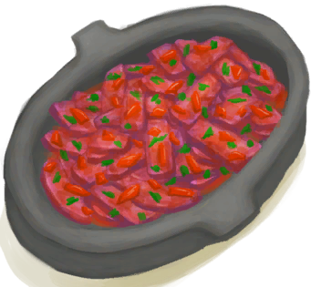
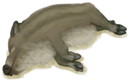
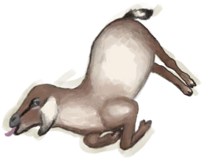
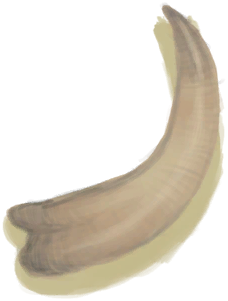

# “CraftAction(Group)”  

Craft BluePrint [

[Aloe Gel(BluePrint)](Bp_AloeGel.md)](Bp_AloeGel.md)

Craft BluePrint [

[Arrows(BluePrint)](Bp_Arrow.md)](Bp_Arrow.md)

Craft BluePrint [

[Ash Dressing(BluePrint)](Bp_AshDressing.md)](Bp_AshDressing.md)

Craft BluePrint [

[Wooden Bed(BluePrint)](Bp_BedWooden.md)](Bp_BedWooden.md)

Craft BluePrint [

[Bee Skep(BluePrint)](Bp_BeeSkep.md)](Bp_BeeSkep.md)

Craft BluePrint [

[Empty Skep(BluePrint)(Empty)](Bp_BeeSkepEmpty.md)](Bp_BeeSkepEmpty.md)

Craft BluePrint [

[Bee Smoker(BluePrint)](Bp_BeeSmoker.md)](Bp_BeeSmoker.md)

Craft BluePrint [

[Bone Knife(BluePrint)](Bp_BoneKnife.md)](Bp_BoneKnife.md)

Craft BluePrint [

[Bow(BluePrint)](Bp_Bow.md)](Bp_Bow.md)

Craft BluePrint [

[Bow Drill(BluePrint)](Bp_BowDrill.md)](Bp_BowDrill.md)

Craft BluePrint [

[Brimstone Gel(BluePrint)](Bp_BrimstoneGel.md)](Bp_BrimstoneGel.md)

Craft BluePrint [

[Broom(BluePrint)](Bp_Broom.md)](Bp_Broom.md)

Craft BluePrint [

[Cage Trap(BluePrint)](Bp_CageTrap.md)](Bp_CageTrap.md)

Craft BluePrint [

[Candles(BluePrint)](Bp_Candles.md)](Bp_Candles.md)

Craft BluePrint [

[Citronella Candles(BluePrint)](Bp_CandlesCitronella.md)](Bp_CandlesCitronella.md)

Craft BluePrint [

[Jasmine Candles(BluePrint)](Bp_CandlesJasmine.md)](Bp_CandlesJasmine.md)

Craft BluePrint [

[Ceremonial Dagger(BluePrint)](Bp_CeremonialDagger.md)](Bp_CeremonialDagger.md)

Craft BluePrint [

[Chair(BluePrint)](Bp_Chair.md)](Bp_Chair.md)

Craft BluePrint [

[Chest(BluePrint)](Bp_Chest.md)](Bp_Chest.md)

Craft BluePrint [

[Copper Axe(BluePrint)](Bp_CopperAxe.md)](Bp_CopperAxe.md)

Craft BluePrint [

[Copper Shovel(BluePrint)](Bp_CopperShovel.md)](Bp_CopperShovel.md)

Craft BluePrint [

[Copper Spear(BluePrint)](Bp_CopperSpear.md)](Bp_CopperSpear.md)

Craft BluePrint [

[Drum(BluePrint)](Bp_Drum.md)](Bp_Drum.md)

Craft BluePrint [

[Dynamite(BluePrint)](Bp_Dynamite.md)](Bp_Dynamite.md)

Craft BluePrint [

[Wooden Eating Utensils(BluePrint)](Bp_EatingUtensilsWooden.md)](Bp_EatingUtensilsWooden.md)

Craft BluePrint [

[Fish Bait(BluePrint)](Bp_FishBait.md)](Bp_FishBait.md)

Craft BluePrint [

[Fish Trap(BluePrint)](Bp_FishTrap.md)](Bp_FishTrap.md)

Craft BluePrint [

[Fishing Line(BluePrint)](Bp_FishingLine.md)](Bp_FishingLine.md)

Craft BluePrint [

[Fishing Rod(BluePrint)](Bp_FishingRod.md)](Bp_FishingRod.md)

Craft BluePrint [

[Fishing Spear(BluePrint)](Bp_FishingSpear.md)](Bp_FishingSpear.md)

Craft BluePrint [

[Flint Axe(BluePrint)](Bp_FlintAxe.md)](Bp_FlintAxe.md)

Craft BluePrint [

[Flint Knife(BluePrint)](Bp_FlintKnife.md)](Bp_FlintKnife.md)

Craft BluePrint [

[Flint Spear(BluePrint)](Bp_FlintSpear.md)](Bp_FlintSpear.md)

Craft BluePrint [

[Bone Flute(BluePrint)](Bp_FluteBone.md)](Bp_FluteBone.md)

Craft BluePrint [

[Wooden Flute(BluePrint)](Bp_FluteWooden.md)](Bp_FluteWooden.md)

Craft BluePrint [

[Glue(BluePrint)](Bp_Glue.md)](Bp_Glue.md)

Craft BluePrint [

[Hand Drill(BluePrint)](Bp_HandDrill.md)](Bp_HandDrill.md)

Craft BluePrint [

[Harpoon(BluePrint)](Bp_Harpoon.md)](Bp_Harpoon.md)

Craft BluePrint [

[Lizard Drum(BluePrint)](Bp_LizardDrum.md)](Bp_LizardDrum.md)

Craft BluePrint [

[Log Trap(BluePrint)](Bp_LogTrap.md)](Bp_LogTrap.md)

Craft BluePrint [

[Loom(BluePrint)](Bp_Loom.md)](Bp_Loom.md)

Craft BluePrint [

[Axe Mold(BluePrint)](Bp_MoldAxe.md)](Bp_MoldAxe.md)

Craft BluePrint [

[Decoration Mold(BluePrint)](Bp_MoldDecoration.md)](Bp_MoldDecoration.md)

Craft BluePrint [

[Knife Mold(BluePrint)](Bp_MoldKnife.md)](Bp_MoldKnife.md)

Craft BluePrint [

[Shovel Mold(BluePrint)](Bp_MoldShovel.md)](Bp_MoldShovel.md)

Craft BluePrint [

[Spear Mold(BluePrint)](Bp_MoldSpear.md)](Bp_MoldSpear.md)

Craft BluePrint [

[Obsidian Knife(BluePrint)](Bp_ObsidianKnife.md)](Bp_ObsidianKnife.md)

Craft BluePrint [

[Obsidian Spear(BluePrint)](Bp_ObsidianSpear.md)](Bp_ObsidianSpear.md)

Craft BluePrint [

[Pottery Wheel(BluePrint)](Bp_PotteryWheel.md)](Bp_PotteryWheel.md)

Craft BluePrint [

[Cinchona Powder(BluePrint)](Bp_Quinine.md)](Bp_Quinine.md)

Craft BluePrint [

[Quinine Sulfate(BluePrint)](Bp_QuinineSulfate.md)](Bp_QuinineSulfate.md)

Craft BluePrint [

[Fish Trap(BluePrint)](Bp_RaftFishTrap.md)](Bp_RaftFishTrap.md)

Craft BluePrint [

[Rustic Spear(BluePrint)](Bp_RusticSpear.md)](Bp_RusticSpear.md)

Craft BluePrint [

[Scrap Axe(BluePrint)](Bp_ScrapAxe.md)](Bp_ScrapAxe.md)

Craft BluePrint [

[Scrap Knife(BluePrint)](Bp_ScrapKnife.md)](Bp_ScrapKnife.md)

Craft BluePrint [

[Scrap Shovel(BluePrint)](Bp_ScrapShovel.md)](Bp_ScrapShovel.md)

Craft BluePrint [

[Scrap Spear(BluePrint)](Bp_ScrapSpear.md)](Bp_ScrapSpear.md)

Craft BluePrint [

[Sharpened Stone(BluePrint)](Bp_SharpenedStone.md)](Bp_SharpenedStone.md)

Craft BluePrint [

[Shield(BluePrint)](Bp_Shield.md)](Bp_Shield.md)

Craft BluePrint [

[Sling(BluePrint)](Bp_Sling.md)](Bp_Sling.md)

Craft BluePrint [

[Soap(BluePrint)](Bp_Soap.md)](Bp_Soap.md)

Craft BluePrint [

[Spindle(BluePrint)](Bp_Spindle.md)](Bp_Spindle.md)

Craft BluePrint [

[Splint(BluePrint)](Bp_Splint.md)](Bp_Splint.md)

Craft BluePrint [

[Stone Axe(BluePrint)](Bp_StoneAxe.md)](Bp_StoneAxe.md)

Craft BluePrint [

[Table(BluePrint)](Bp_Table.md)](Bp_Table.md)

Craft BluePrint [

[Torch(BluePrint)](Bp_Torch.md)](Bp_Torch.md)

Craft BluePrint [

[Tourniquet(BluePrint)](Bp_Tourniquet.md)](Bp_Tourniquet.md)

Craft BluePrint [

[Improvised Tourniquet(BluePrint)](Bp_TourniquetRustic.md)](Bp_TourniquetRustic.md)

Craft BluePrint [

[Travois(BluePrint)](Bp_Travois.md)](Bp_Travois.md)

Craft BluePrint [

[Treenails(BluePrint)](Bp_Treenails.md)](Bp_Treenails.md)

Craft BluePrint [

[Vitriol(BluePrint)](Bp_Vitriol.md)](Bp_Vitriol.md)

Craft BluePrint [

[Wood Carvings(BluePrint)](Bp_WoodCarvings.md)](Bp_WoodCarvings.md)

Craft BluePrint [

[Wooden Shovel(BluePrint)](Bp_WoodenShovel.md)](Bp_WoodenShovel.md)

Craft BluePrint [

[Woven Backpack(BluePrint)](Bp_WovenBackpack.md)](Bp_WovenBackpack.md)

Craft BluePrint [

[Woven Basket(BluePrint)](Bp_WovenBasket.md)](Bp_WovenBasket.md)

Craft BluePrint [

[Woven Hat(BluePrint)](Bp_WovenHat.md)](Bp_WovenHat.md)

Craft BluePrint [

[Bedroll(BluePrint)](Bp_Bedroll.md)](Bp_Bedroll.md)

Craft BluePrint [

[Bone Broth(BluePrint)](Bp_BoneBroth.md)](Bp_BoneBroth.md)

Craft BluePrint [

[Butter(BluePrint)](Bp_Butter.md)](Bp_Butter.md)

Craft BluePrint [

[Butter Baked Oysters(BluePrint)](Bp_ButterBakedOysters.md)](Bp_ButterBakedOysters.md)

Craft BluePrint [

[Candied Ginger(BluePrint)](Bp_CandiedGinger.md)](Bp_CandiedGinger.md)

Craft BluePrint [

[Cheese(BluePrint)](Bp_Cheese.md)](Bp_Cheese.md)

Craft BluePrint [

[Chicken Sandwich(BluePrint)](Bp_ChickenSandwich.md)](Bp_ChickenSandwich.md)

Craft BluePrint [

[Coconut Fish(BluePrint)](Bp_CoconutFish.md)](Bp_CoconutFish.md)

Craft BluePrint [

[Drunken Crab(BluePrint)](Bp_DrunkenCrab.md)](Bp_DrunkenCrab.md)

Craft BluePrint [

[Egg Fried Rice(BluePrint)](Bp_EggFriedRice.md)](Bp_EggFriedRice.md)

Craft BluePrint [

[Fish N' Chips(BluePrint)](Bp_FishNChips.md)](Bp_FishNChips.md)

Craft BluePrint [

[Fish Omelette(BluePrint)](Bp_FishOmelette.md)](Bp_FishOmelette.md)

Craft BluePrint [

[Salted Fish Meat(BluePrint)](Bp_FishSalted.md)](Bp_FishSalted.md)

Craft BluePrint [

[Fish Taco(BluePrint)](Bp_FishTaco.md)](Bp_FishTaco.md)

Craft BluePrint [

[Fried Bananas(BluePrint)](Bp_FriedBananas.md)](Bp_FriedBananas.md)

Craft BluePrint [

[Fried Puffballs(BluePrint)](Bp_FriedPuffballs.md)](Bp_FriedPuffballs.md)

Craft BluePrint [

[Goat Stew(BluePrint)](Bp_GoatStew.md)](Bp_GoatStew.md)

Craft BluePrint [

[Hearty Feast(BluePrint)](Bp_HeartyFeast.md)](Bp_HeartyFeast.md)

Craft BluePrint [

[Honey Candy(BluePrint)](Bp_HoneyCandy.md)](Bp_HoneyCandy.md)

Craft BluePrint [

[Honey Glazed Pork(BluePrint)](Bp_HoneyGlazedPork.md)](Bp_HoneyGlazedPork.md)

Craft BluePrint [

[Island Chicken(BluePrint)](Bp_IslandChicken.md)](Bp_IslandChicken.md)

Craft BluePrint [

[Jungle Salad(BluePrint)](Bp_JungleSalad.md)](Bp_JungleSalad.md)

Craft BluePrint [

[Lizard Fry(BluePrint)](Bp_LizardFry.md)](Bp_LizardFry.md)

Craft BluePrint [

[Macaque Skewers(BluePrint)](Bp_MacaqueSkewers.md)](Bp_MacaqueSkewers.md)

Craft BluePrint [

[Salted Meat(BluePrint)](Bp_MeatSalted.md)](Bp_MeatSalted.md)

Craft BluePrint [

[Protein Bar(BluePrint)](Bp_ProteinBar.md)](Bp_ProteinBar.md)

Craft BluePrint [

[Sago Cake(BluePrint)](Bp_SagoCake.md)](Bp_SagoCake.md)

Craft BluePrint [

[Sago Slime(BluePrint)](Bp_SagoSlime.md)](Bp_SagoSlime.md)

Craft BluePrint [

[Seafood Cup(BluePrint)](Bp_SeafoodCup.md)](Bp_SeafoodCup.md)

Craft BluePrint [

[Sushi(BluePrint)](Bp_Sushi.md)](Bp_Sushi.md)

Craft BluePrint [

[Yam Curry(BluePrint)](Bp_YamCurry.md)](Bp_YamCurry.md)

Craft BluePrint [

[Yam Jam(BluePrint)](Bp_YamJam.md)](Bp_YamJam.md)

Craft BluePrint [

[Alembic(BluePrint)](Bp_Alembic.md)](Bp_Alembic.md)

Craft BluePrint [

[Clay Fire Pit(BluePrint)](Bp_ClayFirePit.md)](Bp_ClayFirePit.md)

Craft BluePrint [

[Clay Jar(BluePrint)](Bp_ClayJar.md)](Bp_ClayJar.md)

Craft BluePrint [

[Clay Pot Cooler(BluePrint)](Bp_ClayPotCooler.md)](Bp_ClayPotCooler.md)

Craft BluePrint [

[Bee Suit(BluePrint)](Bp_BeeSuit.md)](Bp_BeeSuit.md)

Craft BluePrint [

[Bellows(BluePrint)](Bp_Bellows.md)](Bp_Bellows.md)

Craft BluePrint [

[Coconut Sandals(BluePrint)](Bp_CoconutSandals.md)](Bp_CoconutSandals.md)

Craft BluePrint [

[Copper Bottle(BluePrint)](Bp_CopperBottle.md)](Bp_CopperBottle.md)

Craft BluePrint [

[Copper Jar(BluePrint)](Bp_CopperJar.md)](Bp_CopperJar.md)

Craft BluePrint [

[Copper Necklace(BluePrint)](Bp_CopperNecklace.md)](Bp_CopperNecklace.md)

Craft BluePrint [

[Copper Needles(BluePrint)](Bp_CopperNeedles.md)](Bp_CopperNeedles.md)

Craft BluePrint [

[Copper Eating Utensils(BluePrint)](Bp_EatingUtensilsCopper.md)](Bp_EatingUtensilsCopper.md)

Craft BluePrint [

[Flower Necklace(BluePrint)](Bp_FlowerNecklace.md)](Bp_FlowerNecklace.md)

Craft BluePrint [

[Gas Mask(BluePrint)](Bp_GasMask.md)](Bp_GasMask.md)

Craft BluePrint [

[Leaf Skirt(BluePrint)](Bp_LeafSkirt.md)](Bp_LeafSkirt.md)

Craft BluePrint [

[Leather Backpack(BluePrint)](Bp_LeatherBackpack.md)](Bp_LeatherBackpack.md)

Craft BluePrint [

[Leather Gloves(BluePrint)](Bp_LeatherGloves.md)](Bp_LeatherGloves.md)

Craft BluePrint [

[Leather Pants(BluePrint)](Bp_LeatherPants.md)](Bp_LeatherPants.md)

Craft BluePrint [

[Leather Shoes(BluePrint)](Bp_LeatherShoes.md)](Bp_LeatherShoes.md)

Craft BluePrint [

[Pearl Necklace(BluePrint)](Bp_PearlNecklace.md)](Bp_PearlNecklace.md)

Craft BluePrint [

[Quiver(BluePrint)](Bp_Quiver.md)](Bp_Quiver.md)

Craft BluePrint [

[Raincoat(BluePrint)](Bp_Raincoat.md)](Bp_Raincoat.md)

Craft BluePrint [

[Sack(BluePrint)](Bp_Sack.md)](Bp_Sack.md)

Craft BluePrint [

[Satchel(BluePrint)](Bp_Satchel.md)](Bp_Satchel.md)

Craft BluePrint [

[Seagull Charm(BluePrint)](Bp_SeagullCharm.md)](Bp_SeagullCharm.md)

Craft BluePrint [

[Seashell Necklace(BluePrint)](Bp_SeashellNecklace.md)](Bp_SeashellNecklace.md)

Craft BluePrint [

[Shark Headpiece(BluePrint)](Bp_SharkHeadpiece.md)](Bp_SharkHeadpiece.md)

Craft BluePrint [

[Shirt(BluePrint)](Bp_Shirt.md)](Bp_Shirt.md)

Craft BluePrint [

[Straw Cape(BluePrint)](Bp_StrawCape.md)](Bp_StrawCape.md)

Craft BluePrint [

[Waterskin(BluePrint)](Bp_Waterskin.md)](Bp_Waterskin.md)

Craft BluePrint [

[Wooden Needles(BluePrint)](Bp_WoodenNeedles.md)](Bp_WoodenNeedles.md)

Craft BluePrint [

[Home Sign](Imp_HomeSign.md)](Imp_HomeSign.md)

Dissasemble [

[Drying Rack](DryingRack.md)](DryingRack.md)

Repair [

[Bee Suit](BeeSuit.md)](BeeSuit.md)

Repair [

[Survival Hat](HatSurvival.md)](HatSurvival.md)

Repair [

[Hawaiian Shirt](HawaiianShirt.md)](HawaiianShirt.md)

Repair [

[Hoodie](HoodieRetromation.md)](HoodieRetromation.md)

Repair [

[Leather Gloves](LeatherGloves.md)](LeatherGloves.md)

Repair [

[Leather Pants](LeatherPants.md)](LeatherPants.md)

Repair [

[Leather Shoes](LeatherShoes.md)](LeatherShoes.md)

Repair [

[Military Boots](MilitaryBoots.md)](MilitaryBoots.md)

Repair [

[Military Pants](MilitaryPants.md)](MilitaryPants.md)

Repair [Cloth Pants](PantsCloth.md)

Repair [

[Pearl Necklace](PearlNecklace.md)](PearlNecklace.md)

Repair [

[Raincoat](Raincoat.md)](Raincoat.md)

Repair [

[Shark Headpiece](SharkHeadpiece.md)](SharkHeadpiece.md)

Repair [

[Shirt](ShirtFiber.md)](ShirtFiber.md)

Repair [

[Shorts](Shorts.md)](Shorts.md)

Repair [

[Sneakers](Sneakers.md)](Sneakers.md)

Repair [

[Socks](Socks.md)](Socks.md)

Repair [

[T-Shirt](T-Shirt.md)](T-Shirt.md)

Repair [

[Underwear](Underwear.md)](Underwear.md)

Crack Open [

[Copper Decoration](CopperDecoration_Mold.md)](CopperDecoration_Mold.md)

Cord [

[Fibers](Fibers.md)](Fibers.md)

Practice Knapping [

[Flint](Flint.md)](Flint.md)

Carve [

[Unfinished  Bone Flute](FluteBone_Unfinished.md)](FluteBone_Unfinished.md)

Carve [

[Unfinished  Wooden Flute](FluteWooden_Unfinished.md)](FluteWooden_Unfinished.md)

Cut Open [

[Bonefish](Bonefish.md)](Bonefish.md)

Cut Meat [

[King Threadfin](KingThreadfin.md)](KingThreadfin.md)

Skin [

[Boar Carcass](BoarCarcass.md)](BoarCarcass.md)

Skin [

[Piglet Carcass](BoarCarcassPiglet.md)](BoarCarcassPiglet.md)

Butcher [

[Skinned Boar](BoarSkinned.md)](BoarSkinned.md)

Butcher [

[Skinned Piglet](BoarSkinnedPiglet.md)](BoarSkinnedPiglet.md)

Skin [

[Goat Carcass](GoatCarcassFemale.md)](GoatCarcassFemale.md)

Skin [

[Juvenile Goat Carcass](GoatCarcassKid.md)](GoatCarcassKid.md)

Skin [

[Goat Carcass](GoatCarcassMale.md)](GoatCarcassMale.md)

Butcher [

[Skinned Goat](GoatSkinned.md)](GoatSkinned.md)

Butcher [

[Skinned Kid](GoatSkinnedKid.md)](GoatSkinnedKid.md)

Cut Meat [

[Sea Hound Carcass](SeahoundCarcass.md)](SeahoundCarcass.md)

Cut Meat [

[Shark Carcass](SharkCarcass.md)](SharkCarcass.md)

Harvest [

[Partridge Carcass](PartridgeCarcass.md)](PartridgeCarcass.md)

Cut Open [

[Dead Partridge](PartridgeDead.md)](PartridgeDead.md)

Harvest [

[Seagull Carcass](SeagullCarcass.md)](SeagullCarcass.md)

Cut Open [

[Dead Seagull](SeagullDead.md)](SeagullDead.md)

Peel & Cut  [

[Yam](Yam.md)](Yam.md)

Dismantle [

[Satchel](Satchel.md)](Satchel.md)

Dismantle [

[Satchel](SatchelHunter.md)](SatchelHunter.md)

Skin [

[Lizard Carcass](MonitorCarcass.md)](MonitorCarcass.md)

Butcher [

[Skinned Lizard](MonitorSkinned.md)](MonitorSkinned.md)

Ground [

[Burnt Mortar](MortarBurnt.md)](MortarBurnt.md)

Ground [

[Niter Crystals](NiterCrystals.md)](NiterCrystals.md)

Practice Knapping [

[Obsidian](Obsidian.md)](Obsidian.md)

Open [

[Oyster](Oyster.md)](Oyster.md)

Weave [

[Palm Fronds](PalmFronds.md)](PalmFronds.md)

Flesh Skin [

[Fresh Skin](SkinFresh.md)](SkinFresh.md)

Flesh Skin [

[Fresh Reptile Skin](SkinFreshReptile.md)](SkinFreshReptile.md)

Craft Hand Drill [

[Sticks](Sticks.md)](Sticks.md)

Sharpen Stone [

[Stone](Stone.md)](Stone.md)

Ground [

[Burnt Stone](StoneBurnt.md)](StoneBurnt.md)

Ground [

[Burnt Heavy Stone](StoneHeavyBurnt.md)](StoneHeavyBurnt.md)

Carve [

[Boar Tusk](Tusk.md)](Tusk.md)

Carve [

[Unfinished Wood Carving](WoodCarving_Unfinished.md)](WoodCarving_Unfinished.md)

  
  

