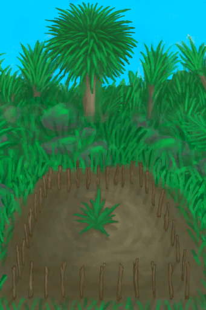
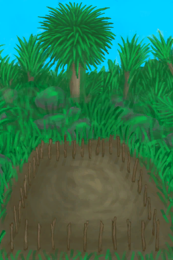
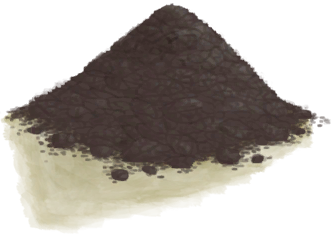
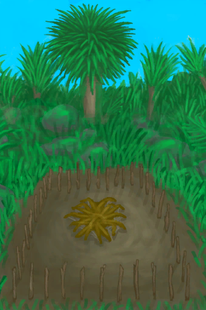

# Aloe Vera Crop Plot  
> I should keep it hydrated and wait for it to grow.  
  
<table class="table table-bordered" data-toggle="table"  data-show-header="false"><thead style="display:none"><tr ><th  style="width:50%;text-align:left;vertical-align:top;"  >title</th><th  style="width:50%;text-align:left;vertical-align:top;"  ></th></tr></thead><tr ><td  style="width:50%;text-align:left;vertical-align:top;"  >** DoseNotPile **  **Tag：**	[“Crop”](tag_Crop.md)  **Usage：**384</td><td  style="width:50%;text-align:left;vertical-align:top;"  >

<a href="CropPlotAloeVera.md" style="color:black">Aloe Vera Crop Plot</a>

</td></tr></tbody></table>  
  
## Got From  

** With：**[Aloe Vera Leaf](AloeVeraLeaf.md)Plant Aloe Vera

[Empty Crop Plot(Empty)](CropPlotEmpty.md)

  
  
## Action  

<table><tr><td rowspan="2" style="width:200px;text-align:center;font-size:1.3em;font-weight:bold">

Destroy

30m

</td><td>[“HandAction(Group)”](HandAction.md)</td></tr><tr><td><b>Self：</b>→ [

[Empty Crop Plot(Empty)](CropPlotEmpty.md)](CropPlotEmpty.md)</td></tr><tr><td colspan="2"><b>StatChange：</b>[

[Herbology(Skill)](Skill_Herbology.md)](Skill_Herbology.md)<b>+0.5</b>, [

[Filth](Filth.md)](Filth.md)<b>+25</b></td></tr></table>
  
  
  
## Drag With  

<table style="margin-bottom:0px;"><tr><td style="width:40%;text-align:left; background-color:#FEFEFE"><b>With：</b>[

[Coconut Water](LQ_CoconutWater.md)](LQ_CoconutWater.md) | [“Water for Crops”](tag_WaterFresh.md)</td><td style="width:40%;font-size:1em;font-weight:bold;background-color:#FEFEFE">Water  </td></tr><tr style="background-color:#FFFFFF"><td style=""><b>Receiving：</b></td><td style=""><b>Self：</b>Hydration

  <b>+96(33.33%)</b></td></tr></table>
  

<table style="margin-bottom:0px;"><tr><td style="width:40%;text-align:left; background-color:#FEFEFE"><b>With：</b>[“Fertilizer”](tag_Fertilizer.md)</td><td style="width:40%;font-size:1em;font-weight:bold;background-color:#FEFEFE">Fertilize (15m) </td></tr><tr style="background-color:#FFFFFF"><td style=""><b>Receiving：</b>→Dismiss</td><td style=""><b>Self：</b>Fertilizer

  <b>+384(100%)</b></td></tr></table>
  

<table style="margin-bottom:0px;"><tr><td style="width:40%;text-align:left; background-color:#FEFEFE"><b>With：</b>[“Weak Fertilizer”](tag_FertilizerWeak.md)</td><td style="width:40%;font-size:1em;font-weight:bold;background-color:#FEFEFE">Fertilize (15m) </td></tr><tr style="background-color:#FFFFFF"><td style=""><b>Receiving：</b>→Dismiss</td><td style=""><b>Self：</b>Fertilizer

  <b>+96(25%)</b></td></tr></table>
  
  
## Drag To  

[Brimstone Pesticide](LQ_PesticideBrimstone.md)

[Chilli Pesticide](LQ_PesticideChilli.md)

  
  
## Durability   

<table style="margin-bottom:0px;"><tr><td style="width:30%;text-align:left; background-color:#FEFEFE;font-size:1.3em;font-weight:bold;">

Fertilizer</td><td style="font-size:1em;background-color:#FEFEFE">Starting：0 , Max：384 -1/TP , Duration ：4d</td></tr><tr style="background-color:#FFFFFF"><td colspan=2></td></tr></table>
  

<table style="margin-bottom:0px;"><tr><td style="width:30%;text-align:left; background-color:#FEFEFE;font-size:1.3em;font-weight:bold;">

Health</td><td style="font-size:1em;background-color:#FEFEFE">Starting：384 , Max：384 +1/TP , Duration ：4d</td></tr><tr style="background-color:#FFFFFF"><td colspan=2>** On Zero：Crop has Died! ** Self: → [

[Ruined Crop Plot](CropPlotRuined.md)](CropPlotRuined.md)</td></tr></table>
  

<table style="margin-bottom:0px;"><tr><td style="width:30%;text-align:left; background-color:#FEFEFE;font-size:1.3em;font-weight:bold;">

Hydration</td><td style="font-size:1em;background-color:#FEFEFE">Starting：192 , Max：288 -1/TP , Duration ：3d</td></tr><tr style="background-color:#FFFFFF"><td colspan=2>** On Zero： ** Self: → [

[Dry Crop Plot](CropPlotDry.md)](CropPlotDry.md)</td></tr></table>
  

<table style="margin-bottom:0px;"><tr><td style="width:30%;text-align:left; background-color:#FEFEFE;font-size:1.3em;font-weight:bold;">Growth</td><td style="font-size:1em;background-color:#FEFEFE">Starting：0 , Max：672 +1/TP , Duration ：7d</td></tr><tr style="background-color:#FFFFFF"><td colspan=2>** On Full： ** Self: →Dismiss 

<table style="margin-bottom:3px;"><tr><td rowspan=2 style="text-align:center" width="80px">
Base Weight

0
</td><td style="font-size:0.6em;line-height:0.6em;font-weight:bold">Result High</td></tr><tr><td>[

[Aloe Vera](AloeVera.md)](AloeVera.md)(<b>+6</b>)</td></tr><tr><td colspan=2><li>Health

in<b>270～384(70.31%～100%)</b>, weight<b>+1</b></li></td></tr></table>

<table style="margin-bottom:3px;"><tr><td rowspan=2 style="text-align:center" width="80px">
Base Weight

0
</td><td style="font-size:0.6em;line-height:0.6em;font-weight:bold">Result Medium</td></tr><tr><td>[

[Aloe Vera](AloeVera.md)](AloeVera.md)(<b>+4</b>)</td></tr><tr><td colspan=2><li>Health

in<b>115～269(29.95%～70.05%)</b>, weight<b>+1</b></li></td></tr></table>

<table style="margin-bottom:3px;"><tr><td rowspan=2 style="text-align:center" width="80px">
Base Weight

0
</td><td style="font-size:0.6em;line-height:0.6em;font-weight:bold">Result Low</td></tr><tr><td>[

[Aloe Vera](AloeVera.md)](AloeVera.md)(<b>+2</b>)</td></tr><tr><td colspan=2><li>Health

in<b>0～114(0%～29.69%)</b>, weight<b>+1</b></li></td></tr></table>
<button class="btn btn-secondary btn-sm" style="" data-toggle="modal" onclick="setCollectionDataBase64('eyJ0aXRsZSI6IlNpbXVsYXRvcjogdW5kZWZpbmVkIiwiY29sbGVjdGlvbnMiOlt7ImRyb3AiOiI8ZGl2IHN0eWxlPVwid2lkdGg6MjVweDtkaXNwbGF5OmlubGluZS1ibG9jazt0ZXh0LWFsaWduOmNlbnRlclwiPjxpbWcgZGVjb2Rpbmc9XCJhc3luY1wiIHNyYz1cIlNwcml0ZS9BbG9lVmVyYS5wbmdcIiBocmVmPVwiYS5tZFwiIHN0eWxlPVwibWF4LXdpZHRoOjI1cHg7bWF4LWhlaWdodDoyNXB4O1wiPjwvZGl2PkFsb2UgVmVyYSIsImJhc2UiOjAsImNvbmRpdGlvbiI6W3sia2V5IjoiVXNhZ2UiLCJ0aXRsZSI6IkhlYWx0aDxkaXYgc3R5bGU9XCJ3aWR0aDoyMHB4O2Rpc3BsYXk6aW5saW5lLWJsb2NrO3RleHQtYWxpZ246Y2VudGVyXCI+PGltZyBkZWNvZGluZz1cImFzeW5jXCIgc3JjPVwiU3ByaXRlL0hlYWx0aC5wbmdcIiBocmVmPVwiYS5tZFwiIHN0eWxlPVwibWF4LXdpZHRoOjIwcHg7bWF4LWhlaWdodDoyMHB4O1wiPjwvZGl2PiIsInR5cGUiOiJyYW5nZSIsIm1heCI6WzI3MCwzODRdLCJyYW5nZSI6WzI3MCwzODRdLCJ3ZWlnaHQiOlsxLDFdLCJkZWZhdWx0VmFsdWUiOjI3MCwid2hlbk91dE9mUmFuZ2UiOjB9XX0seyJkcm9wIjoiPGRpdiBzdHlsZT1cIndpZHRoOjI1cHg7ZGlzcGxheTppbmxpbmUtYmxvY2s7dGV4dC1hbGlnbjpjZW50ZXJcIj48aW1nIGRlY29kaW5nPVwiYXN5bmNcIiBzcmM9XCJTcHJpdGUvQWxvZVZlcmEucG5nXCIgaHJlZj1cImEubWRcIiBzdHlsZT1cIm1heC13aWR0aDoyNXB4O21heC1oZWlnaHQ6MjVweDtcIj48L2Rpdj5BbG9lIFZlcmEiLCJiYXNlIjowLCJjb25kaXRpb24iOlt7ImtleSI6IlVzYWdlIiwidGl0bGUiOiJIZWFsdGg8ZGl2IHN0eWxlPVwid2lkdGg6MjBweDtkaXNwbGF5OmlubGluZS1ibG9jazt0ZXh0LWFsaWduOmNlbnRlclwiPjxpbWcgZGVjb2Rpbmc9XCJhc3luY1wiIHNyYz1cIlNwcml0ZS9IZWFsdGgucG5nXCIgaHJlZj1cImEubWRcIiBzdHlsZT1cIm1heC13aWR0aDoyMHB4O21heC1oZWlnaHQ6MjBweDtcIj48L2Rpdj4iLCJ0eXBlIjoicmFuZ2UiLCJtYXgiOlsxMTUsMjY5XSwicmFuZ2UiOlsxMTUsMjY5XSwid2VpZ2h0IjpbMSwxXSwiZGVmYXVsdFZhbHVlIjoxMTUsIndoZW5PdXRPZlJhbmdlIjowfV19LHsiZHJvcCI6IjxkaXYgc3R5bGU9XCJ3aWR0aDoyNXB4O2Rpc3BsYXk6aW5saW5lLWJsb2NrO3RleHQtYWxpZ246Y2VudGVyXCI+PGltZyBkZWNvZGluZz1cImFzeW5jXCIgc3JjPVwiU3ByaXRlL0Fsb2VWZXJhLnBuZ1wiIGhyZWY9XCJhLm1kXCIgc3R5bGU9XCJtYXgtd2lkdGg6MjVweDttYXgtaGVpZ2h0OjI1cHg7XCI+PC9kaXY+QWxvZSBWZXJhIiwiYmFzZSI6MCwiY29uZGl0aW9uIjpbeyJrZXkiOiJVc2FnZSIsInRpdGxlIjoiSGVhbHRoPGRpdiBzdHlsZT1cIndpZHRoOjIwcHg7ZGlzcGxheTppbmxpbmUtYmxvY2s7dGV4dC1hbGlnbjpjZW50ZXJcIj48aW1nIGRlY29kaW5nPVwiYXN5bmNcIiBzcmM9XCJTcHJpdGUvSGVhbHRoLnBuZ1wiIGhyZWY9XCJhLm1kXCIgc3R5bGU9XCJtYXgtd2lkdGg6MjBweDttYXgtaGVpZ2h0OjIwcHg7XCI+PC9kaXY+IiwidHlwZSI6InJhbmdlIiwibWF4IjpbMCwxMTRdLCJyYW5nZSI6WzAsMTE0XSwid2VpZ2h0IjpbMSwxXSwiZGVmYXVsdFZhbHVlIjowLCJ3aGVuT3V0T2ZSYW5nZSI6MH1dfV19')" data-target="#modelCollectionSimulator">Simulator</button>
</td></tr></table>
  

<table style="margin-bottom:0px;"><tr><td style="width:30%;text-align:left; background-color:#FEFEFE;font-size:1.3em;font-weight:bold;">

Pesticide - Mites</td><td style="font-size:1em;background-color:#FEFEFE">Starting：0 , Max：288 -1/TP , Duration ：3d</td></tr><tr style="background-color:#FFFFFF"><td colspan=2></td></tr></table>
  

<table style="margin-bottom:0px;"><tr><td style="width:30%;text-align:left; background-color:#FEFEFE;font-size:1.3em;font-weight:bold;">

Pesticide - Fungi</td><td style="font-size:1em;background-color:#FEFEFE">Starting：0 , Max：288 -1/TP , Duration ：3d</td></tr><tr style="background-color:#FFFFFF"><td colspan=2></td></tr></table>
  

<table style="margin-bottom:0px;"><tr><td style="width:30%;text-align:left; background-color:#FEFEFE;font-size:1.3em;font-weight:bold;">

Mite Infestation</td><td style="font-size:1em;background-color:#FEFEFE">Starting：0 , Max：100 -1/TP , Duration ：1d1h</td></tr><tr style="background-color:#FFFFFF"><td colspan=2></td></tr></table>
  

<table style="margin-bottom:0px;"><tr><td style="width:30%;text-align:left; background-color:#FEFEFE;font-size:1.3em;font-weight:bold;">

Fungal Infection</td><td style="font-size:1em;background-color:#FEFEFE">Starting：0 , Max：288 -1/TP , Duration ：3d</td></tr><tr style="background-color:#FFFFFF"><td colspan=2></td></tr></table>
  
## Passive Effects  
<table class="table table-bordered" data-toggle="table"  ><thead style=""><tr ><th  style="text-align:left;vertical-align:top;"  >Name</th><th  style="text-align:left;vertical-align:top;"  >Condition</th><th  style="text-align:left;vertical-align:top;"  >Change(Each TP)</th><th  style="text-align:left;vertical-align:top;"  data-sortable="true"  >Status</th></tr></thead><tr ><td  style="text-align:left;vertical-align:top;"  >Fertilizer</td><td  style="text-align:left;vertical-align:top;"  >** Require Durability：** Fertilizer

: <b>1～384(0.26%～100%)</b></td><td  style="text-align:left;vertical-align:top;"  >Mite Infestation

 +0.75(0.75%) Growth+0.5(0.07%)</td><td  style="text-align:left;vertical-align:top;"  ></td></tr><tr ><td  style="text-align:left;vertical-align:top;"  >Pesticide</td><td  style="text-align:left;vertical-align:top;"  >** Require Durability：** Pesticide - Mites

: <b>1～288(0.35%～100%)</b></td><td  style="text-align:left;vertical-align:top;"  >Mite Infestation

 -5(-5%)</td><td  style="text-align:left;vertical-align:top;"  ></td></tr><tr ><td  style="text-align:left;vertical-align:top;"  >Fungicide</td><td  style="text-align:left;vertical-align:top;"  >** Require Durability：** Pesticide - Fungi

: <b>1～288(0.35%～100%)</b></td><td  style="text-align:left;vertical-align:top;"  >Fungal Infection

 -5(-1.74%)</td><td  style="text-align:left;vertical-align:top;"  ></td></tr><tr ><td  style="text-align:left;vertical-align:top;"  >Overwatered</td><td  style="text-align:left;vertical-align:top;"  >** Require Durability：** Hydration

: <b>216～288(75%～100%)</b></td><td  style="text-align:left;vertical-align:top;"  >Fungal Infection

 +1.25(0.43%)</td><td  style="text-align:left;vertical-align:top;"  ></td></tr><tr ><td  style="text-align:left;vertical-align:top;"  >Underwatered</td><td  style="text-align:left;vertical-align:top;"  >** Require Durability：** Hydration

: <b>0～72(0%～25%)</b></td><td  style="text-align:left;vertical-align:top;"  >Mite Infestation

 +1.25(1.25%)</td><td  style="text-align:left;vertical-align:top;"  ></td></tr><tr ><td  style="text-align:left;vertical-align:top;"  >Mite Infestation</td><td  style="text-align:left;vertical-align:top;"  >** Require Durability：** Mite Infestation

: <b>50～100(50%～100%)</b></td><td  style="text-align:left;vertical-align:top;"  >Health

 -2(-0.53%)</td><td  style="text-align:left;vertical-align:top;"  ></td></tr><tr ><td  style="text-align:left;vertical-align:top;"  >Fungal Infestation</td><td  style="text-align:left;vertical-align:top;"  >** Require Durability：** Fungal Infection

: <b>144～288(50%～100%)</b></td><td  style="text-align:left;vertical-align:top;"  >Health

 -2(-0.53%)</td><td  style="text-align:left;vertical-align:top;"  ></td></tr><tr ><td  style="text-align:left;vertical-align:top;"  >Humid</td><td  style="text-align:left;vertical-align:top;"  >** Require Card：** [“Humid Environment”](tag_EnvHumid.md)</td><td  style="text-align:left;vertical-align:top;"  >Fungal Infection

 +0.75(0.26%) Growth-0.25(-0.04%)</td><td  style="text-align:left;vertical-align:top;"  ></td></tr><tr ><td  style="text-align:left;vertical-align:top;"  >Dry</td><td  style="text-align:left;vertical-align:top;"  >** Require Card：** [“Dry Environment”](tag_EnvDry.md)</td><td  style="text-align:left;vertical-align:top;"  >Mite Infestation

 +0.25(0.25%) Growth+0.25(0.03%)</td><td  style="text-align:left;vertical-align:top;"  ></td></tr><tr ><td  style="text-align:left;vertical-align:top;"  >Fertile</td><td  style="text-align:left;vertical-align:top;"  >** Require Card：** [“Fertile Environment”](tag_EnvFertile.md)</td><td  style="text-align:left;vertical-align:top;"  >Growth+0.25(0.03%)</td><td  style="text-align:left;vertical-align:top;"  ></td></tr><tr ><td  style="text-align:left;vertical-align:top;"  >Rain</td><td  style="text-align:left;vertical-align:top;"  >** Require Stat：** [

[Rain Value](RainValue.md)](RainValue.md): <b>1-5</b></td><td  style="text-align:left;vertical-align:top;"  >Hydration

 +25(8.68%)</td><td  style="text-align:left;vertical-align:top;"  ></td></tr></tbody></table>  
  
## Other Effects  
<table class="table table-bordered" data-toggle="table"  ><thead style=""><tr ><th  style="text-align:left;vertical-align:top;"  >Name</th><th  style="text-align:left;vertical-align:top;"  >Condition</th><th  style="text-align:left;vertical-align:top;"  >Change</th><th  style="text-align:left;vertical-align:top;"  data-sortable="true"  >Status</th></tr></thead><tr ><td  style="text-align:left;vertical-align:top;"  >Mite Infestation</td><td  style="text-align:left;vertical-align:top;"  >** Require Durability：** Mite Infestation

: <b>50～100(50%～100%)</b></td><td  style="text-align:left;vertical-align:top;"  >[“Crop”](tag_Crop.md) Mite Infestation

 +0.75(0.75%)</td><td  style="text-align:left;vertical-align:top;"  ></td></tr><tr ><td  style="text-align:left;vertical-align:top;"  >Fungal Infestation</td><td  style="text-align:left;vertical-align:top;"  >** Require Durability：** Fungal Infection

: <b>144～288(50%～100%)</b></td><td  style="text-align:left;vertical-align:top;"  >[“Crop”](tag_Crop.md) Fungal Infection

 +0.5(0.17%)</td><td  style="text-align:left;vertical-align:top;"  ></td></tr></tbody></table>  
  

