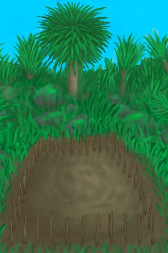
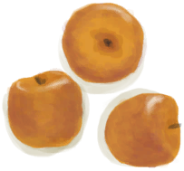
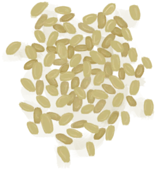
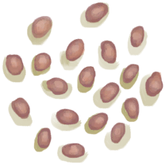

# Empty Crop Plot  
> I should plant something here.  
  
<table class="table table-bordered" data-toggle="table"  data-show-header="false"><thead style="display:none"><tr ><th  style="width:50%;text-align:left;vertical-align:top;"  >title</th><th  style="width:50%;text-align:left;vertical-align:top;"  ></th></tr></thead><tr ><td  style="width:50%;text-align:left;vertical-align:top;"  >**Tag：**	[“Crop”](tag_Crop.md)</td><td  style="width:50%;text-align:left;vertical-align:top;"  >

<a href="CropPlotEmpty.md" style="color:black">Empty Crop Plot</a>

</td></tr></tbody></table>  
  
## Got From  

Destroy

[Almond Tree Crop Plot](CropPlotAlmondTree.md)

Destroy

[Aloe Vera Crop Plot](CropPlotAloeVera.md)

Destroy

[Banana Crop Plot](CropPlotBananaTree.md)

Destroy

[Chili Crop Plot](CropPlotChilies.md)

Destroy

[China Rose Crop Plot](CropPlotChinaRose.md)

Destroy

[Cinchona Crop Plot](CropPlotCinchonaTree.md)

Destroy

[Coffee Crop Plot](CropPlotCoffee.md)

** With：**[Coconut Water](LQ_CoconutWater.md) , [“Water for Crops”](tag_WaterFresh.md)Water

[Dry Crop Plot](CropPlotDry.md)

Rain Water

[Dry Crop Plot](CropPlotDry.md)

Destroy

[Ginger Crop Plot](CropPlotGinger.md)

Destroy

[Jasmine Crop Plot](CropPlotJasmine.md)

Destroy

[Kava Crop Plot](CropPlotKava.md)

Destroy

[Lemon Grass Crop Plot](CropPlotLemonGrass.md)

Destroy

[Mango Crop Plot](CropPlotMangoTree.md)

Destroy

[Nipa Palm Crop Plot](CropPlotNipaPalm.md)

Destroy

[Palm Bush Crop Plot](CropPlotPalmBush.md)

Destroy

[Palm Tree Crop Plot](CropPlotPalmTree.md)

Destroy

[Rice Crop Plot](CropPlotRice.md)

Destroy

[Ruined Crop Plot](CropPlotRuined.md)

Destroy

[Sago Palm Crop Plot](CropPlotSagoPalm.md)

Destroy

[Snake Grass Crop Plot](CropPlotSnakeGrass.md)

Destroy

[Spider Lily Crop Plot](CropPlotSpiderLily.md)

Destroy

[Weevil Lily Crop Plot](CropPlotWeevilLily.md)

Destroy

[Wild Jujube Crop Plot](CropPlotWildJujube.md)

Destroy

[Yam Crop Plot](CropPlotYam.md)

  
  
## Drag With  

<table style="margin-bottom:0px;"><tr><td style="width:40%;text-align:left; background-color:#FEFEFE"><b>With：</b>[

[Cinchona Bark](BarkCinchona.md)](BarkCinchona.md)</td><td style="width:40%;font-size:1em;font-weight:bold;background-color:#FEFEFE">Plant Cinchona (30m) </td></tr><tr style="background-color:#FFFFFF"><td style=""><b>Receiving：</b>→Dismiss</td><td style=""><b>Self：</b>→ [

[Cinchona Crop Plot](CropPlotCinchonaTree.md)](CropPlotCinchonaTree.md)</td></tr><tr><td colspan="2"><b>StatChange：</b>[

[Filth](Filth.md)](Filth.md)<b>+10</b></td></tr></table>
  

<table style="margin-bottom:0px;"><tr><td style="width:40%;text-align:left; background-color:#FEFEFE"><b>With：</b>[

[Jujube Fruits](JujubeFruits.md)](JujubeFruits.md)</td><td style="width:40%;font-size:1em;font-weight:bold;background-color:#FEFEFE">Plant WIld Jujube (30m) </td></tr><tr style="background-color:#FFFFFF"><td style=""><b>Receiving：</b>→Dismiss</td><td style=""><b>Self：</b>→ [

[Wild Jujube Crop Plot](CropPlotWildJujube.md)](CropPlotWildJujube.md)</td></tr><tr><td colspan="2"><b>StatChange：</b>[

[Filth](Filth.md)](Filth.md)<b>+10</b></td></tr></table>
  

<table style="margin-bottom:0px;"><tr><td style="width:40%;text-align:left; background-color:#FEFEFE"><b>With：</b>[

[Rice Grain](RiceGrains.md)](RiceGrains.md)</td><td style="width:40%;font-size:1em;font-weight:bold;background-color:#FEFEFE">Plant Rice (30m) </td></tr><tr style="background-color:#FFFFFF"><td style=""><b>Receiving：</b>→Dismiss</td><td style=""><b>Self：</b>→ [

[Rice Crop Plot](CropPlotRice.md)](CropPlotRice.md)</td></tr><tr><td colspan="2"><b>StatChange：</b>[

[Filth](Filth.md)](Filth.md)<b>+10</b></td></tr></table>
  

<table style="margin-bottom:0px;"><tr><td style="width:40%;text-align:left; background-color:#FEFEFE"><b>With：</b>[

[Coffee Beans](CoffeeBeans.md)](CoffeeBeans.md)</td><td style="width:40%;font-size:1em;font-weight:bold;background-color:#FEFEFE">Plant Coffee (30m) </td></tr><tr style="background-color:#FFFFFF"><td style=""><b>Receiving：</b>→Dismiss</td><td style=""><b>Self：</b>→ [

[Coffee Crop Plot](CropPlotCoffee.md)](CropPlotCoffee.md)</td></tr><tr><td colspan="2"><b>StatChange：</b>[

[Filth](Filth.md)](Filth.md)<b>+10</b></td></tr></table>
  

<table style="margin-bottom:0px;"><tr><td style="width:40%;text-align:left; background-color:#FEFEFE"><b>With：</b>[

[Lemongrass](LemongrassStalks.md)](LemongrassStalks.md)</td><td style="width:40%;font-size:1em;font-weight:bold;background-color:#FEFEFE">Plant Lemongrass (30m) </td></tr><tr style="background-color:#FFFFFF"><td style=""><b>Receiving：</b>→Dismiss</td><td style=""><b>Self：</b>→ [

[Lemon Grass Crop Plot](CropPlotLemonGrass.md)](CropPlotLemonGrass.md)</td></tr><tr><td colspan="2"><b>StatChange：</b>[

[Filth](Filth.md)](Filth.md)<b>+10</b></td></tr></table>
  

<table style="margin-bottom:0px;"><tr><td style="width:40%;text-align:left; background-color:#FEFEFE"><b>With：</b>[

[Snakegrass Seeds](SnakegrassSeeds.md)](SnakegrassSeeds.md)</td><td style="width:40%;font-size:1em;font-weight:bold;background-color:#FEFEFE">Plant Snake Grass (30m) </td></tr><tr style="background-color:#FFFFFF"><td style=""><b>Receiving：</b>→Dismiss</td><td style=""><b>Self：</b>→ [

[Snake Grass Crop Plot](CropPlotSnakeGrass.md)](CropPlotSnakeGrass.md)</td></tr><tr><td colspan="2"><b>StatChange：</b>[

[Filth](Filth.md)](Filth.md)<b>+10</b></td></tr></table>
  

<table style="margin-bottom:0px;"><tr><td style="width:40%;text-align:left; background-color:#FEFEFE"><b>With：</b>[

[Aloe Vera Leaf](AloeVeraLeaf.md)](AloeVeraLeaf.md)</td><td style="width:40%;font-size:1em;font-weight:bold;background-color:#FEFEFE">Plant Aloe Vera (30m) </td></tr><tr style="background-color:#FFFFFF"><td style=""><b>Receiving：</b>→Dismiss</td><td style=""><b>Self：</b>→ [

[Aloe Vera Crop Plot](CropPlotAloeVera.md)](CropPlotAloeVera.md)</td></tr><tr><td colspan="2"><b>StatChange：</b>[

[Filth](Filth.md)](Filth.md)<b>+10</b></td></tr></table>
  

<table style="margin-bottom:0px;"><tr><td style="width:40%;text-align:left; background-color:#FEFEFE"><b>With：</b>[

[Kava Root](KavaRoot.md)](KavaRoot.md)</td><td style="width:40%;font-size:1em;font-weight:bold;background-color:#FEFEFE">Plant Kava (30m) </td></tr><tr style="background-color:#FFFFFF"><td style=""><b>Receiving：</b>→Dismiss</td><td style=""><b>Self：</b>→ [

[Kava Crop Plot](CropPlotKava.md)](CropPlotKava.md)</td></tr><tr><td colspan="2"><b>StatChange：</b>[

[Filth](Filth.md)](Filth.md)<b>+10</b></td></tr></table>
  

<table style="margin-bottom:0px;"><tr><td style="width:40%;text-align:left; background-color:#FEFEFE"><b>With：</b>[

[Spider Lily Leaves](SpiderLilyLeaves.md)](SpiderLilyLeaves.md)</td><td style="width:40%;font-size:1em;font-weight:bold;background-color:#FEFEFE">Plant Spider Lily (30m) </td></tr><tr style="background-color:#FFFFFF"><td style=""><b>Receiving：</b>→Dismiss</td><td style=""><b>Self：</b>→ [

[Spider Lily Crop Plot](CropPlotSpiderLily.md)](CropPlotSpiderLily.md)</td></tr><tr><td colspan="2"><b>StatChange：</b>[

[Filth](Filth.md)](Filth.md)<b>+10</b></td></tr></table>
  

<table style="margin-bottom:0px;"><tr><td style="width:40%;text-align:left; background-color:#FEFEFE"><b>With：</b>[

[Ginger](Ginger.md)](Ginger.md)</td><td style="width:40%;font-size:1em;font-weight:bold;background-color:#FEFEFE">Plant Ginger (30m) </td></tr><tr style="background-color:#FFFFFF"><td style=""><b>Receiving：</b>→Dismiss</td><td style=""><b>Self：</b>→ [

[Ginger Crop Plot](CropPlotGinger.md)](CropPlotGinger.md)</td></tr><tr><td colspan="2"><b>StatChange：</b>[

[Filth](Filth.md)](Filth.md)<b>+10</b></td></tr></table>
  

<table style="margin-bottom:0px;"><tr><td style="width:40%;text-align:left; background-color:#FEFEFE"><b>With：</b>[

[Yam](Yam.md)](Yam.md)</td><td style="width:40%;font-size:1em;font-weight:bold;background-color:#FEFEFE">Plant Yam (30m) </td></tr><tr style="background-color:#FFFFFF"><td style=""><b>Receiving：</b>→Dismiss</td><td style=""><b>Self：</b>→ [

[Yam Crop Plot](CropPlotYam.md)](CropPlotYam.md)</td></tr><tr><td colspan="2"><b>StatChange：</b>[

[Filth](Filth.md)](Filth.md)<b>+10</b></td></tr></table>
  

<table style="margin-bottom:0px;"><tr><td style="width:40%;text-align:left; background-color:#FEFEFE"><b>With：</b>[

[Weevil Lily Leaves](WeevilLilyLeaves.md)](WeevilLilyLeaves.md)</td><td style="width:40%;font-size:1em;font-weight:bold;background-color:#FEFEFE">Plant Weevil Lily Plant (30m) </td></tr><tr style="background-color:#FFFFFF"><td style=""><b>Receiving：</b>→Dismiss</td><td style=""><b>Self：</b>→ [

[Weevil Lily Crop Plot](CropPlotWeevilLily.md)](CropPlotWeevilLily.md)</td></tr><tr><td colspan="2"><b>StatChange：</b>[

[Filth](Filth.md)](Filth.md)<b>+10</b></td></tr></table>
  

<table style="margin-bottom:0px;"><tr><td style="width:40%;text-align:left; background-color:#FEFEFE"><b>With：</b>[

[Chillies](Chilies.md)](Chilies.md)</td><td style="width:40%;font-size:1em;font-weight:bold;background-color:#FEFEFE">Plant Chilies (30m) </td></tr><tr style="background-color:#FFFFFF"><td style=""><b>Receiving：</b>→Dismiss</td><td style=""><b>Self：</b>→ [

[Chili Crop Plot](CropPlotChilies.md)](CropPlotChilies.md)</td></tr><tr><td colspan="2"><b>StatChange：</b>[

[Filth](Filth.md)](Filth.md)<b>+10</b></td></tr></table>
  

<table style="margin-bottom:0px;"><tr><td style="width:40%;text-align:left; background-color:#FEFEFE"><b>With：</b>[

[Jasmine Flowers](JasmineFlowers.md)](JasmineFlowers.md)</td><td style="width:40%;font-size:1em;font-weight:bold;background-color:#FEFEFE">Plant Jasmine (30m) </td></tr><tr style="background-color:#FFFFFF"><td style=""><b>Receiving：</b>→Dismiss</td><td style=""><b>Self：</b>→ [

[Jasmine Crop Plot](CropPlotJasmine.md)](CropPlotJasmine.md)</td></tr><tr><td colspan="2"><b>StatChange：</b>[

[Filth](Filth.md)](Filth.md)<b>+10</b></td></tr></table>
  

<table style="margin-bottom:0px;"><tr><td style="width:40%;text-align:left; background-color:#FEFEFE"><b>With：</b>[

[China Rose](ChinaRoseFlowers.md)](ChinaRoseFlowers.md)</td><td style="width:40%;font-size:1em;font-weight:bold;background-color:#FEFEFE">Plant China Rose (30m) </td></tr><tr style="background-color:#FFFFFF"><td style=""><b>Receiving：</b>→Dismiss</td><td style=""><b>Self：</b>→ [

[China Rose Crop Plot](CropPlotChinaRose.md)](CropPlotChinaRose.md)</td></tr><tr><td colspan="2"><b>StatChange：</b>[

[Filth](Filth.md)](Filth.md)<b>+10</b></td></tr></table>
  

<table style="margin-bottom:0px;"><tr><td style="width:40%;text-align:left; background-color:#FEFEFE"><b>With：</b>[

[Tropical Almonds](TropicalAlmonds.md)](TropicalAlmonds.md)</td><td style="width:40%;font-size:1em;font-weight:bold;background-color:#FEFEFE">Plant Tropical Almonds (30m) </td></tr><tr style="background-color:#FFFFFF"><td style=""><b>Receiving：</b>→Dismiss</td><td style=""><b>Self：</b>→ [

[Almond Tree Crop Plot](CropPlotAlmondTree.md)](CropPlotAlmondTree.md)</td></tr><tr><td colspan="2"><b>StatChange：</b>[

[Filth](Filth.md)](Filth.md)<b>+10</b></td></tr></table>
  

<table style="margin-bottom:0px;"><tr><td style="width:40%;text-align:left; background-color:#FEFEFE"><b>With：</b>[

[Banana](Banana.md)](Banana.md)</td><td style="width:40%;font-size:1em;font-weight:bold;background-color:#FEFEFE">Plant Banana Tree (30m) </td></tr><tr style="background-color:#FFFFFF"><td style=""><b>Receiving：</b>→Dismiss</td><td style=""><b>Self：</b>→ [

[Banana Crop Plot](CropPlotBananaTree.md)](CropPlotBananaTree.md)</td></tr><tr><td colspan="2"><b>StatChange：</b>[

[Filth](Filth.md)](Filth.md)<b>+10</b></td></tr></table>
  

<table style="margin-bottom:0px;"><tr><td style="width:40%;text-align:left; background-color:#FEFEFE"><b>With：</b>[

[Nipa Seeds](NipaSeeds.md)](NipaSeeds.md)</td><td style="width:40%;font-size:1em;font-weight:bold;background-color:#FEFEFE">Plant Nipa Palm (30m) </td></tr><tr style="background-color:#FFFFFF"><td style=""><b>Receiving：</b>→Dismiss</td><td style=""><b>Self：</b>→ [

[Nipa Palm Crop Plot](CropPlotNipaPalm.md)](CropPlotNipaPalm.md)</td></tr><tr><td colspan="2"><b>StatChange：</b>[

[Filth](Filth.md)](Filth.md)<b>+10</b></td></tr></table>
  

<table style="margin-bottom:0px;"><tr><td style="width:40%;text-align:left; background-color:#FEFEFE"><b>With：</b>[

[Sago Seeds](SagoSeeds.md)](SagoSeeds.md)</td><td style="width:40%;font-size:1em;font-weight:bold;background-color:#FEFEFE">Plant Sago Palm (30m) </td></tr><tr style="background-color:#FFFFFF"><td style=""><b>Receiving：</b>→Dismiss</td><td style=""><b>Self：</b>→ [

[Sago Palm Crop Plot](CropPlotSagoPalm.md)](CropPlotSagoPalm.md)</td></tr><tr><td colspan="2"><b>StatChange：</b>[

[Filth](Filth.md)](Filth.md)<b>+10</b></td></tr></table>
  

<table style="margin-bottom:0px;"><tr><td style="width:40%;text-align:left; background-color:#FEFEFE"><b>With：</b>[

[Coconut](Coconut.md)](Coconut.md) | [

[Husked Coconut](CoconutHusked.md)](CoconutHusked.md)</td><td style="width:40%;font-size:1em;font-weight:bold;background-color:#FEFEFE">Plant Palm Tree (30m) </td></tr><tr style="background-color:#FFFFFF"><td style=""><b>Receiving：</b>→Dismiss</td><td style=""><b>Self：</b>→ [

[Palm Tree Crop Plot](CropPlotPalmTree.md)](CropPlotPalmTree.md)</td></tr><tr><td colspan="2"><b>StatChange：</b>[

[Filth](Filth.md)](Filth.md)<b>+10</b></td></tr></table>
  

<table style="margin-bottom:0px;"><tr><td style="width:40%;text-align:left; background-color:#FEFEFE"><b>With：</b>[

[Mango](Mango.md)](Mango.md)</td><td style="width:40%;font-size:1em;font-weight:bold;background-color:#FEFEFE">Plant Mango Tree (30m) </td></tr><tr style="background-color:#FFFFFF"><td style=""><b>Receiving：</b>→Dismiss</td><td style=""><b>Self：</b>→ [

[Mango Crop Plot](CropPlotMangoTree.md)](CropPlotMangoTree.md)</td></tr><tr><td colspan="2"><b>StatChange：</b>[

[Filth](Filth.md)](Filth.md)<b>+10</b></td></tr></table>
  

<table style="margin-bottom:0px;"><tr><td style="width:40%;text-align:left; background-color:#FEFEFE"><b>With：</b>[

[Palm Bush Seeds](PalmBushSeeds.md)](PalmBushSeeds.md)</td><td style="width:40%;font-size:1em;font-weight:bold;background-color:#FEFEFE">Plant Palm Bush (30m) </td></tr><tr style="background-color:#FFFFFF"><td style=""><b>Receiving：</b>→Dismiss</td><td style=""><b>Self：</b>→ [

[Palm Bush Crop Plot](CropPlotPalmBush.md)](CropPlotPalmBush.md)</td></tr><tr><td colspan="2"><b>StatChange：</b>[

[Filth](Filth.md)](Filth.md)<b>+10</b></td></tr></table>
  

<table style="margin-bottom:0px;"><tr><td style="width:40%;text-align:left; background-color:#FEFEFE"><b>With：</b>[

[Coconut Water](LQ_CoconutWater.md)](LQ_CoconutWater.md) | [“Water for Crops”](tag_WaterFresh.md)</td><td style="width:40%;font-size:1em;font-weight:bold;background-color:#FEFEFE">Water  </td></tr><tr style="background-color:#FFFFFF"><td style=""><b>Receiving：</b></td><td style=""><b>Self：</b>Hydration

  <b>+96(33.33%)</b></td></tr></table>
  

<table style="margin-bottom:0px;"><tr><td style="width:40%;text-align:left; background-color:#FEFEFE"><b>With：</b>[“Fertilizer”](tag_Fertilizer.md)</td><td style="width:40%;font-size:1em;font-weight:bold;background-color:#FEFEFE">Fertilize (15m) </td></tr><tr style="background-color:#FFFFFF"><td style=""><b>Receiving：</b>→Dismiss</td><td style=""><b>Self：</b>Fertilizer

  <b>+384(100%)</b></td></tr></table>
  

<table style="margin-bottom:0px;"><tr><td style="width:40%;text-align:left; background-color:#FEFEFE"><b>With：</b>[“Weak Fertilizer”](tag_FertilizerWeak.md)</td><td style="width:40%;font-size:1em;font-weight:bold;background-color:#FEFEFE">Fertilize (15m) </td></tr><tr style="background-color:#FFFFFF"><td style=""><b>Receiving：</b>→Dismiss</td><td style=""><b>Self：</b>Fertilizer

  <b>+96(25%)</b></td></tr></table>
  
  
## Drag To  

[Brimstone Pesticide](LQ_PesticideBrimstone.md)

[Chilli Pesticide](LQ_PesticideChilli.md)

  
  
## Durability   

<table style="margin-bottom:0px;"><tr><td style="width:30%;text-align:left; background-color:#FEFEFE;font-size:1.3em;font-weight:bold;">

Fertilizer</td><td style="font-size:1em;background-color:#FEFEFE">Starting：0 , Max：384 -1/TP , Duration ：4d</td></tr><tr style="background-color:#FFFFFF"><td colspan=2></td></tr></table>
  

<table style="margin-bottom:0px;"><tr><td style="width:30%;text-align:left; background-color:#FEFEFE;font-size:1.3em;font-weight:bold;">

Hydration</td><td style="font-size:1em;background-color:#FEFEFE">Starting：192 , Max：288 -1/TP , Duration ：3d</td></tr><tr style="background-color:#FFFFFF"><td colspan=2>** On Zero： ** Self: → [

[Dry Crop Plot](CropPlotDry.md)](CropPlotDry.md)</td></tr></table>
  
## Passive Effects  
<table class="table table-bordered" data-toggle="table"  ><thead style=""><tr ><th  style="text-align:left;vertical-align:top;"  >Name</th><th  style="text-align:left;vertical-align:top;"  >Condition</th><th  style="text-align:left;vertical-align:top;"  >Change(Each TP)</th><th  style="text-align:left;vertical-align:top;"  data-sortable="true"  >Status</th></tr></thead><tr ><td  style="text-align:left;vertical-align:top;"  >Rain</td><td  style="text-align:left;vertical-align:top;"  >** Require Stat：** [

[Rain Value](RainValue.md)](RainValue.md): <b>1-5</b></td><td  style="text-align:left;vertical-align:top;"  >Hydration

 +25(8.68%)</td><td  style="text-align:left;vertical-align:top;"  ></td></tr></tbody></table>  
  

