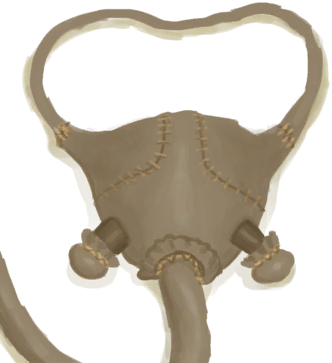
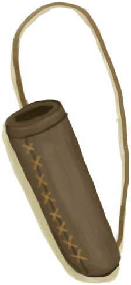

# Cured Skin  
> Ready to be used for leather crafts.  
  
<table class="table table-bordered" data-toggle="table"  data-show-header="false"><thead style="display:none"><tr ><th  style="width:50%;text-align:left;vertical-align:top;"  >title</th><th  style="width:50%;text-align:left;vertical-align:top;"  ></th></tr></thead><tr ><td  style="width:50%;text-align:left;vertical-align:top;"  >** Cannot Be Trashed **  **Weight：**250</td><td  style="width:50%;text-align:left;vertical-align:top;"  >

<a href="CuredSkin.md" style="color:black">Cured Skin</a>

"Skin can be obtained by skinning large animals like Boars</td></tr></tbody></table>  
  
## Got From  

Dismantle

[Bedroll](BedRoll.md)

Transform

[Bedroll](BedRoll.md)

Transform

[Leather Gloves](LeatherGloves.md)

Dismantle

[Leather Pants](LeatherPants.md)

Transform

[Leather Pants](LeatherPants.md)

Dismantle

[Leather Shoes](LeatherShoes.md)

Transform

[Leather Shoes](LeatherShoes.md)

Transform

[Bellows](Bellows.md)

Dismantle

[Satchel](Satchel.md)

Dismantle

[Satchel](SatchelHunter.md)

Skin Cured!

[Fleshed Skin](SkinFleshed.md)

  
  
## Use In BluePrint  

<a href="Bp_Cellar.md" style="color:black">Cellar</a>

<a href="Bp_Drum.md" style="color:black">Drum</a>

<a href="Bp_Glue.md" style="color:black">Glue</a>

<a href="Bp_Raft.md" style="color:black">Raft</a>

<a href="Bp_RaftShelter.md" style="color:black">Raft Shelter</a>

<a href="Bp_Shield.md" style="color:black">Shield</a>

<a href="Bp_Bedroll.md" style="color:black">Bedroll</a>

<a href="Bp_Bellows.md" style="color:black">Bellows</a>

<a href="Bp_GasMask.md" style="color:black">Gas Mask</a>

<a href="Bp_LeatherBackpack.md" style="color:black">Leather Backpack</a>

<a href="Bp_LeatherGloves.md" style="color:black">Leather Gloves</a>

<a href="Bp_LeatherPants.md" style="color:black">Leather Pants</a>

<a href="Bp_LeatherShoes.md" style="color:black">Leather Shoes</a>

<a href="Bp_Quiver.md" style="color:black">Quiver</a>

<a href="Bp_Satchel.md" style="color:black">Satchel</a>

<a href="Bp_Waterskin.md" style="color:black">Waterskin</a>

  
  
  

