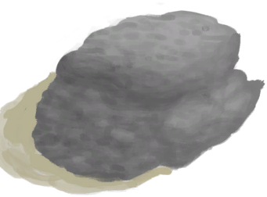
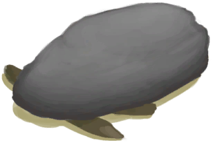
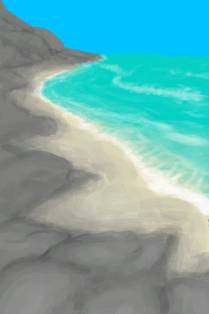
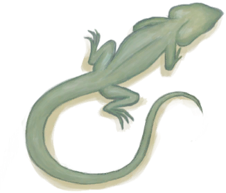

# Deadfall Trap  
> I should place bait inside and check it for prey later. <b>(changing bait resets trap)</b>  
  
<table class="table table-bordered" data-toggle="table"  data-show-header="false"><thead style="display:none"><tr ><th  style="width:50%;text-align:left;vertical-align:top;"  >title</th><th  style="width:50%;text-align:left;vertical-align:top;"  ></th></tr></thead><tr ><td  style="width:50%;text-align:left;vertical-align:top;"  >** Cannot Be Trashed **  ** DoseNotPile **  **Slots：**1</td><td  style="width:50%;text-align:left;vertical-align:top;"  >

<a href="DeadfallTrap.md" style="color:black">Deadfall Trap</a>

"The simplest of all traps made of a <b>Heavy Stone</b> and some <b>Sticks</b>.  It can catch small animals like <b>Mice</td></tr></tbody></table>  
  
## Got From  

Rearm Trap

[Deadfall Trap](DeadfallTrapTriggered.md)

Craft BluePrint

[Deadfall Trap(BluePrint)](Bp_DeadfallTrap.md)

  
  
## Action  

<table><tr><td rowspan="2" style="width:200px;text-align:center;font-size:1.3em;font-weight:bold">

Disassemble trap

15m

</td><td>[“HandAction(Group)”](HandAction.md)</td></tr><tr><td><b>Self：</b>→Dismiss</td></tr><tr><td colspan="2"><b>Require：</b>[

[Light](Light.md)](Light.md): <b>10-100</b></td></tr><tr><td colspan="2">[

[Sticks](Sticks.md)](Sticks.md)(<b>+1</b>), [

[Heavy Stone](StoneHeavy.md)](StoneHeavy.md)(<b>+1</b>)</td></tr></table>
  
  
  
## Transform  

<table style="margin-bottom:0px;"><tr><td  colspan=2 style="font-size:1em;font-weight:bold;background-color:#FEFEFE">Catch Prey</td><td style="text-align:right; background-color:#FEFEFE">[

[Trapping(Skill)](Skill_Trapping.md)](Skill_Trapping.md)<b>+0.5</b></td></tr><tr style="background-color:#FFFFFF"><td style="width:30%;font-size:1em;text-align:right;vertical-align:middle;">[“Bait”](tag_Bait.md) [“Feed”](tag_Feed.md)</td><td style="text-align:center;width:20%;vertical-align:middle;">
18h45m ～ 2d8h15m

Catch Prey
</td><td style="text-align:left;vertical-align:middle;"></td></tr><tr><td colspan="3"><b>Self：</b>→ [

[Deadfall Trap](DeadfallTrapTriggered.md)](DeadfallTrapTriggered.md)</td></tr><tr><td colspan="3">

<table style="margin-bottom:3px;"><tr><td rowspan=2 style="text-align:center" width="80px">
Base Weight

100
</td><td style="font-size:0.6em;line-height:0.6em;font-weight:bold">Fail</td></tr><tr><td></td></tr><tr><td colspan=2><li>[

[Trapping(Skill)](Skill_Trapping.md)](Skill_Trapping.md) in <b>0～150(0%～100%)</b>, weight<b>+0～-50</b></li><li>[

[Trapping Fences](Imp_TrappingFences.md)](Imp_TrappingFences.md) On *Hand/Board*，Weight<b>-20</b>(Stackable),</li></td></tr></table>

<table style="margin-bottom:3px;"><tr><td rowspan=2 style="text-align:center" width="80px">
Base Weight

0
</td><td style="font-size:0.6em;line-height:0.6em;font-weight:bold">Crab</td></tr><tr><td>[

[Crab](Crab.md)](Crab.md)(<b>+1</b>)[Population Crab](Pop_Crab.md)<b>-1000</b></td></tr><tr><td colspan=2><li>In [

[Beach(Environment)](Env_Beach.md)](Env_Beach.md),[Population Crab](Pop_Crab.md) in <b>1000～60000</b>, weight <b>+1～+20</b></li><li>In [

[Bay(Environment)](Env_Bay.md)](Env_Bay.md),[Population Crab](Pop_Crab.md) in <b>1000～60000</b>, weight <b>+1～+20</b></li><li>In [

[Desolate Beach(Environment)](Env_DesolateBeach.md)](Env_DesolateBeach.md),[Population Crab](Pop_Crab.md) in <b>1000～60000</b>, weight <b>+1～+20</b></li><li>In [

[Rocks(Environment)](Env_Rocks.md)](Env_Rocks.md),[Population Crab](Pop_Crab.md) in <b>1000～60000</b>, weight <b>+1～+40</b></li><li>In [

[Bird Rock(Environment)](Env_BirdRock.md)](Env_BirdRock.md),[Population Crab](Pop_Crab.md) in <b>1000～60000</b>, weight <b>+1～+40</b></li><li>In [

[Mangrove Forest(Environment)](Env_Mangroves.md)](Env_Mangroves.md),[Population Crab](Pop_Crab.md) in <b>1000～60000</b>, weight <b>+1～+40</b></li></td></tr></table>

<table style="margin-bottom:3px;"><tr><td rowspan=2 style="text-align:center" width="80px">
Base Weight

0
</td><td style="font-size:0.6em;line-height:0.6em;font-weight:bold">Seagull</td></tr><tr><td>[

[Dead Seagull](SeagullDead.md)](SeagullDead.md)(<b>+1</b>)[Population Seagulls](Pop_Seagull.md)<b>-1000</b> [Seagull Fear](SeagullFear.md)<b>+100</b></td></tr><tr><td colspan=2><li>In [

[Beach(Environment)](Env_Beach.md)](Env_Beach.md),[Population Seagulls](Pop_Seagull.md) in <b>1000～45000</b>, weight<b>+1～+10</b></li><li>In [

[Bay(Environment)](Env_Bay.md)](Env_Bay.md),[Population Seagulls](Pop_Seagull.md) in <b>1000～45000</b>, weight<b>+1～+10</b></li><li>In [

[Bird Rock(Environment)](Env_BirdRock.md)](Env_BirdRock.md),[Population Seagulls](Pop_Seagull.md) in <b>1000～45000</b>, weight<b>+1～+20</b></li><li>In [

[Rocks(Environment)](Env_Rocks.md)](Env_Rocks.md),[Population Seagulls](Pop_Seagull.md) in <b>1000～45000</b>, weight<b>+1～+15</b></li><li>In [

[Desolate Beach(Environment)](Env_DesolateBeach.md)](Env_DesolateBeach.md),[Population Seagulls](Pop_Seagull.md) in <b>1000～45000</b>, weight<b>+1～+15</b></li></td></tr></table>

<table style="margin-bottom:3px;"><tr><td rowspan=2 style="text-align:center" width="80px">
Base Weight

0
</td><td style="font-size:0.6em;line-height:0.6em;font-weight:bold">Lizard</td></tr><tr><td>[

[Lizard](Lizard.md)](Lizard.md)(<b>+1</b>)[Population Lizard](Pop_Lizard.md)<b>-1000</b></td></tr><tr><td colspan=2><li>In [

[Outskirts(Environment)](Env_Outskirts.md)](Env_Outskirts.md),[Population Lizard](Pop_Lizard.md) in <b>1000～60000</b>, weight <b>+0～+20</b></li><li>In [

[Western Highlands(Environment)](Env_HighlandsWestern.md)](Env_HighlandsWestern.md),[Population Lizard](Pop_Lizard.md) in <b>1000～60000</b>, weight <b>+0～+20</b></li><li>In [

[Beach(Environment)](Env_Beach.md)](Env_Beach.md),[Population Lizard](Pop_Lizard.md) in <b>1000～60000</b>, weight <b>+0～+10</b></li><li>In [

[Bay(Environment)](Env_Bay.md)](Env_Bay.md),[Population Lizard](Pop_Lizard.md) in <b>1000～60000</b>, weight <b>+0～+10</b></li><li>In [

[Jungle(Environment)](Env_Jungle.md)](Env_Jungle.md),[Population Lizard](Pop_Lizard.md) in <b>1000～60000</b>, weight <b>+0～+5</b></li><li>In [

[Western Grasslands(Environment)](Env_GrasslandsW.md)](Env_GrasslandsW.md),[Population Lizard](Pop_Lizard.md) in <b>1000～60000</b>, weight <b>+0～+5</b></li><li>In [

[Eastern Grasslands(Environment)](Env_GrasslandsE.md)](Env_GrasslandsE.md),[Population Lizard](Pop_Lizard.md) in <b>1000～60000</b>, weight <b>+0～+5</b></li><li>In [

[Desolate Beach(Environment)](Env_DesolateBeach.md)](Env_DesolateBeach.md),[Population Lizard](Pop_Lizard.md) in <b>1000～60000</b>, weight <b>+0～+5</b></li></td></tr></table>

<table style="margin-bottom:3px;"><tr><td rowspan=2 style="text-align:center" width="80px">
Base Weight

0
</td><td style="font-size:0.6em;line-height:0.6em;font-weight:bold">Mudskipper</td></tr><tr><td>[

[Mudskipper](Mudskipper.md)](Mudskipper.md)(<b>+1</b>)[Population Mudskippers](Pop_Mudskipper.md)<b>-1000</b></td></tr><tr><td colspan=2><li>In [

[Mangrove Forest(Environment)](Env_Mangroves.md)](Env_Mangroves.md),[Population Mudskippers](Pop_Mudskipper.md) in <b>1000～15000</b>, weight <b>+0～+20</b></li></td></tr></table>

<table style="margin-bottom:3px;"><tr><td rowspan=2 style="text-align:center" width="80px">
Base Weight

0
</td><td style="font-size:0.6em;line-height:0.6em;font-weight:bold">Mouse</td></tr><tr><td>[

[Dead Mouse](Mouse.md)](Mouse.md)(<b>+1</b>)[Population Mouse](Pop_Mouse.md)<b>-1000</b></td></tr><tr><td colspan=2><li>In [

[Beach(Environment)](Env_Beach.md)](Env_Beach.md),[Population Mouse](Pop_Mouse.md) in <b>1000～100000</b>, weight <b>+0～+5</b></li><li>In [

[Bay(Environment)](Env_Bay.md)](Env_Bay.md),[Population Mouse](Pop_Mouse.md) in <b>1000～100000</b>, weight <b>+0～+5</b></li><li>In [

[Outskirts(Environment)](Env_Outskirts.md)](Env_Outskirts.md),[Population Mouse](Pop_Mouse.md) in <b>1000～100000</b>, weight <b>+0～+20</b></li><li>In [

[Western Grasslands(Environment)](Env_GrasslandsW.md)](Env_GrasslandsW.md),[Population Mouse](Pop_Mouse.md) in <b>1000～100000</b>, weight <b>+0～+20</b>[Population Monitors](Pop_Monitor.md) in <b>1000～14000</b>, weight <b>+0～-15</b></li><li>In [

[Eastern Grasslands(Environment)](Env_GrasslandsE.md)](Env_GrasslandsE.md),[Population Mouse](Pop_Mouse.md) in <b>1000～100000</b>, weight <b>+0～+20</b>[Population Monitors](Pop_Monitor.md) in <b>1000～14000</b>, weight <b>+0～-15</b></li><li>In [

[Secret Valley(Environment)](Env_SecretValley.md)](Env_SecretValley.md),[Population Mouse](Pop_Mouse.md) in <b>1000～100000</b>, weight <b>+0～+20</b>[Population Monitors](Pop_Monitor.md) in <b>1000～14000</b>, weight <b>+0～-15</b></li><li>In [

[Western Highlands(Environment)](Env_HighlandsWestern.md)](Env_HighlandsWestern.md),[Population Mouse](Pop_Mouse.md) in <b>1000～100000</b>, weight <b>+0～+20</b></li><li>In [

[Jungle Highlands(Environment)](Env_JungleHighlands.md)](Env_JungleHighlands.md),[Population Mouse](Pop_Mouse.md) in <b>1000～100000</b>, weight <b>+0～+20</b></li><li>In [

[Jungle(Environment)](Env_Jungle.md)](Env_Jungle.md),[Population Mouse](Pop_Mouse.md) in <b>1000～100000</b>, weight <b>+0～+25</b></li><li>In [

[Jungle(Environment)](Env_DeepJungle.md)](Env_DeepJungle.md),[Population Mouse](Pop_Mouse.md) in <b>1000～100000</b>, weight <b>+0～+25</b></li><li>In [

[Wetlands(Environment)](Env_Wetlands.md)](Env_Wetlands.md),[Population Mouse](Pop_Mouse.md) in <b>1000～100000</b>, weight <b>+0～+25</b></li><li>In [

[Mangrove Forest(Environment)](Env_Mangroves.md)](Env_Mangroves.md),[Population Mouse](Pop_Mouse.md) in <b>1000～100000</b>, weight <b>+0～+5</b></li></td></tr></table>

<table style="margin-bottom:3px;"><tr><td rowspan=2 style="text-align:center" width="80px">
Base Weight

0
</td><td style="font-size:0.6em;line-height:0.6em;font-weight:bold">Partridge</td></tr><tr><td>[

[Dead Partridge](PartridgeDead.md)](PartridgeDead.md)(<b>+1</b>)[Population Partridges](Pop_Partridge.md)<b>-1000</b></td></tr><tr><td colspan=2><li>In [

[Jungle(Environment)](Env_Jungle.md)](Env_Jungle.md),[Population Partridges](Pop_Partridge.md) in <b>1000～40000</b>, weight <b>+0～+15</b></li><li>In [

[Jungle(Environment)](Env_DeepJungle.md)](Env_DeepJungle.md),[Population Partridges](Pop_Partridge.md) in <b>1000～40000</b>, weight <b>+0～+15</b></li><li>In [

[Wetlands(Environment)](Env_Wetlands.md)](Env_Wetlands.md),[Population Partridges](Pop_Partridge.md) in <b>1000～40000</b>, weight <b>+0～+15</b></li><li>In [

[Western Highlands(Environment)](Env_HighlandsWestern.md)](Env_HighlandsWestern.md),[Population Partridges](Pop_Partridge.md) in <b>1000～40000</b>, weight <b>+0～+15</b></li><li>In [

[Jungle Highlands(Environment)](Env_JungleHighlands.md)](Env_JungleHighlands.md),[Population Partridges](Pop_Partridge.md) in <b>1000～40000</b>, weight <b>+0～+15</b></li><li>In [

[Western Grasslands(Environment)](Env_GrasslandsW.md)](Env_GrasslandsW.md),[Population Partridges](Pop_Partridge.md) in <b>1000～40000</b>, weight <b>+0～+15</b>[Population Monitors](Pop_Monitor.md) in <b>1000～14000</b>, weight <b>+0～-15</b></li><li>In [

[Eastern Grasslands(Environment)](Env_GrasslandsE.md)](Env_GrasslandsE.md),[Population Partridges](Pop_Partridge.md) in <b>1000～40000</b>, weight <b>+0～+15</b>[Population Monitors](Pop_Monitor.md) in <b>1000～14000</b>, weight <b>+0～-15</b></li><li>In [

[Secret Valley(Environment)](Env_SecretValley.md)](Env_SecretValley.md),[Population Partridges](Pop_Partridge.md) in <b>1000～40000</b>, weight <b>+0～+10</b>[Population Monitors](Pop_Monitor.md) in <b>1000～14000</b>, weight <b>+0～-15</b></li></td></tr></table>

<table style="margin-bottom:3px;"><tr><td rowspan=2 style="text-align:center" width="80px">
Base Weight

0
</td><td style="font-size:0.6em;line-height:0.6em;font-weight:bold">Cobra</td></tr><tr><td>[

[Dead Cobra](CobraDead.md)](CobraDead.md)(<b>+1</b>)[Population Cobra](Pop_Cobra.md)<b>-1000</b></td></tr><tr><td colspan=2><li>In [

[Western Highlands(Environment)](Env_HighlandsWestern.md)](Env_HighlandsWestern.md),[Population Cobra](Pop_Cobra.md) in <b>1000～12000</b>, weight <b>+0～+10</b></li><li>In [

[Eastern Highlands(Environment)](Env_HighlandsEastern.md)](Env_HighlandsEastern.md),[Population Cobra](Pop_Cobra.md) in <b>1000～12000</b>, weight <b>+0～+15</b></li><li>In [

[Western Grasslands(Environment)](Env_GrasslandsW.md)](Env_GrasslandsW.md),[Population Cobra](Pop_Cobra.md) in <b>1000～12000</b>, weight <b>+0～+10</b>[Population Monitors](Pop_Monitor.md) in <b>1000～14000</b>, weight <b>+0～-15</b></li><li>In [

[Eastern Grasslands(Environment)](Env_GrasslandsE.md)](Env_GrasslandsE.md),[Population Cobra](Pop_Cobra.md) in <b>1000～12000</b>, weight <b>+0～+10</b>[Population Monitors](Pop_Monitor.md) in <b>1000～14000</b>, weight <b>+0～-15</b></li></td></tr></table>
<button class="btn btn-secondary btn-sm" style="" data-toggle="modal" onclick="setCollectionDataBase64('eyJ0aXRsZSI6IlNpbXVsYXRvcjogQ2F0Y2ggUHJleSAoRGVhZGZhbGwgVHJhcCkiLCJjb2xsZWN0aW9ucyI6W3siZHJvcCI6Ii0iLCJiYXNlIjoxMDAsImNvbmRpdGlvbiI6W3sia2V5IjoiU2tpbGxfVHJhcHBpbmciLCJ0aXRsZSI6IlRyYXBwaW5nKFNraWxsKSIsInR5cGUiOiJyYW5nZSIsIm1heCI6WzAsMTUwXSwicmFuZ2UiOlswLDE1MF0sIndlaWdodCI6WzAsLTUwXSwiZGVmYXVsdFZhbHVlIjowLCJ3aGVuT3V0T2ZSYW5nZSI6MH0seyJrZXkiOiJJbXBfVHJhcHBpbmdGZW5jZXNfYW1vdW50IiwidGl0bGUiOiJUcmFwcGluZyBGZW5jZXMiLCJ0eXBlIjoicmFuZ2UiLCJyYW5nZSI6WzAsMjBdLCJtYXgiOlswLDIwXSwid2VpZ2h0IjpbMCwtNDAwXSwiZGVmYXVsdFZhbHVlIjowLCJ3aGVuT3V0T2ZSYW5nZSI6MCwibWF4U3RhY2tHcm91cCI6IiJ9XX0seyJkcm9wIjoiPGRpdiBzdHlsZT1cIndpZHRoOjI1cHg7ZGlzcGxheTppbmxpbmUtYmxvY2s7dGV4dC1hbGlnbjpjZW50ZXJcIj48aW1nIGRlY29kaW5nPVwiYXN5bmNcIiBzcmM9XCJTcHJpdGUvQ3JhYi5wbmdcIiBocmVmPVwiYS5tZFwiIHN0eWxlPVwibWF4LXdpZHRoOjI1cHg7bWF4LWhlaWdodDoyNXB4O1wiPjwvZGl2PkNyYWIiLCJiYXNlIjowLCJjb25kaXRpb24iOlt7ImtleSI6IkVudl9CZWFjaCIsInRpdGxlIjoiSW4gPGRpdiBzdHlsZT1cIndpZHRoOjIwcHg7ZGlzcGxheTppbmxpbmUtYmxvY2s7dGV4dC1hbGlnbjpjZW50ZXJcIj48aW1nIGRlY29kaW5nPVwiYXN5bmNcIiBzcmM9XCJTcHJpdGUvQmlnSXNsYW5kLnBuZ1wiIGhyZWY9XCJhLm1kXCIgc3R5bGU9XCJtYXgtd2lkdGg6MjBweDttYXgtaGVpZ2h0OjIwcHg7XCI+PC9kaXY+QmVhY2goRW52aXJvbm1lbnQpIiwidHlwZSI6InRvZ2dsZSIsInJhbmdlIjpbMCwxXSwibWF4IjpbMCwxXSwid2VpZ2h0IjpbMCwwXSwiZGVmYXVsdFZhbHVlIjowLCJ3aGVuT3V0T2ZSYW5nZSI6MCwibWF4U3RhY2tHcm91cCI6IiJ9LHsia2V5IjoiUG9wX0NyYWIiLCJ0aXRsZSI6IlBvcHVsYXRpb24gQ3JhYiIsInR5cGUiOiJyYW5nZSIsIm1heCI6WzAsNjAwMDBdLCJyYW5nZSI6WzEwMDAsNjAwMDBdLCJ3ZWlnaHQiOlsxLDIwXSwiZGVmYXVsdFZhbHVlIjo2MDAwMCwid2hlbk91dE9mUmFuZ2UiOjEsInByZWQiOiJFbnZfQmVhY2gifSx7ImtleSI6IkVudl9CYXkiLCJ0aXRsZSI6IkluIDxkaXYgc3R5bGU9XCJ3aWR0aDoyMHB4O2Rpc3BsYXk6aW5saW5lLWJsb2NrO3RleHQtYWxpZ246Y2VudGVyXCI+PGltZyBkZWNvZGluZz1cImFzeW5jXCIgc3JjPVwiU3ByaXRlL0JheS5wbmdcIiBocmVmPVwiYS5tZFwiIHN0eWxlPVwibWF4LXdpZHRoOjIwcHg7bWF4LWhlaWdodDoyMHB4O1wiPjwvZGl2PkJheShFbnZpcm9ubWVudCkiLCJ0eXBlIjoidG9nZ2xlIiwicmFuZ2UiOlswLDFdLCJtYXgiOlswLDFdLCJ3ZWlnaHQiOlswLDBdLCJkZWZhdWx0VmFsdWUiOjAsIndoZW5PdXRPZlJhbmdlIjowLCJtYXhTdGFja0dyb3VwIjoiIn0seyJrZXkiOiJQb3BfQ3JhYiIsInRpdGxlIjoiUG9wdWxhdGlvbiBDcmFiIiwidHlwZSI6InJhbmdlIiwibWF4IjpbMCw2MDAwMF0sInJhbmdlIjpbMTAwMCw2MDAwMF0sIndlaWdodCI6WzEsMjBdLCJkZWZhdWx0VmFsdWUiOjYwMDAwLCJ3aGVuT3V0T2ZSYW5nZSI6MSwicHJlZCI6IkVudl9CYXkifSx7ImtleSI6IkVudl9EZXNvbGF0ZUJlYWNoIiwidGl0bGUiOiJJbiA8ZGl2IHN0eWxlPVwid2lkdGg6MjBweDtkaXNwbGF5OmlubGluZS1ibG9jazt0ZXh0LWFsaWduOmNlbnRlclwiPjxpbWcgZGVjb2Rpbmc9XCJhc3luY1wiIHNyYz1cIlNwcml0ZS9EZXNvbGF0ZUJlYWNoLnBuZ1wiIGhyZWY9XCJhLm1kXCIgc3R5bGU9XCJtYXgtd2lkdGg6MjBweDttYXgtaGVpZ2h0OjIwcHg7XCI+PC9kaXY+RGVzb2xhdGUgQmVhY2goRW52aXJvbm1lbnQpIiwidHlwZSI6InRvZ2dsZSIsInJhbmdlIjpbMCwxXSwibWF4IjpbMCwxXSwid2VpZ2h0IjpbMCwwXSwiZGVmYXVsdFZhbHVlIjowLCJ3aGVuT3V0T2ZSYW5nZSI6MCwibWF4U3RhY2tHcm91cCI6IiJ9LHsia2V5IjoiUG9wX0NyYWIiLCJ0aXRsZSI6IlBvcHVsYXRpb24gQ3JhYiIsInR5cGUiOiJyYW5nZSIsIm1heCI6WzAsNjAwMDBdLCJyYW5nZSI6WzEwMDAsNjAwMDBdLCJ3ZWlnaHQiOlsxLDIwXSwiZGVmYXVsdFZhbHVlIjo2MDAwMCwid2hlbk91dE9mUmFuZ2UiOjEsInByZWQiOiJFbnZfRGVzb2xhdGVCZWFjaCJ9LHsia2V5IjoiRW52X1JvY2tzIiwidGl0bGUiOiJJbiA8ZGl2IHN0eWxlPVwid2lkdGg6MjBweDtkaXNwbGF5OmlubGluZS1ibG9jazt0ZXh0LWFsaWduOmNlbnRlclwiPjxpbWcgZGVjb2Rpbmc9XCJhc3luY1wiIHNyYz1cIlNwcml0ZS9Sb2NreVBhdGgucG5nXCIgaHJlZj1cImEubWRcIiBzdHlsZT1cIm1heC13aWR0aDoyMHB4O21heC1oZWlnaHQ6MjBweDtcIj48L2Rpdj5Sb2NrcyhFbnZpcm9ubWVudCkiLCJ0eXBlIjoidG9nZ2xlIiwicmFuZ2UiOlswLDFdLCJtYXgiOlswLDFdLCJ3ZWlnaHQiOlswLDBdLCJkZWZhdWx0VmFsdWUiOjAsIndoZW5PdXRPZlJhbmdlIjowLCJtYXhTdGFja0dyb3VwIjoiIn0seyJrZXkiOiJQb3BfQ3JhYiIsInRpdGxlIjoiUG9wdWxhdGlvbiBDcmFiIiwidHlwZSI6InJhbmdlIiwibWF4IjpbMCw2MDAwMF0sInJhbmdlIjpbMTAwMCw2MDAwMF0sIndlaWdodCI6WzEsNDBdLCJkZWZhdWx0VmFsdWUiOjYwMDAwLCJ3aGVuT3V0T2ZSYW5nZSI6MSwicHJlZCI6IkVudl9Sb2NrcyJ9LHsia2V5IjoiRW52X0JpcmRSb2NrIiwidGl0bGUiOiJJbiA8ZGl2IHN0eWxlPVwid2lkdGg6MjBweDtkaXNwbGF5OmlubGluZS1ibG9jazt0ZXh0LWFsaWduOmNlbnRlclwiPjxpbWcgZGVjb2Rpbmc9XCJhc3luY1wiIHNyYz1cIlNwcml0ZS9Qb2ludHlSb2NrLnBuZ1wiIGhyZWY9XCJhLm1kXCIgc3R5bGU9XCJtYXgtd2lkdGg6MjBweDttYXgtaGVpZ2h0OjIwcHg7XCI+PC9kaXY+QmlyZCBSb2NrKEVudmlyb25tZW50KSIsInR5cGUiOiJ0b2dnbGUiLCJyYW5nZSI6WzAsMV0sIm1heCI6WzAsMV0sIndlaWdodCI6WzAsMF0sImRlZmF1bHRWYWx1ZSI6MCwid2hlbk91dE9mUmFuZ2UiOjAsIm1heFN0YWNrR3JvdXAiOiIifSx7ImtleSI6IlBvcF9DcmFiIiwidGl0bGUiOiJQb3B1bGF0aW9uIENyYWIiLCJ0eXBlIjoicmFuZ2UiLCJtYXgiOlswLDYwMDAwXSwicmFuZ2UiOlsxMDAwLDYwMDAwXSwid2VpZ2h0IjpbMSw0MF0sImRlZmF1bHRWYWx1ZSI6NjAwMDAsIndoZW5PdXRPZlJhbmdlIjoxLCJwcmVkIjoiRW52X0JpcmRSb2NrIn0seyJrZXkiOiJFbnZfTWFuZ3JvdmVzIiwidGl0bGUiOiJJbiA8ZGl2IHN0eWxlPVwid2lkdGg6MjBweDtkaXNwbGF5OmlubGluZS1ibG9jazt0ZXh0LWFsaWduOmNlbnRlclwiPjxpbWcgZGVjb2Rpbmc9XCJhc3luY1wiIHNyYz1cIlNwcml0ZS9NYW5ncm92ZXMucG5nXCIgaHJlZj1cImEubWRcIiBzdHlsZT1cIm1heC13aWR0aDoyMHB4O21heC1oZWlnaHQ6MjBweDtcIj48L2Rpdj5NYW5ncm92ZSBGb3Jlc3QoRW52aXJvbm1lbnQpIiwidHlwZSI6InRvZ2dsZSIsInJhbmdlIjpbMCwxXSwibWF4IjpbMCwxXSwid2VpZ2h0IjpbMCwwXSwiZGVmYXVsdFZhbHVlIjowLCJ3aGVuT3V0T2ZSYW5nZSI6MCwibWF4U3RhY2tHcm91cCI6IiJ9LHsia2V5IjoiUG9wX0NyYWIiLCJ0aXRsZSI6IlBvcHVsYXRpb24gQ3JhYiIsInR5cGUiOiJyYW5nZSIsIm1heCI6WzAsNjAwMDBdLCJyYW5nZSI6WzEwMDAsNjAwMDBdLCJ3ZWlnaHQiOlsxLDQwXSwiZGVmYXVsdFZhbHVlIjo2MDAwMCwid2hlbk91dE9mUmFuZ2UiOjEsInByZWQiOiJFbnZfTWFuZ3JvdmVzIn1dfSx7ImRyb3AiOiI8ZGl2IHN0eWxlPVwid2lkdGg6MjVweDtkaXNwbGF5OmlubGluZS1ibG9jazt0ZXh0LWFsaWduOmNlbnRlclwiPjxpbWcgZGVjb2Rpbmc9XCJhc3luY1wiIHNyYz1cIlNwcml0ZS9TZWFndWxsRGVhZC5wbmdcIiBocmVmPVwiYS5tZFwiIHN0eWxlPVwibWF4LXdpZHRoOjI1cHg7bWF4LWhlaWdodDoyNXB4O1wiPjwvZGl2PkRlYWQgU2VhZ3VsbCIsImJhc2UiOjAsImNvbmRpdGlvbiI6W3sia2V5IjoiRW52X0JlYWNoIiwidGl0bGUiOiJJbiA8ZGl2IHN0eWxlPVwid2lkdGg6MjBweDtkaXNwbGF5OmlubGluZS1ibG9jazt0ZXh0LWFsaWduOmNlbnRlclwiPjxpbWcgZGVjb2Rpbmc9XCJhc3luY1wiIHNyYz1cIlNwcml0ZS9CaWdJc2xhbmQucG5nXCIgaHJlZj1cImEubWRcIiBzdHlsZT1cIm1heC13aWR0aDoyMHB4O21heC1oZWlnaHQ6MjBweDtcIj48L2Rpdj5CZWFjaChFbnZpcm9ubWVudCkiLCJ0eXBlIjoidG9nZ2xlIiwicmFuZ2UiOlswLDFdLCJtYXgiOlswLDFdLCJ3ZWlnaHQiOlswLDBdLCJkZWZhdWx0VmFsdWUiOjAsIndoZW5PdXRPZlJhbmdlIjowLCJtYXhTdGFja0dyb3VwIjoiIn0seyJrZXkiOiJQb3BfU2VhZ3VsbCIsInRpdGxlIjoiUG9wdWxhdGlvbiBTZWFndWxscyIsInR5cGUiOiJyYW5nZSIsIm1heCI6WzAsNDUwMDBdLCJyYW5nZSI6WzEwMDAsNDUwMDBdLCJ3ZWlnaHQiOlsxLDEwXSwiZGVmYXVsdFZhbHVlIjo0NTAwMCwid2hlbk91dE9mUmFuZ2UiOjAsInByZWQiOiJFbnZfQmVhY2gifSx7ImtleSI6IkVudl9CYXkiLCJ0aXRsZSI6IkluIDxkaXYgc3R5bGU9XCJ3aWR0aDoyMHB4O2Rpc3BsYXk6aW5saW5lLWJsb2NrO3RleHQtYWxpZ246Y2VudGVyXCI+PGltZyBkZWNvZGluZz1cImFzeW5jXCIgc3JjPVwiU3ByaXRlL0JheS5wbmdcIiBocmVmPVwiYS5tZFwiIHN0eWxlPVwibWF4LXdpZHRoOjIwcHg7bWF4LWhlaWdodDoyMHB4O1wiPjwvZGl2PkJheShFbnZpcm9ubWVudCkiLCJ0eXBlIjoidG9nZ2xlIiwicmFuZ2UiOlswLDFdLCJtYXgiOlswLDFdLCJ3ZWlnaHQiOlswLDBdLCJkZWZhdWx0VmFsdWUiOjAsIndoZW5PdXRPZlJhbmdlIjowLCJtYXhTdGFja0dyb3VwIjoiIn0seyJrZXkiOiJQb3BfU2VhZ3VsbCIsInRpdGxlIjoiUG9wdWxhdGlvbiBTZWFndWxscyIsInR5cGUiOiJyYW5nZSIsIm1heCI6WzAsNDUwMDBdLCJyYW5nZSI6WzEwMDAsNDUwMDBdLCJ3ZWlnaHQiOlsxLDEwXSwiZGVmYXVsdFZhbHVlIjo0NTAwMCwid2hlbk91dE9mUmFuZ2UiOjAsInByZWQiOiJFbnZfQmF5In0seyJrZXkiOiJFbnZfQmlyZFJvY2siLCJ0aXRsZSI6IkluIDxkaXYgc3R5bGU9XCJ3aWR0aDoyMHB4O2Rpc3BsYXk6aW5saW5lLWJsb2NrO3RleHQtYWxpZ246Y2VudGVyXCI+PGltZyBkZWNvZGluZz1cImFzeW5jXCIgc3JjPVwiU3ByaXRlL1BvaW50eVJvY2sucG5nXCIgaHJlZj1cImEubWRcIiBzdHlsZT1cIm1heC13aWR0aDoyMHB4O21heC1oZWlnaHQ6MjBweDtcIj48L2Rpdj5CaXJkIFJvY2soRW52aXJvbm1lbnQpIiwidHlwZSI6InRvZ2dsZSIsInJhbmdlIjpbMCwxXSwibWF4IjpbMCwxXSwid2VpZ2h0IjpbMCwwXSwiZGVmYXVsdFZhbHVlIjowLCJ3aGVuT3V0T2ZSYW5nZSI6MCwibWF4U3RhY2tHcm91cCI6IiJ9LHsia2V5IjoiUG9wX1NlYWd1bGwiLCJ0aXRsZSI6IlBvcHVsYXRpb24gU2VhZ3VsbHMiLCJ0eXBlIjoicmFuZ2UiLCJtYXgiOlswLDQ1MDAwXSwicmFuZ2UiOlsxMDAwLDQ1MDAwXSwid2VpZ2h0IjpbMSwyMF0sImRlZmF1bHRWYWx1ZSI6NDUwMDAsIndoZW5PdXRPZlJhbmdlIjowLCJwcmVkIjoiRW52X0JpcmRSb2NrIn0seyJrZXkiOiJFbnZfUm9ja3MiLCJ0aXRsZSI6IkluIDxkaXYgc3R5bGU9XCJ3aWR0aDoyMHB4O2Rpc3BsYXk6aW5saW5lLWJsb2NrO3RleHQtYWxpZ246Y2VudGVyXCI+PGltZyBkZWNvZGluZz1cImFzeW5jXCIgc3JjPVwiU3ByaXRlL1JvY2t5UGF0aC5wbmdcIiBocmVmPVwiYS5tZFwiIHN0eWxlPVwibWF4LXdpZHRoOjIwcHg7bWF4LWhlaWdodDoyMHB4O1wiPjwvZGl2PlJvY2tzKEVudmlyb25tZW50KSIsInR5cGUiOiJ0b2dnbGUiLCJyYW5nZSI6WzAsMV0sIm1heCI6WzAsMV0sIndlaWdodCI6WzAsMF0sImRlZmF1bHRWYWx1ZSI6MCwid2hlbk91dE9mUmFuZ2UiOjAsIm1heFN0YWNrR3JvdXAiOiIifSx7ImtleSI6IlBvcF9TZWFndWxsIiwidGl0bGUiOiJQb3B1bGF0aW9uIFNlYWd1bGxzIiwidHlwZSI6InJhbmdlIiwibWF4IjpbMCw0NTAwMF0sInJhbmdlIjpbMTAwMCw0NTAwMF0sIndlaWdodCI6WzEsMTVdLCJkZWZhdWx0VmFsdWUiOjQ1MDAwLCJ3aGVuT3V0T2ZSYW5nZSI6MCwicHJlZCI6IkVudl9Sb2NrcyJ9LHsia2V5IjoiRW52X0Rlc29sYXRlQmVhY2giLCJ0aXRsZSI6IkluIDxkaXYgc3R5bGU9XCJ3aWR0aDoyMHB4O2Rpc3BsYXk6aW5saW5lLWJsb2NrO3RleHQtYWxpZ246Y2VudGVyXCI+PGltZyBkZWNvZGluZz1cImFzeW5jXCIgc3JjPVwiU3ByaXRlL0Rlc29sYXRlQmVhY2gucG5nXCIgaHJlZj1cImEubWRcIiBzdHlsZT1cIm1heC13aWR0aDoyMHB4O21heC1oZWlnaHQ6MjBweDtcIj48L2Rpdj5EZXNvbGF0ZSBCZWFjaChFbnZpcm9ubWVudCkiLCJ0eXBlIjoidG9nZ2xlIiwicmFuZ2UiOlswLDFdLCJtYXgiOlswLDFdLCJ3ZWlnaHQiOlswLDBdLCJkZWZhdWx0VmFsdWUiOjAsIndoZW5PdXRPZlJhbmdlIjowLCJtYXhTdGFja0dyb3VwIjoiIn0seyJrZXkiOiJQb3BfU2VhZ3VsbCIsInRpdGxlIjoiUG9wdWxhdGlvbiBTZWFndWxscyIsInR5cGUiOiJyYW5nZSIsIm1heCI6WzAsNDUwMDBdLCJyYW5nZSI6WzEwMDAsNDUwMDBdLCJ3ZWlnaHQiOlsxLDE1XSwiZGVmYXVsdFZhbHVlIjo0NTAwMCwid2hlbk91dE9mUmFuZ2UiOjAsInByZWQiOiJFbnZfRGVzb2xhdGVCZWFjaCJ9XX0seyJkcm9wIjoiPGRpdiBzdHlsZT1cIndpZHRoOjI1cHg7ZGlzcGxheTppbmxpbmUtYmxvY2s7dGV4dC1hbGlnbjpjZW50ZXJcIj48aW1nIGRlY29kaW5nPVwiYXN5bmNcIiBzcmM9XCJTcHJpdGUvTGl6YXJkLnBuZ1wiIGhyZWY9XCJhLm1kXCIgc3R5bGU9XCJtYXgtd2lkdGg6MjVweDttYXgtaGVpZ2h0OjI1cHg7XCI+PC9kaXY+TGl6YXJkIiwiYmFzZSI6MCwiY29uZGl0aW9uIjpbeyJrZXkiOiJFbnZfT3V0c2tpcnRzIiwidGl0bGUiOiJJbiA8ZGl2IHN0eWxlPVwid2lkdGg6MjBweDtkaXNwbGF5OmlubGluZS1ibG9jazt0ZXh0LWFsaWduOmNlbnRlclwiPjxpbWcgZGVjb2Rpbmc9XCJhc3luY1wiIHNyYz1cIlNwcml0ZS9KdW5nbGUucG5nXCIgaHJlZj1cImEubWRcIiBzdHlsZT1cIm1heC13aWR0aDoyMHB4O21heC1oZWlnaHQ6MjBweDtcIj48L2Rpdj5PdXRza2lydHMoRW52aXJvbm1lbnQpIiwidHlwZSI6InRvZ2dsZSIsInJhbmdlIjpbMCwxXSwibWF4IjpbMCwxXSwid2VpZ2h0IjpbMCwwXSwiZGVmYXVsdFZhbHVlIjowLCJ3aGVuT3V0T2ZSYW5nZSI6MCwibWF4U3RhY2tHcm91cCI6IiJ9LHsia2V5IjoiUG9wX0xpemFyZCIsInRpdGxlIjoiUG9wdWxhdGlvbiBMaXphcmQiLCJ0eXBlIjoicmFuZ2UiLCJtYXgiOlswLDYwMDAwXSwicmFuZ2UiOlsxMDAwLDYwMDAwXSwid2VpZ2h0IjpbMCwyMF0sImRlZmF1bHRWYWx1ZSI6NjAwMDAsIndoZW5PdXRPZlJhbmdlIjoxLCJwcmVkIjoiRW52X091dHNraXJ0cyJ9LHsia2V5IjoiRW52X0hpZ2hsYW5kc1dlc3Rlcm4iLCJ0aXRsZSI6IkluIDxkaXYgc3R5bGU9XCJ3aWR0aDoyMHB4O2Rpc3BsYXk6aW5saW5lLWJsb2NrO3RleHQtYWxpZ246Y2VudGVyXCI+PGltZyBkZWNvZGluZz1cImFzeW5jXCIgc3JjPVwiU3ByaXRlL0p1bmdsZS5wbmdcIiBocmVmPVwiYS5tZFwiIHN0eWxlPVwibWF4LXdpZHRoOjIwcHg7bWF4LWhlaWdodDoyMHB4O1wiPjwvZGl2Pldlc3Rlcm4gSGlnaGxhbmRzKEVudmlyb25tZW50KSIsInR5cGUiOiJ0b2dnbGUiLCJyYW5nZSI6WzAsMV0sIm1heCI6WzAsMV0sIndlaWdodCI6WzAsMF0sImRlZmF1bHRWYWx1ZSI6MCwid2hlbk91dE9mUmFuZ2UiOjAsIm1heFN0YWNrR3JvdXAiOiIifSx7ImtleSI6IlBvcF9MaXphcmQiLCJ0aXRsZSI6IlBvcHVsYXRpb24gTGl6YXJkIiwidHlwZSI6InJhbmdlIiwibWF4IjpbMCw2MDAwMF0sInJhbmdlIjpbMTAwMCw2MDAwMF0sIndlaWdodCI6WzAsMjBdLCJkZWZhdWx0VmFsdWUiOjYwMDAwLCJ3aGVuT3V0T2ZSYW5nZSI6MSwicHJlZCI6IkVudl9IaWdobGFuZHNXZXN0ZXJuIn0seyJrZXkiOiJFbnZfQmVhY2giLCJ0aXRsZSI6IkluIDxkaXYgc3R5bGU9XCJ3aWR0aDoyMHB4O2Rpc3BsYXk6aW5saW5lLWJsb2NrO3RleHQtYWxpZ246Y2VudGVyXCI+PGltZyBkZWNvZGluZz1cImFzeW5jXCIgc3JjPVwiU3ByaXRlL0JpZ0lzbGFuZC5wbmdcIiBocmVmPVwiYS5tZFwiIHN0eWxlPVwibWF4LXdpZHRoOjIwcHg7bWF4LWhlaWdodDoyMHB4O1wiPjwvZGl2PkJlYWNoKEVudmlyb25tZW50KSIsInR5cGUiOiJ0b2dnbGUiLCJyYW5nZSI6WzAsMV0sIm1heCI6WzAsMV0sIndlaWdodCI6WzAsMF0sImRlZmF1bHRWYWx1ZSI6MCwid2hlbk91dE9mUmFuZ2UiOjAsIm1heFN0YWNrR3JvdXAiOiIifSx7ImtleSI6IlBvcF9MaXphcmQiLCJ0aXRsZSI6IlBvcHVsYXRpb24gTGl6YXJkIiwidHlwZSI6InJhbmdlIiwibWF4IjpbMCw2MDAwMF0sInJhbmdlIjpbMTAwMCw2MDAwMF0sIndlaWdodCI6WzAsMTBdLCJkZWZhdWx0VmFsdWUiOjYwMDAwLCJ3aGVuT3V0T2ZSYW5nZSI6MSwicHJlZCI6IkVudl9CZWFjaCJ9LHsia2V5IjoiRW52X0JheSIsInRpdGxlIjoiSW4gPGRpdiBzdHlsZT1cIndpZHRoOjIwcHg7ZGlzcGxheTppbmxpbmUtYmxvY2s7dGV4dC1hbGlnbjpjZW50ZXJcIj48aW1nIGRlY29kaW5nPVwiYXN5bmNcIiBzcmM9XCJTcHJpdGUvQmF5LnBuZ1wiIGhyZWY9XCJhLm1kXCIgc3R5bGU9XCJtYXgtd2lkdGg6MjBweDttYXgtaGVpZ2h0OjIwcHg7XCI+PC9kaXY+QmF5KEVudmlyb25tZW50KSIsInR5cGUiOiJ0b2dnbGUiLCJyYW5nZSI6WzAsMV0sIm1heCI6WzAsMV0sIndlaWdodCI6WzAsMF0sImRlZmF1bHRWYWx1ZSI6MCwid2hlbk91dE9mUmFuZ2UiOjAsIm1heFN0YWNrR3JvdXAiOiIifSx7ImtleSI6IlBvcF9MaXphcmQiLCJ0aXRsZSI6IlBvcHVsYXRpb24gTGl6YXJkIiwidHlwZSI6InJhbmdlIiwibWF4IjpbMCw2MDAwMF0sInJhbmdlIjpbMTAwMCw2MDAwMF0sIndlaWdodCI6WzAsMTBdLCJkZWZhdWx0VmFsdWUiOjYwMDAwLCJ3aGVuT3V0T2ZSYW5nZSI6MSwicHJlZCI6IkVudl9CYXkifSx7ImtleSI6IkVudl9KdW5nbGUiLCJ0aXRsZSI6IkluIDxkaXYgc3R5bGU9XCJ3aWR0aDoyMHB4O2Rpc3BsYXk6aW5saW5lLWJsb2NrO3RleHQtYWxpZ246Y2VudGVyXCI+PGltZyBkZWNvZGluZz1cImFzeW5jXCIgc3JjPVwiU3ByaXRlL0p1bmdsZS5wbmdcIiBocmVmPVwiYS5tZFwiIHN0eWxlPVwibWF4LXdpZHRoOjIwcHg7bWF4LWhlaWdodDoyMHB4O1wiPjwvZGl2Pkp1bmdsZShFbnZpcm9ubWVudCkiLCJ0eXBlIjoidG9nZ2xlIiwicmFuZ2UiOlswLDFdLCJtYXgiOlswLDFdLCJ3ZWlnaHQiOlswLDBdLCJkZWZhdWx0VmFsdWUiOjAsIndoZW5PdXRPZlJhbmdlIjowLCJtYXhTdGFja0dyb3VwIjoiIn0seyJrZXkiOiJQb3BfTGl6YXJkIiwidGl0bGUiOiJQb3B1bGF0aW9uIExpemFyZCIsInR5cGUiOiJyYW5nZSIsIm1heCI6WzAsNjAwMDBdLCJyYW5nZSI6WzEwMDAsNjAwMDBdLCJ3ZWlnaHQiOlswLDVdLCJkZWZhdWx0VmFsdWUiOjYwMDAwLCJ3aGVuT3V0T2ZSYW5nZSI6MSwicHJlZCI6IkVudl9KdW5nbGUifSx7ImtleSI6IkVudl9HcmFzc2xhbmRzVyIsInRpdGxlIjoiSW4gPGRpdiBzdHlsZT1cIndpZHRoOjIwcHg7ZGlzcGxheTppbmxpbmUtYmxvY2s7dGV4dC1hbGlnbjpjZW50ZXJcIj48aW1nIGRlY29kaW5nPVwiYXN5bmNcIiBzcmM9XCJTcHJpdGUvSnVuZ2xlLnBuZ1wiIGhyZWY9XCJhLm1kXCIgc3R5bGU9XCJtYXgtd2lkdGg6MjBweDttYXgtaGVpZ2h0OjIwcHg7XCI+PC9kaXY+V2VzdGVybiBHcmFzc2xhbmRzKEVudmlyb25tZW50KSIsInR5cGUiOiJ0b2dnbGUiLCJyYW5nZSI6WzAsMV0sIm1heCI6WzAsMV0sIndlaWdodCI6WzAsMF0sImRlZmF1bHRWYWx1ZSI6MCwid2hlbk91dE9mUmFuZ2UiOjAsIm1heFN0YWNrR3JvdXAiOiIifSx7ImtleSI6IlBvcF9MaXphcmQiLCJ0aXRsZSI6IlBvcHVsYXRpb24gTGl6YXJkIiwidHlwZSI6InJhbmdlIiwibWF4IjpbMCw2MDAwMF0sInJhbmdlIjpbMTAwMCw2MDAwMF0sIndlaWdodCI6WzAsNV0sImRlZmF1bHRWYWx1ZSI6NjAwMDAsIndoZW5PdXRPZlJhbmdlIjoxLCJwcmVkIjoiRW52X0dyYXNzbGFuZHNXIn0seyJrZXkiOiJFbnZfR3Jhc3NsYW5kc0UiLCJ0aXRsZSI6IkluIDxkaXYgc3R5bGU9XCJ3aWR0aDoyMHB4O2Rpc3BsYXk6aW5saW5lLWJsb2NrO3RleHQtYWxpZ246Y2VudGVyXCI+PGltZyBkZWNvZGluZz1cImFzeW5jXCIgc3JjPVwiU3ByaXRlL0p1bmdsZS5wbmdcIiBocmVmPVwiYS5tZFwiIHN0eWxlPVwibWF4LXdpZHRoOjIwcHg7bWF4LWhlaWdodDoyMHB4O1wiPjwvZGl2PkVhc3Rlcm4gR3Jhc3NsYW5kcyhFbnZpcm9ubWVudCkiLCJ0eXBlIjoidG9nZ2xlIiwicmFuZ2UiOlswLDFdLCJtYXgiOlswLDFdLCJ3ZWlnaHQiOlswLDBdLCJkZWZhdWx0VmFsdWUiOjAsIndoZW5PdXRPZlJhbmdlIjowLCJtYXhTdGFja0dyb3VwIjoiIn0seyJrZXkiOiJQb3BfTGl6YXJkIiwidGl0bGUiOiJQb3B1bGF0aW9uIExpemFyZCIsInR5cGUiOiJyYW5nZSIsIm1heCI6WzAsNjAwMDBdLCJyYW5nZSI6WzEwMDAsNjAwMDBdLCJ3ZWlnaHQiOlswLDVdLCJkZWZhdWx0VmFsdWUiOjYwMDAwLCJ3aGVuT3V0T2ZSYW5nZSI6MSwicHJlZCI6IkVudl9HcmFzc2xhbmRzRSJ9LHsia2V5IjoiRW52X0Rlc29sYXRlQmVhY2giLCJ0aXRsZSI6IkluIDxkaXYgc3R5bGU9XCJ3aWR0aDoyMHB4O2Rpc3BsYXk6aW5saW5lLWJsb2NrO3RleHQtYWxpZ246Y2VudGVyXCI+PGltZyBkZWNvZGluZz1cImFzeW5jXCIgc3JjPVwiU3ByaXRlL0Rlc29sYXRlQmVhY2gucG5nXCIgaHJlZj1cImEubWRcIiBzdHlsZT1cIm1heC13aWR0aDoyMHB4O21heC1oZWlnaHQ6MjBweDtcIj48L2Rpdj5EZXNvbGF0ZSBCZWFjaChFbnZpcm9ubWVudCkiLCJ0eXBlIjoidG9nZ2xlIiwicmFuZ2UiOlswLDFdLCJtYXgiOlswLDFdLCJ3ZWlnaHQiOlswLDBdLCJkZWZhdWx0VmFsdWUiOjAsIndoZW5PdXRPZlJhbmdlIjowLCJtYXhTdGFja0dyb3VwIjoiIn0seyJrZXkiOiJQb3BfTGl6YXJkIiwidGl0bGUiOiJQb3B1bGF0aW9uIExpemFyZCIsInR5cGUiOiJyYW5nZSIsIm1heCI6WzAsNjAwMDBdLCJyYW5nZSI6WzEwMDAsNjAwMDBdLCJ3ZWlnaHQiOlswLDVdLCJkZWZhdWx0VmFsdWUiOjYwMDAwLCJ3aGVuT3V0T2ZSYW5nZSI6MSwicHJlZCI6IkVudl9EZXNvbGF0ZUJlYWNoIn1dfSx7ImRyb3AiOiI8ZGl2IHN0eWxlPVwid2lkdGg6MjVweDtkaXNwbGF5OmlubGluZS1ibG9jazt0ZXh0LWFsaWduOmNlbnRlclwiPjxpbWcgZGVjb2Rpbmc9XCJhc3luY1wiIHNyYz1cIlNwcml0ZS9NdWRza2lwcGVyLnBuZ1wiIGhyZWY9XCJhLm1kXCIgc3R5bGU9XCJtYXgtd2lkdGg6MjVweDttYXgtaGVpZ2h0OjI1cHg7XCI+PC9kaXY+TXVkc2tpcHBlciIsImJhc2UiOjAsImNvbmRpdGlvbiI6W3sia2V5IjoiRW52X01hbmdyb3ZlcyIsInRpdGxlIjoiSW4gPGRpdiBzdHlsZT1cIndpZHRoOjIwcHg7ZGlzcGxheTppbmxpbmUtYmxvY2s7dGV4dC1hbGlnbjpjZW50ZXJcIj48aW1nIGRlY29kaW5nPVwiYXN5bmNcIiBzcmM9XCJTcHJpdGUvTWFuZ3JvdmVzLnBuZ1wiIGhyZWY9XCJhLm1kXCIgc3R5bGU9XCJtYXgtd2lkdGg6MjBweDttYXgtaGVpZ2h0OjIwcHg7XCI+PC9kaXY+TWFuZ3JvdmUgRm9yZXN0KEVudmlyb25tZW50KSIsInR5cGUiOiJ0b2dnbGUiLCJyYW5nZSI6WzAsMV0sIm1heCI6WzAsMV0sIndlaWdodCI6WzAsMF0sImRlZmF1bHRWYWx1ZSI6MCwid2hlbk91dE9mUmFuZ2UiOjAsIm1heFN0YWNrR3JvdXAiOiIifSx7ImtleSI6IlBvcF9NdWRza2lwcGVyIiwidGl0bGUiOiJQb3B1bGF0aW9uIE11ZHNraXBwZXJzIiwidHlwZSI6InJhbmdlIiwibWF4IjpbMCwxNTAwMF0sInJhbmdlIjpbMTAwMCwxNTAwMF0sIndlaWdodCI6WzAsMjBdLCJkZWZhdWx0VmFsdWUiOjE1MDAwLCJ3aGVuT3V0T2ZSYW5nZSI6MSwicHJlZCI6IkVudl9NYW5ncm92ZXMifV19LHsiZHJvcCI6IjxkaXYgc3R5bGU9XCJ3aWR0aDoyNXB4O2Rpc3BsYXk6aW5saW5lLWJsb2NrO3RleHQtYWxpZ246Y2VudGVyXCI+PGltZyBkZWNvZGluZz1cImFzeW5jXCIgc3JjPVwiU3ByaXRlL01vdXNlLnBuZ1wiIGhyZWY9XCJhLm1kXCIgc3R5bGU9XCJtYXgtd2lkdGg6MjVweDttYXgtaGVpZ2h0OjI1cHg7XCI+PC9kaXY+RGVhZCBNb3VzZSIsImJhc2UiOjAsImNvbmRpdGlvbiI6W3sia2V5IjoiRW52X0JlYWNoIiwidGl0bGUiOiJJbiA8ZGl2IHN0eWxlPVwid2lkdGg6MjBweDtkaXNwbGF5OmlubGluZS1ibG9jazt0ZXh0LWFsaWduOmNlbnRlclwiPjxpbWcgZGVjb2Rpbmc9XCJhc3luY1wiIHNyYz1cIlNwcml0ZS9CaWdJc2xhbmQucG5nXCIgaHJlZj1cImEubWRcIiBzdHlsZT1cIm1heC13aWR0aDoyMHB4O21heC1oZWlnaHQ6MjBweDtcIj48L2Rpdj5CZWFjaChFbnZpcm9ubWVudCkiLCJ0eXBlIjoidG9nZ2xlIiwicmFuZ2UiOlswLDFdLCJtYXgiOlswLDFdLCJ3ZWlnaHQiOlswLDBdLCJkZWZhdWx0VmFsdWUiOjAsIndoZW5PdXRPZlJhbmdlIjowLCJtYXhTdGFja0dyb3VwIjoiIn0seyJrZXkiOiJQb3BfTW91c2UiLCJ0aXRsZSI6IlBvcHVsYXRpb24gTW91c2UiLCJ0eXBlIjoicmFuZ2UiLCJtYXgiOlswLDEwMDAwMF0sInJhbmdlIjpbMTAwMCwxMDAwMDBdLCJ3ZWlnaHQiOlswLDVdLCJkZWZhdWx0VmFsdWUiOjUwMDAwLCJ3aGVuT3V0T2ZSYW5nZSI6MSwicHJlZCI6IkVudl9CZWFjaCJ9LHsia2V5IjoiRW52X0JheSIsInRpdGxlIjoiSW4gPGRpdiBzdHlsZT1cIndpZHRoOjIwcHg7ZGlzcGxheTppbmxpbmUtYmxvY2s7dGV4dC1hbGlnbjpjZW50ZXJcIj48aW1nIGRlY29kaW5nPVwiYXN5bmNcIiBzcmM9XCJTcHJpdGUvQmF5LnBuZ1wiIGhyZWY9XCJhLm1kXCIgc3R5bGU9XCJtYXgtd2lkdGg6MjBweDttYXgtaGVpZ2h0OjIwcHg7XCI+PC9kaXY+QmF5KEVudmlyb25tZW50KSIsInR5cGUiOiJ0b2dnbGUiLCJyYW5nZSI6WzAsMV0sIm1heCI6WzAsMV0sIndlaWdodCI6WzAsMF0sImRlZmF1bHRWYWx1ZSI6MCwid2hlbk91dE9mUmFuZ2UiOjAsIm1heFN0YWNrR3JvdXAiOiIifSx7ImtleSI6IlBvcF9Nb3VzZSIsInRpdGxlIjoiUG9wdWxhdGlvbiBNb3VzZSIsInR5cGUiOiJyYW5nZSIsIm1heCI6WzAsMTAwMDAwXSwicmFuZ2UiOlsxMDAwLDEwMDAwMF0sIndlaWdodCI6WzAsNV0sImRlZmF1bHRWYWx1ZSI6NTAwMDAsIndoZW5PdXRPZlJhbmdlIjoxLCJwcmVkIjoiRW52X0JheSJ9LHsia2V5IjoiRW52X091dHNraXJ0cyIsInRpdGxlIjoiSW4gPGRpdiBzdHlsZT1cIndpZHRoOjIwcHg7ZGlzcGxheTppbmxpbmUtYmxvY2s7dGV4dC1hbGlnbjpjZW50ZXJcIj48aW1nIGRlY29kaW5nPVwiYXN5bmNcIiBzcmM9XCJTcHJpdGUvSnVuZ2xlLnBuZ1wiIGhyZWY9XCJhLm1kXCIgc3R5bGU9XCJtYXgtd2lkdGg6MjBweDttYXgtaGVpZ2h0OjIwcHg7XCI+PC9kaXY+T3V0c2tpcnRzKEVudmlyb25tZW50KSIsInR5cGUiOiJ0b2dnbGUiLCJyYW5nZSI6WzAsMV0sIm1heCI6WzAsMV0sIndlaWdodCI6WzAsMF0sImRlZmF1bHRWYWx1ZSI6MCwid2hlbk91dE9mUmFuZ2UiOjAsIm1heFN0YWNrR3JvdXAiOiIifSx7ImtleSI6IlBvcF9Nb3VzZSIsInRpdGxlIjoiUG9wdWxhdGlvbiBNb3VzZSIsInR5cGUiOiJyYW5nZSIsIm1heCI6WzAsMTAwMDAwXSwicmFuZ2UiOlsxMDAwLDEwMDAwMF0sIndlaWdodCI6WzAsMjBdLCJkZWZhdWx0VmFsdWUiOjUwMDAwLCJ3aGVuT3V0T2ZSYW5nZSI6MSwicHJlZCI6IkVudl9PdXRza2lydHMifSx7ImtleSI6IkVudl9HcmFzc2xhbmRzVyIsInRpdGxlIjoiSW4gPGRpdiBzdHlsZT1cIndpZHRoOjIwcHg7ZGlzcGxheTppbmxpbmUtYmxvY2s7dGV4dC1hbGlnbjpjZW50ZXJcIj48aW1nIGRlY29kaW5nPVwiYXN5bmNcIiBzcmM9XCJTcHJpdGUvSnVuZ2xlLnBuZ1wiIGhyZWY9XCJhLm1kXCIgc3R5bGU9XCJtYXgtd2lkdGg6MjBweDttYXgtaGVpZ2h0OjIwcHg7XCI+PC9kaXY+V2VzdGVybiBHcmFzc2xhbmRzKEVudmlyb25tZW50KSIsInR5cGUiOiJ0b2dnbGUiLCJyYW5nZSI6WzAsMV0sIm1heCI6WzAsMV0sIndlaWdodCI6WzAsMF0sImRlZmF1bHRWYWx1ZSI6MCwid2hlbk91dE9mUmFuZ2UiOjAsIm1heFN0YWNrR3JvdXAiOiIifSx7ImtleSI6IlBvcF9Nb3VzZSIsInRpdGxlIjoiUG9wdWxhdGlvbiBNb3VzZSIsInR5cGUiOiJyYW5nZSIsIm1heCI6WzAsMTAwMDAwXSwicmFuZ2UiOlsxMDAwLDEwMDAwMF0sIndlaWdodCI6WzAsMjBdLCJkZWZhdWx0VmFsdWUiOjUwMDAwLCJ3aGVuT3V0T2ZSYW5nZSI6MSwicHJlZCI6IkVudl9HcmFzc2xhbmRzVyJ9LHsia2V5IjoiRW52X0dyYXNzbGFuZHNFIiwidGl0bGUiOiJJbiA8ZGl2IHN0eWxlPVwid2lkdGg6MjBweDtkaXNwbGF5OmlubGluZS1ibG9jazt0ZXh0LWFsaWduOmNlbnRlclwiPjxpbWcgZGVjb2Rpbmc9XCJhc3luY1wiIHNyYz1cIlNwcml0ZS9KdW5nbGUucG5nXCIgaHJlZj1cImEubWRcIiBzdHlsZT1cIm1heC13aWR0aDoyMHB4O21heC1oZWlnaHQ6MjBweDtcIj48L2Rpdj5FYXN0ZXJuIEdyYXNzbGFuZHMoRW52aXJvbm1lbnQpIiwidHlwZSI6InRvZ2dsZSIsInJhbmdlIjpbMCwxXSwibWF4IjpbMCwxXSwid2VpZ2h0IjpbMCwwXSwiZGVmYXVsdFZhbHVlIjowLCJ3aGVuT3V0T2ZSYW5nZSI6MCwibWF4U3RhY2tHcm91cCI6IiJ9LHsia2V5IjoiUG9wX01vdXNlIiwidGl0bGUiOiJQb3B1bGF0aW9uIE1vdXNlIiwidHlwZSI6InJhbmdlIiwibWF4IjpbMCwxMDAwMDBdLCJyYW5nZSI6WzEwMDAsMTAwMDAwXSwid2VpZ2h0IjpbMCwyMF0sImRlZmF1bHRWYWx1ZSI6NTAwMDAsIndoZW5PdXRPZlJhbmdlIjoxLCJwcmVkIjoiRW52X0dyYXNzbGFuZHNFIn0seyJrZXkiOiJFbnZfU2VjcmV0VmFsbGV5IiwidGl0bGUiOiJJbiA8ZGl2IHN0eWxlPVwid2lkdGg6MjBweDtkaXNwbGF5OmlubGluZS1ibG9jazt0ZXh0LWFsaWduOmNlbnRlclwiPjxpbWcgZGVjb2Rpbmc9XCJhc3luY1wiIHNyYz1cIlNwcml0ZS9KdW5nbGUucG5nXCIgaHJlZj1cImEubWRcIiBzdHlsZT1cIm1heC13aWR0aDoyMHB4O21heC1oZWlnaHQ6MjBweDtcIj48L2Rpdj5TZWNyZXQgVmFsbGV5KEVudmlyb25tZW50KSIsInR5cGUiOiJ0b2dnbGUiLCJyYW5nZSI6WzAsMV0sIm1heCI6WzAsMV0sIndlaWdodCI6WzAsMF0sImRlZmF1bHRWYWx1ZSI6MCwid2hlbk91dE9mUmFuZ2UiOjAsIm1heFN0YWNrR3JvdXAiOiIifSx7ImtleSI6IlBvcF9Nb3VzZSIsInRpdGxlIjoiUG9wdWxhdGlvbiBNb3VzZSIsInR5cGUiOiJyYW5nZSIsIm1heCI6WzAsMTAwMDAwXSwicmFuZ2UiOlsxMDAwLDEwMDAwMF0sIndlaWdodCI6WzAsMjBdLCJkZWZhdWx0VmFsdWUiOjUwMDAwLCJ3aGVuT3V0T2ZSYW5nZSI6MSwicHJlZCI6IkVudl9TZWNyZXRWYWxsZXkifSx7ImtleSI6IkVudl9IaWdobGFuZHNXZXN0ZXJuIiwidGl0bGUiOiJJbiA8ZGl2IHN0eWxlPVwid2lkdGg6MjBweDtkaXNwbGF5OmlubGluZS1ibG9jazt0ZXh0LWFsaWduOmNlbnRlclwiPjxpbWcgZGVjb2Rpbmc9XCJhc3luY1wiIHNyYz1cIlNwcml0ZS9KdW5nbGUucG5nXCIgaHJlZj1cImEubWRcIiBzdHlsZT1cIm1heC13aWR0aDoyMHB4O21heC1oZWlnaHQ6MjBweDtcIj48L2Rpdj5XZXN0ZXJuIEhpZ2hsYW5kcyhFbnZpcm9ubWVudCkiLCJ0eXBlIjoidG9nZ2xlIiwicmFuZ2UiOlswLDFdLCJtYXgiOlswLDFdLCJ3ZWlnaHQiOlswLDBdLCJkZWZhdWx0VmFsdWUiOjAsIndoZW5PdXRPZlJhbmdlIjowLCJtYXhTdGFja0dyb3VwIjoiIn0seyJrZXkiOiJQb3BfTW91c2UiLCJ0aXRsZSI6IlBvcHVsYXRpb24gTW91c2UiLCJ0eXBlIjoicmFuZ2UiLCJtYXgiOlswLDEwMDAwMF0sInJhbmdlIjpbMTAwMCwxMDAwMDBdLCJ3ZWlnaHQiOlswLDIwXSwiZGVmYXVsdFZhbHVlIjo1MDAwMCwid2hlbk91dE9mUmFuZ2UiOjEsInByZWQiOiJFbnZfSGlnaGxhbmRzV2VzdGVybiJ9LHsia2V5IjoiRW52X0p1bmdsZUhpZ2hsYW5kcyIsInRpdGxlIjoiSW4gPGRpdiBzdHlsZT1cIndpZHRoOjIwcHg7ZGlzcGxheTppbmxpbmUtYmxvY2s7dGV4dC1hbGlnbjpjZW50ZXJcIj48aW1nIGRlY29kaW5nPVwiYXN5bmNcIiBzcmM9XCJTcHJpdGUvSnVuZ2xlLnBuZ1wiIGhyZWY9XCJhLm1kXCIgc3R5bGU9XCJtYXgtd2lkdGg6MjBweDttYXgtaGVpZ2h0OjIwcHg7XCI+PC9kaXY+SnVuZ2xlIEhpZ2hsYW5kcyhFbnZpcm9ubWVudCkiLCJ0eXBlIjoidG9nZ2xlIiwicmFuZ2UiOlswLDFdLCJtYXgiOlswLDFdLCJ3ZWlnaHQiOlswLDBdLCJkZWZhdWx0VmFsdWUiOjAsIndoZW5PdXRPZlJhbmdlIjowLCJtYXhTdGFja0dyb3VwIjoiIn0seyJrZXkiOiJQb3BfTW91c2UiLCJ0aXRsZSI6IlBvcHVsYXRpb24gTW91c2UiLCJ0eXBlIjoicmFuZ2UiLCJtYXgiOlswLDEwMDAwMF0sInJhbmdlIjpbMTAwMCwxMDAwMDBdLCJ3ZWlnaHQiOlswLDIwXSwiZGVmYXVsdFZhbHVlIjo1MDAwMCwid2hlbk91dE9mUmFuZ2UiOjEsInByZWQiOiJFbnZfSnVuZ2xlSGlnaGxhbmRzIn0seyJrZXkiOiJFbnZfSnVuZ2xlIiwidGl0bGUiOiJJbiA8ZGl2IHN0eWxlPVwid2lkdGg6MjBweDtkaXNwbGF5OmlubGluZS1ibG9jazt0ZXh0LWFsaWduOmNlbnRlclwiPjxpbWcgZGVjb2Rpbmc9XCJhc3luY1wiIHNyYz1cIlNwcml0ZS9KdW5nbGUucG5nXCIgaHJlZj1cImEubWRcIiBzdHlsZT1cIm1heC13aWR0aDoyMHB4O21heC1oZWlnaHQ6MjBweDtcIj48L2Rpdj5KdW5nbGUoRW52aXJvbm1lbnQpIiwidHlwZSI6InRvZ2dsZSIsInJhbmdlIjpbMCwxXSwibWF4IjpbMCwxXSwid2VpZ2h0IjpbMCwwXSwiZGVmYXVsdFZhbHVlIjowLCJ3aGVuT3V0T2ZSYW5nZSI6MCwibWF4U3RhY2tHcm91cCI6IiJ9LHsia2V5IjoiUG9wX01vdXNlIiwidGl0bGUiOiJQb3B1bGF0aW9uIE1vdXNlIiwidHlwZSI6InJhbmdlIiwibWF4IjpbMCwxMDAwMDBdLCJyYW5nZSI6WzEwMDAsMTAwMDAwXSwid2VpZ2h0IjpbMCwyNV0sImRlZmF1bHRWYWx1ZSI6NTAwMDAsIndoZW5PdXRPZlJhbmdlIjoxLCJwcmVkIjoiRW52X0p1bmdsZSJ9LHsia2V5IjoiRW52X0RlZXBKdW5nbGUiLCJ0aXRsZSI6IkluIDxkaXYgc3R5bGU9XCJ3aWR0aDoyMHB4O2Rpc3BsYXk6aW5saW5lLWJsb2NrO3RleHQtYWxpZ246Y2VudGVyXCI+PGltZyBkZWNvZGluZz1cImFzeW5jXCIgc3JjPVwiU3ByaXRlL0p1bmdsZS5wbmdcIiBocmVmPVwiYS5tZFwiIHN0eWxlPVwibWF4LXdpZHRoOjIwcHg7bWF4LWhlaWdodDoyMHB4O1wiPjwvZGl2Pkp1bmdsZShFbnZpcm9ubWVudCkiLCJ0eXBlIjoidG9nZ2xlIiwicmFuZ2UiOlswLDFdLCJtYXgiOlswLDFdLCJ3ZWlnaHQiOlswLDBdLCJkZWZhdWx0VmFsdWUiOjAsIndoZW5PdXRPZlJhbmdlIjowLCJtYXhTdGFja0dyb3VwIjoiIn0seyJrZXkiOiJQb3BfTW91c2UiLCJ0aXRsZSI6IlBvcHVsYXRpb24gTW91c2UiLCJ0eXBlIjoicmFuZ2UiLCJtYXgiOlswLDEwMDAwMF0sInJhbmdlIjpbMTAwMCwxMDAwMDBdLCJ3ZWlnaHQiOlswLDI1XSwiZGVmYXVsdFZhbHVlIjo1MDAwMCwid2hlbk91dE9mUmFuZ2UiOjEsInByZWQiOiJFbnZfRGVlcEp1bmdsZSJ9LHsia2V5IjoiRW52X1dldGxhbmRzIiwidGl0bGUiOiJJbiA8ZGl2IHN0eWxlPVwid2lkdGg6MjBweDtkaXNwbGF5OmlubGluZS1ibG9jazt0ZXh0LWFsaWduOmNlbnRlclwiPjxpbWcgZGVjb2Rpbmc9XCJhc3luY1wiIHNyYz1cIlNwcml0ZS9XZXRsYW5kcy5wbmdcIiBocmVmPVwiYS5tZFwiIHN0eWxlPVwibWF4LXdpZHRoOjIwcHg7bWF4LWhlaWdodDoyMHB4O1wiPjwvZGl2PldldGxhbmRzKEVudmlyb25tZW50KSIsInR5cGUiOiJ0b2dnbGUiLCJyYW5nZSI6WzAsMV0sIm1heCI6WzAsMV0sIndlaWdodCI6WzAsMF0sImRlZmF1bHRWYWx1ZSI6MCwid2hlbk91dE9mUmFuZ2UiOjAsIm1heFN0YWNrR3JvdXAiOiIifSx7ImtleSI6IlBvcF9Nb3VzZSIsInRpdGxlIjoiUG9wdWxhdGlvbiBNb3VzZSIsInR5cGUiOiJyYW5nZSIsIm1heCI6WzAsMTAwMDAwXSwicmFuZ2UiOlsxMDAwLDEwMDAwMF0sIndlaWdodCI6WzAsMjVdLCJkZWZhdWx0VmFsdWUiOjUwMDAwLCJ3aGVuT3V0T2ZSYW5nZSI6MSwicHJlZCI6IkVudl9XZXRsYW5kcyJ9LHsia2V5IjoiRW52X01hbmdyb3ZlcyIsInRpdGxlIjoiSW4gPGRpdiBzdHlsZT1cIndpZHRoOjIwcHg7ZGlzcGxheTppbmxpbmUtYmxvY2s7dGV4dC1hbGlnbjpjZW50ZXJcIj48aW1nIGRlY29kaW5nPVwiYXN5bmNcIiBzcmM9XCJTcHJpdGUvTWFuZ3JvdmVzLnBuZ1wiIGhyZWY9XCJhLm1kXCIgc3R5bGU9XCJtYXgtd2lkdGg6MjBweDttYXgtaGVpZ2h0OjIwcHg7XCI+PC9kaXY+TWFuZ3JvdmUgRm9yZXN0KEVudmlyb25tZW50KSIsInR5cGUiOiJ0b2dnbGUiLCJyYW5nZSI6WzAsMV0sIm1heCI6WzAsMV0sIndlaWdodCI6WzAsMF0sImRlZmF1bHRWYWx1ZSI6MCwid2hlbk91dE9mUmFuZ2UiOjAsIm1heFN0YWNrR3JvdXAiOiIifSx7ImtleSI6IlBvcF9Nb3VzZSIsInRpdGxlIjoiUG9wdWxhdGlvbiBNb3VzZSIsInR5cGUiOiJyYW5nZSIsIm1heCI6WzAsMTAwMDAwXSwicmFuZ2UiOlsxMDAwLDEwMDAwMF0sIndlaWdodCI6WzAsNV0sImRlZmF1bHRWYWx1ZSI6NTAwMDAsIndoZW5PdXRPZlJhbmdlIjoxLCJwcmVkIjoiRW52X01hbmdyb3ZlcyJ9XX0seyJkcm9wIjoiPGRpdiBzdHlsZT1cIndpZHRoOjI1cHg7ZGlzcGxheTppbmxpbmUtYmxvY2s7dGV4dC1hbGlnbjpjZW50ZXJcIj48aW1nIGRlY29kaW5nPVwiYXN5bmNcIiBzcmM9XCJTcHJpdGUvUGFydHJpZGdlRGVhZC5wbmdcIiBocmVmPVwiYS5tZFwiIHN0eWxlPVwibWF4LXdpZHRoOjI1cHg7bWF4LWhlaWdodDoyNXB4O1wiPjwvZGl2PkRlYWQgUGFydHJpZGdlIiwiYmFzZSI6MCwiY29uZGl0aW9uIjpbeyJrZXkiOiJFbnZfSnVuZ2xlIiwidGl0bGUiOiJJbiA8ZGl2IHN0eWxlPVwid2lkdGg6MjBweDtkaXNwbGF5OmlubGluZS1ibG9jazt0ZXh0LWFsaWduOmNlbnRlclwiPjxpbWcgZGVjb2Rpbmc9XCJhc3luY1wiIHNyYz1cIlNwcml0ZS9KdW5nbGUucG5nXCIgaHJlZj1cImEubWRcIiBzdHlsZT1cIm1heC13aWR0aDoyMHB4O21heC1oZWlnaHQ6MjBweDtcIj48L2Rpdj5KdW5nbGUoRW52aXJvbm1lbnQpIiwidHlwZSI6InRvZ2dsZSIsInJhbmdlIjpbMCwxXSwibWF4IjpbMCwxXSwid2VpZ2h0IjpbMCwwXSwiZGVmYXVsdFZhbHVlIjowLCJ3aGVuT3V0T2ZSYW5nZSI6MCwibWF4U3RhY2tHcm91cCI6IiJ9LHsia2V5IjoiUG9wX1BhcnRyaWRnZSIsInRpdGxlIjoiUG9wdWxhdGlvbiBQYXJ0cmlkZ2VzIiwidHlwZSI6InJhbmdlIiwibWF4IjpbMCw0MDAwMF0sInJhbmdlIjpbMTAwMCw0MDAwMF0sIndlaWdodCI6WzAsMTVdLCJkZWZhdWx0VmFsdWUiOjQwMDAwLCJ3aGVuT3V0T2ZSYW5nZSI6MSwicHJlZCI6IkVudl9KdW5nbGUifSx7ImtleSI6IkVudl9EZWVwSnVuZ2xlIiwidGl0bGUiOiJJbiA8ZGl2IHN0eWxlPVwid2lkdGg6MjBweDtkaXNwbGF5OmlubGluZS1ibG9jazt0ZXh0LWFsaWduOmNlbnRlclwiPjxpbWcgZGVjb2Rpbmc9XCJhc3luY1wiIHNyYz1cIlNwcml0ZS9KdW5nbGUucG5nXCIgaHJlZj1cImEubWRcIiBzdHlsZT1cIm1heC13aWR0aDoyMHB4O21heC1oZWlnaHQ6MjBweDtcIj48L2Rpdj5KdW5nbGUoRW52aXJvbm1lbnQpIiwidHlwZSI6InRvZ2dsZSIsInJhbmdlIjpbMCwxXSwibWF4IjpbMCwxXSwid2VpZ2h0IjpbMCwwXSwiZGVmYXVsdFZhbHVlIjowLCJ3aGVuT3V0T2ZSYW5nZSI6MCwibWF4U3RhY2tHcm91cCI6IiJ9LHsia2V5IjoiUG9wX1BhcnRyaWRnZSIsInRpdGxlIjoiUG9wdWxhdGlvbiBQYXJ0cmlkZ2VzIiwidHlwZSI6InJhbmdlIiwibWF4IjpbMCw0MDAwMF0sInJhbmdlIjpbMTAwMCw0MDAwMF0sIndlaWdodCI6WzAsMTVdLCJkZWZhdWx0VmFsdWUiOjQwMDAwLCJ3aGVuT3V0T2ZSYW5nZSI6MSwicHJlZCI6IkVudl9EZWVwSnVuZ2xlIn0seyJrZXkiOiJFbnZfV2V0bGFuZHMiLCJ0aXRsZSI6IkluIDxkaXYgc3R5bGU9XCJ3aWR0aDoyMHB4O2Rpc3BsYXk6aW5saW5lLWJsb2NrO3RleHQtYWxpZ246Y2VudGVyXCI+PGltZyBkZWNvZGluZz1cImFzeW5jXCIgc3JjPVwiU3ByaXRlL1dldGxhbmRzLnBuZ1wiIGhyZWY9XCJhLm1kXCIgc3R5bGU9XCJtYXgtd2lkdGg6MjBweDttYXgtaGVpZ2h0OjIwcHg7XCI+PC9kaXY+V2V0bGFuZHMoRW52aXJvbm1lbnQpIiwidHlwZSI6InRvZ2dsZSIsInJhbmdlIjpbMCwxXSwibWF4IjpbMCwxXSwid2VpZ2h0IjpbMCwwXSwiZGVmYXVsdFZhbHVlIjowLCJ3aGVuT3V0T2ZSYW5nZSI6MCwibWF4U3RhY2tHcm91cCI6IiJ9LHsia2V5IjoiUG9wX1BhcnRyaWRnZSIsInRpdGxlIjoiUG9wdWxhdGlvbiBQYXJ0cmlkZ2VzIiwidHlwZSI6InJhbmdlIiwibWF4IjpbMCw0MDAwMF0sInJhbmdlIjpbMTAwMCw0MDAwMF0sIndlaWdodCI6WzAsMTVdLCJkZWZhdWx0VmFsdWUiOjQwMDAwLCJ3aGVuT3V0T2ZSYW5nZSI6MSwicHJlZCI6IkVudl9XZXRsYW5kcyJ9LHsia2V5IjoiRW52X0hpZ2hsYW5kc1dlc3Rlcm4iLCJ0aXRsZSI6IkluIDxkaXYgc3R5bGU9XCJ3aWR0aDoyMHB4O2Rpc3BsYXk6aW5saW5lLWJsb2NrO3RleHQtYWxpZ246Y2VudGVyXCI+PGltZyBkZWNvZGluZz1cImFzeW5jXCIgc3JjPVwiU3ByaXRlL0p1bmdsZS5wbmdcIiBocmVmPVwiYS5tZFwiIHN0eWxlPVwibWF4LXdpZHRoOjIwcHg7bWF4LWhlaWdodDoyMHB4O1wiPjwvZGl2Pldlc3Rlcm4gSGlnaGxhbmRzKEVudmlyb25tZW50KSIsInR5cGUiOiJ0b2dnbGUiLCJyYW5nZSI6WzAsMV0sIm1heCI6WzAsMV0sIndlaWdodCI6WzAsMF0sImRlZmF1bHRWYWx1ZSI6MCwid2hlbk91dE9mUmFuZ2UiOjAsIm1heFN0YWNrR3JvdXAiOiIifSx7ImtleSI6IlBvcF9QYXJ0cmlkZ2UiLCJ0aXRsZSI6IlBvcHVsYXRpb24gUGFydHJpZGdlcyIsInR5cGUiOiJyYW5nZSIsIm1heCI6WzAsNDAwMDBdLCJyYW5nZSI6WzEwMDAsNDAwMDBdLCJ3ZWlnaHQiOlswLDE1XSwiZGVmYXVsdFZhbHVlIjo0MDAwMCwid2hlbk91dE9mUmFuZ2UiOjEsInByZWQiOiJFbnZfSGlnaGxhbmRzV2VzdGVybiJ9LHsia2V5IjoiRW52X0p1bmdsZUhpZ2hsYW5kcyIsInRpdGxlIjoiSW4gPGRpdiBzdHlsZT1cIndpZHRoOjIwcHg7ZGlzcGxheTppbmxpbmUtYmxvY2s7dGV4dC1hbGlnbjpjZW50ZXJcIj48aW1nIGRlY29kaW5nPVwiYXN5bmNcIiBzcmM9XCJTcHJpdGUvSnVuZ2xlLnBuZ1wiIGhyZWY9XCJhLm1kXCIgc3R5bGU9XCJtYXgtd2lkdGg6MjBweDttYXgtaGVpZ2h0OjIwcHg7XCI+PC9kaXY+SnVuZ2xlIEhpZ2hsYW5kcyhFbnZpcm9ubWVudCkiLCJ0eXBlIjoidG9nZ2xlIiwicmFuZ2UiOlswLDFdLCJtYXgiOlswLDFdLCJ3ZWlnaHQiOlswLDBdLCJkZWZhdWx0VmFsdWUiOjAsIndoZW5PdXRPZlJhbmdlIjowLCJtYXhTdGFja0dyb3VwIjoiIn0seyJrZXkiOiJQb3BfUGFydHJpZGdlIiwidGl0bGUiOiJQb3B1bGF0aW9uIFBhcnRyaWRnZXMiLCJ0eXBlIjoicmFuZ2UiLCJtYXgiOlswLDQwMDAwXSwicmFuZ2UiOlsxMDAwLDQwMDAwXSwid2VpZ2h0IjpbMCwxNV0sImRlZmF1bHRWYWx1ZSI6NDAwMDAsIndoZW5PdXRPZlJhbmdlIjoxLCJwcmVkIjoiRW52X0p1bmdsZUhpZ2hsYW5kcyJ9LHsia2V5IjoiRW52X0dyYXNzbGFuZHNXIiwidGl0bGUiOiJJbiA8ZGl2IHN0eWxlPVwid2lkdGg6MjBweDtkaXNwbGF5OmlubGluZS1ibG9jazt0ZXh0LWFsaWduOmNlbnRlclwiPjxpbWcgZGVjb2Rpbmc9XCJhc3luY1wiIHNyYz1cIlNwcml0ZS9KdW5nbGUucG5nXCIgaHJlZj1cImEubWRcIiBzdHlsZT1cIm1heC13aWR0aDoyMHB4O21heC1oZWlnaHQ6MjBweDtcIj48L2Rpdj5XZXN0ZXJuIEdyYXNzbGFuZHMoRW52aXJvbm1lbnQpIiwidHlwZSI6InRvZ2dsZSIsInJhbmdlIjpbMCwxXSwibWF4IjpbMCwxXSwid2VpZ2h0IjpbMCwwXSwiZGVmYXVsdFZhbHVlIjowLCJ3aGVuT3V0T2ZSYW5nZSI6MCwibWF4U3RhY2tHcm91cCI6IiJ9LHsia2V5IjoiUG9wX1BhcnRyaWRnZSIsInRpdGxlIjoiUG9wdWxhdGlvbiBQYXJ0cmlkZ2VzIiwidHlwZSI6InJhbmdlIiwibWF4IjpbMCw0MDAwMF0sInJhbmdlIjpbMTAwMCw0MDAwMF0sIndlaWdodCI6WzAsMTVdLCJkZWZhdWx0VmFsdWUiOjQwMDAwLCJ3aGVuT3V0T2ZSYW5nZSI6MSwicHJlZCI6IkVudl9HcmFzc2xhbmRzVyJ9LHsia2V5IjoiRW52X0dyYXNzbGFuZHNFIiwidGl0bGUiOiJJbiA8ZGl2IHN0eWxlPVwid2lkdGg6MjBweDtkaXNwbGF5OmlubGluZS1ibG9jazt0ZXh0LWFsaWduOmNlbnRlclwiPjxpbWcgZGVjb2Rpbmc9XCJhc3luY1wiIHNyYz1cIlNwcml0ZS9KdW5nbGUucG5nXCIgaHJlZj1cImEubWRcIiBzdHlsZT1cIm1heC13aWR0aDoyMHB4O21heC1oZWlnaHQ6MjBweDtcIj48L2Rpdj5FYXN0ZXJuIEdyYXNzbGFuZHMoRW52aXJvbm1lbnQpIiwidHlwZSI6InRvZ2dsZSIsInJhbmdlIjpbMCwxXSwibWF4IjpbMCwxXSwid2VpZ2h0IjpbMCwwXSwiZGVmYXVsdFZhbHVlIjowLCJ3aGVuT3V0T2ZSYW5nZSI6MCwibWF4U3RhY2tHcm91cCI6IiJ9LHsia2V5IjoiUG9wX1BhcnRyaWRnZSIsInRpdGxlIjoiUG9wdWxhdGlvbiBQYXJ0cmlkZ2VzIiwidHlwZSI6InJhbmdlIiwibWF4IjpbMCw0MDAwMF0sInJhbmdlIjpbMTAwMCw0MDAwMF0sIndlaWdodCI6WzAsMTVdLCJkZWZhdWx0VmFsdWUiOjQwMDAwLCJ3aGVuT3V0T2ZSYW5nZSI6MSwicHJlZCI6IkVudl9HcmFzc2xhbmRzRSJ9LHsia2V5IjoiRW52X1NlY3JldFZhbGxleSIsInRpdGxlIjoiSW4gPGRpdiBzdHlsZT1cIndpZHRoOjIwcHg7ZGlzcGxheTppbmxpbmUtYmxvY2s7dGV4dC1hbGlnbjpjZW50ZXJcIj48aW1nIGRlY29kaW5nPVwiYXN5bmNcIiBzcmM9XCJTcHJpdGUvSnVuZ2xlLnBuZ1wiIGhyZWY9XCJhLm1kXCIgc3R5bGU9XCJtYXgtd2lkdGg6MjBweDttYXgtaGVpZ2h0OjIwcHg7XCI+PC9kaXY+U2VjcmV0IFZhbGxleShFbnZpcm9ubWVudCkiLCJ0eXBlIjoidG9nZ2xlIiwicmFuZ2UiOlswLDFdLCJtYXgiOlswLDFdLCJ3ZWlnaHQiOlswLDBdLCJkZWZhdWx0VmFsdWUiOjAsIndoZW5PdXRPZlJhbmdlIjowLCJtYXhTdGFja0dyb3VwIjoiIn0seyJrZXkiOiJQb3BfUGFydHJpZGdlIiwidGl0bGUiOiJQb3B1bGF0aW9uIFBhcnRyaWRnZXMiLCJ0eXBlIjoicmFuZ2UiLCJtYXgiOlswLDQwMDAwXSwicmFuZ2UiOlsxMDAwLDQwMDAwXSwid2VpZ2h0IjpbMCwxMF0sImRlZmF1bHRWYWx1ZSI6NDAwMDAsIndoZW5PdXRPZlJhbmdlIjoxLCJwcmVkIjoiRW52X1NlY3JldFZhbGxleSJ9XX0seyJkcm9wIjoiPGRpdiBzdHlsZT1cIndpZHRoOjI1cHg7ZGlzcGxheTppbmxpbmUtYmxvY2s7dGV4dC1hbGlnbjpjZW50ZXJcIj48aW1nIGRlY29kaW5nPVwiYXN5bmNcIiBzcmM9XCJTcHJpdGUvU3BpdHRpbmdDb2JyYUNhcmNhc3MucG5nXCIgaHJlZj1cImEubWRcIiBzdHlsZT1cIm1heC13aWR0aDoyNXB4O21heC1oZWlnaHQ6MjVweDtcIj48L2Rpdj5EZWFkIENvYnJhIiwiYmFzZSI6MCwiY29uZGl0aW9uIjpbeyJrZXkiOiJFbnZfSGlnaGxhbmRzV2VzdGVybiIsInRpdGxlIjoiSW4gPGRpdiBzdHlsZT1cIndpZHRoOjIwcHg7ZGlzcGxheTppbmxpbmUtYmxvY2s7dGV4dC1hbGlnbjpjZW50ZXJcIj48aW1nIGRlY29kaW5nPVwiYXN5bmNcIiBzcmM9XCJTcHJpdGUvSnVuZ2xlLnBuZ1wiIGhyZWY9XCJhLm1kXCIgc3R5bGU9XCJtYXgtd2lkdGg6MjBweDttYXgtaGVpZ2h0OjIwcHg7XCI+PC9kaXY+V2VzdGVybiBIaWdobGFuZHMoRW52aXJvbm1lbnQpIiwidHlwZSI6InRvZ2dsZSIsInJhbmdlIjpbMCwxXSwibWF4IjpbMCwxXSwid2VpZ2h0IjpbMCwwXSwiZGVmYXVsdFZhbHVlIjowLCJ3aGVuT3V0T2ZSYW5nZSI6MCwibWF4U3RhY2tHcm91cCI6IiJ9LHsia2V5IjoiUG9wX0NvYnJhIiwidGl0bGUiOiJQb3B1bGF0aW9uIENvYnJhIiwidHlwZSI6InJhbmdlIiwibWF4IjpbMCwxMjAwMF0sInJhbmdlIjpbMTAwMCwxMjAwMF0sIndlaWdodCI6WzAsMTBdLCJkZWZhdWx0VmFsdWUiOjEyMDAwLCJ3aGVuT3V0T2ZSYW5nZSI6MSwicHJlZCI6IkVudl9IaWdobGFuZHNXZXN0ZXJuIn0seyJrZXkiOiJFbnZfSGlnaGxhbmRzRWFzdGVybiIsInRpdGxlIjoiSW4gPGRpdiBzdHlsZT1cIndpZHRoOjIwcHg7ZGlzcGxheTppbmxpbmUtYmxvY2s7dGV4dC1hbGlnbjpjZW50ZXJcIj48aW1nIGRlY29kaW5nPVwiYXN5bmNcIiBzcmM9XCJTcHJpdGUvSGlnaGxhbmRzRWFzdGVybi5wbmdcIiBocmVmPVwiYS5tZFwiIHN0eWxlPVwibWF4LXdpZHRoOjIwcHg7bWF4LWhlaWdodDoyMHB4O1wiPjwvZGl2PkVhc3Rlcm4gSGlnaGxhbmRzKEVudmlyb25tZW50KSIsInR5cGUiOiJ0b2dnbGUiLCJyYW5nZSI6WzAsMV0sIm1heCI6WzAsMV0sIndlaWdodCI6WzAsMF0sImRlZmF1bHRWYWx1ZSI6MCwid2hlbk91dE9mUmFuZ2UiOjAsIm1heFN0YWNrR3JvdXAiOiIifSx7ImtleSI6IlBvcF9Db2JyYSIsInRpdGxlIjoiUG9wdWxhdGlvbiBDb2JyYSIsInR5cGUiOiJyYW5nZSIsIm1heCI6WzAsMTIwMDBdLCJyYW5nZSI6WzEwMDAsMTIwMDBdLCJ3ZWlnaHQiOlswLDE1XSwiZGVmYXVsdFZhbHVlIjoxMjAwMCwid2hlbk91dE9mUmFuZ2UiOjEsInByZWQiOiJFbnZfSGlnaGxhbmRzRWFzdGVybiJ9LHsia2V5IjoiRW52X0dyYXNzbGFuZHNXIiwidGl0bGUiOiJJbiA8ZGl2IHN0eWxlPVwid2lkdGg6MjBweDtkaXNwbGF5OmlubGluZS1ibG9jazt0ZXh0LWFsaWduOmNlbnRlclwiPjxpbWcgZGVjb2Rpbmc9XCJhc3luY1wiIHNyYz1cIlNwcml0ZS9KdW5nbGUucG5nXCIgaHJlZj1cImEubWRcIiBzdHlsZT1cIm1heC13aWR0aDoyMHB4O21heC1oZWlnaHQ6MjBweDtcIj48L2Rpdj5XZXN0ZXJuIEdyYXNzbGFuZHMoRW52aXJvbm1lbnQpIiwidHlwZSI6InRvZ2dsZSIsInJhbmdlIjpbMCwxXSwibWF4IjpbMCwxXSwid2VpZ2h0IjpbMCwwXSwiZGVmYXVsdFZhbHVlIjowLCJ3aGVuT3V0T2ZSYW5nZSI6MCwibWF4U3RhY2tHcm91cCI6IiJ9LHsia2V5IjoiUG9wX0NvYnJhIiwidGl0bGUiOiJQb3B1bGF0aW9uIENvYnJhIiwidHlwZSI6InJhbmdlIiwibWF4IjpbMCwxMjAwMF0sInJhbmdlIjpbMTAwMCwxMjAwMF0sIndlaWdodCI6WzAsMTBdLCJkZWZhdWx0VmFsdWUiOjEyMDAwLCJ3aGVuT3V0T2ZSYW5nZSI6MSwicHJlZCI6IkVudl9HcmFzc2xhbmRzVyJ9LHsia2V5IjoiRW52X0dyYXNzbGFuZHNFIiwidGl0bGUiOiJJbiA8ZGl2IHN0eWxlPVwid2lkdGg6MjBweDtkaXNwbGF5OmlubGluZS1ibG9jazt0ZXh0LWFsaWduOmNlbnRlclwiPjxpbWcgZGVjb2Rpbmc9XCJhc3luY1wiIHNyYz1cIlNwcml0ZS9KdW5nbGUucG5nXCIgaHJlZj1cImEubWRcIiBzdHlsZT1cIm1heC13aWR0aDoyMHB4O21heC1oZWlnaHQ6MjBweDtcIj48L2Rpdj5FYXN0ZXJuIEdyYXNzbGFuZHMoRW52aXJvbm1lbnQpIiwidHlwZSI6InRvZ2dsZSIsInJhbmdlIjpbMCwxXSwibWF4IjpbMCwxXSwid2VpZ2h0IjpbMCwwXSwiZGVmYXVsdFZhbHVlIjowLCJ3aGVuT3V0T2ZSYW5nZSI6MCwibWF4U3RhY2tHcm91cCI6IiJ9LHsia2V5IjoiUG9wX0NvYnJhIiwidGl0bGUiOiJQb3B1bGF0aW9uIENvYnJhIiwidHlwZSI6InJhbmdlIiwibWF4IjpbMCwxMjAwMF0sInJhbmdlIjpbMTAwMCwxMjAwMF0sIndlaWdodCI6WzAsMTBdLCJkZWZhdWx0VmFsdWUiOjEyMDAwLCJ3aGVuT3V0T2ZSYW5nZSI6MSwicHJlZCI6IkVudl9HcmFzc2xhbmRzRSJ9XX1dfQ==')" data-target="#modelCollectionSimulator">Simulator</button>
</td></tr></table>
  

