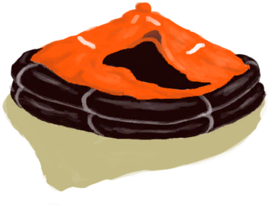
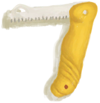

## Character Example  

<table style="margin-bottom:0px;"><tr><td rowspan=2 style="width:160px"></td><td style="font-size:1.8em"><b>Character Example</b></td><td style="width:50%">UnlockPrice：Free</td></tr><tr><td  colspan=2 style=""><i>Having trouble surviving? Try this character. ;)

In the full game you can create characters by choosing their perks

This custom character starts with a liferaft and a trunk full of supplies among many other things.</i></td><tr><td colspan=2><b>Environment：</b>[

[Beach](Beach.md)](Beach.md)<td colspan=1><b>Weather：</b>[

[Clear](TropicalIsland_ClearStart.md)](TropicalIsland_ClearStart.md)</tr></tr><tr><td colspan=3><b>Starting Status：</b>[

[Filth](Filth.md)](Filth.md)<b>-250</b> [

[Hydration ](Hydration.md)](Hydration.md)<b>+300</b> [

[Satiation](Satiation.md)](Satiation.md)<b>+35</b></tr><tr><td colspan=3><b>Perks：</b>

[Life Raft](Pk_1_LifeRaft.md)

[Super Survival Trunk 2000](Pk_2_SurvivalTrunk.md)

[Optimist](Pk_4_Optimist.md)

[Down To Earth](Pk_4_DownToEarth.md)

[Loner](Pk_4_Loner.md)

[Climber](Pk_5_Climber.md)

[Swimmer](Pk_5_Swimmer.md)

[Fisher](Pk_5_Fisher.md)

[Herbologist](Pk_5_Herbologist.md)

[Trapper](Pk_5_Trapper.md)

[Immunized](Pk_4_Immunized.md)

[Strong Immune System](Pk_4_ImmuneSystemStrong.md)

[Bug Resistant](Pk_4_BugResistant.md)

[Rough Sleeper](Pk_4_RoughSleeper.md)

[Bay](Pk_1_LocationBay.md)

  
  
</tr><tr><td colspan=3><b>Clothes：</b> 

  
  
</tr><tr><td colspan=3><b>Starting Cards：</b> 

<a href="LifeRaftDeflated.md" style="color:black">Deflated Life Raft</a>

<a href="ContainerBagA.md" style="color:black">Container Bag</a>

<a href="FirstAidKitLifeRaft.md" style="color:black">First Aid Kit</a>

<a href="AntiDiarrhoeaPills.md" style="color:black">Anti-Diarrhoea Pillsx4</a>

<a href="Painkillers.md" style="color:black">Painkillersx4</a>

<a href="Antibiotics.md" style="color:black">Antibioticsx4</a>

<a href="WoundDressing.md" style="color:black">Wound Dressingx8</a>

<a href="FoodRationsPackage.md" style="color:black">Food Rationsx3</a>

<a href="WaterRationsPackage.md" style="color:black">Water Rationsx3</a>

<a href="FishingLine.md" style="color:black">Fishing Linex3</a>

<a href="PlasticBottleFull.md" style="color:black">Plastic Bottlex7</a>

<a href="ContainerBagB.md" style="color:black">Container Bag</a>

<a href="SafetyKnife.md" style="color:black">Safety Knife</a>

<a href="SignalingMirror.md" style="color:black">Signaling Mirror</a>

<a href="FlareHand.md" style="color:black">Flarex8</a>

<a href="TrunkPerk.md" style="color:black">Super Survival Trunk 2000</a>

<a href="FirstAidKitTrunk.md" style="color:black">First Aid Kit</a>

<a href="WaterPurificationTablets.md" style="color:black">Water Purification Tabletsx3</a>

<a href="PlasticSheet.md" style="color:black">Plastic Sheetx2</a>

  
  
</tr><tr><td colspan=3><b>初始蓝图：</b> 

<a href="Bp_FishingLine.md" style="color:black">Fishing Line</a>

<a href="Bp_FishingRod.md" style="color:black">Fishing Rod</a>

<a href="Bp_FishBait.md" style="color:black">Fish Bait</a>

<a href="Bp_AloeGel.md" style="color:black">Aloe Gel</a>

<a href="Bp_BugRepellent.md" style="color:black">Bug Repellant</a>

<a href="Bp_CropPlot.md" style="color:black">Crop Plot</a>

<a href="Bp_PesticideChilli.md" style="color:black">Chilli Pesticide</a>

<a href="Bp_CompostBin.md" style="color:black">Compost Bin</a>

<a href="Bp_DeadfallTrap.md" style="color:black">Deadfall Trap</a>

<a href="Bp_SnareTrap.md" style="color:black">Snare Trap</a>

<a href="Bp_FishTrap.md" style="color:black">Fish Trap</a>

<a href="Bp_LogTrap.md" style="color:black">Log Trap</a>

<a href="Bp_CageTrap.md" style="color:black">Cage Trap</a>

<a href="Bp_TrappingPit.md" style="color:black">Trapping Pit</a>

  
  
</tr></table>
    
  
## 目标  

<b>PREPARATIONS</b>

<table style="margin-bottom:0px;"><tr><td rowSpan=3 style="width:50px;max-height:100px;text-align:center;vertical-align:top"></td><td colspan=2 >
<b>"Discover the island</b>
<i>Completing these <b>Optional</b> objectives raises your <b>Determination</b>.</i></td></tr><tr style=""></tr><tr style=""><td ><b>Reward：</b>[

[Stress](Stress.md)](Stress.md)<b>-48</b>&nbsp;&nbsp;&nbsp;&nbsp;[

[Determination](Determination.md)](Determination.md)<b>+100</b></td></tr><tr style="border-bottom:2px solid #CCC;height:1px;"></tr><tr><td rowSpan=3 style="width:50px;max-height:100px;text-align:center;vertical-align:top"></td><td colspan=2 >
<b>Exploration</b>
</td></tr><tr style=""><td>
<table style="margin-bottom:0px;"><tr><td rowSpan=3 style="width:50px;max-height:100px;text-align:center;vertical-align:top"></td><td colspan=2 >
<b>Explore the Island</b>
</td></tr><tr style=""></tr><tr style=""><td ><b>Reward：</b>[

[Stress](Stress.md)](Stress.md)<b>-48</b></td></tr><tr style="border-bottom:2px solid #CCC;height:1px;"></tr><tr><td rowSpan=3 style="width:50px;max-height:100px;text-align:center;vertical-align:top"></td><td colspan=2 >
<b>Beach</b>
</td></tr><tr style=""><td><b>Require：</b>[

[Area Explored(Event)(Beach)](Event_BeachExplored.md)](Event_BeachExplored.md)x1 </td></tr><tr style=""><td ><b>Reward：</b>[

[Stress](Stress.md)](Stress.md)<b>-48</b>&nbsp;&nbsp;&nbsp;&nbsp;[

[Determination](Determination.md)](Determination.md)<b>+100</b></td></tr><tr style="border-bottom:2px solid #CCC;height:1px;"></tr><tr><td rowSpan=3 style="width:50px;max-height:100px;text-align:center;vertical-align:top"></td><td colspan=2 >
<b>Rocks</b>
</td></tr><tr style=""><td><b>Require：</b>[

[Area Explored(Event)](Event_RocksExplored.md)](Event_RocksExplored.md)x1 </td></tr><tr style=""><td ><b>Reward：</b>[

[Stress](Stress.md)](Stress.md)<b>-48</b>&nbsp;&nbsp;&nbsp;&nbsp;[

[Determination](Determination.md)](Determination.md)<b>+100</b></td></tr><tr style="border-bottom:2px solid #CCC;height:1px;"></tr><tr><td rowSpan=3 style="width:50px;max-height:100px;text-align:center;vertical-align:top"></td><td colspan=2 >
<b>Outskirts</b>
</td></tr><tr style=""><td><b>Require：</b>[

[Area Explored(Event)](Event_OutskirtsExplored.md)](Event_OutskirtsExplored.md)x1 </td></tr><tr style=""><td ><b>Reward：</b>[

[Stress](Stress.md)](Stress.md)<b>-48</b>&nbsp;&nbsp;&nbsp;&nbsp;[

[Determination](Determination.md)](Determination.md)<b>+100</b></td></tr><tr style="border-bottom:2px solid #CCC;height:1px;"></tr><tr><td rowSpan=3 style="width:50px;max-height:100px;text-align:center;vertical-align:top"></td><td colspan=2 >
<b>Bay</b>
</td></tr><tr style=""><td><b>Require：</b>[

[Area Explored(Event)(Bay)](Event_BayExplored.md)](Event_BayExplored.md)x1 </td></tr><tr style=""><td ><b>Reward：</b>[

[Stress](Stress.md)](Stress.md)<b>-48</b>&nbsp;&nbsp;&nbsp;&nbsp;[

[Determination](Determination.md)](Determination.md)<b>+100</b></td></tr><tr style="border-bottom:2px solid #CCC;height:1px;"></tr><tr><td rowSpan=3 style="width:50px;max-height:100px;text-align:center;vertical-align:top"></td><td colspan=2 >
<b>Jungle</b>
</td></tr><tr style=""><td><b>Require：</b>[

[Area Explored(Event)](Event_JungleExplored.md)](Event_JungleExplored.md)x1 </td></tr><tr style=""><td ><b>Reward：</b>[

[Stress](Stress.md)](Stress.md)<b>-48</b>&nbsp;&nbsp;&nbsp;&nbsp;[

[Determination](Determination.md)](Determination.md)<b>+100</b></td></tr><tr style="border-bottom:2px solid #CCC;height:1px;"></tr><tr><td rowSpan=3 style="width:50px;max-height:100px;text-align:center;vertical-align:top"></td><td colspan=2 >
<b>Wetlands</b>
</td></tr><tr style=""><td><b>Require：</b>[

[Area Explored(Event)(Wetlands)](Event_WetlandsExplored.md)](Event_WetlandsExplored.md)x1 </td></tr><tr style=""><td ><b>Reward：</b>[

[Stress](Stress.md)](Stress.md)<b>-48</b>&nbsp;&nbsp;&nbsp;&nbsp;[

[Determination](Determination.md)](Determination.md)<b>+100</b></td></tr><tr style="border-bottom:2px solid #CCC;height:1px;"></tr><tr><td rowSpan=3 style="width:50px;max-height:100px;text-align:center;vertical-align:top"></td><td colspan=2 >
<b>Mangroves</b>
</td></tr><tr style=""><td><b>Require：</b>[

[Area Explored(Event)(Mangrove Forest)](Event_MangrovesExplored.md)](Event_MangrovesExplored.md)x1 </td></tr><tr style=""><td ><b>Reward：</b>[

[Stress](Stress.md)](Stress.md)<b>-48</b>&nbsp;&nbsp;&nbsp;&nbsp;[

[Determination](Determination.md)](Determination.md)<b>+100</b></td></tr><tr style="border-bottom:2px solid #CCC;height:1px;"></tr><tr><td rowSpan=3 style="width:50px;max-height:100px;text-align:center;vertical-align:top"></td><td colspan=2 >
<b>Western Grasslands</b>
</td></tr><tr style=""><td><b>Require：</b>[

[Area Explored(Event)(Western Grasslands)](Event_GrasslandsWExplored.md)](Event_GrasslandsWExplored.md)x1 </td></tr><tr style=""><td ><b>Reward：</b>[

[Stress](Stress.md)](Stress.md)<b>-48</b>&nbsp;&nbsp;&nbsp;&nbsp;[

[Determination](Determination.md)](Determination.md)<b>+100</b></td></tr><tr style="border-bottom:2px solid #CCC;height:1px;"></tr><tr><td rowSpan=3 style="width:50px;max-height:100px;text-align:center;vertical-align:top"></td><td colspan=2 >
<b>Western Highlands</b>
</td></tr><tr style=""><td><b>Require：</b>[

[Area Explored(Event)(Western Highlands)](Event_HighlandsWExplored.md)](Event_HighlandsWExplored.md)x1 </td></tr><tr style=""><td ><b>Reward：</b>[

[Stress](Stress.md)](Stress.md)<b>-48</b>&nbsp;&nbsp;&nbsp;&nbsp;[

[Determination](Determination.md)](Determination.md)<b>+100</b></td></tr><tr style="border-bottom:2px solid #CCC;height:1px;"></tr></table>
  </td></tr><tr style=""><td ><b>Reward：</b>[

[Stress](Stress.md)](Stress.md)<b>-48</b></td></tr><tr style="border-bottom:2px solid #CCC;height:1px;"></tr><tr><td rowSpan=3 style="width:50px;max-height:100px;text-align:center;vertical-align:top"></td><td colspan=2 >
<b>Skills</b>
</td></tr><tr style=""><td>
<table style="margin-bottom:0px;"><tr><td rowSpan=3 style="width:50px;max-height:100px;text-align:center;vertical-align:top"></td><td colspan=2 >
<b>Master your skills</b>
<i>So you can secure your survival.</i></td></tr><tr style=""></tr><tr style=""><td ><b>Reward：</b>[

[Stress](Stress.md)](Stress.md)<b>-48</b>&nbsp;&nbsp;&nbsp;&nbsp;[

[Determination](Determination.md)](Determination.md)<b>+100</b></td></tr><tr style="border-bottom:2px solid #CCC;height:1px;"></tr><tr><td rowSpan=3 style="width:50px;max-height:100px;text-align:center;vertical-align:top"></td><td colspan=2 >
<b>Hunting</b>
</td></tr><tr style=""></tr><tr style=""><td ><b>Reward：</b>[

[Stress](Stress.md)](Stress.md)<b>-48</b></td></tr><tr style="border-bottom:2px solid #CCC;height:1px;"></tr><tr><td rowSpan=3 style="width:50px;max-height:100px;text-align:center;vertical-align:top"></td><td colspan=2 >
<b>Fishing</b>
</td></tr><tr style=""></tr><tr style=""><td ><b>Reward：</b>[

[Stress](Stress.md)](Stress.md)<b>-48</b></td></tr><tr style="border-bottom:2px solid #CCC;height:1px;"></tr><tr><td rowSpan=3 style="width:50px;max-height:100px;text-align:center;vertical-align:top"></td><td colspan=2 >
<b>Cooking</b>
</td></tr><tr style=""><td><b>Require：</b>[

[Cooking(Skill)](Skill_Cooking.md)](Skill_Cooking.md): <b>150</b> </td></tr><tr style=""><td ><b>Reward：</b>[

[Stress](Stress.md)](Stress.md)<b>-48</b>&nbsp;&nbsp;&nbsp;&nbsp;[

[Determination](Determination.md)](Determination.md)<b>+250</b></td></tr><tr style="border-bottom:2px solid #CCC;height:1px;"></tr><tr><td rowSpan=3 style="width:50px;max-height:100px;text-align:center;vertical-align:top"></td><td colspan=2 >
<b>Crafting</b>
</td></tr><tr style=""><td><b>Require：</b>[

[Crafting(Skill)](Skill_Crafting.md)](Skill_Crafting.md): <b>150</b> </td></tr><tr style=""><td ><b>Reward：</b>[

[Stress](Stress.md)](Stress.md)<b>-48</b>&nbsp;&nbsp;&nbsp;&nbsp;[

[Determination](Determination.md)](Determination.md)<b>+250</b></td></tr><tr style="border-bottom:2px solid #CCC;height:1px;"></tr><tr><td rowSpan=3 style="width:50px;max-height:100px;text-align:center;vertical-align:top"></td><td colspan=2 >
<b>Tailoring</b>
</td></tr><tr style=""><td><b>Require：</b>[

[Tailoring(Skill)](Skill_Tailoring.md)](Skill_Tailoring.md): <b>150</b> </td></tr><tr style=""><td ><b>Reward：</b>[

[Stress](Stress.md)](Stress.md)<b>-48</b>&nbsp;&nbsp;&nbsp;&nbsp;[

[Determination](Determination.md)](Determination.md)<b>+250</b></td></tr><tr style="border-bottom:2px solid #CCC;height:1px;"></tr><tr><td rowSpan=3 style="width:50px;max-height:100px;text-align:center;vertical-align:top"></td><td colspan=2 >
<b>Woodworking</b>
</td></tr><tr style=""><td><b>Require：</b>[

[Woodworking(Skill)](Skill_Woodworking.md)](Skill_Woodworking.md): <b>150</b> </td></tr><tr style=""><td ><b>Reward：</b>[

[Stress](Stress.md)](Stress.md)<b>-48</b>&nbsp;&nbsp;&nbsp;&nbsp;[

[Determination](Determination.md)](Determination.md)<b>+250</b></td></tr><tr style="border-bottom:2px solid #CCC;height:1px;"></tr><tr><td rowSpan=3 style="width:50px;max-height:100px;text-align:center;vertical-align:top"></td><td colspan=2 >
<b>Herbology</b>
</td></tr><tr style=""><td><b>Require：</b>[

[Herbology(Skill)](Skill_Herbology.md)](Skill_Herbology.md): <b>150</b> </td></tr><tr style=""><td ><b>Reward：</b>[

[Stress](Stress.md)](Stress.md)<b>-48</b>&nbsp;&nbsp;&nbsp;&nbsp;[

[Determination](Determination.md)](Determination.md)<b>+250</b></td></tr><tr style="border-bottom:2px solid #CCC;height:1px;"></tr><tr><td rowSpan=3 style="width:50px;max-height:100px;text-align:center;vertical-align:top"></td><td colspan=2 >
<b>Climbing</b>
</td></tr><tr style=""><td><b>Require：</b>[

[Climbing(Skill)](Skill_Climbing.md)](Skill_Climbing.md): <b>150</b> </td></tr><tr style=""><td ><b>Reward：</b>[

[Stress](Stress.md)](Stress.md)<b>-48</b>&nbsp;&nbsp;&nbsp;&nbsp;[

[Determination](Determination.md)](Determination.md)<b>+250</b></td></tr><tr style="border-bottom:2px solid #CCC;height:1px;"></tr><tr><td rowSpan=3 style="width:50px;max-height:100px;text-align:center;vertical-align:top"></td><td colspan=2 >
<b>Swimming</b>
</td></tr><tr style=""><td><b>Require：</b>[

[Swimming(Skill)](Skill_Swimming.md)](Skill_Swimming.md): <b>150</b> </td></tr><tr style=""><td ><b>Reward：</b>[

[Stress](Stress.md)](Stress.md)<b>-48</b>&nbsp;&nbsp;&nbsp;&nbsp;[

[Determination](Determination.md)](Determination.md)<b>+250</b></td></tr><tr style="border-bottom:2px solid #CCC;height:1px;"></tr></table>
  </td></tr><tr style=""><td ><b>Reward：</b>[

[Stress](Stress.md)](Stress.md)<b>-48</b>&nbsp;&nbsp;&nbsp;&nbsp;[

[Determination](Determination.md)](Determination.md)<b>+100</b></td></tr><tr style="border-bottom:2px solid #CCC;height:1px;"></tr></table>
 
<b>FACING DESTINY</b>

<table style="margin-bottom:0px;"><tr><td rowSpan=3 style="width:50px;max-height:100px;text-align:center;vertical-align:top"></td><td colspan=2 >
<b>Summon the Determination to choose your Path</b>
<i>Determination increases over <b>Time</b> and when completing <b>Objectives</b>.</i></td></tr><tr style=""><td><b>Require：</b>[

[Determination](Determination.md)](Determination.md): <b>4000</b> </td></tr><tr style="border-bottom:2px solid #CCC;height:1px;"></tr><tr><td rowSpan=3 style="width:50px;max-height:100px;text-align:center;vertical-align:top"></td><td colspan=2 >
<b>Escape from the Island</b>
</td></tr><tr style=""><td>
<table style="margin-bottom:0px;"><tr><td rowSpan=3 style="width:50px;max-height:100px;text-align:center;vertical-align:top"></td><td colspan=2 >
<b>Build a Raft</b>
<i>To escape the island and get back to civilization.</i></td></tr><tr style=""><td><b>Require：</b>[

[Raft](RaftEntrance.md)](RaftEntrance.md)x1 </td></tr><tr style="border-bottom:2px solid #CCC;height:1px;"></tr><tr><td rowSpan=3 style="width:50px;max-height:100px;text-align:center;vertical-align:top"></td><td colspan=2 >
<b>Return to Civilization</b>
<i>To finish this adventure.</i></td></tr><tr style=""><td><b>Require：</b>[

[Distance](Distance.md)](Distance.md): <b>2016</b> </td></tr><tr style="border-bottom:2px solid #CCC;height:1px;"></tr></table>
  </td></tr><tr style="border-bottom:2px solid #CCC;height:1px;"></tr><tr><td rowSpan=3 style="width:50px;max-height:100px;text-align:center;vertical-align:top"></td><td colspan=2 >
<b>Make the Island your Home</b>
</td></tr><tr style=""><td>
<table style="margin-bottom:0px;"><tr><td rowSpan=3 style="width:50px;max-height:100px;text-align:center;vertical-align:top"></td><td colspan=2 >
<b>Survive in the Island for 120 days</b>
<i>to become familiar with it.</i></td></tr><tr style=""><td><b>Require：</b>[Counter](Counter.md): <b>11520～999999</b> </td></tr><tr style="border-bottom:2px solid #CCC;height:1px;"></tr><tr><td rowSpan=3 style="width:50px;max-height:100px;text-align:center;vertical-align:top"></td><td colspan=2 >
<b>Reach Maximum Comfort</b>
<i>To turn your house into your home.</i></td></tr><tr style=""><td><b>Require：</b>[

[Comfort](Comfort.md)](Comfort.md): <b>1751～2500</b> </td></tr><tr style="border-bottom:2px solid #CCC;height:1px;"></tr></table>
  </td></tr><tr style="border-bottom:2px solid #CCC;height:1px;"></tr></table>
   

