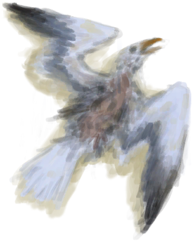

# Desolate Beach  
> A barren and desolate shore near the volcanic part of the island.  
  

<a href="DesolateBeach.md" style="color:black">Desolate Beach</a>

<a href="CaveTidal.md" style="color:black">Tidal Cave</a>

<a href="BirdRock.md" style="color:black">Bird Rock</a>

<a href="GrasslandsE.md" style="color:black">Eastern Grasslands</a>

<a href="Mangroves.md" style="color:black">Mangrove Forest</a>

<a href="Volcano.md" style="color:black">Volcano</a>

<a href="Sea_DesolateBeach.md" style="color:black">Sea</a>

<a href="SandSource.md" style="color:black">Sand</a>

  
  
<table class="table table-bordered" data-toggle="table"  data-show-header="false"><thead style="display:none"><tr ><th  style="width:50%;text-align:left;vertical-align:top;"  >title</th><th  style="width:50%;text-align:left;vertical-align:top;"  ></th></tr></thead><tr ><td  style="width:50%;text-align:left;vertical-align:top;"  >** Unique On Board **  **Environment：**[Desolate Beach(Environment)](Env_DesolateBeach.md)  ** EnvironmentEffect: ** [

[Temperature](TemperaturePerceived.md)](TemperaturePerceived.md)<b>-5</b> [

[Land Sickness](LandSickness.md)](LandSickness.md)addition<b>-8</b></td><td  style="width:50%;text-align:left;vertical-align:top;"  >"A desolate shore on the eastern side. It has access to the <b>Mangroves</td></tr></tbody></table>  
  
## Exploration  
<table class="table table-bordered" data-toggle="table"  ><thead style=""><tr ><th  style="text-align:left;vertical-align:top;"  >Progress</th><th  style="text-align:left;vertical-align:top;"  >Target</th></tr></thead><tr ><td  style="text-align:left;vertical-align:top;"  >15%</td><td  style="text-align:left;vertical-align:top;"  >[Tide Pool(Rocks)](TidePool.md)</td></tr><tr ><td  style="text-align:left;vertical-align:top;"  >15%</td><td  style="text-align:left;vertical-align:top;"  >[Flooded Tide Pool(Rocks)](TidePoolFlooded.md)</td></tr><tr ><td  style="text-align:left;vertical-align:top;"  >30%</td><td  style="text-align:left;vertical-align:top;"  >[To Eastern Grasslands(Desolate Beach)](Path_DesolateBeachToGrasslandsE.md)</td></tr><tr ><td  style="text-align:left;vertical-align:top;"  >45%</td><td  style="text-align:left;vertical-align:top;"  >[To Volcano(Desolate Beach)](Path_DesolateBeachToVolcano.md)</td></tr><tr ><td  style="text-align:left;vertical-align:top;"  >60%</td><td  style="text-align:left;vertical-align:top;"  >[Tidal Cave(Desolate Beach)](CaveTidalEntrance.md)</td></tr><tr ><td  style="text-align:left;vertical-align:top;"  >75%</td><td  style="text-align:left;vertical-align:top;"  >[To Mangrove Forest(Desolate Beach)](Path_DesolateBeachToMangroves.md)</td></tr><tr ><td  style="text-align:left;vertical-align:top;"  >90%</td><td  style="text-align:left;vertical-align:top;"  >[Bird Rock(Desolate Beach)](Path_DesolateBeachToBirdRock.md)</td></tr><tr ><td  style="text-align:left;vertical-align:top;"  >100%</td><td  style="text-align:left;vertical-align:top;"  >[Area Explored(Event)(Desolate Beach)](Event_DesolateBeachExplored.md)</td></tr></tbody></table>  
  
## Action  

<table><tr><td rowspan="2" style="width:200px;text-align:center;font-size:1.3em;font-weight:bold">

Explore

15m

</td><td>[“LegAction(Group)”](LegAction.md), [“SlipperyAction(Group)”](SlipperyAction.md)</td></tr><tr><td></td></tr><tr><td colspan="2"><b>Require：</b>[

[Light](Light.md)](Light.md): <b>10-100</b></td></tr><tr><td colspan="2"><b>StatChange：</b>[

[Foot Damage](FootDamage.md)](FootDamage.md)<b>+20</b>, [

[Stamina](Stamina.md)](Stamina.md)<b>-4</b>, [

[Stress](Stress.md)](Stress.md)<b>-10</b>, [Exploration Rocks](Exploration_Rocks.md)<b>+1</b>, [TV Rocks - Explore](TV_RocksExplore.md)<b>+1</b></td></tr><tr><td colspan="2">

<table style="margin-bottom:3px;"><tr><td rowspan=2 style="text-align:center" width="80px">
Base Weight

500
</td><td style="font-size:0.6em;line-height:0.6em;font-weight:bold">Cocon First❗1 limit</td></tr><tr><td>[

[Husked Coconut](CoconutHusked.md)](CoconutHusked.md)(<b>+1</b>)</td></tr></table>

<table style="margin-bottom:3px;"><tr><td rowspan=2 style="text-align:center" width="80px">
Base Weight

100
</td><td style="font-size:0.6em;line-height:0.6em;font-weight:bold">Coconut</td></tr><tr><td>[

[Husked Coconut](CoconutHusked.md)](CoconutHusked.md)(<b>+1</b>)</td></tr></table>

<table style="margin-bottom:3px;"><tr><td rowspan=2 style="text-align:center" width="80px">
Base Weight

100
</td><td style="font-size:0.6em;line-height:0.6em;font-weight:bold">Flint</td></tr><tr><td>[

[Flint](Flint.md)](Flint.md)(<b>+1</b>)</td></tr></table>

<table style="margin-bottom:3px;"><tr><td rowspan=2 style="text-align:center" width="80px">
Base Weight

50
</td><td style="font-size:0.6em;line-height:0.6em;font-weight:bold">Flint Slab</td></tr><tr><td>[

[Flint Slab](FlintSlab.md)](FlintSlab.md)(<b>+1</b>)</td></tr></table>

<table style="margin-bottom:3px;"><tr><td rowspan=2 style="text-align:center" width="80px">
Base Weight

50
</td><td style="font-size:0.6em;line-height:0.6em;font-weight:bold">Obsidian</td></tr><tr><td>[

[Obsidian](Obsidian.md)](Obsidian.md)(<b>+1</b>)</td></tr></table>

<table style="margin-bottom:3px;"><tr><td rowspan=2 style="text-align:center" width="80px">
Base Weight

75
</td><td style="font-size:0.6em;line-height:0.6em;font-weight:bold">Brimstone Stone❗12 limit</td></tr><tr><td>[

[Sulphurous Stone](StoneHeavyBrimstone.md)](StoneHeavyBrimstone.md)(<b>+1</b>)</td></tr></table>

<table style="margin-bottom:3px;"><tr><td rowspan=2 style="text-align:center" width="80px">
Base Weight

400
</td><td style="font-size:0.6em;line-height:0.6em;font-weight:bold">Pretty Seashells</td></tr><tr><td>[

[Pretty Seashells](SeashellsPretty.md)](SeashellsPretty.md)(<b>+1</b>)</td></tr></table>

<table style="margin-bottom:3px;"><tr><td rowspan=2 style="text-align:center" width="80px">
Base Weight

1500
</td><td style="font-size:0.6em;line-height:0.6em;font-weight:bold">Stone</td></tr><tr><td>[

[Stone](Stone.md)](Stone.md)(<b>+1</b>)</td></tr></table>

<table style="margin-bottom:3px;"><tr><td rowspan=2 style="text-align:center" width="80px">
Base Weight

1000
</td><td style="font-size:0.6em;line-height:0.6em;font-weight:bold">Sticks First❗1 limit</td></tr><tr><td>[

[Sticks](Sticks.md)](Sticks.md)(<b>+1</b>)</td></tr></table>

<table style="margin-bottom:3px;"><tr><td rowspan=2 style="text-align:center" width="80px">
Base Weight

300
</td><td style="font-size:0.6em;line-height:0.6em;font-weight:bold">Sticks</td></tr><tr><td>[

[Sticks](Sticks.md)](Sticks.md)(<b>+1</b>)</td></tr></table>

<table style="margin-bottom:3px;"><tr><td rowspan=2 style="text-align:center" width="80px">
Base Weight

750
</td><td style="font-size:0.6em;line-height:0.6em;font-weight:bold">Wood First❗1 limit</td></tr><tr><td>[

[Wood](Wood.md)](Wood.md)(<b>+1</b>)</td></tr></table>

<table style="margin-bottom:3px;"><tr><td rowspan=2 style="text-align:center" width="80px">
Base Weight

200
</td><td style="font-size:0.6em;line-height:0.6em;font-weight:bold">Wood</td></tr><tr><td>[

[Wood](Wood.md)](Wood.md)(<b>+1</b>)</td></tr></table>

<table style="margin-bottom:3px;"><tr><td rowspan=2 style="text-align:center" width="80px">
Base Weight

0
</td><td style="font-size:0.6em;line-height:0.6em;font-weight:bold">Aloe Vera</td></tr><tr><td>[

[Aloe Vera](AloeVera.md)](AloeVera.md)(<b>+1</b>)[Beach Aloe Vera](AloeVera_BeachPop.md)<b>-1000</b></td></tr><tr><td colspan=2><li>[

[Herbology(Skill)](Skill_Herbology.md)](Skill_Herbology.md) in <b>0～150</b>, weight<b>-25～+0</b></li><li>[Beach Aloe Vera](AloeVera_BeachPop.md) in <b>1000～4000</b>, weight<b>+50～+100</b></li></td></tr></table>

<table style="margin-bottom:3px;"><tr><td rowspan=2 style="text-align:center" width="80px">
Base Weight

0
</td><td style="font-size:0.6em;line-height:0.6em;font-weight:bold">Gastric Pellet</td></tr><tr><td>[

[Gastric Pellet](GastricPellet.md)](GastricPellet.md)(<b>+1</b>)</td></tr><tr><td colspan=2><li>[Population Monitors](Pop_Monitor.md) in <b>1000～14000</b>, weight<b>+25～+100</b>，否则权重-1000000</li></td></tr></table>

<table style="margin-bottom:3px;"><tr><td rowspan=2 style="text-align:center" width="80px">
Base Weight

0
</td><td style="font-size:0.6em;line-height:0.6em;font-weight:bold">Supply Crate</td></tr><tr><td>[

[Supply Capsule](TV_SupplyCapsule.md)](TV_SupplyCapsule.md)(<b>+1</b>)</td></tr><tr><td colspan=2><li>[

[TV Rocks](TV_Rocks.md)](TV_Rocks.md) in <b>1</b>, weight<b>+200</b></li><li>[TV Rocks - Explore](TV_RocksExplore.md) in <b>0～9</b>, weight<b>-999</b></li></td></tr></table>

<table style="margin-bottom:3px;"><tr><td rowspan=2 style="text-align:center" width="80px">
Base Weight

750
</td><td style="font-size:0.6em;line-height:0.6em;font-weight:bold">Heavy Stone</td></tr><tr><td>[

[Heavy Stone](StoneHeavy.md)](StoneHeavy.md)(<b>+1</b>)</td></tr></table>

<table style="margin-bottom:3px;"><tr><td rowspan=2 style="text-align:center" width="80px">
Base Weight

0
</td><td style="font-size:0.6em;line-height:0.6em;font-weight:bold">Crab</td></tr><tr><td>[

[Crab](Crab.md)](Crab.md)(<b>+1</b>)[Population Crab](Pop_Crab.md)<b>-1000</b></td></tr><tr><td colspan=2><li>[Population Crab](Pop_Crab.md) in <b>1000～60000</b>, weight<b>+100～+1200</b></li></td></tr></table>

<table style="margin-bottom:3px;"><tr><td rowspan=2 style="text-align:center" width="80px">
Base Weight

0
</td><td style="font-size:0.6em;line-height:0.6em;font-weight:bold">Seagull Carcass</td></tr><tr><td>[

[Seagull Carcass](SeagullCarcass.md)](SeagullCarcass.md)(<b>+1</b>)[Population Seagulls](Pop_Seagull.md)<b>-1000</b></td></tr><tr><td colspan=2><li>[Population Seagulls](Pop_Seagull.md) in <b>1000～45000</b>, weight<b>+0～+100</b></li></td></tr></table>

<table style="margin-bottom:3px;"><tr><td rowspan=2 style="text-align:center" width="80px">
Base Weight

0
</td><td style="font-size:0.6em;line-height:0.6em;font-weight:bold">Seagull Spotted</td></tr><tr><td>[

[A seagull!(Event)](Event_SeagullFight.md)](Event_SeagullFight.md)(<b>+1</b>)</td></tr><tr><td colspan=2><li>[Population Seagulls](Pop_Seagull.md) in <b>1000～45000</b>, weight<b>+0～+100</b></li><li>[

[Eyesight](Myopia.md)](Myopia.md) in <b>1～3</b>, weight<b>-100～-200</b></li></td></tr></table>

<table style="margin-bottom:3px;"><tr><td rowspan=2 style="text-align:center" width="80px">
Base Weight

0
</td><td style="font-size:0.6em;line-height:0.6em;font-weight:bold">Drone Encounter</td></tr><tr><td>[

[Attack Drone!(Event)](Event_DroneFight.md)](Event_DroneFight.md)(<b>+1</b>)</td></tr><tr><td colspan=2><li>[Island Drones](Pop_Drone.md) in <b>1000～4000</b>, weight<b>+25～+100</b></li><li>[

[Eyesight](Myopia.md)](Myopia.md) in <b>1～3</b>, weight<b>+0</b></li><li>[“Fight Event”](tag_FightEvent.md) On *Hand/Board*，Weight<b>-999999</b>(Stackable),</li></td></tr></table>

<table style="margin-bottom:3px;"><tr><td rowspan=2 style="text-align:center" width="80px">
Base Weight

0
</td><td style="font-size:0.6em;line-height:0.6em;font-weight:bold">Monitor Encounter</td></tr><tr><td>[

[A Monitor Lizard!(Event)(Cave)](Event_MonitorFight.md)](Event_MonitorFight.md)(<b>+1</b>)</td></tr><tr><td colspan=2><li>[First Month Counter](FirstMonthCounter.md) in <b>0～672</b>, weight<b>-1000</b></li><li>[Population Monitors](Pop_Monitor.md) in <b>1000～14000</b>, weight<b>+10～+50</b></li><li>[

[Eyesight](Myopia.md)](Myopia.md) in <b>1～3</b>, weight<b>+0</b></li><li>[“Fight Event”](tag_FightEvent.md) On *Hand/Board*，Weight<b>-999999</b>(Stackable),</li></td></tr></table>
<button class="btn btn-secondary btn-sm" style="" data-toggle="modal" onclick="setCollectionDataBase64('eyJ0aXRsZSI6IlNpbXVsYXRvcjogRXhwbG9yZSAoRGVzb2xhdGUgQmVhY2gpIiwiY29sbGVjdGlvbnMiOlt7ImRyb3AiOiI8ZGl2IHN0eWxlPVwid2lkdGg6MjVweDtkaXNwbGF5OmlubGluZS1ibG9jazt0ZXh0LWFsaWduOmNlbnRlclwiPjxpbWcgZGVjb2Rpbmc9XCJhc3luY1wiIHNyYz1cIlNwcml0ZS9Db2NvbnV0SHVza2VkLnBuZ1wiIGhyZWY9XCJhLm1kXCIgc3R5bGU9XCJtYXgtd2lkdGg6MjVweDttYXgtaGVpZ2h0OjI1cHg7XCI+PC9kaXY+SHVza2VkIENvY29udXQiLCJiYXNlIjoxMDAsImNvbmRpdGlvbiI6W119LHsiZHJvcCI6IjxkaXYgc3R5bGU9XCJ3aWR0aDoyNXB4O2Rpc3BsYXk6aW5saW5lLWJsb2NrO3RleHQtYWxpZ246Y2VudGVyXCI+PGltZyBkZWNvZGluZz1cImFzeW5jXCIgc3JjPVwiU3ByaXRlL0ZsaW50LnBuZ1wiIGhyZWY9XCJhLm1kXCIgc3R5bGU9XCJtYXgtd2lkdGg6MjVweDttYXgtaGVpZ2h0OjI1cHg7XCI+PC9kaXY+RmxpbnQiLCJiYXNlIjoxMDAsImNvbmRpdGlvbiI6W119LHsiZHJvcCI6IjxkaXYgc3R5bGU9XCJ3aWR0aDoyNXB4O2Rpc3BsYXk6aW5saW5lLWJsb2NrO3RleHQtYWxpZ246Y2VudGVyXCI+PGltZyBkZWNvZGluZz1cImFzeW5jXCIgc3JjPVwiU3ByaXRlL0ZsaW50TGFyZ2UucG5nXCIgaHJlZj1cImEubWRcIiBzdHlsZT1cIm1heC13aWR0aDoyNXB4O21heC1oZWlnaHQ6MjVweDtcIj48L2Rpdj5GbGludCBTbGFiIiwiYmFzZSI6NTAsImNvbmRpdGlvbiI6W119LHsiZHJvcCI6IjxkaXYgc3R5bGU9XCJ3aWR0aDoyNXB4O2Rpc3BsYXk6aW5saW5lLWJsb2NrO3RleHQtYWxpZ246Y2VudGVyXCI+PGltZyBkZWNvZGluZz1cImFzeW5jXCIgc3JjPVwiU3ByaXRlL09ic2lkaWFuLnBuZ1wiIGhyZWY9XCJhLm1kXCIgc3R5bGU9XCJtYXgtd2lkdGg6MjVweDttYXgtaGVpZ2h0OjI1cHg7XCI+PC9kaXY+T2JzaWRpYW4iLCJiYXNlIjo1MCwiY29uZGl0aW9uIjpbXX0seyJkcm9wIjoiPGRpdiBzdHlsZT1cIndpZHRoOjI1cHg7ZGlzcGxheTppbmxpbmUtYmxvY2s7dGV4dC1hbGlnbjpjZW50ZXJcIj48aW1nIGRlY29kaW5nPVwiYXN5bmNcIiBzcmM9XCJTcHJpdGUvUHJldHR5U2Vhc2hlbGxzLnBuZ1wiIGhyZWY9XCJhLm1kXCIgc3R5bGU9XCJtYXgtd2lkdGg6MjVweDttYXgtaGVpZ2h0OjI1cHg7XCI+PC9kaXY+UHJldHR5IFNlYXNoZWxscyIsImJhc2UiOjQwMCwiY29uZGl0aW9uIjpbXX0seyJkcm9wIjoiPGRpdiBzdHlsZT1cIndpZHRoOjI1cHg7ZGlzcGxheTppbmxpbmUtYmxvY2s7dGV4dC1hbGlnbjpjZW50ZXJcIj48aW1nIGRlY29kaW5nPVwiYXN5bmNcIiBzcmM9XCJTcHJpdGUvU3RvbmUucG5nXCIgaHJlZj1cImEubWRcIiBzdHlsZT1cIm1heC13aWR0aDoyNXB4O21heC1oZWlnaHQ6MjVweDtcIj48L2Rpdj5TdG9uZSIsImJhc2UiOjE1MDAsImNvbmRpdGlvbiI6W119LHsiZHJvcCI6IjxkaXYgc3R5bGU9XCJ3aWR0aDoyNXB4O2Rpc3BsYXk6aW5saW5lLWJsb2NrO3RleHQtYWxpZ246Y2VudGVyXCI+PGltZyBkZWNvZGluZz1cImFzeW5jXCIgc3JjPVwiU3ByaXRlL0tpbmRsaW5nLnBuZ1wiIGhyZWY9XCJhLm1kXCIgc3R5bGU9XCJtYXgtd2lkdGg6MjVweDttYXgtaGVpZ2h0OjI1cHg7XCI+PC9kaXY+U3RpY2tzIiwiYmFzZSI6MzAwLCJjb25kaXRpb24iOltdfSx7ImRyb3AiOiI8ZGl2IHN0eWxlPVwid2lkdGg6MjVweDtkaXNwbGF5OmlubGluZS1ibG9jazt0ZXh0LWFsaWduOmNlbnRlclwiPjxpbWcgZGVjb2Rpbmc9XCJhc3luY1wiIHNyYz1cIlNwcml0ZS9GaXJld29vZC5wbmdcIiBocmVmPVwiYS5tZFwiIHN0eWxlPVwibWF4LXdpZHRoOjI1cHg7bWF4LWhlaWdodDoyNXB4O1wiPjwvZGl2Pldvb2QiLCJiYXNlIjoyMDAsImNvbmRpdGlvbiI6W119LHsiZHJvcCI6IjxkaXYgc3R5bGU9XCJ3aWR0aDoyNXB4O2Rpc3BsYXk6aW5saW5lLWJsb2NrO3RleHQtYWxpZ246Y2VudGVyXCI+PGltZyBkZWNvZGluZz1cImFzeW5jXCIgc3JjPVwiU3ByaXRlL0Fsb2VWZXJhLnBuZ1wiIGhyZWY9XCJhLm1kXCIgc3R5bGU9XCJtYXgtd2lkdGg6MjVweDttYXgtaGVpZ2h0OjI1cHg7XCI+PC9kaXY+QWxvZSBWZXJhIiwiYmFzZSI6MCwiY29uZGl0aW9uIjpbeyJrZXkiOiJTa2lsbF9IZXJib2xvZ3kiLCJ0aXRsZSI6IkhlcmJvbG9neShTa2lsbCkiLCJ0eXBlIjoicmFuZ2UiLCJtYXgiOlswLDE1MF0sInJhbmdlIjpbMCwxNTBdLCJ3ZWlnaHQiOlstMjUsMF0sImRlZmF1bHRWYWx1ZSI6MCwid2hlbk91dE9mUmFuZ2UiOjB9LHsia2V5IjoiQWxvZVZlcmFfQmVhY2hQb3AiLCJ0aXRsZSI6IkJlYWNoIEFsb2UgVmVyYSIsInR5cGUiOiJyYW5nZSIsIm1heCI6WzAsNDAwMF0sInJhbmdlIjpbMTAwMCw0MDAwXSwid2VpZ2h0IjpbNTAsMTAwXSwiZGVmYXVsdFZhbHVlIjo0MDAwLCJ3aGVuT3V0T2ZSYW5nZSI6MH1dfSx7ImRyb3AiOiI8ZGl2IHN0eWxlPVwid2lkdGg6MjVweDtkaXNwbGF5OmlubGluZS1ibG9jazt0ZXh0LWFsaWduOmNlbnRlclwiPjxpbWcgZGVjb2Rpbmc9XCJhc3luY1wiIHNyYz1cIlNwcml0ZS9HYXN0cmljUGVsbGV0LnBuZ1wiIGhyZWY9XCJhLm1kXCIgc3R5bGU9XCJtYXgtd2lkdGg6MjVweDttYXgtaGVpZ2h0OjI1cHg7XCI+PC9kaXY+R2FzdHJpYyBQZWxsZXQiLCJiYXNlIjowLCJjb25kaXRpb24iOlt7ImtleSI6IlBvcF9Nb25pdG9yIiwidGl0bGUiOiJQb3B1bGF0aW9uIE1vbml0b3JzIiwidHlwZSI6InJhbmdlIiwibWF4IjpbMCwxNDAwMF0sInJhbmdlIjpbMTAwMCwxNDAwMF0sIndlaWdodCI6WzI1LDEwMF0sImRlZmF1bHRWYWx1ZSI6MTQwMDAsIndoZW5PdXRPZlJhbmdlIjoyfV19LHsiZHJvcCI6IjxkaXYgc3R5bGU9XCJ3aWR0aDoyNXB4O2Rpc3BsYXk6aW5saW5lLWJsb2NrO3RleHQtYWxpZ246Y2VudGVyXCI+PGltZyBkZWNvZGluZz1cImFzeW5jXCIgc3JjPVwiU3ByaXRlL1RWQ3JhdGUucG5nXCIgaHJlZj1cImEubWRcIiBzdHlsZT1cIm1heC13aWR0aDoyNXB4O21heC1oZWlnaHQ6MjVweDtcIj48L2Rpdj5TdXBwbHkgQ2Fwc3VsZSIsImJhc2UiOjAsImNvbmRpdGlvbiI6W3sia2V5IjoiVFZfUm9ja3MiLCJ0aXRsZSI6IlRWIFJvY2tzIiwidHlwZSI6InJhbmdlIiwibWF4IjpbMCwxXSwicmFuZ2UiOlsxLDFdLCJ3ZWlnaHQiOlsyMDAsMjAwXSwiZGVmYXVsdFZhbHVlIjowLCJ3aGVuT3V0T2ZSYW5nZSI6MH0seyJrZXkiOiJUVl9Sb2Nrc0V4cGxvcmUiLCJ0aXRsZSI6IlRWIFJvY2tzIC0gRXhwbG9yZSIsInR5cGUiOiJyYW5nZSIsIm1heCI6WzAsMjBdLCJyYW5nZSI6WzAsOV0sIndlaWdodCI6Wy05OTksLTk5OV0sImRlZmF1bHRWYWx1ZSI6MCwid2hlbk91dE9mUmFuZ2UiOjB9XX0seyJkcm9wIjoiPGRpdiBzdHlsZT1cIndpZHRoOjI1cHg7ZGlzcGxheTppbmxpbmUtYmxvY2s7dGV4dC1hbGlnbjpjZW50ZXJcIj48aW1nIGRlY29kaW5nPVwiYXN5bmNcIiBzcmM9XCJTcHJpdGUvU2FuZHN0b25lLnBuZ1wiIGhyZWY9XCJhLm1kXCIgc3R5bGU9XCJtYXgtd2lkdGg6MjVweDttYXgtaGVpZ2h0OjI1cHg7XCI+PC9kaXY+SGVhdnkgU3RvbmUiLCJiYXNlIjo3NTAsImNvbmRpdGlvbiI6W119LHsiZHJvcCI6IjxkaXYgc3R5bGU9XCJ3aWR0aDoyNXB4O2Rpc3BsYXk6aW5saW5lLWJsb2NrO3RleHQtYWxpZ246Y2VudGVyXCI+PGltZyBkZWNvZGluZz1cImFzeW5jXCIgc3JjPVwiU3ByaXRlL0NyYWIucG5nXCIgaHJlZj1cImEubWRcIiBzdHlsZT1cIm1heC13aWR0aDoyNXB4O21heC1oZWlnaHQ6MjVweDtcIj48L2Rpdj5DcmFiIiwiYmFzZSI6MCwiY29uZGl0aW9uIjpbeyJrZXkiOiJQb3BfQ3JhYiIsInRpdGxlIjoiUG9wdWxhdGlvbiBDcmFiIiwidHlwZSI6InJhbmdlIiwibWF4IjpbMCw2MDAwMF0sInJhbmdlIjpbMTAwMCw2MDAwMF0sIndlaWdodCI6WzEwMCwxMjAwXSwiZGVmYXVsdFZhbHVlIjo2MDAwMCwid2hlbk91dE9mUmFuZ2UiOjB9XX0seyJkcm9wIjoiPGRpdiBzdHlsZT1cIndpZHRoOjI1cHg7ZGlzcGxheTppbmxpbmUtYmxvY2s7dGV4dC1hbGlnbjpjZW50ZXJcIj48aW1nIGRlY29kaW5nPVwiYXN5bmNcIiBzcmM9XCJTcHJpdGUvU2VhZ3VsbENhcmNhc3MucG5nXCIgaHJlZj1cImEubWRcIiBzdHlsZT1cIm1heC13aWR0aDoyNXB4O21heC1oZWlnaHQ6MjVweDtcIj48L2Rpdj5TZWFndWxsIENhcmNhc3MiLCJiYXNlIjowLCJjb25kaXRpb24iOlt7ImtleSI6IlBvcF9TZWFndWxsIiwidGl0bGUiOiJQb3B1bGF0aW9uIFNlYWd1bGxzIiwidHlwZSI6InJhbmdlIiwibWF4IjpbMCw0NTAwMF0sInJhbmdlIjpbMTAwMCw0NTAwMF0sIndlaWdodCI6WzAsMTAwXSwiZGVmYXVsdFZhbHVlIjo0NTAwMCwid2hlbk91dE9mUmFuZ2UiOjB9XX0seyJkcm9wIjoiPGRpdiBzdHlsZT1cIndpZHRoOjI1cHg7ZGlzcGxheTppbmxpbmUtYmxvY2s7dGV4dC1hbGlnbjpjZW50ZXJcIj48aW1nIGRlY29kaW5nPVwiYXN5bmNcIiBzcmM9XCJTcHJpdGUvU2VhZ3VsbC5wbmdcIiBocmVmPVwiYS5tZFwiIHN0eWxlPVwibWF4LXdpZHRoOjI1cHg7bWF4LWhlaWdodDoyNXB4O1wiPjwvZGl2PkEgc2VhZ3VsbCEoRXZlbnQpIiwiYmFzZSI6MCwiY29uZGl0aW9uIjpbeyJrZXkiOiJQb3BfU2VhZ3VsbCIsInRpdGxlIjoiUG9wdWxhdGlvbiBTZWFndWxscyIsInR5cGUiOiJyYW5nZSIsIm1heCI6WzAsNDUwMDBdLCJyYW5nZSI6WzEwMDAsNDUwMDBdLCJ3ZWlnaHQiOlswLDEwMF0sImRlZmF1bHRWYWx1ZSI6NDUwMDAsIndoZW5PdXRPZlJhbmdlIjowfSx7ImtleSI6Ik15b3BpYSIsInRpdGxlIjoiRXllc2lnaHQiLCJ0eXBlIjoicmFuZ2UiLCJtYXgiOlswLDNdLCJyYW5nZSI6WzEsM10sIndlaWdodCI6Wy0xMDAsLTIwMF0sImRlZmF1bHRWYWx1ZSI6MCwid2hlbk91dE9mUmFuZ2UiOjB9XX0seyJkcm9wIjoiPGRpdiBzdHlsZT1cIndpZHRoOjI1cHg7ZGlzcGxheTppbmxpbmUtYmxvY2s7dGV4dC1hbGlnbjpjZW50ZXJcIj48aW1nIGRlY29kaW5nPVwiYXN5bmNcIiBzcmM9XCJTcHJpdGUvRHJvbmUucG5nXCIgaHJlZj1cImEubWRcIiBzdHlsZT1cIm1heC13aWR0aDoyNXB4O21heC1oZWlnaHQ6MjVweDtcIj48L2Rpdj5BdHRhY2sgRHJvbmUhKEV2ZW50KSIsImJhc2UiOjAsImNvbmRpdGlvbiI6W3sia2V5IjoiUG9wX0Ryb25lIiwidGl0bGUiOiJJc2xhbmQgRHJvbmVzIiwidHlwZSI6InJhbmdlIiwibWF4IjpbMCw0MDAwXSwicmFuZ2UiOlsxMDAwLDQwMDBdLCJ3ZWlnaHQiOlsyNSwxMDBdLCJkZWZhdWx0VmFsdWUiOjAsIndoZW5PdXRPZlJhbmdlIjowfSx7ImtleSI6Ik15b3BpYSIsInRpdGxlIjoiRXllc2lnaHQiLCJ0eXBlIjoicmFuZ2UiLCJtYXgiOlswLDNdLCJyYW5nZSI6WzEsM10sIndlaWdodCI6WzAsMF0sImRlZmF1bHRWYWx1ZSI6MCwid2hlbk91dE9mUmFuZ2UiOjB9LHsia2V5IjoidGFnX0ZpZ2h0RXZlbnRfYW1vdW50IiwidGl0bGUiOiLigJxGaWdodCBFdmVudOKAnSIsInR5cGUiOiJyYW5nZSIsInJhbmdlIjpbMCwyMF0sIm1heCI6WzAsMjBdLCJ3ZWlnaHQiOlswLC0xOTk5OTk4MF0sImRlZmF1bHRWYWx1ZSI6MCwid2hlbk91dE9mUmFuZ2UiOjAsIm1heFN0YWNrR3JvdXAiOiIifV19LHsiZHJvcCI6IjxkaXYgc3R5bGU9XCJ3aWR0aDoyNXB4O2Rpc3BsYXk6aW5saW5lLWJsb2NrO3RleHQtYWxpZ246Y2VudGVyXCI+PGltZyBkZWNvZGluZz1cImFzeW5jXCIgc3JjPVwiU3ByaXRlL01vbml0b3JFdmVudC5wbmdcIiBocmVmPVwiYS5tZFwiIHN0eWxlPVwibWF4LXdpZHRoOjI1cHg7bWF4LWhlaWdodDoyNXB4O1wiPjwvZGl2PkEgTW9uaXRvciBMaXphcmQhKEV2ZW50KShDYXZlKSIsImJhc2UiOjAsImNvbmRpdGlvbiI6W3sia2V5IjoiRmlyc3RNb250aENvdW50ZXIiLCJ0aXRsZSI6IkZpcnN0IE1vbnRoIENvdW50ZXIiLCJ0eXBlIjoicmFuZ2UiLCJtYXgiOlswLDU3NjBdLCJyYW5nZSI6WzAsNjcyXSwid2VpZ2h0IjpbLTEwMDAsLTEwMDBdLCJkZWZhdWx0VmFsdWUiOjAsIndoZW5PdXRPZlJhbmdlIjowfSx7ImtleSI6IlBvcF9Nb25pdG9yIiwidGl0bGUiOiJQb3B1bGF0aW9uIE1vbml0b3JzIiwidHlwZSI6InJhbmdlIiwibWF4IjpbMCwxNDAwMF0sInJhbmdlIjpbMTAwMCwxNDAwMF0sIndlaWdodCI6WzEwLDUwXSwiZGVmYXVsdFZhbHVlIjoxNDAwMCwid2hlbk91dE9mUmFuZ2UiOjB9LHsia2V5IjoiTXlvcGlhIiwidGl0bGUiOiJFeWVzaWdodCIsInR5cGUiOiJyYW5nZSIsIm1heCI6WzAsM10sInJhbmdlIjpbMSwzXSwid2VpZ2h0IjpbMCwwXSwiZGVmYXVsdFZhbHVlIjowLCJ3aGVuT3V0T2ZSYW5nZSI6MH0seyJrZXkiOiJ0YWdfRmlnaHRFdmVudF9hbW91bnQiLCJ0aXRsZSI6IuKAnEZpZ2h0IEV2ZW504oCdIiwidHlwZSI6InJhbmdlIiwicmFuZ2UiOlswLDIwXSwibWF4IjpbMCwyMF0sIndlaWdodCI6WzAsLTE5OTk5OTgwXSwiZGVmYXVsdFZhbHVlIjowLCJ3aGVuT3V0T2ZSYW5nZSI6MCwibWF4U3RhY2tHcm91cCI6IiJ9XX0seyJkcm9wIjoiPGRpdiBzdHlsZT1cIndpZHRoOjI1cHg7ZGlzcGxheTppbmxpbmUtYmxvY2s7dGV4dC1hbGlnbjpjZW50ZXJcIj48aW1nIGRlY29kaW5nPVwiYXN5bmNcIiBzcmM9XCJTcHJpdGUvQ29jb251dEh1c2tlZC5wbmdcIiBocmVmPVwiYS5tZFwiIHN0eWxlPVwibWF4LXdpZHRoOjI1cHg7bWF4LWhlaWdodDoyNXB4O1wiPjwvZGl2Pkh1c2tlZCBDb2NvbnV0IiwiYmFzZSI6NTAwLCJjb25kaXRpb24iOltdLCJpc0xpbWl0Ijp0cnVlfSx7ImRyb3AiOiI8ZGl2IHN0eWxlPVwid2lkdGg6MjVweDtkaXNwbGF5OmlubGluZS1ibG9jazt0ZXh0LWFsaWduOmNlbnRlclwiPjxpbWcgZGVjb2Rpbmc9XCJhc3luY1wiIHNyYz1cIlNwcml0ZS9Ccmltc3RvbmVIZWF2eVN0b25lLnBuZ1wiIGhyZWY9XCJhLm1kXCIgc3R5bGU9XCJtYXgtd2lkdGg6MjVweDttYXgtaGVpZ2h0OjI1cHg7XCI+PC9kaXY+U3VscGh1cm91cyBTdG9uZSIsImJhc2UiOjc1LCJjb25kaXRpb24iOltdLCJpc0xpbWl0Ijp0cnVlfSx7ImRyb3AiOiI8ZGl2IHN0eWxlPVwid2lkdGg6MjVweDtkaXNwbGF5OmlubGluZS1ibG9jazt0ZXh0LWFsaWduOmNlbnRlclwiPjxpbWcgZGVjb2Rpbmc9XCJhc3luY1wiIHNyYz1cIlNwcml0ZS9LaW5kbGluZy5wbmdcIiBocmVmPVwiYS5tZFwiIHN0eWxlPVwibWF4LXdpZHRoOjI1cHg7bWF4LWhlaWdodDoyNXB4O1wiPjwvZGl2PlN0aWNrcyIsImJhc2UiOjEwMDAsImNvbmRpdGlvbiI6W10sImlzTGltaXQiOnRydWV9LHsiZHJvcCI6IjxkaXYgc3R5bGU9XCJ3aWR0aDoyNXB4O2Rpc3BsYXk6aW5saW5lLWJsb2NrO3RleHQtYWxpZ246Y2VudGVyXCI+PGltZyBkZWNvZGluZz1cImFzeW5jXCIgc3JjPVwiU3ByaXRlL0ZpcmV3b29kLnBuZ1wiIGhyZWY9XCJhLm1kXCIgc3R5bGU9XCJtYXgtd2lkdGg6MjVweDttYXgtaGVpZ2h0OjI1cHg7XCI+PC9kaXY+V29vZCIsImJhc2UiOjc1MCwiY29uZGl0aW9uIjpbXSwiaXNMaW1pdCI6dHJ1ZX1dfQ==')" data-target="#modelCollectionSimulator">Simulator</button>
</td></tr></table>
  
  
  

