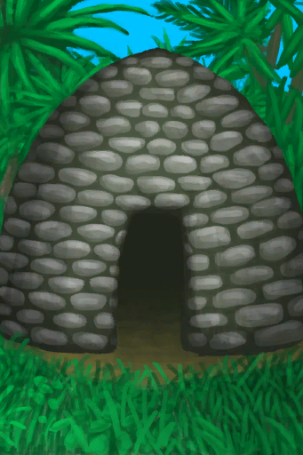

# Determination  
  

<b>Base Value: </b> 0 
  

<b>Value Range: </b> 0 ~ 4000 
  

<b>Base Rate: </b> +0.25 / /TP 
  
## Related Cards  
[Alcohol](Alcohol.md)  
## Addition Change By  
<table class="table table-bordered" data-toggle="table"  ><thead style=""><tr ><th  style="text-align:left;vertical-align:top;"  >From</th><th  style="text-align:left;vertical-align:top;"  >Operation</th><th  style="text-align:left;vertical-align:top;"  >Value</th></tr></thead><tr ><td  style="text-align:left;vertical-align:top;"  >[Raft](RaftEntrance.md)</td><td  style="text-align:left;vertical-align:top;"  >Passive</td><td  style="text-align:left;vertical-align:top;"  >addition+1</td></tr><tr ><td  style="text-align:left;vertical-align:top;"  >

[Brave](Pk_4_Brave.md)</td><td  style="text-align:left;vertical-align:top;"  >Perk Effect</td><td  style="text-align:left;vertical-align:top;"  >addition+1</td></tr></tbody></table>  
  
## Change By  
<table class="table table-bordered" data-toggle="table"  ><thead style=""><tr ><th  style="text-align:left;vertical-align:top;"  >From</th><th  style="text-align:left;vertical-align:top;"  >Operation</th><th  style="text-align:left;vertical-align:top;"  data-sortable="true"  >Value</th></tr></thead><tr ><td  style="text-align:left;vertical-align:top;"  >[

[Mud Hut(BluePrint)](Bp_MudHut.md)](Bp_MudHut.md)</td><td  style="text-align:left;vertical-align:top;"  >Craft BluePrint</td><td  style="text-align:left;vertical-align:top;"  >250</td></tr><tr ><td  style="text-align:left;vertical-align:top;"  >[

[Stone Hut(BluePrint)](Bp_StoneHut.md)](Bp_StoneHut.md)</td><td  style="text-align:left;vertical-align:top;"  >Craft BluePrint</td><td  style="text-align:left;vertical-align:top;"  >250</td></tr><tr ><td  style="text-align:left;vertical-align:top;"  >[

[Shed(BluePrint)](Bp_Shed.md)](Bp_Shed.md)</td><td  style="text-align:left;vertical-align:top;"  >Craft BluePrint</td><td  style="text-align:left;vertical-align:top;"  >100</td></tr><tr ><td  style="text-align:left;vertical-align:top;"  >[

[Weston(IslandEscape2)(Event)](Event_WestonIslandEscape2.md)](Event_WestonIslandEscape2.md)(未实装)</td><td  style="text-align:left;vertical-align:top;"  >"Thanks</td><td  style="text-align:left;vertical-align:top;"  >50</td></tr></tbody></table>  
  

