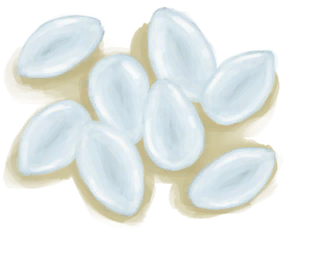
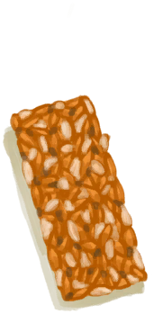

# Stool Liquidity  
> Increases the rate at which you lose hydration.  
> "Diarrhoea can be caused by eating certain foods in excess (like <b>Coconut and some Mushrooms and Vegetables</b>) and by some bacteria which can be acquired by eating <b>Raw Food</b> or having <b>Bad Hygiene</b>.  This ailment will lower your morale and dehydrate you much faster than normal. To treat it you must deal first with its underlying causes. Either stop eating the <b>Offending Food</b> for a period or strengthen your <b>Immune System</b> until you body is rid of the Bacteria.  There are however some useful ways to treat the symptoms. Eating <b>Charcoal</b> can be quite effective to lower Diarrhea. <b>Ginger Tea  
  

<b>Base Value: </b> 0 
  

<b>Value Range: </b> 0 ~ 300 
  

<b>Base Rate: </b> -0.75 / /TP 
  
## Statuses  

<table><tr style="height:2em;"><td style="background-color:#F0F0F0;text-align:center;width:180px;font-size:1.4em;font-weight:bold;vertical-align:middle;">
149 ～ 200

49% ～ 66%
</td><td colspan=2 style="font-size:1.1em;vertical-align:middle;background-color:#F9F9F9;">
<b>

Loose Stools</b>

&nbsp;&nbsp;Not feeling that well...
</td></tr><tr><td colspan=2><b>Effect：</b>[

[Intestines](Intestines.md)](Intestines.md)addition<b>-0.5</b>, [

[Hydration ](Hydration.md)](Hydration.md)addition<b>-1</b></td></tr><tr><td colspan=2></td></tr><tr style="height:2em;"><td style="background-color:#F0F0F0;text-align:center;width:180px;font-size:1.4em;font-weight:bold;vertical-align:middle;">
201 ～ 250

67% ～ 83%
</td><td colspan=2 style="font-size:1.1em;vertical-align:middle;background-color:#F9F9F9;">
<b>

Diarrhoea</b>

&nbsp;&nbsp;I have diarrhoea!
</td></tr><tr><td colspan=2><b>Effect：</b>[

[Intestines](Intestines.md)](Intestines.md)addition<b>-1</b>, [

[Hydration ](Hydration.md)](Hydration.md)addition<b>-2</b>, [

[Morale](Morale.md)](Morale.md)addition<b>-0.5</b></td></tr><tr><td colspan=2></td></tr><tr style="height:2em;"><td style="background-color:#F0F0F0;text-align:center;width:180px;font-size:1.4em;font-weight:bold;vertical-align:middle;">
251 ～ 300

83% ～ 100%
</td><td colspan=2 style="font-size:1.1em;vertical-align:middle;background-color:#F9F9F9;">
<b>

Severe Diarrhoea</b>

&nbsp;&nbsp;...
</td></tr><tr><td colspan=2><b>Effect：</b>[

[Intestines](Intestines.md)](Intestines.md)addition<b>-2</b>, [

[Hydration ](Hydration.md)](Hydration.md)addition<b>-3</b>, [

[Morale](Morale.md)](Morale.md)addition<b>-1</b></td></tr><tr><td colspan=2></td></tr></table>
  
## Related Cards  
[Stress](Stress.md)  |  [Bacteria Diarrhoea](BacteriaDiarrhoea.md)  |  [Camp Fever](BacteriaTyphus.md)  |  [Bacteria Cholera](BacteriaCholera.md)  |  [Parasite Malaria](ParasiteMalaria.md)  |  [Caffeine](Caffeine.md)  |  [Capsaicin](Capsaicin.md)  |  [Food Poisoning](FoodPoisoning.md)  |  [Ginger](GingerEffect.md)  |  [Quinine](Quinine.md)  |  [Rice Effect](RiceEffect.md)  
## Change By  
<table class="table table-bordered" data-toggle="table"  ><thead style=""><tr ><th  style="text-align:left;vertical-align:top;"  >From</th><th  style="text-align:left;vertical-align:top;"  >Operation</th><th  style="text-align:left;vertical-align:top;"  data-sortable="true"  >Value</th></tr></thead><tr ><td  style="text-align:left;vertical-align:top;"  >[

[Rotten Remains](RottenRemains.md)](RottenRemains.md)</td><td  style="text-align:left;vertical-align:top;"  >Eat</td><td  style="text-align:left;vertical-align:top;"  >300 ~ 600</td></tr><tr ><td  style="text-align:left;vertical-align:top;"  >[

[Ground Spider Lily](SpiderLilyGround.md)](SpiderLilyGround.md)</td><td  style="text-align:left;vertical-align:top;"  >Eat</td><td  style="text-align:left;vertical-align:top;"  >150</td></tr><tr ><td  style="text-align:left;vertical-align:top;"  >[

[Spider Lily Leaves](SpiderLilyLeaves.md)](SpiderLilyLeaves.md)</td><td  style="text-align:left;vertical-align:top;"  >Eat</td><td  style="text-align:left;vertical-align:top;"  >150</td></tr><tr ><td  style="text-align:left;vertical-align:top;"  >[

[Dried Spider Lily Leaves](SpiderLilyLeavesDried.md)](SpiderLilyLeavesDried.md)</td><td  style="text-align:left;vertical-align:top;"  >Eat</td><td  style="text-align:left;vertical-align:top;"  >150</td></tr><tr ><td  style="text-align:left;vertical-align:top;"  >[

[Oil](LQ_Oil.md)](LQ_Oil.md)</td><td  style="text-align:left;vertical-align:top;"  >Drink</td><td  style="text-align:left;vertical-align:top;"  >150</td></tr><tr ><td  style="text-align:left;vertical-align:top;"  >[

[Citronella Oil](LQ_OilCitronella.md)](LQ_OilCitronella.md)</td><td  style="text-align:left;vertical-align:top;"  >Drink</td><td  style="text-align:left;vertical-align:top;"  >150</td></tr><tr ><td  style="text-align:left;vertical-align:top;"  >[

[Citronella Oil Mix](LQ_OilCitronellaMix.md)](LQ_OilCitronellaMix.md)</td><td  style="text-align:left;vertical-align:top;"  >Drink</td><td  style="text-align:left;vertical-align:top;"  >150</td></tr><tr ><td  style="text-align:left;vertical-align:top;"  >[

[Jasmine Oil](LQ_OilJasmine.md)](LQ_OilJasmine.md)</td><td  style="text-align:left;vertical-align:top;"  >Drink</td><td  style="text-align:left;vertical-align:top;"  >150</td></tr><tr ><td  style="text-align:left;vertical-align:top;"  >[

[Jasmine Oil Mix](LQ_OilJasmineMix.md)](LQ_OilJasmineMix.md)</td><td  style="text-align:left;vertical-align:top;"  >Drink</td><td  style="text-align:left;vertical-align:top;"  >150</td></tr><tr ><td  style="text-align:left;vertical-align:top;"  >

[Nut Allergy](Pk_4_NutAllergy.md)</td><td  style="text-align:left;vertical-align:top;"  >“NutAction(Group)”</td><td  style="text-align:left;vertical-align:top;"  >100</td></tr><tr ><td  style="text-align:left;vertical-align:top;"  >

[Shellfish Allergy](Pk_4_ShellfishAllergy.md)</td><td  style="text-align:left;vertical-align:top;"  >“ShellfishAction(Group)”</td><td  style="text-align:left;vertical-align:top;"  >100</td></tr><tr ><td  style="text-align:left;vertical-align:top;"  >[

[Coconut Water](LQ_CoconutWater.md)](LQ_CoconutWater.md)(未实装)</td><td  style="text-align:left;vertical-align:top;"  >Drink</td><td  style="text-align:left;vertical-align:top;"  >45</td></tr><tr ><td  style="text-align:left;vertical-align:top;"  >[

[Aloe Vera Gel](AloeVeraGel.md)](AloeVeraGel.md)</td><td  style="text-align:left;vertical-align:top;"  >Eat</td><td  style="text-align:left;vertical-align:top;"  >35</td></tr><tr ><td  style="text-align:left;vertical-align:top;"  >[

[Jungle Salad](JungleSalad.md)](JungleSalad.md)</td><td  style="text-align:left;vertical-align:top;"  >Eat</td><td  style="text-align:left;vertical-align:top;"  >30</td></tr><tr ><td  style="text-align:left;vertical-align:top;"  >[

[Coconut Milk](LQ_CoconutMilk.md)](LQ_CoconutMilk.md)</td><td  style="text-align:left;vertical-align:top;"  >Drink</td><td  style="text-align:left;vertical-align:top;"  >20</td></tr><tr ><td  style="text-align:left;vertical-align:top;"  >[

[Coconut Meat](CoconutMeat.md)](CoconutMeat.md)</td><td  style="text-align:left;vertical-align:top;"  >Eat</td><td  style="text-align:left;vertical-align:top;"  >15</td></tr><tr ><td  style="text-align:left;vertical-align:top;"  >[

[Nipa Seeds](NipaSeeds.md)](NipaSeeds.md)</td><td  style="text-align:left;vertical-align:top;"  >Eat</td><td  style="text-align:left;vertical-align:top;"  >15</td></tr><tr ><td  style="text-align:left;vertical-align:top;"  >[

[Roasted Coconut Meat](CoconutMeatCooked.md)](CoconutMeatCooked.md)</td><td  style="text-align:left;vertical-align:top;"  >Eat</td><td  style="text-align:left;vertical-align:top;"  >14</td></tr><tr ><td  style="text-align:left;vertical-align:top;"  >[

[Coconut Fish](CoconutFish.md)](CoconutFish.md)</td><td  style="text-align:left;vertical-align:top;"  >Eat</td><td  style="text-align:left;vertical-align:top;"  >10</td></tr><tr ><td  style="text-align:left;vertical-align:top;"  >[

[Ground Lemongrass](LemonGrassGround.md)](LemonGrassGround.md)</td><td  style="text-align:left;vertical-align:top;"  >Eat</td><td  style="text-align:left;vertical-align:top;"  >10</td></tr><tr ><td  style="text-align:left;vertical-align:top;"  >[

[Ground Snake Grass](SnakeGrassGround.md)](SnakeGrassGround.md)</td><td  style="text-align:left;vertical-align:top;"  >Eat</td><td  style="text-align:left;vertical-align:top;"  >10</td></tr><tr ><td  style="text-align:left;vertical-align:top;"  >[

[Sap](LQ_Sap.md)](LQ_Sap.md)</td><td  style="text-align:left;vertical-align:top;"  >Drink</td><td  style="text-align:left;vertical-align:top;"  >10</td></tr><tr ><td  style="text-align:left;vertical-align:top;"  >[

[Protein Bar](ProteinBar.md)](ProteinBar.md)</td><td  style="text-align:left;vertical-align:top;"  >Eat</td><td  style="text-align:left;vertical-align:top;"  >6</td></tr><tr ><td  style="text-align:left;vertical-align:top;"  >[

[Drunken Crab](DrunkenCrab.md)](DrunkenCrab.md)</td><td  style="text-align:left;vertical-align:top;"  >Eat</td><td  style="text-align:left;vertical-align:top;"  >5</td></tr><tr ><td  style="text-align:left;vertical-align:top;"  >[

[Sago Cake](SagoCake.md)](SagoCake.md)</td><td  style="text-align:left;vertical-align:top;"  >Eat</td><td  style="text-align:left;vertical-align:top;"  >5</td></tr><tr ><td  style="text-align:left;vertical-align:top;"  >[

[Honey Water](LQ_HoneyWater.md)](LQ_HoneyWater.md)</td><td  style="text-align:left;vertical-align:top;"  >Drink</td><td  style="text-align:left;vertical-align:top;"  >5</td></tr><tr ><td  style="text-align:left;vertical-align:top;"  >[

[Mead](LQ_Mead.md)](LQ_Mead.md)</td><td  style="text-align:left;vertical-align:top;"  >Drink</td><td  style="text-align:left;vertical-align:top;"  >5</td></tr><tr ><td  style="text-align:left;vertical-align:top;"  >[

[Palm Wine](LQ_PalmWine.md)](LQ_PalmWine.md)</td><td  style="text-align:left;vertical-align:top;"  >Drink</td><td  style="text-align:left;vertical-align:top;"  >5</td></tr><tr ><td  style="text-align:left;vertical-align:top;"  >[

[Sugar Water](LQ_SugarWater.md)](LQ_SugarWater.md)</td><td  style="text-align:left;vertical-align:top;"  >Drink</td><td  style="text-align:left;vertical-align:top;"  >5</td></tr><tr ><td  style="text-align:left;vertical-align:top;"  >[

[Sugar Wine](LQ_SugarWine.md)](LQ_SugarWine.md)</td><td  style="text-align:left;vertical-align:top;"  >Drink</td><td  style="text-align:left;vertical-align:top;"  >5</td></tr><tr ><td  style="text-align:left;vertical-align:top;"  >[

[Banana](Banana.md)](Banana.md)</td><td  style="text-align:left;vertical-align:top;"  >Eat</td><td  style="text-align:left;vertical-align:top;"  >-5</td></tr><tr ><td  style="text-align:left;vertical-align:top;"  >[

[Charred Remains](CharredRemains.md)](CharredRemains.md)</td><td  style="text-align:left;vertical-align:top;"  >Eat Charred Remains</td><td  style="text-align:left;vertical-align:top;"  >-7</td></tr><tr ><td  style="text-align:left;vertical-align:top;"  >[

[Charcoal](Charcoal.md)](Charcoal.md)</td><td  style="text-align:left;vertical-align:top;"  >Eat</td><td  style="text-align:left;vertical-align:top;"  >-50</td></tr><tr ><td  style="text-align:left;vertical-align:top;"  >[

[Anti-Diarrhoea Pills](AntiDiarrhoeaPills.md)](AntiDiarrhoeaPills.md)</td><td  style="text-align:left;vertical-align:top;"  >Take a pill</td><td  style="text-align:left;vertical-align:top;"  >-100</td></tr></tbody></table>  
  

