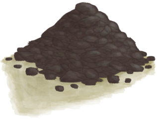

# Dirt Pile  
> "Could mix it with water to make mud  
  
<table class="table table-bordered" data-toggle="table"  data-show-header="false"><thead style="display:none"><tr ><th  style="width:50%;text-align:left;vertical-align:top;"  >title</th><th  style="width:50%;text-align:left;vertical-align:top;"  ></th></tr></thead><tr ><td  style="width:50%;text-align:left;vertical-align:top;"  >**Weight：**150  **Tag：**	[“Water Container”](tag_WaterContainer.md), [“Heavy”](tag_Heavy.md)</td><td  style="width:50%;text-align:left;vertical-align:top;"  >

<a href="DirtPile.md" style="color:black">Dirt Pile</a>

</td></tr></tbody></table>  
  
## Got From  

Dry Mud

[Mud Pile](MudPile.md)

Dry Mud

[Mud Pile](MudPile.md)

Dry Mud

[Mud Pile](MudPile.md)

Demolish

[Forge(Off)](ForgeExtinguished.md)

Dry Mud

[Mud Pile](MudPile.md)

Demolish

[Advanced Kiln(Off)](KilnAdvancedExtinguished.md)

Demolish

[Kiln(Off)](KilnExtinguished.md)

** With：**[“Hammer”](tag_Hammer.md)Demolish

[Stove(Off)](StoveExtinguished.md)

Transform

[Mud Pile](MudPile.md)

** With：**[“Hammer”](tag_Hammer.md)Demolish

[Watering Trough](WateringTrough.md)

Craft BluePrint

[Cellar(BluePrint)](Bp_Cellar.md)

Craft BluePrint

[Cistern(BluePrint)](Bp_Cistern.md)

Craft BluePrint

[Well(BluePrint)](Bp_Well.md)

** With：**[“Hammer”](tag_Hammer.md)Break

[Mud Brick](MudBrick.md)

Clear

[Debris(Mud Hut)](Debris.md)

** With：**[“Shovel”](tag_Shovel.md)Clear

[Debris(Mud Hut)](Debris.md)

** With：**[“Shovel”](tag_Shovel.md)Dig Up Soil

[Eastern Grasslands](GrasslandsE.md)

** With：**[“Shovel”](tag_Shovel.md)Dig Up Soil

[Western Grasslands](GrasslandsW.md)

** With：**[“Shovel”](tag_Shovel.md)Dig Up Soil

[Secret Valley](SecretValley.md)

Dig up Dirt

[Dry Puddle(Wetlands)](Puddle.md)

** With：**[“Shovel”](tag_Shovel.md)Dig Up Dirt

[Dry Puddle(Wetlands)](Puddle.md)

** With：**[“Hammer”](tag_Hammer.md)Demolish

[Water Filter](WaterFilter.md)

  
  
## Action  

<table><tr><td rowspan="2" style="width:200px;text-align:center;font-size:1.3em;font-weight:bold">

Make Mud

3m

</td><td>[“HandAction(Group)”](HandAction.md)</td></tr><tr><td><b>Self：</b>→ [

[Mud Pile](MudPile.md)](MudPile.md)</td></tr><tr><td colspan="2"><b>Require：</b>[

[Rain Value](RainValue.md)](RainValue.md): <b>1-5</b></td></tr><tr><td colspan="2"><b>StatChange：</b>[

[Filth](Filth.md)](Filth.md)<b>+10</b></td></tr></table>
  

<table><tr><td rowspan="2" style="width:200px;text-align:center;font-size:1.3em;font-weight:bold">

Crush dirt

30m

</td><td>[“HandAction(Group)”](HandAction.md)</td></tr><tr><td><b>Self：</b>→ [

[Fine Dirt](FineDirt.md)](FineDirt.md)</td></tr><tr><td colspan="2"><b>StatChange：</b>[

[Filth](Filth.md)](Filth.md)<b>+15</b></td></tr></table>
  
  
  
## Drag With  

<table style="margin-bottom:0px;"><tr><td style="width:40%;text-align:left; background-color:#FEFEFE"><b>With：</b>[“Water”](tag_WaterAny.md)</td><td style="width:40%;font-size:1em;font-weight:bold;background-color:#FEFEFE">Make Mud (3m) [“HandAction(Group)”](HandAction.md)</td></tr><tr style="background-color:#FFFFFF"><td style=""><b>Receiving：</b></td><td style=""><b>Self：</b>→ [

[Mud Pile](MudPile.md)](MudPile.md)</td></tr><tr><td colspan="2"><b>StatChange：</b>[

[Filth](Filth.md)](Filth.md)<b>+10</b>, [

[Wetness](Wetness.md)](Wetness.md)<b>+20</b></td></tr></table>
  

<table style="margin-bottom:0px;"><tr><td style="width:40%;text-align:left; background-color:#FEFEFE"><b>With：</b>[“Hammer”](tag_Hammer.md)</td><td style="width:40%;font-size:1em;font-weight:bold;background-color:#FEFEFE">Crush dirt (15m) [“HandAction(Group)”](HandAction.md)</td></tr><tr><td colspan="2"><b>Require：</b>[

[Light](Light.md)](Light.md): <b>10-100</b></td></tr><tr style="background-color:#FFFFFF"><td style=""><b>Receiving：</b></td><td style=""><b>Self：</b>→ [

[Fine Dirt](FineDirt.md)](FineDirt.md)</td></tr><tr><td colspan="2"><b>StatChange：</b>[

[Filth](Filth.md)](Filth.md)<b>+10</b></td></tr></table>
  
  
## Drag To  

[Bee Skep](BeeSkep.md)

[Swarming Bee Skep](BeeSkepSwarming.md)

[Trapped Macaque](CageTrapMacaque.md)

[Sow](BoarEnclosureFemale.md)

[Boar](BoarEnclosureMale.md)

[Piglet](BoarEnclosurePiglet.md)

[Sow](BoarTiedFemale.md)

[Boar](BoarTiedMale.md)

[Piglet](BoarTiedPiglet.md)

[Dog Friend](DogFriend.md)

[Goat](GoatEnclosureFemale.md)

[Juvenile Goat](GoatEnclosureKid.md)

[Lactating Goat](GoatEnclosureLactating.md)

[Male Goat](GoatEnclosureMale.md)

[Goat](GoatTiedFemale.md)

[Lactating Goat](GoatTiedFemaleLactating.md)

[Juvenile Goat](GoatTiedKid.md)

[Male Goat](GoatTiedMale.md)

[Grandfather](Grandfather.md)

[Grandfather](GrandfatherHealthy.md)

[Macaque Friend](MacaqueFriend.md)

[Wounded Macaque](MacaqueWounded.md)

[Sago Flatbread](SagoFlatbread.md)

[Water Ration](WaterRation.md)

[Dry Puddle(Wetlands)](Puddle.md)

[Reservoir](WaterReservoir.md)

[Reservoir(Full)](WaterReservoirFull.md)

[Reservoir (irrigating)](WaterReservoirIrrigating.md)

  
  
## Use In BluePrint  

<a href="Bp_Cellar.md" style="color:black">Cellar</a>

<a href="Bp_CropPlot.md" style="color:black">Crop Plot</a>

<a href="Bp_RicePaddy.md" style="color:black">Rice Paddy</a>

  
  
  

