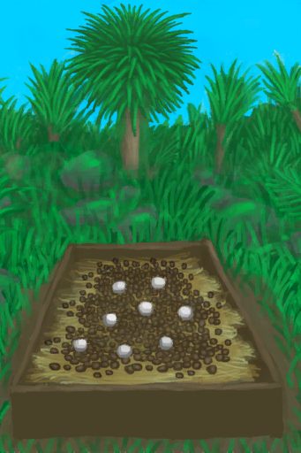

# Discomfort  
> "Bad smells  
> "Bad smells  
  

<b>Base Value: </b> 0 
  

<b>Value Range: </b> 0 ~ 2500 
  

<b>Base Rate: </b> - 
  
## Statuses  

<table><tr style="height:2em;"><td style="background-color:#F0F0F0;text-align:center;width:180px;font-size:1.4em;font-weight:bold;vertical-align:middle;">
100 ～ 250

4% ～ 10%
</td><td colspan=2 style="font-size:1.1em;vertical-align:middle;background-color:#F9F9F9;">
<b>

Minimal Discomfort</b>

</td></tr><tr><td colspan=2><b>Effect：</b>[

[Comfort](Comfort.md)](Comfort.md)<b>-100</b>, [

[Nausea](Nausea.md)](Nausea.md)addition<b>+0.1</b></td></tr><tr><td colspan=2></td></tr><tr style="height:2em;"><td style="background-color:#F0F0F0;text-align:center;width:180px;font-size:1.4em;font-weight:bold;vertical-align:middle;">
251 ～ 500

10% ～ 20%
</td><td colspan=2 style="font-size:1.1em;vertical-align:middle;background-color:#F9F9F9;">
<b>

Low Discomfort</b>

</td></tr><tr><td colspan=2><b>Effect：</b>[

[Stress](Stress.md)](Stress.md)addition<b>+0.25</b>, [

[Comfort](Comfort.md)](Comfort.md)<b>-250</b>, [

[Nausea](Nausea.md)](Nausea.md)addition<b>+0.2</b></td></tr><tr><td colspan=2></td></tr><tr style="height:2em;"><td style="background-color:#F0F0F0;text-align:center;width:180px;font-size:1.4em;font-weight:bold;vertical-align:middle;">
501 ～ 1000

20% ～ 40%
</td><td colspan=2 style="font-size:1.1em;vertical-align:middle;background-color:#F9F9F9;">
<b>

Moderate Discomfort</b>

</td></tr><tr><td colspan=2><b>Effect：</b>[

[Stress](Stress.md)](Stress.md)addition<b>+0.5</b>, [

[Mental Structure](Structure.md)](Structure.md)addition<b>-0.25</b>, [

[Comfort](Comfort.md)](Comfort.md)<b>-500</b>, [

[Nausea](Nausea.md)](Nausea.md)addition<b>+0.3</b></td></tr><tr><td colspan=2></td></tr><tr style="height:2em;"><td style="background-color:#F0F0F0;text-align:center;width:180px;font-size:1.4em;font-weight:bold;vertical-align:middle;">
1001 ～ 1750

40% ～ 70%
</td><td colspan=2 style="font-size:1.1em;vertical-align:middle;background-color:#F9F9F9;">
<b>

High Discomfort</b>

</td></tr><tr><td colspan=2><b>Effect：</b>[

[Stress](Stress.md)](Stress.md)addition<b>+0.75</b>, [

[Mental Structure](Structure.md)](Structure.md)addition<b>-0.5</b>, [

[Comfort](Comfort.md)](Comfort.md)<b>-1000</b>, [

[Nausea](Nausea.md)](Nausea.md)addition<b>+0.4</b></td></tr><tr><td colspan=2></td></tr><tr style="height:2em;"><td style="background-color:#F0F0F0;text-align:center;width:180px;font-size:1.4em;font-weight:bold;vertical-align:middle;">
1751 ～ 2500

70% ～ 100%
</td><td colspan=2 style="font-size:1.1em;vertical-align:middle;background-color:#F9F9F9;">
<b>

Extreme Discomfort</b>

</td></tr><tr><td colspan=2><b>Effect：</b>[

[Stress](Stress.md)](Stress.md)addition<b>+1</b>, [

[Mental Structure](Structure.md)](Structure.md)addition<b>-1</b>, [

[Comfort](Comfort.md)](Comfort.md)<b>-2000</b>, [

[Nausea](Nausea.md)](Nausea.md)addition<b>+0.5</b></td></tr><tr><td colspan=2></td></tr></table>
  
## Change By  
<table class="table table-bordered" data-toggle="table"  ><thead style=""><tr ><th  style="text-align:left;vertical-align:top;"  >From</th><th  style="text-align:left;vertical-align:top;"  >Operation</th><th  style="text-align:left;vertical-align:top;"  data-sortable="true"  >Value</th></tr></thead><tr ><td  style="text-align:left;vertical-align:top;"  >[

[Bat Colony(Bat Cave)](BatColony.md)](BatColony.md)</td><td  style="text-align:left;vertical-align:top;"  >Passive Effects</td><td  style="text-align:left;vertical-align:top;"  >2000</td></tr><tr ><td  style="text-align:left;vertical-align:top;"  >[

[Bat Cave](CaveBats.md)](CaveBats.md)</td><td  style="text-align:left;vertical-align:top;"  >Passive</td><td  style="text-align:left;vertical-align:top;"  >875</td></tr><tr ><td  style="text-align:left;vertical-align:top;"  >[

[Grasslands Cave(Cave)](CaveGrasslands.md)](CaveGrasslands.md)</td><td  style="text-align:left;vertical-align:top;"  >Passive</td><td  style="text-align:left;vertical-align:top;"  >875</td></tr><tr ><td  style="text-align:left;vertical-align:top;"  >[

[Sea Cave(Cave)](CaveSea.md)](CaveSea.md)</td><td  style="text-align:left;vertical-align:top;"  >Passive</td><td  style="text-align:left;vertical-align:top;"  >875</td></tr><tr ><td  style="text-align:left;vertical-align:top;"  >[

[Crystal Chamber(High Chamber)](CrystalChamber.md)](CrystalChamber.md)</td><td  style="text-align:left;vertical-align:top;"  >Passive</td><td  style="text-align:left;vertical-align:top;"  >875</td></tr><tr ><td  style="text-align:left;vertical-align:top;"  >[

[Damp Chamber](DampChamber.md)](DampChamber.md)</td><td  style="text-align:left;vertical-align:top;"  >Passive</td><td  style="text-align:left;vertical-align:top;"  >875</td></tr><tr ><td  style="text-align:left;vertical-align:top;"  >[

[Darkness(Dark Chamber)](DarkChamber.md)](DarkChamber.md)</td><td  style="text-align:left;vertical-align:top;"  >Passive</td><td  style="text-align:left;vertical-align:top;"  >875</td></tr><tr ><td  style="text-align:left;vertical-align:top;"  >[

[Flooded Chamber](FloodedChamber.md)](FloodedChamber.md)</td><td  style="text-align:left;vertical-align:top;"  >Passive</td><td  style="text-align:left;vertical-align:top;"  >875</td></tr><tr ><td  style="text-align:left;vertical-align:top;"  >[

[High Chamber](HighChamber.md)](HighChamber.md)</td><td  style="text-align:left;vertical-align:top;"  >Passive</td><td  style="text-align:left;vertical-align:top;"  >875</td></tr><tr ><td  style="text-align:left;vertical-align:top;"  >[

[Low Chamber(High Chamber)](LowChamber.md)](LowChamber.md)</td><td  style="text-align:left;vertical-align:top;"  >Passive</td><td  style="text-align:left;vertical-align:top;"  >875</td></tr><tr ><td  style="text-align:left;vertical-align:top;"  >[

[Medium Chamber(High Chamber)](MidChamber.md)](MidChamber.md)</td><td  style="text-align:left;vertical-align:top;"  >Passive</td><td  style="text-align:left;vertical-align:top;"  >875</td></tr><tr ><td  style="text-align:left;vertical-align:top;"  >[

[Narrow Tunnel(High Chamber)](NarrowTunnel.md)](NarrowTunnel.md)</td><td  style="text-align:left;vertical-align:top;"  >Passive</td><td  style="text-align:left;vertical-align:top;"  >875</td></tr><tr ><td  style="text-align:left;vertical-align:top;"  >[

[Tunnel](Tunnel.md)](Tunnel.md)</td><td  style="text-align:left;vertical-align:top;"  >Passive</td><td  style="text-align:left;vertical-align:top;"  >875</td></tr><tr ><td  style="text-align:left;vertical-align:top;"  >[

[Tidal Cave](CaveTidal.md)](CaveTidal.md)</td><td  style="text-align:left;vertical-align:top;"  >Passive</td><td  style="text-align:left;vertical-align:top;"  >875</td></tr><tr ><td  style="text-align:left;vertical-align:top;"  >[

[Cellar](Cellar.md)](Cellar.md)</td><td  style="text-align:left;vertical-align:top;"  >Passive</td><td  style="text-align:left;vertical-align:top;"  >875</td></tr><tr ><td  style="text-align:left;vertical-align:top;"  >[

[Dark Cave](DarkCave.md)](DarkCave.md)</td><td  style="text-align:left;vertical-align:top;"  >Passive</td><td  style="text-align:left;vertical-align:top;"  >875</td></tr><tr ><td  style="text-align:left;vertical-align:top;"  >[

[Enclosure](Enclosure.md)](Enclosure.md)</td><td  style="text-align:left;vertical-align:top;"  >Passive</td><td  style="text-align:left;vertical-align:top;"  >875</td></tr><tr ><td  style="text-align:left;vertical-align:top;"  >[

[Macaque Den](MacaqueDen.md)](MacaqueDen.md)</td><td  style="text-align:left;vertical-align:top;"  >Passive</td><td  style="text-align:left;vertical-align:top;"  >875</td></tr><tr ><td  style="text-align:left;vertical-align:top;"  >[

[Mud Hut](MudHut.md)](MudHut.md)</td><td  style="text-align:left;vertical-align:top;"  >Passive</td><td  style="text-align:left;vertical-align:top;"  >875</td></tr><tr ><td  style="text-align:left;vertical-align:top;"  >[

[Mud Hut](MudHutRuins.md)](MudHutRuins.md)</td><td  style="text-align:left;vertical-align:top;"  >Passive</td><td  style="text-align:left;vertical-align:top;"  >875</td></tr><tr ><td  style="text-align:left;vertical-align:top;"  >[

[Plane Crash(Crashed Plane)](PlaneCrash.md)](PlaneCrash.md)</td><td  style="text-align:left;vertical-align:top;"  >Passive</td><td  style="text-align:left;vertical-align:top;"  >875</td></tr><tr ><td  style="text-align:left;vertical-align:top;"  >[

[Shed](Shed.md)](Shed.md)</td><td  style="text-align:left;vertical-align:top;"  >Passive</td><td  style="text-align:left;vertical-align:top;"  >875</td></tr><tr ><td  style="text-align:left;vertical-align:top;"  >[

[Stone Hut](StoneHut.md)](StoneHut.md)</td><td  style="text-align:left;vertical-align:top;"  >Passive</td><td  style="text-align:left;vertical-align:top;"  >875</td></tr><tr ><td  style="text-align:left;vertical-align:top;"  >[

[Cesspool](Cesspool.md)](Cesspool.md)</td><td  style="text-align:left;vertical-align:top;"  >Passive Effects</td><td  style="text-align:left;vertical-align:top;"  >750</td></tr><tr ><td  style="text-align:left;vertical-align:top;"  >[

[Niter Bed](NiterBed.md)](NiterBed.md)</td><td  style="text-align:left;vertical-align:top;"  >Passive Effects</td><td  style="text-align:left;vertical-align:top;"  >750</td></tr><tr ><td  style="text-align:left;vertical-align:top;"  >[

[Bat Cave](CaveBats.md)](CaveBats.md)</td><td  style="text-align:left;vertical-align:top;"  >Passive</td><td  style="text-align:left;vertical-align:top;"  >625</td></tr><tr ><td  style="text-align:left;vertical-align:top;"  >[

[Grasslands Cave(Cave)](CaveGrasslands.md)](CaveGrasslands.md)</td><td  style="text-align:left;vertical-align:top;"  >Passive</td><td  style="text-align:left;vertical-align:top;"  >625</td></tr><tr ><td  style="text-align:left;vertical-align:top;"  >[

[Sea Cave(Cave)](CaveSea.md)](CaveSea.md)</td><td  style="text-align:left;vertical-align:top;"  >Passive</td><td  style="text-align:left;vertical-align:top;"  >625</td></tr><tr ><td  style="text-align:left;vertical-align:top;"  >[

[Crystal Chamber(High Chamber)](CrystalChamber.md)](CrystalChamber.md)</td><td  style="text-align:left;vertical-align:top;"  >Passive</td><td  style="text-align:left;vertical-align:top;"  >625</td></tr><tr ><td  style="text-align:left;vertical-align:top;"  >[

[Damp Chamber](DampChamber.md)](DampChamber.md)</td><td  style="text-align:left;vertical-align:top;"  >Passive</td><td  style="text-align:left;vertical-align:top;"  >625</td></tr><tr ><td  style="text-align:left;vertical-align:top;"  >[

[Darkness(Dark Chamber)](DarkChamber.md)](DarkChamber.md)</td><td  style="text-align:left;vertical-align:top;"  >Passive</td><td  style="text-align:left;vertical-align:top;"  >625</td></tr><tr ><td  style="text-align:left;vertical-align:top;"  >[

[Flooded Chamber](FloodedChamber.md)](FloodedChamber.md)</td><td  style="text-align:left;vertical-align:top;"  >Passive</td><td  style="text-align:left;vertical-align:top;"  >625</td></tr><tr ><td  style="text-align:left;vertical-align:top;"  >[

[High Chamber](HighChamber.md)](HighChamber.md)</td><td  style="text-align:left;vertical-align:top;"  >Passive</td><td  style="text-align:left;vertical-align:top;"  >625</td></tr><tr ><td  style="text-align:left;vertical-align:top;"  >[

[Low Chamber(High Chamber)](LowChamber.md)](LowChamber.md)</td><td  style="text-align:left;vertical-align:top;"  >Passive</td><td  style="text-align:left;vertical-align:top;"  >625</td></tr><tr ><td  style="text-align:left;vertical-align:top;"  >[

[Medium Chamber(High Chamber)](MidChamber.md)](MidChamber.md)</td><td  style="text-align:left;vertical-align:top;"  >Passive</td><td  style="text-align:left;vertical-align:top;"  >625</td></tr><tr ><td  style="text-align:left;vertical-align:top;"  >[

[Narrow Tunnel(High Chamber)](NarrowTunnel.md)](NarrowTunnel.md)</td><td  style="text-align:left;vertical-align:top;"  >Passive</td><td  style="text-align:left;vertical-align:top;"  >625</td></tr><tr ><td  style="text-align:left;vertical-align:top;"  >[

[Tunnel](Tunnel.md)](Tunnel.md)</td><td  style="text-align:left;vertical-align:top;"  >Passive</td><td  style="text-align:left;vertical-align:top;"  >625</td></tr><tr ><td  style="text-align:left;vertical-align:top;"  >[

[Tidal Cave](CaveTidal.md)](CaveTidal.md)</td><td  style="text-align:left;vertical-align:top;"  >Passive</td><td  style="text-align:left;vertical-align:top;"  >625</td></tr><tr ><td  style="text-align:left;vertical-align:top;"  >[

[Cellar](Cellar.md)](Cellar.md)</td><td  style="text-align:left;vertical-align:top;"  >Passive</td><td  style="text-align:left;vertical-align:top;"  >625</td></tr><tr ><td  style="text-align:left;vertical-align:top;"  >[

[Dark Cave](DarkCave.md)](DarkCave.md)</td><td  style="text-align:left;vertical-align:top;"  >Passive</td><td  style="text-align:left;vertical-align:top;"  >625</td></tr><tr ><td  style="text-align:left;vertical-align:top;"  >[

[Enclosure](Enclosure.md)](Enclosure.md)</td><td  style="text-align:left;vertical-align:top;"  >Passive</td><td  style="text-align:left;vertical-align:top;"  >625</td></tr><tr ><td  style="text-align:left;vertical-align:top;"  >[

[Macaque Den](MacaqueDen.md)](MacaqueDen.md)</td><td  style="text-align:left;vertical-align:top;"  >Passive</td><td  style="text-align:left;vertical-align:top;"  >625</td></tr><tr ><td  style="text-align:left;vertical-align:top;"  >[

[Mud Hut](MudHut.md)](MudHut.md)</td><td  style="text-align:left;vertical-align:top;"  >Passive</td><td  style="text-align:left;vertical-align:top;"  >625</td></tr><tr ><td  style="text-align:left;vertical-align:top;"  >[

[Mud Hut](MudHutRuins.md)](MudHutRuins.md)</td><td  style="text-align:left;vertical-align:top;"  >Passive</td><td  style="text-align:left;vertical-align:top;"  >625</td></tr><tr ><td  style="text-align:left;vertical-align:top;"  >[

[Plane Crash(Crashed Plane)](PlaneCrash.md)](PlaneCrash.md)</td><td  style="text-align:left;vertical-align:top;"  >Passive</td><td  style="text-align:left;vertical-align:top;"  >625</td></tr><tr ><td  style="text-align:left;vertical-align:top;"  >[

[Shed](Shed.md)](Shed.md)</td><td  style="text-align:left;vertical-align:top;"  >Passive</td><td  style="text-align:left;vertical-align:top;"  >625</td></tr><tr ><td  style="text-align:left;vertical-align:top;"  >[

[Stone Hut](StoneHut.md)](StoneHut.md)</td><td  style="text-align:left;vertical-align:top;"  >Passive</td><td  style="text-align:left;vertical-align:top;"  >625</td></tr><tr ><td  style="text-align:left;vertical-align:top;"  >[

[Brimstone Vent(Volcano)](VentBrimstone.md)](VentBrimstone.md)</td><td  style="text-align:left;vertical-align:top;"  >Passive Effects</td><td  style="text-align:left;vertical-align:top;"  >500</td></tr><tr ><td  style="text-align:left;vertical-align:top;"  >[

[Debris(Mud Hut)](Debris.md)](Debris.md)</td><td  style="text-align:left;vertical-align:top;"  >Passive Effects</td><td  style="text-align:left;vertical-align:top;"  >500</td></tr><tr ><td  style="text-align:left;vertical-align:top;"  >[

[Passing Ship](PassingShip.md)](PassingShip.md)</td><td  style="text-align:left;vertical-align:top;"  >Passive Effects</td><td  style="text-align:left;vertical-align:top;"  >500</td></tr><tr ><td  style="text-align:left;vertical-align:top;"  >[

[Shark](SharkVisitor.md)](SharkVisitor.md)</td><td  style="text-align:left;vertical-align:top;"  >Passive Effects</td><td  style="text-align:left;vertical-align:top;"  >500</td></tr><tr ><td  style="text-align:left;vertical-align:top;"  >[

[Bat Cave](CaveBats.md)](CaveBats.md)</td><td  style="text-align:left;vertical-align:top;"  >Passive</td><td  style="text-align:left;vertical-align:top;"  >375</td></tr><tr ><td  style="text-align:left;vertical-align:top;"  >[

[Grasslands Cave(Cave)](CaveGrasslands.md)](CaveGrasslands.md)</td><td  style="text-align:left;vertical-align:top;"  >Passive</td><td  style="text-align:left;vertical-align:top;"  >375</td></tr><tr ><td  style="text-align:left;vertical-align:top;"  >[

[Sea Cave(Cave)](CaveSea.md)](CaveSea.md)</td><td  style="text-align:left;vertical-align:top;"  >Passive</td><td  style="text-align:left;vertical-align:top;"  >375</td></tr><tr ><td  style="text-align:left;vertical-align:top;"  >[

[Crystal Chamber(High Chamber)](CrystalChamber.md)](CrystalChamber.md)</td><td  style="text-align:left;vertical-align:top;"  >Passive</td><td  style="text-align:left;vertical-align:top;"  >375</td></tr><tr ><td  style="text-align:left;vertical-align:top;"  >[

[Damp Chamber](DampChamber.md)](DampChamber.md)</td><td  style="text-align:left;vertical-align:top;"  >Passive</td><td  style="text-align:left;vertical-align:top;"  >375</td></tr><tr ><td  style="text-align:left;vertical-align:top;"  >[

[Darkness(Dark Chamber)](DarkChamber.md)](DarkChamber.md)</td><td  style="text-align:left;vertical-align:top;"  >Passive</td><td  style="text-align:left;vertical-align:top;"  >375</td></tr><tr ><td  style="text-align:left;vertical-align:top;"  >[

[Flooded Chamber](FloodedChamber.md)](FloodedChamber.md)</td><td  style="text-align:left;vertical-align:top;"  >Passive</td><td  style="text-align:left;vertical-align:top;"  >375</td></tr><tr ><td  style="text-align:left;vertical-align:top;"  >[

[High Chamber](HighChamber.md)](HighChamber.md)</td><td  style="text-align:left;vertical-align:top;"  >Passive</td><td  style="text-align:left;vertical-align:top;"  >375</td></tr><tr ><td  style="text-align:left;vertical-align:top;"  >[

[Low Chamber(High Chamber)](LowChamber.md)](LowChamber.md)</td><td  style="text-align:left;vertical-align:top;"  >Passive</td><td  style="text-align:left;vertical-align:top;"  >375</td></tr><tr ><td  style="text-align:left;vertical-align:top;"  >[

[Medium Chamber(High Chamber)](MidChamber.md)](MidChamber.md)</td><td  style="text-align:left;vertical-align:top;"  >Passive</td><td  style="text-align:left;vertical-align:top;"  >375</td></tr><tr ><td  style="text-align:left;vertical-align:top;"  >[

[Narrow Tunnel(High Chamber)](NarrowTunnel.md)](NarrowTunnel.md)</td><td  style="text-align:left;vertical-align:top;"  >Passive</td><td  style="text-align:left;vertical-align:top;"  >375</td></tr><tr ><td  style="text-align:left;vertical-align:top;"  >[

[Tunnel](Tunnel.md)](Tunnel.md)</td><td  style="text-align:left;vertical-align:top;"  >Passive</td><td  style="text-align:left;vertical-align:top;"  >375</td></tr><tr ><td  style="text-align:left;vertical-align:top;"  >[

[Tidal Cave](CaveTidal.md)](CaveTidal.md)</td><td  style="text-align:left;vertical-align:top;"  >Passive</td><td  style="text-align:left;vertical-align:top;"  >375</td></tr><tr ><td  style="text-align:left;vertical-align:top;"  >[

[Cellar](Cellar.md)](Cellar.md)</td><td  style="text-align:left;vertical-align:top;"  >Passive</td><td  style="text-align:left;vertical-align:top;"  >375</td></tr><tr ><td  style="text-align:left;vertical-align:top;"  >[

[Dark Cave](DarkCave.md)](DarkCave.md)</td><td  style="text-align:left;vertical-align:top;"  >Passive</td><td  style="text-align:left;vertical-align:top;"  >375</td></tr><tr ><td  style="text-align:left;vertical-align:top;"  >[

[Enclosure](Enclosure.md)](Enclosure.md)</td><td  style="text-align:left;vertical-align:top;"  >Passive</td><td  style="text-align:left;vertical-align:top;"  >375</td></tr><tr ><td  style="text-align:left;vertical-align:top;"  >[

[Macaque Den](MacaqueDen.md)](MacaqueDen.md)</td><td  style="text-align:left;vertical-align:top;"  >Passive</td><td  style="text-align:left;vertical-align:top;"  >375</td></tr><tr ><td  style="text-align:left;vertical-align:top;"  >[

[Mud Hut](MudHut.md)](MudHut.md)</td><td  style="text-align:left;vertical-align:top;"  >Passive</td><td  style="text-align:left;vertical-align:top;"  >375</td></tr><tr ><td  style="text-align:left;vertical-align:top;"  >[

[Mud Hut](MudHutRuins.md)](MudHutRuins.md)</td><td  style="text-align:left;vertical-align:top;"  >Passive</td><td  style="text-align:left;vertical-align:top;"  >375</td></tr><tr ><td  style="text-align:left;vertical-align:top;"  >[

[Plane Crash(Crashed Plane)](PlaneCrash.md)](PlaneCrash.md)</td><td  style="text-align:left;vertical-align:top;"  >Passive</td><td  style="text-align:left;vertical-align:top;"  >375</td></tr><tr ><td  style="text-align:left;vertical-align:top;"  >[

[Shed](Shed.md)](Shed.md)</td><td  style="text-align:left;vertical-align:top;"  >Passive</td><td  style="text-align:left;vertical-align:top;"  >375</td></tr><tr ><td  style="text-align:left;vertical-align:top;"  >[

[Stone Hut](StoneHut.md)](StoneHut.md)</td><td  style="text-align:left;vertical-align:top;"  >Passive</td><td  style="text-align:left;vertical-align:top;"  >375</td></tr><tr ><td  style="text-align:left;vertical-align:top;"  >[

[Assorted Mushrooms Bed](MushroomBedAssorted.md)](MushroomBedAssorted.md)</td><td  style="text-align:left;vertical-align:top;"  >Passive Effects</td><td  style="text-align:left;vertical-align:top;"  >300</td></tr><tr ><td  style="text-align:left;vertical-align:top;"  >[

[Empty Mushroom Bed(Empty)](MushroomBedEmpty.md)](MushroomBedEmpty.md)</td><td  style="text-align:left;vertical-align:top;"  >Passive Effects</td><td  style="text-align:left;vertical-align:top;"  >300</td></tr><tr ><td  style="text-align:left;vertical-align:top;"  >[

[Magic Mushroom Bed](MushroomBedMagic.md)](MushroomBedMagic.md)</td><td  style="text-align:left;vertical-align:top;"  >Passive Effects</td><td  style="text-align:left;vertical-align:top;"  >300</td></tr><tr ><td  style="text-align:left;vertical-align:top;"  >[

[Puffball Bed](MushroomBedPuffballs.md)](MushroomBedPuffballs.md)</td><td  style="text-align:left;vertical-align:top;"  >Passive Effects</td><td  style="text-align:left;vertical-align:top;"  >300</td></tr><tr ><td  style="text-align:left;vertical-align:top;"  >[

[Tide Pool(Rocks)](TidePool.md)](TidePool.md)</td><td  style="text-align:left;vertical-align:top;"  >Passive Effects</td><td  style="text-align:left;vertical-align:top;"  >250</td></tr><tr ><td  style="text-align:left;vertical-align:top;"  >[

[Floating Debris](FloatingDebris.md)](FloatingDebris.md)</td><td  style="text-align:left;vertical-align:top;"  >Passive Effects</td><td  style="text-align:left;vertical-align:top;"  >250</td></tr><tr ><td  style="text-align:left;vertical-align:top;"  >[

[Bat Cave](CaveBats.md)](CaveBats.md)</td><td  style="text-align:left;vertical-align:top;"  >Passive</td><td  style="text-align:left;vertical-align:top;"  >175</td></tr><tr ><td  style="text-align:left;vertical-align:top;"  >[

[Grasslands Cave(Cave)](CaveGrasslands.md)](CaveGrasslands.md)</td><td  style="text-align:left;vertical-align:top;"  >Passive</td><td  style="text-align:left;vertical-align:top;"  >175</td></tr><tr ><td  style="text-align:left;vertical-align:top;"  >[

[Sea Cave(Cave)](CaveSea.md)](CaveSea.md)</td><td  style="text-align:left;vertical-align:top;"  >Passive</td><td  style="text-align:left;vertical-align:top;"  >175</td></tr><tr ><td  style="text-align:left;vertical-align:top;"  >[

[Crystal Chamber(High Chamber)](CrystalChamber.md)](CrystalChamber.md)</td><td  style="text-align:left;vertical-align:top;"  >Passive</td><td  style="text-align:left;vertical-align:top;"  >175</td></tr><tr ><td  style="text-align:left;vertical-align:top;"  >[

[Damp Chamber](DampChamber.md)](DampChamber.md)</td><td  style="text-align:left;vertical-align:top;"  >Passive</td><td  style="text-align:left;vertical-align:top;"  >175</td></tr><tr ><td  style="text-align:left;vertical-align:top;"  >[

[Darkness(Dark Chamber)](DarkChamber.md)](DarkChamber.md)</td><td  style="text-align:left;vertical-align:top;"  >Passive</td><td  style="text-align:left;vertical-align:top;"  >175</td></tr><tr ><td  style="text-align:left;vertical-align:top;"  >[

[Flooded Chamber](FloodedChamber.md)](FloodedChamber.md)</td><td  style="text-align:left;vertical-align:top;"  >Passive</td><td  style="text-align:left;vertical-align:top;"  >175</td></tr><tr ><td  style="text-align:left;vertical-align:top;"  >[

[High Chamber](HighChamber.md)](HighChamber.md)</td><td  style="text-align:left;vertical-align:top;"  >Passive</td><td  style="text-align:left;vertical-align:top;"  >175</td></tr><tr ><td  style="text-align:left;vertical-align:top;"  >[

[Low Chamber(High Chamber)](LowChamber.md)](LowChamber.md)</td><td  style="text-align:left;vertical-align:top;"  >Passive</td><td  style="text-align:left;vertical-align:top;"  >175</td></tr><tr ><td  style="text-align:left;vertical-align:top;"  >[

[Medium Chamber(High Chamber)](MidChamber.md)](MidChamber.md)</td><td  style="text-align:left;vertical-align:top;"  >Passive</td><td  style="text-align:left;vertical-align:top;"  >175</td></tr><tr ><td  style="text-align:left;vertical-align:top;"  >[

[Narrow Tunnel(High Chamber)](NarrowTunnel.md)](NarrowTunnel.md)</td><td  style="text-align:left;vertical-align:top;"  >Passive</td><td  style="text-align:left;vertical-align:top;"  >175</td></tr><tr ><td  style="text-align:left;vertical-align:top;"  >[

[Tunnel](Tunnel.md)](Tunnel.md)</td><td  style="text-align:left;vertical-align:top;"  >Passive</td><td  style="text-align:left;vertical-align:top;"  >175</td></tr><tr ><td  style="text-align:left;vertical-align:top;"  >[

[Tidal Cave](CaveTidal.md)](CaveTidal.md)</td><td  style="text-align:left;vertical-align:top;"  >Passive</td><td  style="text-align:left;vertical-align:top;"  >175</td></tr><tr ><td  style="text-align:left;vertical-align:top;"  >[

[Cellar](Cellar.md)](Cellar.md)</td><td  style="text-align:left;vertical-align:top;"  >Passive</td><td  style="text-align:left;vertical-align:top;"  >175</td></tr><tr ><td  style="text-align:left;vertical-align:top;"  >[

[Dark Cave](DarkCave.md)](DarkCave.md)</td><td  style="text-align:left;vertical-align:top;"  >Passive</td><td  style="text-align:left;vertical-align:top;"  >175</td></tr><tr ><td  style="text-align:left;vertical-align:top;"  >[

[Enclosure](Enclosure.md)](Enclosure.md)</td><td  style="text-align:left;vertical-align:top;"  >Passive</td><td  style="text-align:left;vertical-align:top;"  >175</td></tr><tr ><td  style="text-align:left;vertical-align:top;"  >[

[Macaque Den](MacaqueDen.md)](MacaqueDen.md)</td><td  style="text-align:left;vertical-align:top;"  >Passive</td><td  style="text-align:left;vertical-align:top;"  >175</td></tr><tr ><td  style="text-align:left;vertical-align:top;"  >[

[Mud Hut](MudHut.md)](MudHut.md)</td><td  style="text-align:left;vertical-align:top;"  >Passive</td><td  style="text-align:left;vertical-align:top;"  >175</td></tr><tr ><td  style="text-align:left;vertical-align:top;"  >[

[Mud Hut](MudHutRuins.md)](MudHutRuins.md)</td><td  style="text-align:left;vertical-align:top;"  >Passive</td><td  style="text-align:left;vertical-align:top;"  >175</td></tr><tr ><td  style="text-align:left;vertical-align:top;"  >[

[Plane Crash(Crashed Plane)](PlaneCrash.md)](PlaneCrash.md)</td><td  style="text-align:left;vertical-align:top;"  >Passive</td><td  style="text-align:left;vertical-align:top;"  >175</td></tr><tr ><td  style="text-align:left;vertical-align:top;"  >[

[Shed](Shed.md)](Shed.md)</td><td  style="text-align:left;vertical-align:top;"  >Passive</td><td  style="text-align:left;vertical-align:top;"  >175</td></tr><tr ><td  style="text-align:left;vertical-align:top;"  >[

[Stone Hut](StoneHut.md)](StoneHut.md)</td><td  style="text-align:left;vertical-align:top;"  >Passive</td><td  style="text-align:left;vertical-align:top;"  >175</td></tr><tr ><td  style="text-align:left;vertical-align:top;"  >[

[Compost Bin](CompostBin.md)](CompostBin.md)</td><td  style="text-align:left;vertical-align:top;"  >Passive Effects</td><td  style="text-align:left;vertical-align:top;"  >150</td></tr><tr ><td  style="text-align:left;vertical-align:top;"  >[

[Dry Mushroom Bed](MushroomBedDry.md)](MushroomBedDry.md)</td><td  style="text-align:left;vertical-align:top;"  >Passive Effects</td><td  style="text-align:left;vertical-align:top;"  >150</td></tr><tr ><td  style="text-align:left;vertical-align:top;"  >[

[Brimstone](Brimstone.md)](Brimstone.md)</td><td  style="text-align:left;vertical-align:top;"  >Passive Effects</td><td  style="text-align:left;vertical-align:top;"  >100</td></tr><tr ><td  style="text-align:left;vertical-align:top;"  >[

[Flooded Tide Pool(Rocks)](TidePoolFlooded.md)](TidePoolFlooded.md)</td><td  style="text-align:left;vertical-align:top;"  >Passive Effects</td><td  style="text-align:left;vertical-align:top;"  >100</td></tr><tr ><td  style="text-align:left;vertical-align:top;"  >[

[Rotten Remains](RottenRemains.md)](RottenRemains.md)</td><td  style="text-align:left;vertical-align:top;"  >Passive Effects</td><td  style="text-align:left;vertical-align:top;"  >50</td></tr><tr ><td  style="text-align:left;vertical-align:top;"  >[

[Guano](Guano.md)](Guano.md)</td><td  style="text-align:left;vertical-align:top;"  >Passive Effects</td><td  style="text-align:left;vertical-align:top;"  >50</td></tr><tr ><td  style="text-align:left;vertical-align:top;"  >[

[Manure](Manure.md)](Manure.md)</td><td  style="text-align:left;vertical-align:top;"  >Passive Effects</td><td  style="text-align:left;vertical-align:top;"  >50</td></tr><tr ><td  style="text-align:left;vertical-align:top;"  >[

[Rotten Skin](SkinRotten.md)](SkinRotten.md)(未实装)</td><td  style="text-align:left;vertical-align:top;"  >Passive Effects</td><td  style="text-align:left;vertical-align:top;"  >50</td></tr><tr ><td  style="text-align:left;vertical-align:top;"  >[

[Rotten Coconut](CoconutRotten.md)](CoconutRotten.md)</td><td  style="text-align:left;vertical-align:top;"  >Passive Effects</td><td  style="text-align:left;vertical-align:top;"  >25</td></tr><tr ><td  style="text-align:left;vertical-align:top;"  >[

[China Rose](ChinaRosePlant.md)](ChinaRosePlant.md)</td><td  style="text-align:left;vertical-align:top;"  >Passive Effects</td><td  style="text-align:left;vertical-align:top;"  >-100</td></tr><tr ><td  style="text-align:left;vertical-align:top;"  >[

[Jasmine Flowers](JasminePlant.md)](JasminePlant.md)</td><td  style="text-align:left;vertical-align:top;"  >Passive Effects</td><td  style="text-align:left;vertical-align:top;"  >-100</td></tr><tr ><td  style="text-align:left;vertical-align:top;"  >[

[Citronella Candle(On)](CandleCitronellaOn.md)](CandleCitronellaOn.md)</td><td  style="text-align:left;vertical-align:top;"  >Passive Effects</td><td  style="text-align:left;vertical-align:top;"  >-250</td></tr><tr ><td  style="text-align:left;vertical-align:top;"  >[

[Jasmine Candle(On)](CandleJasmineOn.md)](CandleJasmineOn.md)</td><td  style="text-align:left;vertical-align:top;"  >Passive Effects</td><td  style="text-align:left;vertical-align:top;"  >-500</td></tr><tr ><td  style="text-align:left;vertical-align:top;"  >

[Feral](Pk_4_Feral.md)</td><td  style="text-align:left;vertical-align:top;"  >Perk Effect</td><td  style="text-align:left;vertical-align:top;"  >-2500</td></tr></tbody></table>  
  

