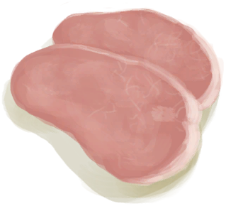

# Drying Rack  
> I can hang vegetables and meat to dry here.  
  
<table class="table table-bordered" data-toggle="table"  data-show-header="false"><thead style="display:none"><tr ><th  style="width:50%;text-align:left;vertical-align:top;"  >title</th><th  style="width:50%;text-align:left;vertical-align:top;"  ></th></tr></thead><tr ><td  style="width:50%;text-align:left;vertical-align:top;"  >**Slots：**4  **过滤器：**[“Water Container”](tag_WaterContainer.md)</td><td  style="width:50%;text-align:left;vertical-align:top;"  >

<a href="DryingRack.md" style="color:black">Drying Rack</a>

"A contraption designed to hang meat and vegetables to dry in the sun and wind.  It can only be placed in open areas like the <b>Beaches</td></tr></tbody></table>  
  
## Got From  

Craft BluePrint

[Drying Rack(BluePrint)](Bp_DryingRack.md)

  
  
## Action  

<table><tr><td rowspan="2" style="width:200px;text-align:center;font-size:1.3em;font-weight:bold">

Dissasemble

45m

</td><td>[“HandAction(Group)”](HandAction.md), [“CraftAction(Group)”](CraftAction.md)</td></tr><tr><td><b>Self：</b>→Dismiss</td></tr><tr><td colspan="2">[

[Fiber Cord](CordFiber.md)](CordFiber.md)(<b>+10</b>), [

[Long Stick](StickLong.md)](StickLong.md)(<b>+5</b>)</td></tr></table>
  
  
  
## Transform  

<table style="margin-bottom:0px;"><tr><td  colspan=2 style="font-size:1em;font-weight:bold;background-color:#FEFEFE">Chilli</td><td style="text-align:right; background-color:#FEFEFE"></td></tr><tr style="background-color:#FFFFFF"><td style="width:30%;font-size:1em;text-align:right;vertical-align:middle;">[

[Chillies](Chilies.md)](Chilies.md)</td><td style="text-align:center;width:20%;vertical-align:middle;">
3d

Chilli
</td><td style="text-align:left;vertical-align:middle;">[

[Dried Chilies](ChiliesDried.md)](ChiliesDried.md)(<b>+1</b>)Spoilage  <b>+0.75</b></td></tr><tr style="text-align:left;background-color:#FEFEFE"><td colspan="3"><b></b>** Require Stat：** [

[Rain Value](RainValue.md)](RainValue.md): <b>0-0</b></td></tr></table>
  

<table style="margin-bottom:0px;"><tr><td  colspan=2 style="font-size:1em;font-weight:bold;background-color:#FEFEFE">Spider Lily</td><td style="text-align:right; background-color:#FEFEFE"></td></tr><tr style="background-color:#FFFFFF"><td style="width:30%;font-size:1em;text-align:right;vertical-align:middle;">[

[Spider Lily Leaves](SpiderLilyLeaves.md)](SpiderLilyLeaves.md)</td><td style="text-align:center;width:20%;vertical-align:middle;">
3d

Spider Lily
</td><td style="text-align:left;vertical-align:middle;">[

[Dried Spider Lily Leaves](SpiderLilyLeavesDried.md)](SpiderLilyLeavesDried.md)(<b>+1</b>)Spoilage  <b>+0.75</b></td></tr><tr style="text-align:left;background-color:#FEFEFE"><td colspan="3"><b></b>** Require Stat：** [

[Rain Value](RainValue.md)](RainValue.md): <b>0-0</b></td></tr></table>
  

<table style="margin-bottom:0px;"><tr><td  colspan=2 style="font-size:1em;font-weight:bold;background-color:#FEFEFE">Kava</td><td style="text-align:right; background-color:#FEFEFE"></td></tr><tr style="background-color:#FFFFFF"><td style="width:30%;font-size:1em;text-align:right;vertical-align:middle;">[

[Kava Root](KavaRoot.md)](KavaRoot.md)</td><td style="text-align:center;width:20%;vertical-align:middle;">
3d

Kava
</td><td style="text-align:left;vertical-align:middle;">[

[Dried Kava Root](KavaRootDried.md)](KavaRootDried.md)(<b>+1</b>)Spoilage  <b>+0.75</b></td></tr><tr style="text-align:left;background-color:#FEFEFE"><td colspan="3"><b></b>** Require Stat：** [

[Rain Value](RainValue.md)](RainValue.md): <b>0-0</b></td></tr></table>
  

<table style="margin-bottom:0px;"><tr><td  colspan=2 style="font-size:1em;font-weight:bold;background-color:#FEFEFE">Ginger</td><td style="text-align:right; background-color:#FEFEFE"></td></tr><tr style="background-color:#FFFFFF"><td style="width:30%;font-size:1em;text-align:right;vertical-align:middle;">[

[Ginger](Ginger.md)](Ginger.md)</td><td style="text-align:center;width:20%;vertical-align:middle;">
3d

Ginger
</td><td style="text-align:left;vertical-align:middle;">[

[Dried Ginger](GingerDried.md)](GingerDried.md)(<b>+1</b>)Spoilage  <b>+0.75</b></td></tr><tr style="text-align:left;background-color:#FEFEFE"><td colspan="3"><b></b>** Require Stat：** [

[Rain Value](RainValue.md)](RainValue.md): <b>0-0</b></td></tr></table>
  

<table style="margin-bottom:0px;"><tr><td  colspan=2 style="font-size:1em;font-weight:bold;background-color:#FEFEFE">Cinchona Bark</td><td style="text-align:right; background-color:#FEFEFE"></td></tr><tr style="background-color:#FFFFFF"><td style="width:30%;font-size:1em;text-align:right;vertical-align:middle;">[

[Cinchona Bark](BarkCinchona.md)](BarkCinchona.md)</td><td style="text-align:center;width:20%;vertical-align:middle;">
3d

Cinchona Bark
</td><td style="text-align:left;vertical-align:middle;">[

[Dried Cinchona Bark](BarkCinchonaDried.md)](BarkCinchonaDried.md)(<b>+1</b>)Spoilage  <b>+1</b></td></tr><tr style="text-align:left;background-color:#FEFEFE"><td colspan="3"><b></b>** Require Stat：** [

[Rain Value](RainValue.md)](RainValue.md): <b>0-0</b></td></tr></table>
  

<table style="margin-bottom:0px;"><tr><td  colspan=2 style="font-size:1em;font-weight:bold;background-color:#FEFEFE">Fish</td><td style="text-align:right; background-color:#FEFEFE"></td></tr><tr style="background-color:#FFFFFF"><td style="width:30%;font-size:1em;text-align:right;vertical-align:middle;">[“Raw Fish”](tag_RawFish.md)</td><td style="text-align:center;width:20%;vertical-align:middle;">
6d6h

Fish
</td><td style="text-align:left;vertical-align:middle;">[

[Dried Fish](FishDried.md)](FishDried.md)(<b>+1</b>)Spoilage  <b>+0.75</b></td></tr><tr style="text-align:left;background-color:#FEFEFE"><td colspan="3"><b></b>** Require Stat：** [

[Rain Value](RainValue.md)](RainValue.md): <b>0-0</b></td></tr></table>
  

<table style="margin-bottom:0px;"><tr><td  colspan=2 style="font-size:1em;font-weight:bold;background-color:#FEFEFE">Boar</td><td style="text-align:right; background-color:#FEFEFE"></td></tr><tr style="background-color:#FFFFFF"><td style="width:30%;font-size:1em;text-align:right;vertical-align:middle;">[

[Boar Meat](BoarMeat.md)](BoarMeat.md)</td><td style="text-align:center;width:20%;vertical-align:middle;">
6d6h

Boar
</td><td style="text-align:left;vertical-align:middle;">[

[Dried Boar Meat](BoarMeatDried.md)](BoarMeatDried.md)(<b>+1</b>)Spoilage  <b>+0.75</b></td></tr><tr style="text-align:left;background-color:#FEFEFE"><td colspan="3"><b></b>** Require Stat：** [

[Rain Value](RainValue.md)](RainValue.md): <b>0-0</b></td></tr></table>
  

<table style="margin-bottom:0px;"><tr><td  colspan=2 style="font-size:1em;font-weight:bold;background-color:#FEFEFE">Goat</td><td style="text-align:right; background-color:#FEFEFE"></td></tr><tr style="background-color:#FFFFFF"><td style="width:30%;font-size:1em;text-align:right;vertical-align:middle;">[

[Goat Meat](GoatMeat.md)](GoatMeat.md)</td><td style="text-align:center;width:20%;vertical-align:middle;">
6d6h

Goat
</td><td style="text-align:left;vertical-align:middle;">[

[Dried Goat Meat](GoatMeatDried.md)](GoatMeatDried.md)(<b>+1</b>)Spoilage  <b>+0.75</b></td></tr><tr style="text-align:left;background-color:#FEFEFE"><td colspan="3"><b></b>** Require Stat：** [

[Rain Value](RainValue.md)](RainValue.md): <b>0-0</b></td></tr></table>
  

<table style="margin-bottom:0px;"><tr><td  colspan=2 style="font-size:1em;font-weight:bold;background-color:#FEFEFE">Macaque</td><td style="text-align:right; background-color:#FEFEFE"></td></tr><tr style="background-color:#FFFFFF"><td style="width:30%;font-size:1em;text-align:right;vertical-align:middle;">[

[Macaque Meat](MacaqueMeat.md)](MacaqueMeat.md)</td><td style="text-align:center;width:20%;vertical-align:middle;">
6d6h

Macaque
</td><td style="text-align:left;vertical-align:middle;">[

[Dried Macaque Meat](MacaqueMeatDried.md)](MacaqueMeatDried.md)(<b>+1</b>)Spoilage  <b>+0.75</b></td></tr><tr style="text-align:left;background-color:#FEFEFE"><td colspan="3"><b></b>** Require Stat：** [

[Rain Value](RainValue.md)](RainValue.md): <b>0-0</b></td></tr></table>
  
## Other Effects  
<table class="table table-bordered" data-toggle="table"  ><thead style=""><tr ><th  style="text-align:left;vertical-align:top;"  >Name</th><th  style="text-align:left;vertical-align:top;"  >Condition</th><th  style="text-align:left;vertical-align:top;"  >Change</th><th  style="text-align:left;vertical-align:top;"  data-sortable="true"  >Status</th></tr></thead><tr ><td  style="text-align:left;vertical-align:top;"  >Preservation</td><td  style="text-align:left;vertical-align:top;"  >** Require Stat：** [

[Rain Value](RainValue.md)](RainValue.md): <b>0-0</b></td><td  style="text-align:left;vertical-align:top;"  >内部物品 Spoilage +0.95</td><td  style="text-align:left;vertical-align:top;"  ></td></tr><tr ><td  style="text-align:left;vertical-align:top;"  >Putrefaction</td><td  style="text-align:left;vertical-align:top;"  >** Require Stat：** [

[Rain Value](RainValue.md)](RainValue.md): <b>1-5</b></td><td  style="text-align:left;vertical-align:top;"  >内部物品 Spoilage -2</td><td  style="text-align:left;vertical-align:top;"  ></td></tr></tbody></table>  
  

