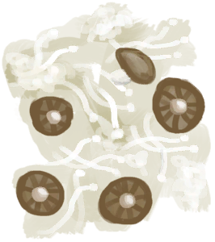
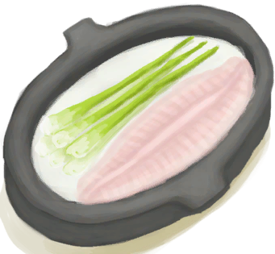
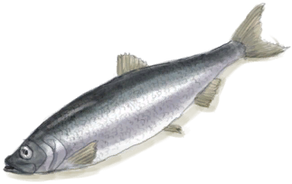
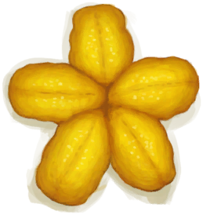

# “EatingAction(Group)”  

Eat [

[Aloe Vera Gel](AloeVeraGel.md)](AloeVeraGel.md)

Eat [

[Alien Nodule](AlienNodule.md)](AlienNodule.md)

Eat [

[Assorted Mushrooms](AssortedMushrooms.md)](AssortedMushrooms.md)

Eat [

[Banana](Banana.md)](Banana.md)

Eat Banana Stem [

[Banana Stem](BananaStem.md)](BananaStem.md)

Eat [

[Dead Bat](Bat.md)](Bat.md)

Eat [

[Roasted Bat](BatCooked.md)](BatCooked.md)

Eat [

[Honeycomb](BeeHoneycomb.md)](BeeHoneycomb.md)

Eat [

[Bird Meat](BirdMeat.md)](BirdMeat.md)

Eat [

[Cooked Bird Meat](BirdMeatCooked.md)](BirdMeatCooked.md)

Eat [

[Smoked Bird Meat](BirdMeatSmoked.md)](BirdMeatSmoked.md)

Eat [

[Boar Meat](BoarMeat.md)](BoarMeat.md)

Eat [

[Cooked Boar Meat](BoarMeatCooked.md)](BoarMeatCooked.md)

Eat [

[Dried Boar Meat](BoarMeatDried.md)](BoarMeatDried.md)

Eat [

[Cured Boar Meat](BoarMeatSalted.md)](BoarMeatSalted.md)

Eat [

[Drying Boar Meat](BoarMeatSaltedDrying.md)](BoarMeatSaltedDrying.md)

Eat [

[Smoked Boar Meat](BoarMeatSmoked.md)](BoarMeatSmoked.md)

Eat Fish [

[Cooked Bonefish](BonefishCooked.md)](BonefishCooked.md)

Eat Fish [

[Bonefish Meat](BonefishMeat.md)](BonefishMeat.md)

Eat Fish [

[Smoked Bonefish](BonefishSmoked.md)](BonefishSmoked.md)

Eat [

[Bugs](Bugs.md)](Bugs.md)

Eat [

[Butter](Butter.md)](Butter.md)

Eat [

[Candied Ginger](CandiedGinger.md)](CandiedGinger.md)

Eat Charred Remains [

[Charred Remains](CharredRemains.md)](CharredRemains.md)

Eat [

[Goat Cheese](Cheese.md)](Cheese.md)

Eat [

[Chicken Sandwich](ChickenSandwich.md)](ChickenSandwich.md)

Eat [

[Chillies](Chilies.md)](Chilies.md)

Eat [

[Dried Chilies](ChiliesDried.md)](ChiliesDried.md)

Eat [

[China Rose](ChinaRoseFlowers.md)](ChinaRoseFlowers.md)

Eat [

[Chocolate](Chocolate.md)](Chocolate.md)

Eat [

[Coconut Meat](CoconutMeat.md)](CoconutMeat.md)

Eat [

[Roasted Coconut Meat](CoconutMeatCooked.md)](CoconutMeatCooked.md)

Eat [

[Coffee Berries](CoffeeBerries.md)](CoffeeBerries.md)

Eat [

[Coffee Berry Pulp](CoffeeBerryPulp.md)](CoffeeBerryPulp.md)

Eat [

[Conch Meat](ConchMeat.md)](ConchMeat.md)

Eat [

[Cooked Conch Meat](ConchMeatCooked.md)](ConchMeatCooked.md)

Eat [

[Soft Conch Meat](ConchMeatSoft.md)](ConchMeatSoft.md)

Eat [

[Cooked Soft Conch Meat](ConchMeatSoftCooked.md)](ConchMeatSoftCooked.md)

Drink [

[Bone Broth](BoneBroth.md)](BoneBroth.md)

Eat [

[Coconut Fish](CoconutFish.md)](CoconutFish.md)

Eat [

[Drunken Crab](DrunkenCrab.md)](DrunkenCrab.md)

Eat [

[Egg Fried Rice](EggFriedRice.md)](EggFriedRice.md)

Eat [

[Fish N' Chips](FishNChips.md)](FishNChips.md)

Eat [

[Fish Omelette](FishOmelette.md)](FishOmelette.md)

Eat [

[Fried Puffballs](FriedPuffballs.md)](FriedPuffballs.md)

Eat [

[Goat Stew](GoatStew.md)](GoatStew.md)

Eat [

[Hearty Feast](HeartyFeast.md)](HeartyFeast.md)

Eat [

[Honey Glazed Pork](HoneyGlazedPork.md)](HoneyGlazedPork.md)

Eat [

[Island Chicken](IslandChicken.md)](IslandChicken.md)

Eat [

[Jungle Salad](JungleSalad.md)](JungleSalad.md)

Eat [

[Lizard Fry](LizardFry.md)](LizardFry.md)

Eat [

[Macaque Skewers](MacaqueSkewers.md)](MacaqueSkewers.md)

Eat [

[Sago Cake](SagoCake.md)](SagoCake.md)

Eat [

[Seafood Cup](SeafoodCup.md)](SeafoodCup.md)

Eat [

[Yam Curry](YamCurry.md)](YamCurry.md)

Eat Crab [

[Crab](Crab.md)](Crab.md)

Eat Crab [

[Cooked Crab](CrabCooked.md)](CrabCooked.md)

Eat [

[Egg](Egg.md)](Egg.md)

Eat [

[Boiled Egg](EggBoiled.md)](EggBoiled.md)

Eat [

[Roasted Egg](EggCooked.md)](EggCooked.md)

Eat [

[Fertilized Egg](EggPartridgeFertilized.md)](EggPartridgeFertilized.md)

Eat [

[Fat](Fat.md)](Fat.md)

Eat Fish [

[Dried Fish](FishDried.md)](FishDried.md)

Eat Fish [

[Salted Fish](FishSalted.md)](FishSalted.md)

Eat Fish [

[Drying Salted Fish](FishSaltedDrying.md)](FishSaltedDrying.md)

Eat Scraps [

[Fish Scraps](FishScraps.md)](FishScraps.md)

Eat Scraps [

[Cooked Fish Scraps](FishScrapsCooked.md)](FishScrapsCooked.md)

Eat Slices [

[Fish Slices](FishSlices.md)](FishSlices.md)

Eat Slices [

[Cooked Fish Slices](FishSlicesCooked.md)](FishSlicesCooked.md)

Eat [

[Fish Taco](FishTaco.md)](FishTaco.md)

Eat [

[Food Ration](FoodRation.md)](FoodRation.md)

Eat [

[Fried Banana](FriedBanana.md)](FriedBanana.md)

Eat [

[Ginger](Ginger.md)](Ginger.md)

Eat [

[Dried Ginger](GingerDried.md)](GingerDried.md)

Eat [

[Ground Ginger](GingerGround.md)](GingerGround.md)

Eat [

[Goat Meat](GoatMeat.md)](GoatMeat.md)

Eat [

[Cooked Goat Meat](GoatMeatCooked.md)](GoatMeatCooked.md)

Eat [

[Dried Goat Meat](GoatMeatDried.md)](GoatMeatDried.md)

Eat [

[Cured Goat Meat](GoatMeatSalted.md)](GoatMeatSalted.md)

Eat [

[Drying Goat Meat](GoatMeatSaltedDrying.md)](GoatMeatSaltedDrying.md)

Eat [

[Smoked Goat Meat](GoatMeatSmoked.md)](GoatMeatSmoked.md)

Eat Fish [

[Goatfish](Goatfish.md)](Goatfish.md)

Eat Fish [

[Cooked Goatfish](GoatfishCooked.md)](GoatfishCooked.md)

Eat Fish [

[Smoked Goatfish](GoatfishSmoked.md)](GoatfishSmoked.md)

Eat Grouper meat [

[Grouper Meat](GrouperMeat.md)](GrouperMeat.md)

Eat Cooked Goatfish [

[Cooked Grouper](GrouperMeatCooked.md)](GrouperMeatCooked.md)

Eat Smoked Goatfish [

[Smoked Grouper](GrouperMeatSmoked.md)](GrouperMeatSmoked.md)

Eat Fish [

[Herring](Herring.md)](Herring.md)

Eat Fish [

[Cooked Herring](HerringCooked.md)](HerringCooked.md)

Eat Fish [

[Smoked Herring](HerringSmoked.md)](HerringSmoked.md)

Eat [

[Honey Candy](HoneyCandy.md)](HoneyCandy.md)

Eat [

[Jasmine Flowers](JasmineFlowers.md)](JasmineFlowers.md)

Eat [

[Ground Jasmine Flowers](JasmineFlowersGround.md)](JasmineFlowersGround.md)

Eat [

[Jujube Fruits](JujubeFruits.md)](JujubeFruits.md)

Eat Root [

[Kava Root](KavaRoot.md)](KavaRoot.md)

Eat Root [

[Dried Kava Root](KavaRootDried.md)](KavaRootDried.md)

Eat Ground Root [

[Ground Kava Root](KavaRootGround.md)](KavaRootGround.md)

Eat [

[Ground Lemongrass](LemonGrassGround.md)](LemonGrassGround.md)

Eat [

[Lemongrass](LemongrassStalks.md)](LemongrassStalks.md)

Eat [

[Lizard](Lizard.md)](Lizard.md)

Eat [

[Roasted Lizard](LizardCooked.md)](LizardCooked.md)

Eat [

[Macaque Meat](MacaqueMeat.md)](MacaqueMeat.md)

Eat [

[Cooked Macaque Meat](MacaqueMeatCooked.md)](MacaqueMeatCooked.md)

Eat [

[Dried Macaque Meat](MacaqueMeatDried.md)](MacaqueMeatDried.md)

Eat [

[Cured Macaque Meat](MacaqueMeatSalted.md)](MacaqueMeatSalted.md)

Eat [

[Drying Macaque Meat](MacaqueMeatSaltedDrying.md)](MacaqueMeatSaltedDrying.md)

Eat [

[Smoked Macaque Meat](MacaqueMeatSmoked.md)](MacaqueMeatSmoked.md)

Eat [

[Magic Mushrooms](MagicMushrooms.md)](MagicMushrooms.md)

Eat [

[Mango](Mango.md)](Mango.md)

Eat [

[Cured Meat](MeatSaltedDried.md)](MeatSaltedDried.md)

Eat [

[Drying Meat](MeatSaltedDrying.md)](MeatSaltedDrying.md)

Eat [

[Lizard Meat](MonitorMeat.md)](MonitorMeat.md)

Eat [

[Cooked Lizard Meat](MonitorMeatCooked.md)](MonitorMeatCooked.md)

Eat [

[Dried Lizard Meat](MonitorMeatDried.md)](MonitorMeatDried.md)

Eat [

[Cured Lizard Meat](MonitorMeatSalted.md)](MonitorMeatSalted.md)

Eat [

[Drying Lizard Meat](MonitorMeatSaltedDrying.md)](MonitorMeatSaltedDrying.md)

Eat [

[Smoked Lizard Meat](MonitorMeatSmoked.md)](MonitorMeatSmoked.md)

Eat [

[Dead Mouse](Mouse.md)](Mouse.md)

Eat [

[Roasted Mouse](MouseCooked.md)](MouseCooked.md)

Eat [

[Skinned Mouse](MouseSkinned.md)](MouseSkinned.md)

Eat [

[Mudskipper](Mudskipper.md)](Mudskipper.md)

Eat [

[Roasted Mudskipper](MudskipperCooked.md)](MudskipperCooked.md)

Eat [

[Nipa Seeds](NipaSeeds.md)](NipaSeeds.md)

Eat [

[Oyster Meat](OysterMeat.md)](OysterMeat.md)

Eat [

[Butter Baked Oyster](OysterMeatBaked.md)](OysterMeatBaked.md)

Eat [

[Cooked Oyster](OysterMeatCooked.md)](OysterMeatCooked.md)

Eat Fish [

[Parrot Fish](ParrotFish.md)](ParrotFish.md)

Eat Fish [

[Cooked Parrot Fish](ParrotFishCooked.md)](ParrotFishCooked.md)

Eat Fish [

[Smoked Parrot Fish](ParrotFishSmoked.md)](ParrotFishSmoked.md)

Eat [

[Dead Chick](PartridgeChickDead.md)](PartridgeChickDead.md)

Eat [

[Prawns](Prawns.md)](Prawns.md)

Eat [

[Roasted Prawns](PrawnsCooked.md)](PrawnsCooked.md)

Eat [

[Protein Bar](ProteinBar.md)](ProteinBar.md)

Eat [

[Puffballs](Puffballs.md)](Puffballs.md)

Eat [

[Rice](RiceCooked.md)](RiceCooked.md)

Eat [

[Sago Flatbread](SagoFlatbread.md)](SagoFlatbread.md)

Eat [

[Sago Flatbread with Honey](SagoFlatbreadHoney.md)](SagoFlatbreadHoney.md)

Eat [

[Sago Flatbread with Jam](SagoFlatbreadJam.md)](SagoFlatbreadJam.md)

Eat [

[Sago Flour](SagoFlour.md)](SagoFlour.md)

Eat [

[Sago Pulp](SagoPulp.md)](SagoPulp.md)

Eat [

[Sago Sawdust](SagoSawdust.md)](SagoSawdust.md)

Eat [

[Sago Slime](SagoSlime.md)](SagoSlime.md)

Eat [

[Cooked Seahound](SeahoundCooked.md)](SeahoundCooked.md)

Eat [

[Seahound Meat](Seahoundmeat.md)](Seahoundmeat.md)

Eat [

[Seaweed](Seaweed.md)](Seaweed.md)

Eat [

[Cooked Shark](SharkCooked.md)](SharkCooked.md)

Eat [

[Shark Meat](SharkMeat.md)](SharkMeat.md)

Eat [

[Smoked Shark](SharkSmoked.md)](SharkSmoked.md)

Eat [

[Cooked Snake Meat](SnakeCooked.md)](SnakeCooked.md)

Eat [

[Ground Snake Grass](SnakeGrassGround.md)](SnakeGrassGround.md)

Eat [

[Skinned Snake](SnakeSkinned.md)](SnakeSkinned.md)

Eat [

[Ground Spider Lily](SpiderLilyGround.md)](SpiderLilyGround.md)

Eat [

[Spider Lily Leaves](SpiderLilyLeaves.md)](SpiderLilyLeaves.md)

Eat [

[Dried Spider Lily Leaves](SpiderLilyLeavesDried.md)](SpiderLilyLeavesDried.md)

Eat [

[Sugar](Sugar.md)](Sugar.md)

Eat [

[Sushi](Sushi.md)](Sushi.md)

Eat [

[Cooked Threadfin](ThreadfinCooked.md)](ThreadfinCooked.md)

Eat [

[Threadfin Meat](ThreadfinMeat.md)](ThreadfinMeat.md)

Eat [

[Smoked Threadfin](ThreadfinSmoked.md)](ThreadfinSmoked.md)

Eat [

[Tropical Almond Kernels](TropicalAlmondKernels.md)](TropicalAlmondKernels.md)

Eat [

[Roasted Tropical Almond](TropicalAlmondsRoasted.md)](TropicalAlmondsRoasted.md)

Eat [

[Urchin Meat](UrchinMeat.md)](UrchinMeat.md)

Eat [

[Cooked Urchin](UrchinMeatCooked.md)](UrchinMeatCooked.md)

Eat [

[Boiled Yam](YamBoiled.md)](YamBoiled.md)

Eat [

[Cut Yam](YamCut.md)](YamCut.md)

Eat [

[Yam Jam](YamJam.md)](YamJam.md)

  
  

