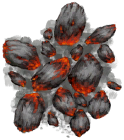

# Embers  
> Hot! Hot! Could light tinder with it.  
  
<table class="table table-bordered" data-toggle="table"  data-show-header="false"><thead style="display:none"><tr ><th  style="width:50%;text-align:left;vertical-align:top;"  >title</th><th  style="width:50%;text-align:left;vertical-align:top;"  ></th></tr></thead><tr ><td  style="width:50%;text-align:left;vertical-align:top;"  >**Weight：**75</td><td  style="width:50%;text-align:left;vertical-align:top;"  >

<a href="Embers.md" style="color:black">Embers</a>

</td></tr></tbody></table>  
  
## Got From  

Take Embers

[Alembic(On)](AlembicOn.md)

Take Embers

[Campfire](Campfire.md)

Take Embers

[Clay Fire Pit](ClayFirePit.md)

Take Embers

[Fire](Fire.md)

Take Embers

[Stove](Stove.md)

Take Embers

[Smoker](Smoker.md)

Transform

[Smoker](Smoker.md)

Take Embers

[Smoker](SmokerPlastic.md)

  
  
## Drag With  

<table style="margin-bottom:0px;"><tr><td style="width:40%;text-align:left; background-color:#FEFEFE"><b>With：</b>[“Tinder”](tag_Tinder.md)</td><td style="width:40%;font-size:1em;font-weight:bold;background-color:#FEFEFE">Light Tinder  </td></tr><tr style="background-color:#FFFFFF"><td style=""><b>Receiving：</b>→ [

[Lit Tinder](TinderLit.md)](TinderLit.md)</td><td style=""><b>Self：</b></td></tr></table>
  
  
## Drag To  

[Alembic(Off)](AlembicOff.md)

[Alembic(On)](AlembicOn.md)

[Campfire](Campfire.md)

[Campfire(Off)](CampfireExtinguished.md)

[Clay Fire Pit](ClayFirePit.md)

[Clay Fire Pit(Off)](ClayFirePitExtinguished.md)

[Fire](Fire.md)

[Fire(Off)](FireExtinguished.md)

[Forge](Forge.md)

[Kiln](Kiln.md)

[Advanced Kiln](KilnAdvanced.md)

[Stove](Stove.md)

[Wood](Wood.md)

  
  
## Durability   

<table style="margin-bottom:0px;"><tr><td style="width:30%;text-align:left; background-color:#FEFEFE;font-size:1.3em;font-weight:bold;">Fuel</td><td style="font-size:1em;background-color:#FEFEFE">Starting：6 -1/TP , Duration ：1h30m</td></tr><tr style="background-color:#FFFFFF"><td colspan=2>** On Zero： ** Self: → [

[Charcoal](Charcoal.md)](Charcoal.md)</td></tr></table>
  

