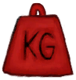

# Encumbrance  
> Shows how much you can carry before getting encumbered.  
> "Determines how much you can carry with you as you move or travel to different environments. Carrying too much will make you consume more <b>Stamina</b> and slow down your movement actions like <b>Exploring or Travelling</b>.  It is recommended to craft inventories such as <b>Baskets  
  

<b>Base Value: </b> 0 
  

<b>Value Range: </b> 0 ~ 4000 
  

<b>Base Rate: </b> - 
  
## Statuses  

<table><tr style="height:2em;"><td style="background-color:#F0F0F0;text-align:center;width:180px;font-size:1.4em;font-weight:bold;vertical-align:middle;">
2001 ～ 3000

50% ～ 75%
</td><td colspan=2 style="font-size:1.1em;vertical-align:middle;background-color:#F9F9F9;">
<b>

Encumbered</b>

&nbsp;&nbsp;I'm carrying too much...
</td></tr><tr><td colspan=2><b>Effect on Action：</b>[“LegAction(Group)”](LegAction.md): , [“ClimbAction(Group)”](ClimbAction.md): , [

[Stamina](Stamina.md)](Stamina.md)<b>-2</b> (/TP), TimeCost+1</td></tr><tr><td colspan=2></td></tr><tr style="height:2em;"><td style="background-color:#F0F0F0;text-align:center;width:180px;font-size:1.4em;font-weight:bold;vertical-align:middle;">
3001 ～ 3500

75% ～ 87%
</td><td colspan=2 style="font-size:1.1em;vertical-align:middle;background-color:#F9F9F9;">
<b>

Very Encumbered</b>

&nbsp;&nbsp;I'm carrying too much...
</td></tr><tr><td colspan=2><b>Effect on Action：</b>[“LegAction(Group)”](LegAction.md): , [“ClimbAction(Group)”](ClimbAction.md): , [

[Stamina](Stamina.md)](Stamina.md)<b>-4</b> (/TP), TimeCost+2</td></tr><tr><td colspan=2></td></tr><tr style="height:2em;"><td style="background-color:#F0F0F0;text-align:center;width:180px;font-size:1.4em;font-weight:bold;vertical-align:middle;">
3501 ～ 3999

87% ～ 99%
</td><td colspan=2 style="font-size:1.1em;vertical-align:middle;background-color:#F9F9F9;">
<b>

Seriously Encumbered</b>

&nbsp;&nbsp;I'm carrying too much...
</td></tr><tr><td colspan=2><b>Effect on Action：</b>[“LegAction(Group)”](LegAction.md): , [“ClimbAction(Group)”](ClimbAction.md): , [

[Stamina](Stamina.md)](Stamina.md)<b>-6</b> (/TP), TimeCost+4</td></tr><tr><td colspan=2></td></tr><tr style="height:2em;"><td style="background-color:#F0F0F0;text-align:center;width:180px;font-size:1.4em;font-weight:bold;vertical-align:middle;">
4000

100%
</td><td colspan=2 style="font-size:1.1em;vertical-align:middle;background-color:#F9F9F9;">
<b>

Too encumbered to move</b>

&nbsp;&nbsp;I'm carrying too much...
</td></tr><tr><td colspan=2><b>Effect on Action：</b>[“LegAction(Group)”](LegAction.md): , [“ClimbAction(Group)”](ClimbAction.md): , [

[Stamina](Stamina.md)](Stamina.md)<b>-8</b> (/TP), TimeCost+6</td></tr><tr><td colspan=2></td></tr></table>
  

