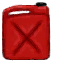

# Engine (open)  
> The plane's remaining engine. It needs fuel and repairs to work.  
  
<table class="table table-bordered" data-toggle="table"  data-show-header="false"><thead style="display:none"><tr ><th  style="width:50%;text-align:left;vertical-align:top;"  >title</th><th  style="width:50%;text-align:left;vertical-align:top;"  ></th></tr></thead><tr ><td  style="width:50%;text-align:left;vertical-align:top;"  >** Unique On Board **</td><td  style="width:50%;text-align:left;vertical-align:top;"  >

<a href="Engine1Open.md" style="color:black">Engine (open)</a>

</td></tr></tbody></table>  
  
## Got From  

Open

[Engine](Engine1Closed.md)

  
  
## Drag With  

<table style="margin-bottom:0px;"><tr><td style="width:40%;text-align:left; background-color:#FEFEFE"><b>With：</b>[

[Fuel Jerrycan](JerrycanFuel.md)](JerrycanFuel.md)</td><td style="width:40%;font-size:1em;font-weight:bold;background-color:#FEFEFE">Fill (15m) </td></tr><tr style="background-color:#FFFFFF"><td style=""><b>Receiving：</b>→ [

[Jerrycan](Jerrycan.md)](Jerrycan.md)</td><td style=""><b>Self：</b>Fuel  <b>+96(100%)</b></td></tr><tr><td colspan="2"><b>StatChange：</b>[

[Fuel Tank Full](FuelTankFull.md)](FuelTankFull.md)<b>+1</b></td></tr></table>
  
  
## Durability   

<table style="margin-bottom:0px;"><tr><td style="width:30%;text-align:left; background-color:#FEFEFE;font-size:1.3em;font-weight:bold;">Fuel</td><td style="font-size:1em;background-color:#FEFEFE">Starting：0 , Max：96 -</td></tr><tr style="background-color:#FFFFFF"><td colspan=2></td></tr></table>
  

<table style="margin-bottom:0px;"><tr><td style="width:30%;text-align:left; background-color:#FEFEFE;font-size:1.3em;font-weight:bold;">Progress</td><td style="font-size:1em;background-color:#FEFEFE">Starting：0 , Max：3 -</td></tr><tr style="background-color:#FFFFFF"><td colspan=2>** On Full： ** Self: → [

[Engine (repaired)](Engine1Repaired.md)](Engine1Repaired.md)</td></tr></table>
  

