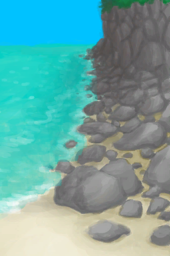

# Rocks  
  
<table class="table table-bordered" data-toggle="table"  data-show-header="false"><thead style="display:none"><tr ><th  style="width:50%;text-align:left;vertical-align:top;"  >title</th><th  style="width:50%;text-align:left;vertical-align:top;"  ></th></tr></thead><tr ><td  style="width:50%;text-align:left;vertical-align:top;"  >**Tag：**	[“Seagull Compatible”](tag_Coastal.md), [“West”](tag_West.md), [“Open Environment”](tag_EnvOpen.md), [“Dry Environment”](tag_EnvDry.md)  **Starting：**	[Rocks](Rocks.md), [Sea(Bird Rock)](Sea_Rocks.md)  ** Effect: ** [

[Temperature](TemperaturePerceived.md)](TemperaturePerceived.md)<b>-5</b> [

[Land Sickness](LandSickness.md)](LandSickness.md)addition<b>-8</b></td><td  style="width:50%;text-align:left;vertical-align:top;"  >

<a href="Env_Rocks.md" style="color:black">Rocks</a>

</td></tr></tbody></table>  
  
## Got From  

Exit

[Exit](CaveSeaExit.md)

Swim

[Rocks(Bird Rock)](Path_BirdRockToRocks.md)

Go

[To Rocks(Beach)](Path_BeachToRocks.md)

  
  

