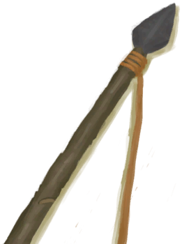
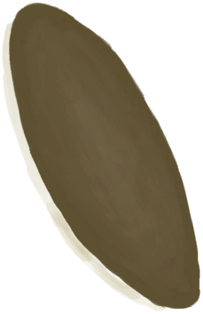
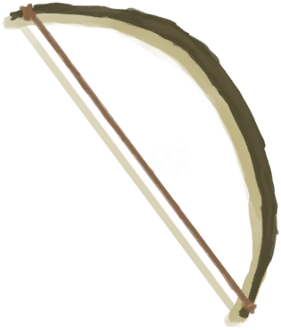
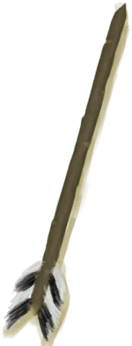
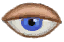
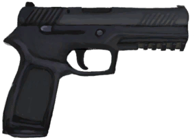
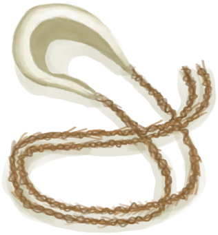

# I see a Boar!  
> Should I attack it or leave it alone?  
  
<table class="table table-bordered" data-toggle="table"  data-show-header="false"><thead style="display:none"><tr ><th  style="width:50%;text-align:left;vertical-align:top;"  >title</th><th  style="width:50%;text-align:left;vertical-align:top;"  ></th></tr></thead><tr ><td  style="width:50%;text-align:left;vertical-align:top;"  >**Tag：**	[“Fight Event”](tag_FightEvent.md)</td><td  style="width:50%;text-align:left;vertical-align:top;"  >

<a href="Event_BoarFight.md" style="color:black">I see a Boar!</a>

</td></tr></tbody></table>  
  
## Got From  

Follow Trail

[Recent Trail(Event)](Event_BoarTrailRecent.md)

Explore

[Deep Jungle(Jungle)](DeepJungle.md)

Explore

[Jungle](Jungle.md)

Explore

[Jungle Highlands](JungleHighlands.md)

Explore

[Wetland Jungle(Wetlands)](Wetlands.md)

  
  
## Action  

<table><tr><td rowspan="2" style="width:200px;text-align:center;font-size:1.3em;font-weight:bold">

Attack with Spear!

30m

</td><td></td></tr><tr><td><b>Self：</b>→Dismiss</td></tr><tr><td colspan="2"><b>Require：</b>[“Spear T1”](tag_Spear.md) On Hand/Equip(Partial)</td></tr><tr><td colspan="2"><b>CardChanges：</b>手牌中的一个[“Spear T1”](tag_Spear.md)Usage  <b>-30～-5</b>, 手牌中的一个[Shield](Shield.md)Usage  <b>-20～-5</b></td></tr><tr><td colspan="2"><b>StatChange：</b>[

[Spear Fighting(Skill)](Skill_SpearFighting.md)](Skill_SpearFighting.md)<b>+1</b></td></tr><tr><td colspan="2">

<table style="margin-bottom:3px;"><tr><td rowspan=2 style="text-align:center" width="80px">
Base Weight

0
</td><td style="font-size:0.6em;line-height:0.6em;font-weight:bold">Success</td></tr><tr><td>[

[The Boar is down!(Event)](Event_BoarFightSuccess.md)](Event_BoarFightSuccess.md)(<b>+1</b>)</td></tr><tr><td colspan=2><li>[

[Spear Fighting(Skill)](Skill_SpearFighting.md)](Skill_SpearFighting.md) in <b>0～150</b>, weight <b>+0～+150</b></li><li>[Climb Modifier](ModifierClimb.md) in <b>0～3</b>, weight <b>+0～-125</b></li><li>Spoilagein<b>0</b>, weight<b>+0</b></li>Max 1 of：<li>[

[Flint Spear](SpearFlint.md)](SpearFlint.md) On *Hand/Equip*，Weight<b>+10</b>,</li><li>[

[Copper Spear](SpearCopper.md)](SpearCopper.md) On *Hand/Equip*，Weight<b>+20</b>,</li><li>[

[Scrap Spear](SpearScrap.md)](SpearScrap.md) On *Hand/Equip*，Weight<b>+20</b>,</li><li>[

[Obsidian Spear](SpearObsidian.md)](SpearObsidian.md) On *Hand/Equip*，Weight<b>+25</b>,</li><li>[

[Dog Friend](DogFriend.md)](DogFriend.md) On *Hand/Board*，Weight<b>+25</b>,</li></td></tr></table>

<table style="margin-bottom:3px;"><tr><td rowspan=2 style="text-align:center" width="80px">
Base Weight

25
</td><td style="font-size:0.6em;line-height:0.6em;font-weight:bold">Mixed Success</td></tr><tr><td>[

["I got him(Event)](Event_BoarFightMixedSuccess.md)](Event_BoarFightMixedSuccess.md)(<b>+1</b>)</td></tr><tr><td colspan=2><li>[

[Spear Fighting(Skill)](Skill_SpearFighting.md)](Skill_SpearFighting.md) in <b>0～150</b>, weight <b>+0～+75</b></li><li>[Climb Modifier](ModifierClimb.md) in <b>0～3</b>, weight <b>+0～-60</b></li><li>[

[Armor](Armor.md)](Armor.md) in <b>1～100</b>, weight<b>-1～-20</b></li>Max 1 of：<li>[

[Flint Spear](SpearFlint.md)](SpearFlint.md) On *Hand/Equip*，Weight<b>+10</b>,</li><li>[

[Copper Spear](SpearCopper.md)](SpearCopper.md) On *Hand/Equip*，Weight<b>+20</b>,</li><li>[

[Scrap Spear](SpearScrap.md)](SpearScrap.md) On *Hand/Equip*，Weight<b>+20</b>,</li><li>[

[Obsidian Spear](SpearObsidian.md)](SpearObsidian.md) On *Hand/Equip*，Weight<b>+25</b>,</li><li>[

[Shield](Shield.md)](Shield.md) On *Hand/Equip*，Weight<b>-10</b>,</li></td></tr></table>

<table style="margin-bottom:3px;"><tr><td rowspan=2 style="text-align:center" width="80px">
Base Weight

25
</td><td style="font-size:0.6em;line-height:0.6em;font-weight:bold">Failure</td></tr><tr><td>[

[It Escaped!(Event)](Event_BoarFightFailure.md)](Event_BoarFightFailure.md)(<b>+1</b>)</td></tr></table>

<table style="margin-bottom:3px;"><tr><td rowspan=2 style="text-align:center" width="80px">
Base Weight

25
</td><td style="font-size:0.6em;line-height:0.6em;font-weight:bold">Bad Failure</td></tr><tr><td>[

[It got me...(Event)](Event_BoarFightBadFailure.md)](Event_BoarFightBadFailure.md)(<b>+1</b>)</td></tr><tr><td colspan=2><li>[

[Armor](Armor.md)](Armor.md) in <b>1～100</b>, weight<b>-1～-15</b></li><li>[

[Shield](Shield.md)](Shield.md) On *Hand/Equip*，Weight<b>-10</b>,</li></td></tr></table>
<button class="btn btn-secondary btn-sm" style="" data-toggle="modal" onclick="setCollectionDataBase64('eyJ0aXRsZSI6IlNpbXVsYXRvcjogQXR0YWNrIHdpdGggU3BlYXIhIChJIHNlZSBhIEJvYXIhKSIsImNvbGxlY3Rpb25zIjpbeyJkcm9wIjoiPGRpdiBzdHlsZT1cIndpZHRoOjI1cHg7ZGlzcGxheTppbmxpbmUtYmxvY2s7dGV4dC1hbGlnbjpjZW50ZXJcIj48aW1nIGRlY29kaW5nPVwiYXN5bmNcIiBzcmM9XCJTcHJpdGUvQm9hckV2ZW50LnBuZ1wiIGhyZWY9XCJhLm1kXCIgc3R5bGU9XCJtYXgtd2lkdGg6MjVweDttYXgtaGVpZ2h0OjI1cHg7XCI+PC9kaXY+VGhlIEJvYXIgaXMgZG93biEoRXZlbnQpIiwiYmFzZSI6MCwiY29uZGl0aW9uIjpbeyJrZXkiOiJTa2lsbF9TcGVhckZpZ2h0aW5nIiwidGl0bGUiOiJTcGVhciBGaWdodGluZyhTa2lsbCkiLCJ0eXBlIjoicmFuZ2UiLCJtYXgiOlswLDE1MF0sInJhbmdlIjpbMCwxNTBdLCJ3ZWlnaHQiOlswLDE1MF0sImRlZmF1bHRWYWx1ZSI6MCwid2hlbk91dE9mUmFuZ2UiOjF9LHsia2V5IjoiTW9kaWZpZXJDbGltYiIsInRpdGxlIjoiQ2xpbWIgTW9kaWZpZXIiLCJ0eXBlIjoicmFuZ2UiLCJtYXgiOlswLDNdLCJyYW5nZSI6WzAsM10sIndlaWdodCI6WzAsLTEyNV0sImRlZmF1bHRWYWx1ZSI6MCwid2hlbk91dE9mUmFuZ2UiOjF9LHsia2V5IjoiU3BvaWxhZ2UiLCJ0aXRsZSI6IlNwb2lsYWdlIiwidHlwZSI6InJhbmdlIiwibWF4IjpbMCwwXSwicmFuZ2UiOlswLDBdLCJ3ZWlnaHQiOlswLDBdLCJkZWZhdWx0VmFsdWUiOjAsIndoZW5PdXRPZlJhbmdlIjowfSx7ImtleSI6IlNwZWFyRmxpbnQiLCJ0aXRsZSI6IjxkaXYgc3R5bGU9XCJ3aWR0aDoyMHB4O2Rpc3BsYXk6aW5saW5lLWJsb2NrO3RleHQtYWxpZ246Y2VudGVyXCI+PGltZyBkZWNvZGluZz1cImFzeW5jXCIgc3JjPVwiU3ByaXRlL1NwZWFyRmxpbnQucG5nXCIgaHJlZj1cImEubWRcIiBzdHlsZT1cIm1heC13aWR0aDoyMHB4O21heC1oZWlnaHQ6MjBweDtcIj48L2Rpdj5GbGludCBTcGVhciBPbiAqSGFuZC9FcXVpcCrvvIwiLCJ0eXBlIjoidG9nZ2xlIiwicmFuZ2UiOlswLDFdLCJtYXgiOlswLDFdLCJ3ZWlnaHQiOlswLDEwXSwiZGVmYXVsdFZhbHVlIjowLCJ3aGVuT3V0T2ZSYW5nZSI6MCwibWF4U3RhY2tHcm91cCI6Ik1BWF9TVEFDS19TdWNjZXNzIn0seyJrZXkiOiJTcGVhckNvcHBlciIsInRpdGxlIjoiPGRpdiBzdHlsZT1cIndpZHRoOjIwcHg7ZGlzcGxheTppbmxpbmUtYmxvY2s7dGV4dC1hbGlnbjpjZW50ZXJcIj48aW1nIGRlY29kaW5nPVwiYXN5bmNcIiBzcmM9XCJTcHJpdGUvU3BlYXJDb3BwZXIucG5nXCIgaHJlZj1cImEubWRcIiBzdHlsZT1cIm1heC13aWR0aDoyMHB4O21heC1oZWlnaHQ6MjBweDtcIj48L2Rpdj5Db3BwZXIgU3BlYXIgT24gKkhhbmQvRXF1aXAq77yMIiwidHlwZSI6InRvZ2dsZSIsInJhbmdlIjpbMCwxXSwibWF4IjpbMCwxXSwid2VpZ2h0IjpbMCwyMF0sImRlZmF1bHRWYWx1ZSI6MCwid2hlbk91dE9mUmFuZ2UiOjAsIm1heFN0YWNrR3JvdXAiOiJNQVhfU1RBQ0tfU3VjY2VzcyJ9LHsia2V5IjoiU3BlYXJTY3JhcCIsInRpdGxlIjoiPGRpdiBzdHlsZT1cIndpZHRoOjIwcHg7ZGlzcGxheTppbmxpbmUtYmxvY2s7dGV4dC1hbGlnbjpjZW50ZXJcIj48aW1nIGRlY29kaW5nPVwiYXN5bmNcIiBzcmM9XCJTcHJpdGUvU3BlYXJTY3JhcC5wbmdcIiBocmVmPVwiYS5tZFwiIHN0eWxlPVwibWF4LXdpZHRoOjIwcHg7bWF4LWhlaWdodDoyMHB4O1wiPjwvZGl2PlNjcmFwIFNwZWFyIE9uICpIYW5kL0VxdWlwKu+8jCIsInR5cGUiOiJ0b2dnbGUiLCJyYW5nZSI6WzAsMV0sIm1heCI6WzAsMV0sIndlaWdodCI6WzAsMjBdLCJkZWZhdWx0VmFsdWUiOjAsIndoZW5PdXRPZlJhbmdlIjowLCJtYXhTdGFja0dyb3VwIjoiTUFYX1NUQUNLX1N1Y2Nlc3MifSx7ImtleSI6IlNwZWFyT2JzaWRpYW4iLCJ0aXRsZSI6IjxkaXYgc3R5bGU9XCJ3aWR0aDoyMHB4O2Rpc3BsYXk6aW5saW5lLWJsb2NrO3RleHQtYWxpZ246Y2VudGVyXCI+PGltZyBkZWNvZGluZz1cImFzeW5jXCIgc3JjPVwiU3ByaXRlL1NwZWFyT2JzaWRpYW4ucG5nXCIgaHJlZj1cImEubWRcIiBzdHlsZT1cIm1heC13aWR0aDoyMHB4O21heC1oZWlnaHQ6MjBweDtcIj48L2Rpdj5PYnNpZGlhbiBTcGVhciBPbiAqSGFuZC9FcXVpcCrvvIwiLCJ0eXBlIjoidG9nZ2xlIiwicmFuZ2UiOlswLDFdLCJtYXgiOlswLDFdLCJ3ZWlnaHQiOlswLDI1XSwiZGVmYXVsdFZhbHVlIjowLCJ3aGVuT3V0T2ZSYW5nZSI6MCwibWF4U3RhY2tHcm91cCI6Ik1BWF9TVEFDS19TdWNjZXNzIn0seyJrZXkiOiJEb2dGcmllbmQiLCJ0aXRsZSI6IjxkaXYgc3R5bGU9XCJ3aWR0aDoyMHB4O2Rpc3BsYXk6aW5saW5lLWJsb2NrO3RleHQtYWxpZ246Y2VudGVyXCI+PGltZyBkZWNvZGluZz1cImFzeW5jXCIgc3JjPVwiU3ByaXRlL0RvZy5wbmdcIiBocmVmPVwiYS5tZFwiIHN0eWxlPVwibWF4LXdpZHRoOjIwcHg7bWF4LWhlaWdodDoyMHB4O1wiPjwvZGl2PkRvZyBGcmllbmQgT24gKkhhbmQvQm9hcmQq77yMIiwidHlwZSI6InRvZ2dsZSIsInJhbmdlIjpbMCwxXSwibWF4IjpbMCwxXSwid2VpZ2h0IjpbMCwyNV0sImRlZmF1bHRWYWx1ZSI6MCwid2hlbk91dE9mUmFuZ2UiOjAsIm1heFN0YWNrR3JvdXAiOiJNQVhfU1RBQ0tfU3VjY2VzcyJ9XX0seyJkcm9wIjoiPGRpdiBzdHlsZT1cIndpZHRoOjI1cHg7ZGlzcGxheTppbmxpbmUtYmxvY2s7dGV4dC1hbGlnbjpjZW50ZXJcIj48aW1nIGRlY29kaW5nPVwiYXN5bmNcIiBzcmM9XCJTcHJpdGUvQm9hckV2ZW50LnBuZ1wiIGhyZWY9XCJhLm1kXCIgc3R5bGU9XCJtYXgtd2lkdGg6MjVweDttYXgtaGVpZ2h0OjI1cHg7XCI+PC9kaXY+XCJJIGdvdCBoaW0oRXZlbnQpIiwiYmFzZSI6MjUsImNvbmRpdGlvbiI6W3sia2V5IjoiU2tpbGxfU3BlYXJGaWdodGluZyIsInRpdGxlIjoiU3BlYXIgRmlnaHRpbmcoU2tpbGwpIiwidHlwZSI6InJhbmdlIiwibWF4IjpbMCwxNTBdLCJyYW5nZSI6WzAsMTUwXSwid2VpZ2h0IjpbMCw3NV0sImRlZmF1bHRWYWx1ZSI6MCwid2hlbk91dE9mUmFuZ2UiOjF9LHsia2V5IjoiTW9kaWZpZXJDbGltYiIsInRpdGxlIjoiQ2xpbWIgTW9kaWZpZXIiLCJ0eXBlIjoicmFuZ2UiLCJtYXgiOlswLDNdLCJyYW5nZSI6WzAsM10sIndlaWdodCI6WzAsLTYwXSwiZGVmYXVsdFZhbHVlIjowLCJ3aGVuT3V0T2ZSYW5nZSI6MX0seyJrZXkiOiJBcm1vciIsInRpdGxlIjoiQXJtb3IiLCJ0eXBlIjoicmFuZ2UiLCJtYXgiOlswLDEwMF0sInJhbmdlIjpbMSwxMDBdLCJ3ZWlnaHQiOlstMSwtMjBdLCJkZWZhdWx0VmFsdWUiOjAsIndoZW5PdXRPZlJhbmdlIjowfSx7ImtleSI6IlNwZWFyRmxpbnQiLCJ0aXRsZSI6IjxkaXYgc3R5bGU9XCJ3aWR0aDoyMHB4O2Rpc3BsYXk6aW5saW5lLWJsb2NrO3RleHQtYWxpZ246Y2VudGVyXCI+PGltZyBkZWNvZGluZz1cImFzeW5jXCIgc3JjPVwiU3ByaXRlL1NwZWFyRmxpbnQucG5nXCIgaHJlZj1cImEubWRcIiBzdHlsZT1cIm1heC13aWR0aDoyMHB4O21heC1oZWlnaHQ6MjBweDtcIj48L2Rpdj5GbGludCBTcGVhciBPbiAqSGFuZC9FcXVpcCrvvIwiLCJ0eXBlIjoidG9nZ2xlIiwicmFuZ2UiOlswLDFdLCJtYXgiOlswLDFdLCJ3ZWlnaHQiOlswLDEwXSwiZGVmYXVsdFZhbHVlIjowLCJ3aGVuT3V0T2ZSYW5nZSI6MCwibWF4U3RhY2tHcm91cCI6Ik1BWF9TVEFDS19NaXhlZCBTdWNjZXNzIn0seyJrZXkiOiJTcGVhckNvcHBlciIsInRpdGxlIjoiPGRpdiBzdHlsZT1cIndpZHRoOjIwcHg7ZGlzcGxheTppbmxpbmUtYmxvY2s7dGV4dC1hbGlnbjpjZW50ZXJcIj48aW1nIGRlY29kaW5nPVwiYXN5bmNcIiBzcmM9XCJTcHJpdGUvU3BlYXJDb3BwZXIucG5nXCIgaHJlZj1cImEubWRcIiBzdHlsZT1cIm1heC13aWR0aDoyMHB4O21heC1oZWlnaHQ6MjBweDtcIj48L2Rpdj5Db3BwZXIgU3BlYXIgT24gKkhhbmQvRXF1aXAq77yMIiwidHlwZSI6InRvZ2dsZSIsInJhbmdlIjpbMCwxXSwibWF4IjpbMCwxXSwid2VpZ2h0IjpbMCwyMF0sImRlZmF1bHRWYWx1ZSI6MCwid2hlbk91dE9mUmFuZ2UiOjAsIm1heFN0YWNrR3JvdXAiOiJNQVhfU1RBQ0tfTWl4ZWQgU3VjY2VzcyJ9LHsia2V5IjoiU3BlYXJTY3JhcCIsInRpdGxlIjoiPGRpdiBzdHlsZT1cIndpZHRoOjIwcHg7ZGlzcGxheTppbmxpbmUtYmxvY2s7dGV4dC1hbGlnbjpjZW50ZXJcIj48aW1nIGRlY29kaW5nPVwiYXN5bmNcIiBzcmM9XCJTcHJpdGUvU3BlYXJTY3JhcC5wbmdcIiBocmVmPVwiYS5tZFwiIHN0eWxlPVwibWF4LXdpZHRoOjIwcHg7bWF4LWhlaWdodDoyMHB4O1wiPjwvZGl2PlNjcmFwIFNwZWFyIE9uICpIYW5kL0VxdWlwKu+8jCIsInR5cGUiOiJ0b2dnbGUiLCJyYW5nZSI6WzAsMV0sIm1heCI6WzAsMV0sIndlaWdodCI6WzAsMjBdLCJkZWZhdWx0VmFsdWUiOjAsIndoZW5PdXRPZlJhbmdlIjowLCJtYXhTdGFja0dyb3VwIjoiTUFYX1NUQUNLX01peGVkIFN1Y2Nlc3MifSx7ImtleSI6IlNwZWFyT2JzaWRpYW4iLCJ0aXRsZSI6IjxkaXYgc3R5bGU9XCJ3aWR0aDoyMHB4O2Rpc3BsYXk6aW5saW5lLWJsb2NrO3RleHQtYWxpZ246Y2VudGVyXCI+PGltZyBkZWNvZGluZz1cImFzeW5jXCIgc3JjPVwiU3ByaXRlL1NwZWFyT2JzaWRpYW4ucG5nXCIgaHJlZj1cImEubWRcIiBzdHlsZT1cIm1heC13aWR0aDoyMHB4O21heC1oZWlnaHQ6MjBweDtcIj48L2Rpdj5PYnNpZGlhbiBTcGVhciBPbiAqSGFuZC9FcXVpcCrvvIwiLCJ0eXBlIjoidG9nZ2xlIiwicmFuZ2UiOlswLDFdLCJtYXgiOlswLDFdLCJ3ZWlnaHQiOlswLDI1XSwiZGVmYXVsdFZhbHVlIjowLCJ3aGVuT3V0T2ZSYW5nZSI6MCwibWF4U3RhY2tHcm91cCI6Ik1BWF9TVEFDS19NaXhlZCBTdWNjZXNzIn0seyJrZXkiOiJTaGllbGQiLCJ0aXRsZSI6IjxkaXYgc3R5bGU9XCJ3aWR0aDoyMHB4O2Rpc3BsYXk6aW5saW5lLWJsb2NrO3RleHQtYWxpZ246Y2VudGVyXCI+PGltZyBkZWNvZGluZz1cImFzeW5jXCIgc3JjPVwiU3ByaXRlL1NoaWVsZC5wbmdcIiBocmVmPVwiYS5tZFwiIHN0eWxlPVwibWF4LXdpZHRoOjIwcHg7bWF4LWhlaWdodDoyMHB4O1wiPjwvZGl2PlNoaWVsZCBPbiAqSGFuZC9FcXVpcCrvvIwiLCJ0eXBlIjoidG9nZ2xlIiwicmFuZ2UiOlswLDFdLCJtYXgiOlswLDFdLCJ3ZWlnaHQiOlswLC0xMF0sImRlZmF1bHRWYWx1ZSI6MCwid2hlbk91dE9mUmFuZ2UiOjAsIm1heFN0YWNrR3JvdXAiOiJNQVhfU1RBQ0tfTWl4ZWQgU3VjY2VzcyJ9XX0seyJkcm9wIjoiPGRpdiBzdHlsZT1cIndpZHRoOjI1cHg7ZGlzcGxheTppbmxpbmUtYmxvY2s7dGV4dC1hbGlnbjpjZW50ZXJcIj48aW1nIGRlY29kaW5nPVwiYXN5bmNcIiBzcmM9XCJTcHJpdGUvQm9hckV2ZW50LnBuZ1wiIGhyZWY9XCJhLm1kXCIgc3R5bGU9XCJtYXgtd2lkdGg6MjVweDttYXgtaGVpZ2h0OjI1cHg7XCI+PC9kaXY+SXQgRXNjYXBlZCEoRXZlbnQpIiwiYmFzZSI6MjUsImNvbmRpdGlvbiI6W119LHsiZHJvcCI6IjxkaXYgc3R5bGU9XCJ3aWR0aDoyNXB4O2Rpc3BsYXk6aW5saW5lLWJsb2NrO3RleHQtYWxpZ246Y2VudGVyXCI+PGltZyBkZWNvZGluZz1cImFzeW5jXCIgc3JjPVwiU3ByaXRlL0JvYXJFdmVudC5wbmdcIiBocmVmPVwiYS5tZFwiIHN0eWxlPVwibWF4LXdpZHRoOjI1cHg7bWF4LWhlaWdodDoyNXB4O1wiPjwvZGl2Pkl0IGdvdCBtZS4uLihFdmVudCkiLCJiYXNlIjoyNSwiY29uZGl0aW9uIjpbeyJrZXkiOiJBcm1vciIsInRpdGxlIjoiQXJtb3IiLCJ0eXBlIjoicmFuZ2UiLCJtYXgiOlswLDEwMF0sInJhbmdlIjpbMSwxMDBdLCJ3ZWlnaHQiOlstMSwtMTVdLCJkZWZhdWx0VmFsdWUiOjAsIndoZW5PdXRPZlJhbmdlIjowfSx7ImtleSI6IlNoaWVsZCIsInRpdGxlIjoiPGRpdiBzdHlsZT1cIndpZHRoOjIwcHg7ZGlzcGxheTppbmxpbmUtYmxvY2s7dGV4dC1hbGlnbjpjZW50ZXJcIj48aW1nIGRlY29kaW5nPVwiYXN5bmNcIiBzcmM9XCJTcHJpdGUvU2hpZWxkLnBuZ1wiIGhyZWY9XCJhLm1kXCIgc3R5bGU9XCJtYXgtd2lkdGg6MjBweDttYXgtaGVpZ2h0OjIwcHg7XCI+PC9kaXY+U2hpZWxkIE9uICpIYW5kL0VxdWlwKu+8jCIsInR5cGUiOiJ0b2dnbGUiLCJyYW5nZSI6WzAsMV0sIm1heCI6WzAsMV0sIndlaWdodCI6WzAsLTEwXSwiZGVmYXVsdFZhbHVlIjowLCJ3aGVuT3V0T2ZSYW5nZSI6MCwibWF4U3RhY2tHcm91cCI6IiJ9XX1dfQ==')" data-target="#modelCollectionSimulator">Simulator</button>
</td></tr></table>
  

<table><tr><td rowspan="2" style="width:200px;text-align:center;font-size:1.3em;font-weight:bold">

Attack with Bow!

30m

</td><td></td></tr><tr><td><b>Self：</b>→Dismiss</td></tr><tr><td colspan="2"><b>Require：</b>[

[Rustic Bow](BowRustic.md)](BowRustic.md) On Hand/Equip, [

[Simple Arrow](ArrowSimple.md)](ArrowSimple.md) On Hand</td></tr><tr><td colspan="2"><b>CardChanges：</b>手牌中的一个[Rustic Bow](BowRustic.md)Usage  <b>-1</b>, 手牌中的一个[Simple Arrow](ArrowSimple.md)Usage  <b>-3～-1</b></td></tr><tr><td colspan="2"><b>StatChange：</b>[

[Archery(Skill)](Skill_Archery.md)](Skill_Archery.md)<b>+1</b></td></tr><tr><td colspan="2">

<table style="margin-bottom:3px;"><tr><td rowspan=2 style="text-align:center" width="80px">
Base Weight

0
</td><td style="font-size:0.6em;line-height:0.6em;font-weight:bold">Success</td></tr><tr><td>[

[The Boar is down!(Event)](Event_BoarFightSuccess.md)](Event_BoarFightSuccess.md)(<b>+1</b>)</td></tr><tr><td colspan=2><li>[

[Archery(Skill)](Skill_Archery.md)](Skill_Archery.md) in <b>0～150</b>, weight <b>+1～+150</b></li><li>[

[Eyesight](Myopia.md)](Myopia.md) in <b>0～3</b>, weight <b>+0～-100</b></li><li>[Hand Modifier](ModifierHand.md) in <b>0～3</b>, weight <b>+0～-125</b></li><li>[

[Dog Friend](DogFriend.md)](DogFriend.md) On *Hand/Board*，Weight<b>+25</b>,</li></td></tr></table>

<table style="margin-bottom:3px;"><tr><td rowspan=2 style="text-align:center" width="80px">
Base Weight

5
</td><td style="font-size:0.6em;line-height:0.6em;font-weight:bold">Mixed Success</td></tr><tr><td>[

["I got him(Event)](Event_BoarFightMixedSuccess.md)](Event_BoarFightMixedSuccess.md)(<b>+1</b>)</td></tr><tr><td colspan=2><li>[

[Archery(Skill)](Skill_Archery.md)](Skill_Archery.md) in <b>0～150</b>, weight <b>+0～+75</b></li><li>[

[Eyesight](Myopia.md)](Myopia.md) in <b>0～3</b>, weight <b>+0～-100</b></li><li>[Hand Modifier](ModifierHand.md) in <b>0～3</b>, weight <b>+0～-60</b></li><li>[

[Armor](Armor.md)](Armor.md) in <b>1～100</b>, weight<b>-1～-10</b></li></td></tr></table>

<table style="margin-bottom:3px;"><tr><td rowspan=2 style="text-align:center" width="80px">
Base Weight

75
</td><td style="font-size:0.6em;line-height:0.6em;font-weight:bold">Failure</td></tr><tr><td>[

[It Escaped!(Event)](Event_BoarFightFailure.md)](Event_BoarFightFailure.md)(<b>+1</b>)</td></tr></table>

<table style="margin-bottom:3px;"><tr><td rowspan=2 style="text-align:center" width="80px">
Base Weight

5
</td><td style="font-size:0.6em;line-height:0.6em;font-weight:bold">Bad Failure</td></tr><tr><td>[

[It got me...(Event)](Event_BoarFightBadFailure.md)](Event_BoarFightBadFailure.md)(<b>+1</b>)</td></tr><tr><td colspan=2><li>[

[Armor](Armor.md)](Armor.md) in <b>1～100</b>, weight<b>-1～-10</b></li></td></tr></table>
<button class="btn btn-secondary btn-sm" style="" data-toggle="modal" onclick="setCollectionDataBase64('eyJ0aXRsZSI6IlNpbXVsYXRvcjogQXR0YWNrIHdpdGggQm93ISAoSSBzZWUgYSBCb2FyISkiLCJjb2xsZWN0aW9ucyI6W3siZHJvcCI6IjxkaXYgc3R5bGU9XCJ3aWR0aDoyNXB4O2Rpc3BsYXk6aW5saW5lLWJsb2NrO3RleHQtYWxpZ246Y2VudGVyXCI+PGltZyBkZWNvZGluZz1cImFzeW5jXCIgc3JjPVwiU3ByaXRlL0JvYXJFdmVudC5wbmdcIiBocmVmPVwiYS5tZFwiIHN0eWxlPVwibWF4LXdpZHRoOjI1cHg7bWF4LWhlaWdodDoyNXB4O1wiPjwvZGl2PlRoZSBCb2FyIGlzIGRvd24hKEV2ZW50KSIsImJhc2UiOjAsImNvbmRpdGlvbiI6W3sia2V5IjoiU2tpbGxfQXJjaGVyeSIsInRpdGxlIjoiQXJjaGVyeShTa2lsbCkiLCJ0eXBlIjoicmFuZ2UiLCJtYXgiOlswLDE1MF0sInJhbmdlIjpbMCwxNTBdLCJ3ZWlnaHQiOlsxLDE1MF0sImRlZmF1bHRWYWx1ZSI6MCwid2hlbk91dE9mUmFuZ2UiOjF9LHsia2V5IjoiTXlvcGlhIiwidGl0bGUiOiJFeWVzaWdodCIsInR5cGUiOiJyYW5nZSIsIm1heCI6WzAsM10sInJhbmdlIjpbMCwzXSwid2VpZ2h0IjpbMCwtMTAwXSwiZGVmYXVsdFZhbHVlIjowLCJ3aGVuT3V0T2ZSYW5nZSI6MX0seyJrZXkiOiJNb2RpZmllckhhbmQiLCJ0aXRsZSI6IkhhbmQgTW9kaWZpZXIiLCJ0eXBlIjoicmFuZ2UiLCJtYXgiOlswLDNdLCJyYW5nZSI6WzAsM10sIndlaWdodCI6WzAsLTEyNV0sImRlZmF1bHRWYWx1ZSI6MCwid2hlbk91dE9mUmFuZ2UiOjF9LHsia2V5IjoiRG9nRnJpZW5kIiwidGl0bGUiOiI8ZGl2IHN0eWxlPVwid2lkdGg6MjBweDtkaXNwbGF5OmlubGluZS1ibG9jazt0ZXh0LWFsaWduOmNlbnRlclwiPjxpbWcgZGVjb2Rpbmc9XCJhc3luY1wiIHNyYz1cIlNwcml0ZS9Eb2cucG5nXCIgaHJlZj1cImEubWRcIiBzdHlsZT1cIm1heC13aWR0aDoyMHB4O21heC1oZWlnaHQ6MjBweDtcIj48L2Rpdj5Eb2cgRnJpZW5kIE9uICpIYW5kL0JvYXJkKu+8jCIsInR5cGUiOiJ0b2dnbGUiLCJyYW5nZSI6WzAsMV0sIm1heCI6WzAsMV0sIndlaWdodCI6WzAsMjVdLCJkZWZhdWx0VmFsdWUiOjAsIndoZW5PdXRPZlJhbmdlIjowLCJtYXhTdGFja0dyb3VwIjoiIn1dfSx7ImRyb3AiOiI8ZGl2IHN0eWxlPVwid2lkdGg6MjVweDtkaXNwbGF5OmlubGluZS1ibG9jazt0ZXh0LWFsaWduOmNlbnRlclwiPjxpbWcgZGVjb2Rpbmc9XCJhc3luY1wiIHNyYz1cIlNwcml0ZS9Cb2FyRXZlbnQucG5nXCIgaHJlZj1cImEubWRcIiBzdHlsZT1cIm1heC13aWR0aDoyNXB4O21heC1oZWlnaHQ6MjVweDtcIj48L2Rpdj5cIkkgZ290IGhpbShFdmVudCkiLCJiYXNlIjo1LCJjb25kaXRpb24iOlt7ImtleSI6IlNraWxsX0FyY2hlcnkiLCJ0aXRsZSI6IkFyY2hlcnkoU2tpbGwpIiwidHlwZSI6InJhbmdlIiwibWF4IjpbMCwxNTBdLCJyYW5nZSI6WzAsMTUwXSwid2VpZ2h0IjpbMCw3NV0sImRlZmF1bHRWYWx1ZSI6MCwid2hlbk91dE9mUmFuZ2UiOjF9LHsia2V5IjoiTXlvcGlhIiwidGl0bGUiOiJFeWVzaWdodCIsInR5cGUiOiJyYW5nZSIsIm1heCI6WzAsM10sInJhbmdlIjpbMCwzXSwid2VpZ2h0IjpbMCwtMTAwXSwiZGVmYXVsdFZhbHVlIjowLCJ3aGVuT3V0T2ZSYW5nZSI6MX0seyJrZXkiOiJNb2RpZmllckhhbmQiLCJ0aXRsZSI6IkhhbmQgTW9kaWZpZXIiLCJ0eXBlIjoicmFuZ2UiLCJtYXgiOlswLDNdLCJyYW5nZSI6WzAsM10sIndlaWdodCI6WzAsLTYwXSwiZGVmYXVsdFZhbHVlIjowLCJ3aGVuT3V0T2ZSYW5nZSI6MX0seyJrZXkiOiJBcm1vciIsInRpdGxlIjoiQXJtb3IiLCJ0eXBlIjoicmFuZ2UiLCJtYXgiOlswLDEwMF0sInJhbmdlIjpbMSwxMDBdLCJ3ZWlnaHQiOlstMSwtMTBdLCJkZWZhdWx0VmFsdWUiOjAsIndoZW5PdXRPZlJhbmdlIjowfV19LHsiZHJvcCI6IjxkaXYgc3R5bGU9XCJ3aWR0aDoyNXB4O2Rpc3BsYXk6aW5saW5lLWJsb2NrO3RleHQtYWxpZ246Y2VudGVyXCI+PGltZyBkZWNvZGluZz1cImFzeW5jXCIgc3JjPVwiU3ByaXRlL0JvYXJFdmVudC5wbmdcIiBocmVmPVwiYS5tZFwiIHN0eWxlPVwibWF4LXdpZHRoOjI1cHg7bWF4LWhlaWdodDoyNXB4O1wiPjwvZGl2Pkl0IEVzY2FwZWQhKEV2ZW50KSIsImJhc2UiOjc1LCJjb25kaXRpb24iOltdfSx7ImRyb3AiOiI8ZGl2IHN0eWxlPVwid2lkdGg6MjVweDtkaXNwbGF5OmlubGluZS1ibG9jazt0ZXh0LWFsaWduOmNlbnRlclwiPjxpbWcgZGVjb2Rpbmc9XCJhc3luY1wiIHNyYz1cIlNwcml0ZS9Cb2FyRXZlbnQucG5nXCIgaHJlZj1cImEubWRcIiBzdHlsZT1cIm1heC13aWR0aDoyNXB4O21heC1oZWlnaHQ6MjVweDtcIj48L2Rpdj5JdCBnb3QgbWUuLi4oRXZlbnQpIiwiYmFzZSI6NSwiY29uZGl0aW9uIjpbeyJrZXkiOiJBcm1vciIsInRpdGxlIjoiQXJtb3IiLCJ0eXBlIjoicmFuZ2UiLCJtYXgiOlswLDEwMF0sInJhbmdlIjpbMSwxMDBdLCJ3ZWlnaHQiOlstMSwtMTBdLCJkZWZhdWx0VmFsdWUiOjAsIndoZW5PdXRPZlJhbmdlIjowfV19XX0=')" data-target="#modelCollectionSimulator">Simulator</button>
</td></tr></table>
  

<table><tr><td rowspan="2" style="width:200px;text-align:center;font-size:1.3em;font-weight:bold">

Attack with Gun!

30m

</td><td></td></tr><tr><td><b>Self：</b>→Dismiss</td></tr><tr><td colspan="2"><b>Require：</b>[

[Gun](Gun.md)](Gun.md) On Hand</td></tr><tr><td colspan="2"><b>CardChanges：</b>手牌中的一个[Gun](Gun.md)Usage  <b>-1</b></td></tr><tr><td colspan="2"><b>StatChange：</b>[

[Handguns(Skill)](Skill_Handguns.md)](Skill_Handguns.md)<b>+1</b></td></tr><tr><td colspan="2">

<table style="margin-bottom:3px;"><tr><td rowspan=2 style="text-align:center" width="80px">
Base Weight

50
</td><td style="font-size:0.6em;line-height:0.6em;font-weight:bold">Success</td></tr><tr><td>[

[The Boar is down!(Event)](Event_BoarFightSuccess.md)](Event_BoarFightSuccess.md)(<b>+1</b>)</td></tr><tr><td colspan=2><li>[

[Handguns(Skill)](Skill_Handguns.md)](Skill_Handguns.md) in <b>0～150</b>, weight <b>+1～+150</b></li><li>[

[Eyesight](Myopia.md)](Myopia.md) in <b>0～3</b>, weight <b>+0～-100</b></li><li>[Hand Modifier](ModifierHand.md) in <b>0～3</b>, weight <b>+0～-75</b></li><li>[

[Dog Friend](DogFriend.md)](DogFriend.md) On *Hand/Board*，Weight<b>+25</b>,</li></td></tr></table>

<table style="margin-bottom:3px;"><tr><td rowspan=2 style="text-align:center" width="80px">
Base Weight

5
</td><td style="font-size:0.6em;line-height:0.6em;font-weight:bold">Mixed Success</td></tr><tr><td>[

["I got him(Event)](Event_BoarFightMixedSuccess.md)](Event_BoarFightMixedSuccess.md)(<b>+1</b>)</td></tr><tr><td colspan=2><li>[

[Handguns(Skill)](Skill_Handguns.md)](Skill_Handguns.md) in <b>0～100</b>, weight <b>+0～+75</b></li><li>[

[Eyesight](Myopia.md)](Myopia.md) in <b>0～3</b>, weight <b>+0～-100</b></li><li>[Hand Modifier](ModifierHand.md) in <b>0～3</b>, weight <b>+0～-60</b></li><li>[

[Armor](Armor.md)](Armor.md) in <b>1～100</b>, weight<b>-1～-10</b></li></td></tr></table>

<table style="margin-bottom:3px;"><tr><td rowspan=2 style="text-align:center" width="80px">
Base Weight

50
</td><td style="font-size:0.6em;line-height:0.6em;font-weight:bold">Failure</td></tr><tr><td>[

[It Escaped!(Event)](Event_BoarFightFailure.md)](Event_BoarFightFailure.md)(<b>+1</b>)</td></tr></table>

<table style="margin-bottom:3px;"><tr><td rowspan=2 style="text-align:center" width="80px">
Base Weight

5
</td><td style="font-size:0.6em;line-height:0.6em;font-weight:bold">Bad Failure</td></tr><tr><td>[

[It got me...(Event)](Event_BoarFightBadFailure.md)](Event_BoarFightBadFailure.md)(<b>+1</b>)</td></tr><tr><td colspan=2><li>[

[Armor](Armor.md)](Armor.md) in <b>1～100</b>, weight<b>-1～-10</b></li></td></tr></table>
<button class="btn btn-secondary btn-sm" style="" data-toggle="modal" onclick="setCollectionDataBase64('eyJ0aXRsZSI6IlNpbXVsYXRvcjogQXR0YWNrIHdpdGggR3VuISAoSSBzZWUgYSBCb2FyISkiLCJjb2xsZWN0aW9ucyI6W3siZHJvcCI6IjxkaXYgc3R5bGU9XCJ3aWR0aDoyNXB4O2Rpc3BsYXk6aW5saW5lLWJsb2NrO3RleHQtYWxpZ246Y2VudGVyXCI+PGltZyBkZWNvZGluZz1cImFzeW5jXCIgc3JjPVwiU3ByaXRlL0JvYXJFdmVudC5wbmdcIiBocmVmPVwiYS5tZFwiIHN0eWxlPVwibWF4LXdpZHRoOjI1cHg7bWF4LWhlaWdodDoyNXB4O1wiPjwvZGl2PlRoZSBCb2FyIGlzIGRvd24hKEV2ZW50KSIsImJhc2UiOjUwLCJjb25kaXRpb24iOlt7ImtleSI6IlNraWxsX0hhbmRndW5zIiwidGl0bGUiOiJIYW5kZ3VucyhTa2lsbCkiLCJ0eXBlIjoicmFuZ2UiLCJtYXgiOlswLDE1MF0sInJhbmdlIjpbMCwxNTBdLCJ3ZWlnaHQiOlsxLDE1MF0sImRlZmF1bHRWYWx1ZSI6MCwid2hlbk91dE9mUmFuZ2UiOjF9LHsia2V5IjoiTXlvcGlhIiwidGl0bGUiOiJFeWVzaWdodCIsInR5cGUiOiJyYW5nZSIsIm1heCI6WzAsM10sInJhbmdlIjpbMCwzXSwid2VpZ2h0IjpbMCwtMTAwXSwiZGVmYXVsdFZhbHVlIjowLCJ3aGVuT3V0T2ZSYW5nZSI6MX0seyJrZXkiOiJNb2RpZmllckhhbmQiLCJ0aXRsZSI6IkhhbmQgTW9kaWZpZXIiLCJ0eXBlIjoicmFuZ2UiLCJtYXgiOlswLDNdLCJyYW5nZSI6WzAsM10sIndlaWdodCI6WzAsLTc1XSwiZGVmYXVsdFZhbHVlIjowLCJ3aGVuT3V0T2ZSYW5nZSI6MX0seyJrZXkiOiJEb2dGcmllbmQiLCJ0aXRsZSI6IjxkaXYgc3R5bGU9XCJ3aWR0aDoyMHB4O2Rpc3BsYXk6aW5saW5lLWJsb2NrO3RleHQtYWxpZ246Y2VudGVyXCI+PGltZyBkZWNvZGluZz1cImFzeW5jXCIgc3JjPVwiU3ByaXRlL0RvZy5wbmdcIiBocmVmPVwiYS5tZFwiIHN0eWxlPVwibWF4LXdpZHRoOjIwcHg7bWF4LWhlaWdodDoyMHB4O1wiPjwvZGl2PkRvZyBGcmllbmQgT24gKkhhbmQvQm9hcmQq77yMIiwidHlwZSI6InRvZ2dsZSIsInJhbmdlIjpbMCwxXSwibWF4IjpbMCwxXSwid2VpZ2h0IjpbMCwyNV0sImRlZmF1bHRWYWx1ZSI6MCwid2hlbk91dE9mUmFuZ2UiOjAsIm1heFN0YWNrR3JvdXAiOiIifV19LHsiZHJvcCI6IjxkaXYgc3R5bGU9XCJ3aWR0aDoyNXB4O2Rpc3BsYXk6aW5saW5lLWJsb2NrO3RleHQtYWxpZ246Y2VudGVyXCI+PGltZyBkZWNvZGluZz1cImFzeW5jXCIgc3JjPVwiU3ByaXRlL0JvYXJFdmVudC5wbmdcIiBocmVmPVwiYS5tZFwiIHN0eWxlPVwibWF4LXdpZHRoOjI1cHg7bWF4LWhlaWdodDoyNXB4O1wiPjwvZGl2PlwiSSBnb3QgaGltKEV2ZW50KSIsImJhc2UiOjUsImNvbmRpdGlvbiI6W3sia2V5IjoiU2tpbGxfSGFuZGd1bnMiLCJ0aXRsZSI6IkhhbmRndW5zKFNraWxsKSIsInR5cGUiOiJyYW5nZSIsIm1heCI6WzAsMTUwXSwicmFuZ2UiOlswLDEwMF0sIndlaWdodCI6WzAsNzVdLCJkZWZhdWx0VmFsdWUiOjAsIndoZW5PdXRPZlJhbmdlIjoxfSx7ImtleSI6Ik15b3BpYSIsInRpdGxlIjoiRXllc2lnaHQiLCJ0eXBlIjoicmFuZ2UiLCJtYXgiOlswLDNdLCJyYW5nZSI6WzAsM10sIndlaWdodCI6WzAsLTEwMF0sImRlZmF1bHRWYWx1ZSI6MCwid2hlbk91dE9mUmFuZ2UiOjF9LHsia2V5IjoiTW9kaWZpZXJIYW5kIiwidGl0bGUiOiJIYW5kIE1vZGlmaWVyIiwidHlwZSI6InJhbmdlIiwibWF4IjpbMCwzXSwicmFuZ2UiOlswLDNdLCJ3ZWlnaHQiOlswLC02MF0sImRlZmF1bHRWYWx1ZSI6MCwid2hlbk91dE9mUmFuZ2UiOjF9LHsia2V5IjoiQXJtb3IiLCJ0aXRsZSI6IkFybW9yIiwidHlwZSI6InJhbmdlIiwibWF4IjpbMCwxMDBdLCJyYW5nZSI6WzEsMTAwXSwid2VpZ2h0IjpbLTEsLTEwXSwiZGVmYXVsdFZhbHVlIjowLCJ3aGVuT3V0T2ZSYW5nZSI6MH1dfSx7ImRyb3AiOiI8ZGl2IHN0eWxlPVwid2lkdGg6MjVweDtkaXNwbGF5OmlubGluZS1ibG9jazt0ZXh0LWFsaWduOmNlbnRlclwiPjxpbWcgZGVjb2Rpbmc9XCJhc3luY1wiIHNyYz1cIlNwcml0ZS9Cb2FyRXZlbnQucG5nXCIgaHJlZj1cImEubWRcIiBzdHlsZT1cIm1heC13aWR0aDoyNXB4O21heC1oZWlnaHQ6MjVweDtcIj48L2Rpdj5JdCBFc2NhcGVkIShFdmVudCkiLCJiYXNlIjo1MCwiY29uZGl0aW9uIjpbXX0seyJkcm9wIjoiPGRpdiBzdHlsZT1cIndpZHRoOjI1cHg7ZGlzcGxheTppbmxpbmUtYmxvY2s7dGV4dC1hbGlnbjpjZW50ZXJcIj48aW1nIGRlY29kaW5nPVwiYXN5bmNcIiBzcmM9XCJTcHJpdGUvQm9hckV2ZW50LnBuZ1wiIGhyZWY9XCJhLm1kXCIgc3R5bGU9XCJtYXgtd2lkdGg6MjVweDttYXgtaGVpZ2h0OjI1cHg7XCI+PC9kaXY+SXQgZ290IG1lLi4uKEV2ZW50KSIsImJhc2UiOjUsImNvbmRpdGlvbiI6W3sia2V5IjoiQXJtb3IiLCJ0aXRsZSI6IkFybW9yIiwidHlwZSI6InJhbmdlIiwibWF4IjpbMCwxMDBdLCJyYW5nZSI6WzEsMTAwXSwid2VpZ2h0IjpbLTEsLTEwXSwiZGVmYXVsdFZhbHVlIjowLCJ3aGVuT3V0T2ZSYW5nZSI6MH1dfV19')" data-target="#modelCollectionSimulator">Simulator</button>
</td></tr></table>
  

<table><tr><td rowspan="2" style="width:200px;text-align:center;font-size:1.3em;font-weight:bold">

Attack with Sling!

30m

</td><td></td></tr><tr><td><b>Self：</b>→Dismiss</td></tr><tr><td colspan="2"><b>Require：</b>[

[Sling](Sling.md)](Sling.md) On Hand</td></tr><tr><td colspan="2"><b>CardChanges：</b>手牌中的一个[Sling](Sling.md)Usage  <b>-1</b></td></tr><tr><td colspan="2"><b>StatChange：</b>[

[Sling(Skill)](Skill_Sling.md)](Skill_Sling.md)<b>+1</b></td></tr><tr><td colspan="2">

<table style="margin-bottom:3px;"><tr><td rowspan=2 style="text-align:center" width="80px">
Base Weight

0
</td><td style="font-size:0.6em;line-height:0.6em;font-weight:bold">Success</td></tr><tr><td>[

[The Boar is down!(Event)](Event_BoarFightSuccess.md)](Event_BoarFightSuccess.md)(<b>+1</b>)</td></tr><tr><td colspan=2><li>[

[Sling(Skill)](Skill_Sling.md)](Skill_Sling.md) in <b>0～150</b>, weight <b>+0～+150</b></li><li>[

[Eyesight](Myopia.md)](Myopia.md) in <b>0～3</b>, weight <b>+0～-50</b></li><li>[Hand Modifier](ModifierHand.md) in <b>0～3</b>, weight <b>+0～-125</b></li><li>[

[Dog Friend](DogFriend.md)](DogFriend.md) On *Hand/Board*，Weight<b>+25</b>,</li></td></tr></table>

<table style="margin-bottom:3px;"><tr><td rowspan=2 style="text-align:center" width="80px">
Base Weight

5
</td><td style="font-size:0.6em;line-height:0.6em;font-weight:bold">Mixed Success</td></tr><tr><td>[

["I got him(Event)](Event_BoarFightMixedSuccess.md)](Event_BoarFightMixedSuccess.md)(<b>+1</b>)</td></tr><tr><td colspan=2><li>[

[Sling(Skill)](Skill_Sling.md)](Skill_Sling.md) in <b>0～150</b>, weight <b>+0～+75</b></li><li>[

[Eyesight](Myopia.md)](Myopia.md) in <b>0～3</b>, weight <b>+0～-100</b></li><li>[Hand Modifier](ModifierHand.md) in <b>0～3</b>, weight <b>+0～-60</b></li><li>[

[Armor](Armor.md)](Armor.md) in <b>1～100</b>, weight<b>-1～-10</b></li></td></tr></table>

<table style="margin-bottom:3px;"><tr><td rowspan=2 style="text-align:center" width="80px">
Base Weight

100
</td><td style="font-size:0.6em;line-height:0.6em;font-weight:bold">Failure</td></tr><tr><td>[

[It Escaped!(Event)](Event_BoarFightFailure.md)](Event_BoarFightFailure.md)(<b>+1</b>)</td></tr></table>

<table style="margin-bottom:3px;"><tr><td rowspan=2 style="text-align:center" width="80px">
Base Weight

5
</td><td style="font-size:0.6em;line-height:0.6em;font-weight:bold">Bad Failure</td></tr><tr><td>[

[It got me...(Event)](Event_BoarFightBadFailure.md)](Event_BoarFightBadFailure.md)(<b>+1</b>)</td></tr><tr><td colspan=2><li>[

[Armor](Armor.md)](Armor.md) in <b>1～100</b>, weight<b>-1～-15</b></li></td></tr></table>
<button class="btn btn-secondary btn-sm" style="" data-toggle="modal" onclick="setCollectionDataBase64('eyJ0aXRsZSI6IlNpbXVsYXRvcjogQXR0YWNrIHdpdGggU2xpbmchIChJIHNlZSBhIEJvYXIhKSIsImNvbGxlY3Rpb25zIjpbeyJkcm9wIjoiPGRpdiBzdHlsZT1cIndpZHRoOjI1cHg7ZGlzcGxheTppbmxpbmUtYmxvY2s7dGV4dC1hbGlnbjpjZW50ZXJcIj48aW1nIGRlY29kaW5nPVwiYXN5bmNcIiBzcmM9XCJTcHJpdGUvQm9hckV2ZW50LnBuZ1wiIGhyZWY9XCJhLm1kXCIgc3R5bGU9XCJtYXgtd2lkdGg6MjVweDttYXgtaGVpZ2h0OjI1cHg7XCI+PC9kaXY+VGhlIEJvYXIgaXMgZG93biEoRXZlbnQpIiwiYmFzZSI6MCwiY29uZGl0aW9uIjpbeyJrZXkiOiJTa2lsbF9TbGluZyIsInRpdGxlIjoiU2xpbmcoU2tpbGwpIiwidHlwZSI6InJhbmdlIiwibWF4IjpbMCwxNTBdLCJyYW5nZSI6WzAsMTUwXSwid2VpZ2h0IjpbMCwxNTBdLCJkZWZhdWx0VmFsdWUiOjAsIndoZW5PdXRPZlJhbmdlIjoxfSx7ImtleSI6Ik15b3BpYSIsInRpdGxlIjoiRXllc2lnaHQiLCJ0eXBlIjoicmFuZ2UiLCJtYXgiOlswLDNdLCJyYW5nZSI6WzAsM10sIndlaWdodCI6WzAsLTUwXSwiZGVmYXVsdFZhbHVlIjowLCJ3aGVuT3V0T2ZSYW5nZSI6MX0seyJrZXkiOiJNb2RpZmllckhhbmQiLCJ0aXRsZSI6IkhhbmQgTW9kaWZpZXIiLCJ0eXBlIjoicmFuZ2UiLCJtYXgiOlswLDNdLCJyYW5nZSI6WzAsM10sIndlaWdodCI6WzAsLTEyNV0sImRlZmF1bHRWYWx1ZSI6MCwid2hlbk91dE9mUmFuZ2UiOjF9LHsia2V5IjoiRG9nRnJpZW5kIiwidGl0bGUiOiI8ZGl2IHN0eWxlPVwid2lkdGg6MjBweDtkaXNwbGF5OmlubGluZS1ibG9jazt0ZXh0LWFsaWduOmNlbnRlclwiPjxpbWcgZGVjb2Rpbmc9XCJhc3luY1wiIHNyYz1cIlNwcml0ZS9Eb2cucG5nXCIgaHJlZj1cImEubWRcIiBzdHlsZT1cIm1heC13aWR0aDoyMHB4O21heC1oZWlnaHQ6MjBweDtcIj48L2Rpdj5Eb2cgRnJpZW5kIE9uICpIYW5kL0JvYXJkKu+8jCIsInR5cGUiOiJ0b2dnbGUiLCJyYW5nZSI6WzAsMV0sIm1heCI6WzAsMV0sIndlaWdodCI6WzAsMjVdLCJkZWZhdWx0VmFsdWUiOjAsIndoZW5PdXRPZlJhbmdlIjowLCJtYXhTdGFja0dyb3VwIjoiIn1dfSx7ImRyb3AiOiI8ZGl2IHN0eWxlPVwid2lkdGg6MjVweDtkaXNwbGF5OmlubGluZS1ibG9jazt0ZXh0LWFsaWduOmNlbnRlclwiPjxpbWcgZGVjb2Rpbmc9XCJhc3luY1wiIHNyYz1cIlNwcml0ZS9Cb2FyRXZlbnQucG5nXCIgaHJlZj1cImEubWRcIiBzdHlsZT1cIm1heC13aWR0aDoyNXB4O21heC1oZWlnaHQ6MjVweDtcIj48L2Rpdj5cIkkgZ290IGhpbShFdmVudCkiLCJiYXNlIjo1LCJjb25kaXRpb24iOlt7ImtleSI6IlNraWxsX1NsaW5nIiwidGl0bGUiOiJTbGluZyhTa2lsbCkiLCJ0eXBlIjoicmFuZ2UiLCJtYXgiOlswLDE1MF0sInJhbmdlIjpbMCwxNTBdLCJ3ZWlnaHQiOlswLDc1XSwiZGVmYXVsdFZhbHVlIjowLCJ3aGVuT3V0T2ZSYW5nZSI6MX0seyJrZXkiOiJNeW9waWEiLCJ0aXRsZSI6IkV5ZXNpZ2h0IiwidHlwZSI6InJhbmdlIiwibWF4IjpbMCwzXSwicmFuZ2UiOlswLDNdLCJ3ZWlnaHQiOlswLC0xMDBdLCJkZWZhdWx0VmFsdWUiOjAsIndoZW5PdXRPZlJhbmdlIjoxfSx7ImtleSI6Ik1vZGlmaWVySGFuZCIsInRpdGxlIjoiSGFuZCBNb2RpZmllciIsInR5cGUiOiJyYW5nZSIsIm1heCI6WzAsM10sInJhbmdlIjpbMCwzXSwid2VpZ2h0IjpbMCwtNjBdLCJkZWZhdWx0VmFsdWUiOjAsIndoZW5PdXRPZlJhbmdlIjoxfSx7ImtleSI6IkFybW9yIiwidGl0bGUiOiJBcm1vciIsInR5cGUiOiJyYW5nZSIsIm1heCI6WzAsMTAwXSwicmFuZ2UiOlsxLDEwMF0sIndlaWdodCI6Wy0xLC0xMF0sImRlZmF1bHRWYWx1ZSI6MCwid2hlbk91dE9mUmFuZ2UiOjB9XX0seyJkcm9wIjoiPGRpdiBzdHlsZT1cIndpZHRoOjI1cHg7ZGlzcGxheTppbmxpbmUtYmxvY2s7dGV4dC1hbGlnbjpjZW50ZXJcIj48aW1nIGRlY29kaW5nPVwiYXN5bmNcIiBzcmM9XCJTcHJpdGUvQm9hckV2ZW50LnBuZ1wiIGhyZWY9XCJhLm1kXCIgc3R5bGU9XCJtYXgtd2lkdGg6MjVweDttYXgtaGVpZ2h0OjI1cHg7XCI+PC9kaXY+SXQgRXNjYXBlZCEoRXZlbnQpIiwiYmFzZSI6MTAwLCJjb25kaXRpb24iOltdfSx7ImRyb3AiOiI8ZGl2IHN0eWxlPVwid2lkdGg6MjVweDtkaXNwbGF5OmlubGluZS1ibG9jazt0ZXh0LWFsaWduOmNlbnRlclwiPjxpbWcgZGVjb2Rpbmc9XCJhc3luY1wiIHNyYz1cIlNwcml0ZS9Cb2FyRXZlbnQucG5nXCIgaHJlZj1cImEubWRcIiBzdHlsZT1cIm1heC13aWR0aDoyNXB4O21heC1oZWlnaHQ6MjVweDtcIj48L2Rpdj5JdCBnb3QgbWUuLi4oRXZlbnQpIiwiYmFzZSI6NSwiY29uZGl0aW9uIjpbeyJrZXkiOiJBcm1vciIsInRpdGxlIjoiQXJtb3IiLCJ0eXBlIjoicmFuZ2UiLCJtYXgiOlswLDEwMF0sInJhbmdlIjpbMSwxMDBdLCJ3ZWlnaHQiOlstMSwtMTVdLCJkZWZhdWx0VmFsdWUiOjAsIndoZW5PdXRPZlJhbmdlIjowfV19XX0=')" data-target="#modelCollectionSimulator">Simulator</button>
</td></tr></table>
  

<table><tr><td rowspan="2" style="width:200px;text-align:center;font-size:1.3em;font-weight:bold">

Retreat

15m

</td><td></td></tr><tr><td><b>Self：</b>→Dismiss</td></tr><tr><td colspan="2"><b>StatChange：</b>[

[Stealth(Skill)](Skill_Stealth.md)](Skill_Stealth.md)<b>+1</b></td></tr></table>
  
  
  

