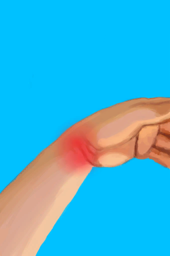

# The boar managed to hurt you!  
> You should take care of your wounds as soon as possible...  
  
<table class="table table-bordered" data-toggle="table"  data-show-header="false"><thead style="display:none"><tr ><th  style="width:50%;text-align:left;vertical-align:top;"  data-sortable="true"  >title</th><th  style="width:50%;text-align:left;vertical-align:top;"  ></th></tr></thead><tr ><td  style="width:50%;text-align:left;vertical-align:top;"  ></td><td  style="width:50%;text-align:left;vertical-align:top;"  >

<a href="Event_BoarWoundMajor.md" style="color:black">The boar managed to hurt you!</a>

</td></tr></tbody></table>  
  
## Got From  

Continue

[It got me...(Event)](Event_BoarFightBadFailure.md)

  
  
## Action  

<table><tr><td rowspan="2" style="width:200px;text-align:center;font-size:1.3em;font-weight:bold">

Nice

</td><td></td></tr><tr><td><b>Self：</b>→Dismiss</td></tr><tr><td colspan="2"><b>CardChanges：</b>装备中的[Glasses](Glasses.md)Usage  <b>-10</b></td></tr><tr><td colspan="2"><b>StatChange：</b>[

[Filth](Filth.md)](Filth.md)<b>+30</b></td></tr><tr><td colspan="2">

<table style="margin-bottom:3px;"><tr><td rowspan=2 style="text-align:center" width="80px">
Base Weight

1
</td><td style="font-size:0.6em;line-height:0.6em;font-weight:bold">Arm Fracture R</td></tr><tr><td>[

[Arm Fracture](W_ArmFractureR.md)](W_ArmFractureR.md)(<b>+1</b>)</td></tr></table>

<table style="margin-bottom:3px;"><tr><td rowspan=2 style="text-align:center" width="80px">
Base Weight

2
</td><td style="font-size:0.6em;line-height:0.6em;font-weight:bold">Arm Laceration R</td></tr><tr><td>[

[Arm Laceration](W_ArmLacerationR.md)](W_ArmLacerationR.md)(<b>+1</b>)</td></tr></table>

<table style="margin-bottom:3px;"><tr><td rowspan=2 style="text-align:center" width="80px">
Base Weight

1
</td><td style="font-size:0.6em;line-height:0.6em;font-weight:bold">Arm Fracture L</td></tr><tr><td>[

[Arm Fracture](W_ArmFractureL.md)](W_ArmFractureL.md)(<b>+1</b>)</td></tr></table>

<table style="margin-bottom:3px;"><tr><td rowspan=2 style="text-align:center" width="80px">
Base Weight

2
</td><td style="font-size:0.6em;line-height:0.6em;font-weight:bold">Arm Laceration L</td></tr><tr><td>[

[Arm Laceration](W_ArmLacerationL.md)](W_ArmLacerationL.md)(<b>+1</b>)</td></tr></table>

<table style="margin-bottom:3px;"><tr><td rowspan=2 style="text-align:center" width="80px">
Base Weight

1
</td><td style="font-size:0.6em;line-height:0.6em;font-weight:bold">Leg Fracture R</td></tr><tr><td>[

[Leg Fracture](W_LegFractureR.md)](W_LegFractureR.md)(<b>+1</b>)</td></tr></table>

<table style="margin-bottom:3px;"><tr><td rowspan=2 style="text-align:center" width="80px">
Base Weight

2
</td><td style="font-size:0.6em;line-height:0.6em;font-weight:bold">Leg Laceration R</td></tr><tr><td>[

[Leg Laceration](W_LegLacerationR.md)](W_LegLacerationR.md)(<b>+1</b>)</td></tr></table>

<table style="margin-bottom:3px;"><tr><td rowspan=2 style="text-align:center" width="80px">
Base Weight

1
</td><td style="font-size:0.6em;line-height:0.6em;font-weight:bold">Leg Fracture L</td></tr><tr><td>[

[Leg Fracture](W_LegFractureL.md)](W_LegFractureL.md)(<b>+1</b>)</td></tr></table>

<table style="margin-bottom:3px;"><tr><td rowspan=2 style="text-align:center" width="80px">
Base Weight

2
</td><td style="font-size:0.6em;line-height:0.6em;font-weight:bold">Leg Laceration L</td></tr><tr><td>[

[Leg Laceration](W_LegLacerationL.md)](W_LegLacerationL.md)(<b>+1</b>)</td></tr></table>

</td></tr></table>
  
  
  

