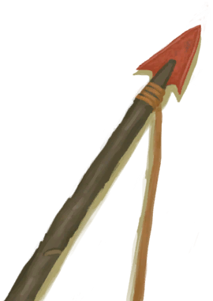
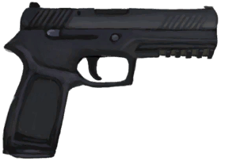

# Spitting Cobra!  
> Should I attack it or leave it alone?  
  
<table class="table table-bordered" data-toggle="table"  data-show-header="false"><thead style="display:none"><tr ><th  style="width:50%;text-align:left;vertical-align:top;"  >title</th><th  style="width:50%;text-align:left;vertical-align:top;"  ></th></tr></thead><tr ><td  style="width:50%;text-align:left;vertical-align:top;"  >**Tag：**	[“Fight Event”](tag_FightEvent.md)</td><td  style="width:50%;text-align:left;vertical-align:top;"  >

<a href="Event_CobraFight.md" style="color:black">Spitting Cobra!</a>

</td></tr></tbody></table>  
  
## Got From  

Explore

[Eastern Grasslands](GrasslandsE.md)

Explore

[Western Grasslands](GrasslandsW.md)

Explore

[Eastern Highlands](HighlandsEastern.md)

Explore

[Western Highlands](HighlandsWestern.md)

  
  
## Action  

<table><tr><td rowspan="2" style="width:200px;text-align:center;font-size:1.3em;font-weight:bold">

Attack with Spear!

30m

</td><td></td></tr><tr><td><b>Self：</b>→Dismiss</td></tr><tr><td colspan="2"><b>Require：</b>[“Spear T1”](tag_Spear.md) On Hand/Equip(Partial)</td></tr><tr><td colspan="2"><b>CardChanges：</b>手牌中的一个[“Spear T1”](tag_Spear.md)Usage  <b>-5</b></td></tr><tr><td colspan="2"><b>StatChange：</b>[

[Spear Fighting(Skill)](Skill_SpearFighting.md)](Skill_SpearFighting.md)<b>+1</b></td></tr><tr><td colspan="2">

<table style="margin-bottom:3px;"><tr><td rowspan=2 style="text-align:center" width="80px">
Base Weight

10
</td><td style="font-size:0.6em;line-height:0.6em;font-weight:bold">Success</td></tr><tr><td>[

[Success!(Event)](Event_CobraFightSuccess.md)](Event_CobraFightSuccess.md)(<b>+1</b>)</td></tr><tr><td colspan=2><li>[

[Spear Fighting(Skill)](Skill_SpearFighting.md)](Skill_SpearFighting.md) in <b>0～150</b>, weight <b>+0～+150</b></li><li>[Climb Modifier](ModifierClimb.md) in <b>0～3</b>, weight <b>+0～-125</b></li>Max 1 of：<li>[

[Flint Spear](SpearFlint.md)](SpearFlint.md) On *Hand/Equip*，Weight<b>+10</b>,</li><li>[

[Copper Spear](SpearCopper.md)](SpearCopper.md) On *Hand/Equip*，Weight<b>+20</b>,</li><li>[

[Scrap Spear](SpearScrap.md)](SpearScrap.md) On *Hand/Equip*，Weight<b>+20</b>,</li><li>[

[Obsidian Spear](SpearObsidian.md)](SpearObsidian.md) On *Hand/Equip*，Weight<b>+25</b>,</li><li>[

[Dog Friend](DogFriend.md)](DogFriend.md) On *Hand/Board*，Weight<b>+25</b>,</li></td></tr></table>

<table style="margin-bottom:3px;"><tr><td rowspan=2 style="text-align:center" width="80px">
Base Weight

20
</td><td style="font-size:0.6em;line-height:0.6em;font-weight:bold">Mixed Success</td></tr><tr><td>[

[Mixed Success(Event)](Event_CobraFightMixedSuccess.md)](Event_CobraFightMixedSuccess.md)(<b>+1</b>)</td></tr><tr><td colspan=2><li>[

[Spear Fighting(Skill)](Skill_SpearFighting.md)](Skill_SpearFighting.md) in <b>0～100</b>, weight <b>+0～+75</b></li><li>[Climb Modifier](ModifierClimb.md) in <b>0～3</b>, weight <b>+0～-60</b></li>Max 1 of：<li>[

[Flint Spear](SpearFlint.md)](SpearFlint.md) On *Hand/Equip*，Weight<b>+10</b>,</li><li>[

[Copper Spear](SpearCopper.md)](SpearCopper.md) On *Hand/Equip*，Weight<b>+20</b>,</li><li>[

[Scrap Spear](SpearScrap.md)](SpearScrap.md) On *Hand/Equip*，Weight<b>+20</b>,</li><li>[

[Obsidian Spear](SpearObsidian.md)](SpearObsidian.md) On *Hand/Equip*，Weight<b>+25</b>,</li><li>[

[Glasses](Glasses.md)](Glasses.md) On *Hand/Board*，Weight<b>-50</b>,</li><li>[

[Shield](Shield.md)](Shield.md) On *Hand/Equip*，Weight<b>-10</b>,</li></td></tr></table>

<table style="margin-bottom:3px;"><tr><td rowspan=2 style="text-align:center" width="80px">
Base Weight

20
</td><td style="font-size:0.6em;line-height:0.6em;font-weight:bold">Failure</td></tr><tr><td>[

[It Escaped!(Event)](Event_CobraFightFailure.md)](Event_CobraFightFailure.md)(<b>+1</b>)</td></tr></table>

<table style="margin-bottom:3px;"><tr><td rowspan=2 style="text-align:center" width="80px">
Base Weight

20
</td><td style="font-size:0.6em;line-height:0.6em;font-weight:bold">Bad Failure</td></tr><tr><td>[

[It got me...(Event)](Event_CobraFightBadFailure.md)](Event_CobraFightBadFailure.md)(<b>+1</b>)</td></tr><tr><td colspan=2>Max 1 of：<li>[

[Glasses](Glasses.md)](Glasses.md) On *Hand/Board*，Weight<b>-15</b>,</li><li>[

[Shield](Shield.md)](Shield.md) On *Hand/Equip*，Weight<b>-10</b>,</li></td></tr></table>
<button class="btn btn-secondary btn-sm" style="" data-toggle="modal" onclick="setCollectionDataBase64('eyJ0aXRsZSI6IlNpbXVsYXRvcjogQXR0YWNrIHdpdGggU3BlYXIhIChTcGl0dGluZyBDb2JyYSEpIiwiY29sbGVjdGlvbnMiOlt7ImRyb3AiOiI8ZGl2IHN0eWxlPVwid2lkdGg6MjVweDtkaXNwbGF5OmlubGluZS1ibG9jazt0ZXh0LWFsaWduOmNlbnRlclwiPjxpbWcgZGVjb2Rpbmc9XCJhc3luY1wiIHNyYz1cIlNwcml0ZS9TcGl0dGluZ0NvYnJhLnBuZ1wiIGhyZWY9XCJhLm1kXCIgc3R5bGU9XCJtYXgtd2lkdGg6MjVweDttYXgtaGVpZ2h0OjI1cHg7XCI+PC9kaXY+U3VjY2VzcyEoRXZlbnQpIiwiYmFzZSI6MTAsImNvbmRpdGlvbiI6W3sia2V5IjoiU2tpbGxfU3BlYXJGaWdodGluZyIsInRpdGxlIjoiU3BlYXIgRmlnaHRpbmcoU2tpbGwpIiwidHlwZSI6InJhbmdlIiwibWF4IjpbMCwxNTBdLCJyYW5nZSI6WzAsMTUwXSwid2VpZ2h0IjpbMCwxNTBdLCJkZWZhdWx0VmFsdWUiOjAsIndoZW5PdXRPZlJhbmdlIjoxfSx7ImtleSI6Ik1vZGlmaWVyQ2xpbWIiLCJ0aXRsZSI6IkNsaW1iIE1vZGlmaWVyIiwidHlwZSI6InJhbmdlIiwibWF4IjpbMCwzXSwicmFuZ2UiOlswLDNdLCJ3ZWlnaHQiOlswLC0xMjVdLCJkZWZhdWx0VmFsdWUiOjAsIndoZW5PdXRPZlJhbmdlIjoxfSx7ImtleSI6IlNwZWFyRmxpbnQiLCJ0aXRsZSI6IjxkaXYgc3R5bGU9XCJ3aWR0aDoyMHB4O2Rpc3BsYXk6aW5saW5lLWJsb2NrO3RleHQtYWxpZ246Y2VudGVyXCI+PGltZyBkZWNvZGluZz1cImFzeW5jXCIgc3JjPVwiU3ByaXRlL1NwZWFyRmxpbnQucG5nXCIgaHJlZj1cImEubWRcIiBzdHlsZT1cIm1heC13aWR0aDoyMHB4O21heC1oZWlnaHQ6MjBweDtcIj48L2Rpdj5GbGludCBTcGVhciBPbiAqSGFuZC9FcXVpcCrvvIwiLCJ0eXBlIjoidG9nZ2xlIiwicmFuZ2UiOlswLDFdLCJtYXgiOlswLDFdLCJ3ZWlnaHQiOlswLDEwXSwiZGVmYXVsdFZhbHVlIjowLCJ3aGVuT3V0T2ZSYW5nZSI6MCwibWF4U3RhY2tHcm91cCI6Ik1BWF9TVEFDS19TdWNjZXNzIn0seyJrZXkiOiJTcGVhckNvcHBlciIsInRpdGxlIjoiPGRpdiBzdHlsZT1cIndpZHRoOjIwcHg7ZGlzcGxheTppbmxpbmUtYmxvY2s7dGV4dC1hbGlnbjpjZW50ZXJcIj48aW1nIGRlY29kaW5nPVwiYXN5bmNcIiBzcmM9XCJTcHJpdGUvU3BlYXJDb3BwZXIucG5nXCIgaHJlZj1cImEubWRcIiBzdHlsZT1cIm1heC13aWR0aDoyMHB4O21heC1oZWlnaHQ6MjBweDtcIj48L2Rpdj5Db3BwZXIgU3BlYXIgT24gKkhhbmQvRXF1aXAq77yMIiwidHlwZSI6InRvZ2dsZSIsInJhbmdlIjpbMCwxXSwibWF4IjpbMCwxXSwid2VpZ2h0IjpbMCwyMF0sImRlZmF1bHRWYWx1ZSI6MCwid2hlbk91dE9mUmFuZ2UiOjAsIm1heFN0YWNrR3JvdXAiOiJNQVhfU1RBQ0tfU3VjY2VzcyJ9LHsia2V5IjoiU3BlYXJTY3JhcCIsInRpdGxlIjoiPGRpdiBzdHlsZT1cIndpZHRoOjIwcHg7ZGlzcGxheTppbmxpbmUtYmxvY2s7dGV4dC1hbGlnbjpjZW50ZXJcIj48aW1nIGRlY29kaW5nPVwiYXN5bmNcIiBzcmM9XCJTcHJpdGUvU3BlYXJTY3JhcC5wbmdcIiBocmVmPVwiYS5tZFwiIHN0eWxlPVwibWF4LXdpZHRoOjIwcHg7bWF4LWhlaWdodDoyMHB4O1wiPjwvZGl2PlNjcmFwIFNwZWFyIE9uICpIYW5kL0VxdWlwKu+8jCIsInR5cGUiOiJ0b2dnbGUiLCJyYW5nZSI6WzAsMV0sIm1heCI6WzAsMV0sIndlaWdodCI6WzAsMjBdLCJkZWZhdWx0VmFsdWUiOjAsIndoZW5PdXRPZlJhbmdlIjowLCJtYXhTdGFja0dyb3VwIjoiTUFYX1NUQUNLX1N1Y2Nlc3MifSx7ImtleSI6IlNwZWFyT2JzaWRpYW4iLCJ0aXRsZSI6IjxkaXYgc3R5bGU9XCJ3aWR0aDoyMHB4O2Rpc3BsYXk6aW5saW5lLWJsb2NrO3RleHQtYWxpZ246Y2VudGVyXCI+PGltZyBkZWNvZGluZz1cImFzeW5jXCIgc3JjPVwiU3ByaXRlL1NwZWFyT2JzaWRpYW4ucG5nXCIgaHJlZj1cImEubWRcIiBzdHlsZT1cIm1heC13aWR0aDoyMHB4O21heC1oZWlnaHQ6MjBweDtcIj48L2Rpdj5PYnNpZGlhbiBTcGVhciBPbiAqSGFuZC9FcXVpcCrvvIwiLCJ0eXBlIjoidG9nZ2xlIiwicmFuZ2UiOlswLDFdLCJtYXgiOlswLDFdLCJ3ZWlnaHQiOlswLDI1XSwiZGVmYXVsdFZhbHVlIjowLCJ3aGVuT3V0T2ZSYW5nZSI6MCwibWF4U3RhY2tHcm91cCI6Ik1BWF9TVEFDS19TdWNjZXNzIn0seyJrZXkiOiJEb2dGcmllbmQiLCJ0aXRsZSI6IjxkaXYgc3R5bGU9XCJ3aWR0aDoyMHB4O2Rpc3BsYXk6aW5saW5lLWJsb2NrO3RleHQtYWxpZ246Y2VudGVyXCI+PGltZyBkZWNvZGluZz1cImFzeW5jXCIgc3JjPVwiU3ByaXRlL0RvZy5wbmdcIiBocmVmPVwiYS5tZFwiIHN0eWxlPVwibWF4LXdpZHRoOjIwcHg7bWF4LWhlaWdodDoyMHB4O1wiPjwvZGl2PkRvZyBGcmllbmQgT24gKkhhbmQvQm9hcmQq77yMIiwidHlwZSI6InRvZ2dsZSIsInJhbmdlIjpbMCwxXSwibWF4IjpbMCwxXSwid2VpZ2h0IjpbMCwyNV0sImRlZmF1bHRWYWx1ZSI6MCwid2hlbk91dE9mUmFuZ2UiOjAsIm1heFN0YWNrR3JvdXAiOiJNQVhfU1RBQ0tfU3VjY2VzcyJ9XX0seyJkcm9wIjoiPGRpdiBzdHlsZT1cIndpZHRoOjI1cHg7ZGlzcGxheTppbmxpbmUtYmxvY2s7dGV4dC1hbGlnbjpjZW50ZXJcIj48aW1nIGRlY29kaW5nPVwiYXN5bmNcIiBzcmM9XCJTcHJpdGUvU3BpdHRpbmdDb2JyYS5wbmdcIiBocmVmPVwiYS5tZFwiIHN0eWxlPVwibWF4LXdpZHRoOjI1cHg7bWF4LWhlaWdodDoyNXB4O1wiPjwvZGl2Pk1peGVkIFN1Y2Nlc3MoRXZlbnQpIiwiYmFzZSI6MjAsImNvbmRpdGlvbiI6W3sia2V5IjoiU2tpbGxfU3BlYXJGaWdodGluZyIsInRpdGxlIjoiU3BlYXIgRmlnaHRpbmcoU2tpbGwpIiwidHlwZSI6InJhbmdlIiwibWF4IjpbMCwxNTBdLCJyYW5nZSI6WzAsMTAwXSwid2VpZ2h0IjpbMCw3NV0sImRlZmF1bHRWYWx1ZSI6MCwid2hlbk91dE9mUmFuZ2UiOjF9LHsia2V5IjoiTW9kaWZpZXJDbGltYiIsInRpdGxlIjoiQ2xpbWIgTW9kaWZpZXIiLCJ0eXBlIjoicmFuZ2UiLCJtYXgiOlswLDNdLCJyYW5nZSI6WzAsM10sIndlaWdodCI6WzAsLTYwXSwiZGVmYXVsdFZhbHVlIjowLCJ3aGVuT3V0T2ZSYW5nZSI6MX0seyJrZXkiOiJTcGVhckZsaW50IiwidGl0bGUiOiI8ZGl2IHN0eWxlPVwid2lkdGg6MjBweDtkaXNwbGF5OmlubGluZS1ibG9jazt0ZXh0LWFsaWduOmNlbnRlclwiPjxpbWcgZGVjb2Rpbmc9XCJhc3luY1wiIHNyYz1cIlNwcml0ZS9TcGVhckZsaW50LnBuZ1wiIGhyZWY9XCJhLm1kXCIgc3R5bGU9XCJtYXgtd2lkdGg6MjBweDttYXgtaGVpZ2h0OjIwcHg7XCI+PC9kaXY+RmxpbnQgU3BlYXIgT24gKkhhbmQvRXF1aXAq77yMIiwidHlwZSI6InRvZ2dsZSIsInJhbmdlIjpbMCwxXSwibWF4IjpbMCwxXSwid2VpZ2h0IjpbMCwxMF0sImRlZmF1bHRWYWx1ZSI6MCwid2hlbk91dE9mUmFuZ2UiOjAsIm1heFN0YWNrR3JvdXAiOiJNQVhfU1RBQ0tfTWl4ZWQgU3VjY2VzcyJ9LHsia2V5IjoiU3BlYXJDb3BwZXIiLCJ0aXRsZSI6IjxkaXYgc3R5bGU9XCJ3aWR0aDoyMHB4O2Rpc3BsYXk6aW5saW5lLWJsb2NrO3RleHQtYWxpZ246Y2VudGVyXCI+PGltZyBkZWNvZGluZz1cImFzeW5jXCIgc3JjPVwiU3ByaXRlL1NwZWFyQ29wcGVyLnBuZ1wiIGhyZWY9XCJhLm1kXCIgc3R5bGU9XCJtYXgtd2lkdGg6MjBweDttYXgtaGVpZ2h0OjIwcHg7XCI+PC9kaXY+Q29wcGVyIFNwZWFyIE9uICpIYW5kL0VxdWlwKu+8jCIsInR5cGUiOiJ0b2dnbGUiLCJyYW5nZSI6WzAsMV0sIm1heCI6WzAsMV0sIndlaWdodCI6WzAsMjBdLCJkZWZhdWx0VmFsdWUiOjAsIndoZW5PdXRPZlJhbmdlIjowLCJtYXhTdGFja0dyb3VwIjoiTUFYX1NUQUNLX01peGVkIFN1Y2Nlc3MifSx7ImtleSI6IlNwZWFyU2NyYXAiLCJ0aXRsZSI6IjxkaXYgc3R5bGU9XCJ3aWR0aDoyMHB4O2Rpc3BsYXk6aW5saW5lLWJsb2NrO3RleHQtYWxpZ246Y2VudGVyXCI+PGltZyBkZWNvZGluZz1cImFzeW5jXCIgc3JjPVwiU3ByaXRlL1NwZWFyU2NyYXAucG5nXCIgaHJlZj1cImEubWRcIiBzdHlsZT1cIm1heC13aWR0aDoyMHB4O21heC1oZWlnaHQ6MjBweDtcIj48L2Rpdj5TY3JhcCBTcGVhciBPbiAqSGFuZC9FcXVpcCrvvIwiLCJ0eXBlIjoidG9nZ2xlIiwicmFuZ2UiOlswLDFdLCJtYXgiOlswLDFdLCJ3ZWlnaHQiOlswLDIwXSwiZGVmYXVsdFZhbHVlIjowLCJ3aGVuT3V0T2ZSYW5nZSI6MCwibWF4U3RhY2tHcm91cCI6Ik1BWF9TVEFDS19NaXhlZCBTdWNjZXNzIn0seyJrZXkiOiJTcGVhck9ic2lkaWFuIiwidGl0bGUiOiI8ZGl2IHN0eWxlPVwid2lkdGg6MjBweDtkaXNwbGF5OmlubGluZS1ibG9jazt0ZXh0LWFsaWduOmNlbnRlclwiPjxpbWcgZGVjb2Rpbmc9XCJhc3luY1wiIHNyYz1cIlNwcml0ZS9TcGVhck9ic2lkaWFuLnBuZ1wiIGhyZWY9XCJhLm1kXCIgc3R5bGU9XCJtYXgtd2lkdGg6MjBweDttYXgtaGVpZ2h0OjIwcHg7XCI+PC9kaXY+T2JzaWRpYW4gU3BlYXIgT24gKkhhbmQvRXF1aXAq77yMIiwidHlwZSI6InRvZ2dsZSIsInJhbmdlIjpbMCwxXSwibWF4IjpbMCwxXSwid2VpZ2h0IjpbMCwyNV0sImRlZmF1bHRWYWx1ZSI6MCwid2hlbk91dE9mUmFuZ2UiOjAsIm1heFN0YWNrR3JvdXAiOiJNQVhfU1RBQ0tfTWl4ZWQgU3VjY2VzcyJ9LHsia2V5IjoiR2xhc3NlcyIsInRpdGxlIjoiPGRpdiBzdHlsZT1cIndpZHRoOjIwcHg7ZGlzcGxheTppbmxpbmUtYmxvY2s7dGV4dC1hbGlnbjpjZW50ZXJcIj48aW1nIGRlY29kaW5nPVwiYXN5bmNcIiBzcmM9XCJTcHJpdGUvR2xhc3Nlcy5wbmdcIiBocmVmPVwiYS5tZFwiIHN0eWxlPVwibWF4LXdpZHRoOjIwcHg7bWF4LWhlaWdodDoyMHB4O1wiPjwvZGl2PkdsYXNzZXMgT24gKkhhbmQvQm9hcmQq77yMIiwidHlwZSI6InRvZ2dsZSIsInJhbmdlIjpbMCwxXSwibWF4IjpbMCwxXSwid2VpZ2h0IjpbMCwtNTBdLCJkZWZhdWx0VmFsdWUiOjAsIndoZW5PdXRPZlJhbmdlIjowLCJtYXhTdGFja0dyb3VwIjoiTUFYX1NUQUNLX01peGVkIFN1Y2Nlc3MifSx7ImtleSI6IlNoaWVsZCIsInRpdGxlIjoiPGRpdiBzdHlsZT1cIndpZHRoOjIwcHg7ZGlzcGxheTppbmxpbmUtYmxvY2s7dGV4dC1hbGlnbjpjZW50ZXJcIj48aW1nIGRlY29kaW5nPVwiYXN5bmNcIiBzcmM9XCJTcHJpdGUvU2hpZWxkLnBuZ1wiIGhyZWY9XCJhLm1kXCIgc3R5bGU9XCJtYXgtd2lkdGg6MjBweDttYXgtaGVpZ2h0OjIwcHg7XCI+PC9kaXY+U2hpZWxkIE9uICpIYW5kL0VxdWlwKu+8jCIsInR5cGUiOiJ0b2dnbGUiLCJyYW5nZSI6WzAsMV0sIm1heCI6WzAsMV0sIndlaWdodCI6WzAsLTEwXSwiZGVmYXVsdFZhbHVlIjowLCJ3aGVuT3V0T2ZSYW5nZSI6MCwibWF4U3RhY2tHcm91cCI6Ik1BWF9TVEFDS19NaXhlZCBTdWNjZXNzIn1dfSx7ImRyb3AiOiI8ZGl2IHN0eWxlPVwid2lkdGg6MjVweDtkaXNwbGF5OmlubGluZS1ibG9jazt0ZXh0LWFsaWduOmNlbnRlclwiPjxpbWcgZGVjb2Rpbmc9XCJhc3luY1wiIHNyYz1cIlNwcml0ZS9TcGl0dGluZ0NvYnJhLnBuZ1wiIGhyZWY9XCJhLm1kXCIgc3R5bGU9XCJtYXgtd2lkdGg6MjVweDttYXgtaGVpZ2h0OjI1cHg7XCI+PC9kaXY+SXQgRXNjYXBlZCEoRXZlbnQpIiwiYmFzZSI6MjAsImNvbmRpdGlvbiI6W119LHsiZHJvcCI6IjxkaXYgc3R5bGU9XCJ3aWR0aDoyNXB4O2Rpc3BsYXk6aW5saW5lLWJsb2NrO3RleHQtYWxpZ246Y2VudGVyXCI+PGltZyBkZWNvZGluZz1cImFzeW5jXCIgc3JjPVwiU3ByaXRlL1NwaXR0aW5nQ29icmEucG5nXCIgaHJlZj1cImEubWRcIiBzdHlsZT1cIm1heC13aWR0aDoyNXB4O21heC1oZWlnaHQ6MjVweDtcIj48L2Rpdj5JdCBnb3QgbWUuLi4oRXZlbnQpIiwiYmFzZSI6MjAsImNvbmRpdGlvbiI6W3sia2V5IjoiR2xhc3NlcyIsInRpdGxlIjoiPGRpdiBzdHlsZT1cIndpZHRoOjIwcHg7ZGlzcGxheTppbmxpbmUtYmxvY2s7dGV4dC1hbGlnbjpjZW50ZXJcIj48aW1nIGRlY29kaW5nPVwiYXN5bmNcIiBzcmM9XCJTcHJpdGUvR2xhc3Nlcy5wbmdcIiBocmVmPVwiYS5tZFwiIHN0eWxlPVwibWF4LXdpZHRoOjIwcHg7bWF4LWhlaWdodDoyMHB4O1wiPjwvZGl2PkdsYXNzZXMgT24gKkhhbmQvQm9hcmQq77yMIiwidHlwZSI6InRvZ2dsZSIsInJhbmdlIjpbMCwxXSwibWF4IjpbMCwxXSwid2VpZ2h0IjpbMCwtMTVdLCJkZWZhdWx0VmFsdWUiOjAsIndoZW5PdXRPZlJhbmdlIjowLCJtYXhTdGFja0dyb3VwIjoiTUFYX1NUQUNLX0JhZCBGYWlsdXJlIn0seyJrZXkiOiJTaGllbGQiLCJ0aXRsZSI6IjxkaXYgc3R5bGU9XCJ3aWR0aDoyMHB4O2Rpc3BsYXk6aW5saW5lLWJsb2NrO3RleHQtYWxpZ246Y2VudGVyXCI+PGltZyBkZWNvZGluZz1cImFzeW5jXCIgc3JjPVwiU3ByaXRlL1NoaWVsZC5wbmdcIiBocmVmPVwiYS5tZFwiIHN0eWxlPVwibWF4LXdpZHRoOjIwcHg7bWF4LWhlaWdodDoyMHB4O1wiPjwvZGl2PlNoaWVsZCBPbiAqSGFuZC9FcXVpcCrvvIwiLCJ0eXBlIjoidG9nZ2xlIiwicmFuZ2UiOlswLDFdLCJtYXgiOlswLDFdLCJ3ZWlnaHQiOlswLC0xMF0sImRlZmF1bHRWYWx1ZSI6MCwid2hlbk91dE9mUmFuZ2UiOjAsIm1heFN0YWNrR3JvdXAiOiJNQVhfU1RBQ0tfQmFkIEZhaWx1cmUifV19XX0=')" data-target="#modelCollectionSimulator">Simulator</button>
</td></tr></table>
  

<table><tr><td rowspan="2" style="width:200px;text-align:center;font-size:1.3em;font-weight:bold">

Attack with Bow!

30m

</td><td></td></tr><tr><td><b>Self：</b>→Dismiss</td></tr><tr><td colspan="2"><b>Require：</b>[

[Rustic Bow](BowRustic.md)](BowRustic.md) On Hand/Equip, [

[Simple Arrow](ArrowSimple.md)](ArrowSimple.md) On Hand</td></tr><tr><td colspan="2"><b>CardChanges：</b>手牌中的一个[Rustic Bow](BowRustic.md)Usage  <b>-1</b>, 手牌中的一个[Simple Arrow](ArrowSimple.md)Usage  <b>-3～-1</b></td></tr><tr><td colspan="2"><b>StatChange：</b>[

[Archery(Skill)](Skill_Archery.md)](Skill_Archery.md)<b>+1</b></td></tr><tr><td colspan="2">

<table style="margin-bottom:3px;"><tr><td rowspan=2 style="text-align:center" width="80px">
Base Weight

15
</td><td style="font-size:0.6em;line-height:0.6em;font-weight:bold">Success</td></tr><tr><td>[

[Success!(Event)](Event_CobraFightSuccess.md)](Event_CobraFightSuccess.md)(<b>+1</b>)</td></tr><tr><td colspan=2><li>[

[Archery(Skill)](Skill_Archery.md)](Skill_Archery.md) in <b>0～150</b>, weight <b>+0～+150</b></li><li>[Climb Modifier](ModifierClimb.md) in <b>0～3</b>, weight <b>+0～-125</b></li><li>[

[Eyesight](Myopia.md)](Myopia.md) in <b>0～3</b>, weight <b>+0～-100</b></li><li>[

[Dog Friend](DogFriend.md)](DogFriend.md) On *Hand/Board*，Weight<b>+25</b>,</li></td></tr></table>

<table style="margin-bottom:3px;"><tr><td rowspan=2 style="text-align:center" width="80px">
Base Weight

15
</td><td style="font-size:0.6em;line-height:0.6em;font-weight:bold">Mixed Success</td></tr><tr><td>[

[Mixed Success(Event)](Event_CobraFightMixedSuccess.md)](Event_CobraFightMixedSuccess.md)(<b>+1</b>)</td></tr><tr><td colspan=2><li>[

[Archery(Skill)](Skill_Archery.md)](Skill_Archery.md) in <b>0～100</b>, weight <b>+0～+75</b></li><li>[Climb Modifier](ModifierClimb.md) in <b>0～3</b>, weight <b>+0～-60</b></li><li>[

[Glasses](Glasses.md)](Glasses.md) On *Hand/Board*，Weight<b>-50</b>,</li></td></tr></table>

<table style="margin-bottom:3px;"><tr><td rowspan=2 style="text-align:center" width="80px">
Base Weight

40
</td><td style="font-size:0.6em;line-height:0.6em;font-weight:bold">Failure</td></tr><tr><td>[

[It Escaped!(Event)](Event_CobraFightFailure.md)](Event_CobraFightFailure.md)(<b>+1</b>)</td></tr></table>

<table style="margin-bottom:3px;"><tr><td rowspan=2 style="text-align:center" width="80px">
Base Weight

10
</td><td style="font-size:0.6em;line-height:0.6em;font-weight:bold">Bad Failure</td></tr><tr><td>[

[It got me...(Event)](Event_CobraFightBadFailure.md)](Event_CobraFightBadFailure.md)(<b>+1</b>)</td></tr><tr><td colspan=2><li>[

[Glasses](Glasses.md)](Glasses.md) On *Hand/Board*，Weight<b>-7</b>,</li></td></tr></table>
<button class="btn btn-secondary btn-sm" style="" data-toggle="modal" onclick="setCollectionDataBase64('eyJ0aXRsZSI6IlNpbXVsYXRvcjogQXR0YWNrIHdpdGggQm93ISAoU3BpdHRpbmcgQ29icmEhKSIsImNvbGxlY3Rpb25zIjpbeyJkcm9wIjoiPGRpdiBzdHlsZT1cIndpZHRoOjI1cHg7ZGlzcGxheTppbmxpbmUtYmxvY2s7dGV4dC1hbGlnbjpjZW50ZXJcIj48aW1nIGRlY29kaW5nPVwiYXN5bmNcIiBzcmM9XCJTcHJpdGUvU3BpdHRpbmdDb2JyYS5wbmdcIiBocmVmPVwiYS5tZFwiIHN0eWxlPVwibWF4LXdpZHRoOjI1cHg7bWF4LWhlaWdodDoyNXB4O1wiPjwvZGl2PlN1Y2Nlc3MhKEV2ZW50KSIsImJhc2UiOjE1LCJjb25kaXRpb24iOlt7ImtleSI6IlNraWxsX0FyY2hlcnkiLCJ0aXRsZSI6IkFyY2hlcnkoU2tpbGwpIiwidHlwZSI6InJhbmdlIiwibWF4IjpbMCwxNTBdLCJyYW5nZSI6WzAsMTUwXSwid2VpZ2h0IjpbMCwxNTBdLCJkZWZhdWx0VmFsdWUiOjAsIndoZW5PdXRPZlJhbmdlIjoxfSx7ImtleSI6Ik1vZGlmaWVyQ2xpbWIiLCJ0aXRsZSI6IkNsaW1iIE1vZGlmaWVyIiwidHlwZSI6InJhbmdlIiwibWF4IjpbMCwzXSwicmFuZ2UiOlswLDNdLCJ3ZWlnaHQiOlswLC0xMjVdLCJkZWZhdWx0VmFsdWUiOjAsIndoZW5PdXRPZlJhbmdlIjoxfSx7ImtleSI6Ik15b3BpYSIsInRpdGxlIjoiRXllc2lnaHQiLCJ0eXBlIjoicmFuZ2UiLCJtYXgiOlswLDNdLCJyYW5nZSI6WzAsM10sIndlaWdodCI6WzAsLTEwMF0sImRlZmF1bHRWYWx1ZSI6MCwid2hlbk91dE9mUmFuZ2UiOjF9LHsia2V5IjoiRG9nRnJpZW5kIiwidGl0bGUiOiI8ZGl2IHN0eWxlPVwid2lkdGg6MjBweDtkaXNwbGF5OmlubGluZS1ibG9jazt0ZXh0LWFsaWduOmNlbnRlclwiPjxpbWcgZGVjb2Rpbmc9XCJhc3luY1wiIHNyYz1cIlNwcml0ZS9Eb2cucG5nXCIgaHJlZj1cImEubWRcIiBzdHlsZT1cIm1heC13aWR0aDoyMHB4O21heC1oZWlnaHQ6MjBweDtcIj48L2Rpdj5Eb2cgRnJpZW5kIE9uICpIYW5kL0JvYXJkKu+8jCIsInR5cGUiOiJ0b2dnbGUiLCJyYW5nZSI6WzAsMV0sIm1heCI6WzAsMV0sIndlaWdodCI6WzAsMjVdLCJkZWZhdWx0VmFsdWUiOjAsIndoZW5PdXRPZlJhbmdlIjowLCJtYXhTdGFja0dyb3VwIjoiIn1dfSx7ImRyb3AiOiI8ZGl2IHN0eWxlPVwid2lkdGg6MjVweDtkaXNwbGF5OmlubGluZS1ibG9jazt0ZXh0LWFsaWduOmNlbnRlclwiPjxpbWcgZGVjb2Rpbmc9XCJhc3luY1wiIHNyYz1cIlNwcml0ZS9TcGl0dGluZ0NvYnJhLnBuZ1wiIGhyZWY9XCJhLm1kXCIgc3R5bGU9XCJtYXgtd2lkdGg6MjVweDttYXgtaGVpZ2h0OjI1cHg7XCI+PC9kaXY+TWl4ZWQgU3VjY2VzcyhFdmVudCkiLCJiYXNlIjoxNSwiY29uZGl0aW9uIjpbeyJrZXkiOiJTa2lsbF9BcmNoZXJ5IiwidGl0bGUiOiJBcmNoZXJ5KFNraWxsKSIsInR5cGUiOiJyYW5nZSIsIm1heCI6WzAsMTUwXSwicmFuZ2UiOlswLDEwMF0sIndlaWdodCI6WzAsNzVdLCJkZWZhdWx0VmFsdWUiOjAsIndoZW5PdXRPZlJhbmdlIjoxfSx7ImtleSI6Ik1vZGlmaWVyQ2xpbWIiLCJ0aXRsZSI6IkNsaW1iIE1vZGlmaWVyIiwidHlwZSI6InJhbmdlIiwibWF4IjpbMCwzXSwicmFuZ2UiOlswLDNdLCJ3ZWlnaHQiOlswLC02MF0sImRlZmF1bHRWYWx1ZSI6MCwid2hlbk91dE9mUmFuZ2UiOjF9LHsia2V5IjoiR2xhc3NlcyIsInRpdGxlIjoiPGRpdiBzdHlsZT1cIndpZHRoOjIwcHg7ZGlzcGxheTppbmxpbmUtYmxvY2s7dGV4dC1hbGlnbjpjZW50ZXJcIj48aW1nIGRlY29kaW5nPVwiYXN5bmNcIiBzcmM9XCJTcHJpdGUvR2xhc3Nlcy5wbmdcIiBocmVmPVwiYS5tZFwiIHN0eWxlPVwibWF4LXdpZHRoOjIwcHg7bWF4LWhlaWdodDoyMHB4O1wiPjwvZGl2PkdsYXNzZXMgT24gKkhhbmQvQm9hcmQq77yMIiwidHlwZSI6InRvZ2dsZSIsInJhbmdlIjpbMCwxXSwibWF4IjpbMCwxXSwid2VpZ2h0IjpbMCwtNTBdLCJkZWZhdWx0VmFsdWUiOjAsIndoZW5PdXRPZlJhbmdlIjowLCJtYXhTdGFja0dyb3VwIjoiIn1dfSx7ImRyb3AiOiI8ZGl2IHN0eWxlPVwid2lkdGg6MjVweDtkaXNwbGF5OmlubGluZS1ibG9jazt0ZXh0LWFsaWduOmNlbnRlclwiPjxpbWcgZGVjb2Rpbmc9XCJhc3luY1wiIHNyYz1cIlNwcml0ZS9TcGl0dGluZ0NvYnJhLnBuZ1wiIGhyZWY9XCJhLm1kXCIgc3R5bGU9XCJtYXgtd2lkdGg6MjVweDttYXgtaGVpZ2h0OjI1cHg7XCI+PC9kaXY+SXQgRXNjYXBlZCEoRXZlbnQpIiwiYmFzZSI6NDAsImNvbmRpdGlvbiI6W119LHsiZHJvcCI6IjxkaXYgc3R5bGU9XCJ3aWR0aDoyNXB4O2Rpc3BsYXk6aW5saW5lLWJsb2NrO3RleHQtYWxpZ246Y2VudGVyXCI+PGltZyBkZWNvZGluZz1cImFzeW5jXCIgc3JjPVwiU3ByaXRlL1NwaXR0aW5nQ29icmEucG5nXCIgaHJlZj1cImEubWRcIiBzdHlsZT1cIm1heC13aWR0aDoyNXB4O21heC1oZWlnaHQ6MjVweDtcIj48L2Rpdj5JdCBnb3QgbWUuLi4oRXZlbnQpIiwiYmFzZSI6MTAsImNvbmRpdGlvbiI6W3sia2V5IjoiR2xhc3NlcyIsInRpdGxlIjoiPGRpdiBzdHlsZT1cIndpZHRoOjIwcHg7ZGlzcGxheTppbmxpbmUtYmxvY2s7dGV4dC1hbGlnbjpjZW50ZXJcIj48aW1nIGRlY29kaW5nPVwiYXN5bmNcIiBzcmM9XCJTcHJpdGUvR2xhc3Nlcy5wbmdcIiBocmVmPVwiYS5tZFwiIHN0eWxlPVwibWF4LXdpZHRoOjIwcHg7bWF4LWhlaWdodDoyMHB4O1wiPjwvZGl2PkdsYXNzZXMgT24gKkhhbmQvQm9hcmQq77yMIiwidHlwZSI6InRvZ2dsZSIsInJhbmdlIjpbMCwxXSwibWF4IjpbMCwxXSwid2VpZ2h0IjpbMCwtN10sImRlZmF1bHRWYWx1ZSI6MCwid2hlbk91dE9mUmFuZ2UiOjAsIm1heFN0YWNrR3JvdXAiOiIifV19XX0=')" data-target="#modelCollectionSimulator">Simulator</button>
</td></tr></table>
  

<table><tr><td rowspan="2" style="width:200px;text-align:center;font-size:1.3em;font-weight:bold">

Attack with Gun!

30m

</td><td></td></tr><tr><td><b>Self：</b>→Dismiss</td></tr><tr><td colspan="2"><b>Require：</b>[

[Gun](Gun.md)](Gun.md) On Hand</td></tr><tr><td colspan="2"><b>CardChanges：</b>手牌中的一个[Gun](Gun.md)Usage  <b>-1</b></td></tr><tr><td colspan="2"><b>StatChange：</b>[

[Handguns(Skill)](Skill_Handguns.md)](Skill_Handguns.md)<b>+1</b></td></tr><tr><td colspan="2">

<table style="margin-bottom:3px;"><tr><td rowspan=2 style="text-align:center" width="80px">
Base Weight

50
</td><td style="font-size:0.6em;line-height:0.6em;font-weight:bold">Success</td></tr><tr><td>[

[Success!(Event)](Event_CobraFightSuccess.md)](Event_CobraFightSuccess.md)(<b>+1</b>)</td></tr><tr><td colspan=2><li>[

[Handguns(Skill)](Skill_Handguns.md)](Skill_Handguns.md) in <b>0～150</b>, weight <b>+0～+150</b></li><li>[Hand Modifier](ModifierHand.md) in <b>0～3</b>, weight <b>+0～-125</b></li><li>[

[Eyesight](Myopia.md)](Myopia.md) in <b>0～3</b>, weight <b>+0～-100</b></li><li>[

[Dog Friend](DogFriend.md)](DogFriend.md) On *Hand/Board*，Weight<b>+25</b>,</li></td></tr></table>

<table style="margin-bottom:3px;"><tr><td rowspan=2 style="text-align:center" width="80px">
Base Weight

20
</td><td style="font-size:0.6em;line-height:0.6em;font-weight:bold">Mixed Success</td></tr><tr><td>[

[Mixed Success(Event)](Event_CobraFightMixedSuccess.md)](Event_CobraFightMixedSuccess.md)(<b>+1</b>)</td></tr><tr><td colspan=2><li>[

[Handguns(Skill)](Skill_Handguns.md)](Skill_Handguns.md) in <b>0～100</b>, weight <b>+0～+75</b></li><li>[Hand Modifier](ModifierHand.md) in <b>0～3</b>, weight <b>+0～-60</b></li><li>[

[Glasses](Glasses.md)](Glasses.md) On *Hand/Board*，Weight<b>-15</b>,</li></td></tr></table>

<table style="margin-bottom:3px;"><tr><td rowspan=2 style="text-align:center" width="80px">
Base Weight

40
</td><td style="font-size:0.6em;line-height:0.6em;font-weight:bold">Failure</td></tr><tr><td>[

[It Escaped!(Event)](Event_MonitorFightFailure.md)](Event_MonitorFightFailure.md)(<b>+1</b>)</td></tr></table>

<table style="margin-bottom:3px;"><tr><td rowspan=2 style="text-align:center" width="80px">
Base Weight

10
</td><td style="font-size:0.6em;line-height:0.6em;font-weight:bold">Bad Failure</td></tr><tr><td>[

[It got me...(Event)](Event_CobraFightBadFailure.md)](Event_CobraFightBadFailure.md)(<b>+1</b>)</td></tr><tr><td colspan=2><li>[

[Glasses](Glasses.md)](Glasses.md) On *Hand/Board*，Weight<b>-7</b>,</li></td></tr></table>
<button class="btn btn-secondary btn-sm" style="" data-toggle="modal" onclick="setCollectionDataBase64('eyJ0aXRsZSI6IlNpbXVsYXRvcjogQXR0YWNrIHdpdGggR3VuISAoU3BpdHRpbmcgQ29icmEhKSIsImNvbGxlY3Rpb25zIjpbeyJkcm9wIjoiPGRpdiBzdHlsZT1cIndpZHRoOjI1cHg7ZGlzcGxheTppbmxpbmUtYmxvY2s7dGV4dC1hbGlnbjpjZW50ZXJcIj48aW1nIGRlY29kaW5nPVwiYXN5bmNcIiBzcmM9XCJTcHJpdGUvU3BpdHRpbmdDb2JyYS5wbmdcIiBocmVmPVwiYS5tZFwiIHN0eWxlPVwibWF4LXdpZHRoOjI1cHg7bWF4LWhlaWdodDoyNXB4O1wiPjwvZGl2PlN1Y2Nlc3MhKEV2ZW50KSIsImJhc2UiOjUwLCJjb25kaXRpb24iOlt7ImtleSI6IlNraWxsX0hhbmRndW5zIiwidGl0bGUiOiJIYW5kZ3VucyhTa2lsbCkiLCJ0eXBlIjoicmFuZ2UiLCJtYXgiOlswLDE1MF0sInJhbmdlIjpbMCwxNTBdLCJ3ZWlnaHQiOlswLDE1MF0sImRlZmF1bHRWYWx1ZSI6MCwid2hlbk91dE9mUmFuZ2UiOjF9LHsia2V5IjoiTW9kaWZpZXJIYW5kIiwidGl0bGUiOiJIYW5kIE1vZGlmaWVyIiwidHlwZSI6InJhbmdlIiwibWF4IjpbMCwzXSwicmFuZ2UiOlswLDNdLCJ3ZWlnaHQiOlswLC0xMjVdLCJkZWZhdWx0VmFsdWUiOjAsIndoZW5PdXRPZlJhbmdlIjoxfSx7ImtleSI6Ik15b3BpYSIsInRpdGxlIjoiRXllc2lnaHQiLCJ0eXBlIjoicmFuZ2UiLCJtYXgiOlswLDNdLCJyYW5nZSI6WzAsM10sIndlaWdodCI6WzAsLTEwMF0sImRlZmF1bHRWYWx1ZSI6MCwid2hlbk91dE9mUmFuZ2UiOjF9LHsia2V5IjoiRG9nRnJpZW5kIiwidGl0bGUiOiI8ZGl2IHN0eWxlPVwid2lkdGg6MjBweDtkaXNwbGF5OmlubGluZS1ibG9jazt0ZXh0LWFsaWduOmNlbnRlclwiPjxpbWcgZGVjb2Rpbmc9XCJhc3luY1wiIHNyYz1cIlNwcml0ZS9Eb2cucG5nXCIgaHJlZj1cImEubWRcIiBzdHlsZT1cIm1heC13aWR0aDoyMHB4O21heC1oZWlnaHQ6MjBweDtcIj48L2Rpdj5Eb2cgRnJpZW5kIE9uICpIYW5kL0JvYXJkKu+8jCIsInR5cGUiOiJ0b2dnbGUiLCJyYW5nZSI6WzAsMV0sIm1heCI6WzAsMV0sIndlaWdodCI6WzAsMjVdLCJkZWZhdWx0VmFsdWUiOjAsIndoZW5PdXRPZlJhbmdlIjowLCJtYXhTdGFja0dyb3VwIjoiIn1dfSx7ImRyb3AiOiI8ZGl2IHN0eWxlPVwid2lkdGg6MjVweDtkaXNwbGF5OmlubGluZS1ibG9jazt0ZXh0LWFsaWduOmNlbnRlclwiPjxpbWcgZGVjb2Rpbmc9XCJhc3luY1wiIHNyYz1cIlNwcml0ZS9TcGl0dGluZ0NvYnJhLnBuZ1wiIGhyZWY9XCJhLm1kXCIgc3R5bGU9XCJtYXgtd2lkdGg6MjVweDttYXgtaGVpZ2h0OjI1cHg7XCI+PC9kaXY+TWl4ZWQgU3VjY2VzcyhFdmVudCkiLCJiYXNlIjoyMCwiY29uZGl0aW9uIjpbeyJrZXkiOiJTa2lsbF9IYW5kZ3VucyIsInRpdGxlIjoiSGFuZGd1bnMoU2tpbGwpIiwidHlwZSI6InJhbmdlIiwibWF4IjpbMCwxNTBdLCJyYW5nZSI6WzAsMTAwXSwid2VpZ2h0IjpbMCw3NV0sImRlZmF1bHRWYWx1ZSI6MCwid2hlbk91dE9mUmFuZ2UiOjF9LHsia2V5IjoiTW9kaWZpZXJIYW5kIiwidGl0bGUiOiJIYW5kIE1vZGlmaWVyIiwidHlwZSI6InJhbmdlIiwibWF4IjpbMCwzXSwicmFuZ2UiOlswLDNdLCJ3ZWlnaHQiOlswLC02MF0sImRlZmF1bHRWYWx1ZSI6MCwid2hlbk91dE9mUmFuZ2UiOjF9LHsia2V5IjoiR2xhc3NlcyIsInRpdGxlIjoiPGRpdiBzdHlsZT1cIndpZHRoOjIwcHg7ZGlzcGxheTppbmxpbmUtYmxvY2s7dGV4dC1hbGlnbjpjZW50ZXJcIj48aW1nIGRlY29kaW5nPVwiYXN5bmNcIiBzcmM9XCJTcHJpdGUvR2xhc3Nlcy5wbmdcIiBocmVmPVwiYS5tZFwiIHN0eWxlPVwibWF4LXdpZHRoOjIwcHg7bWF4LWhlaWdodDoyMHB4O1wiPjwvZGl2PkdsYXNzZXMgT24gKkhhbmQvQm9hcmQq77yMIiwidHlwZSI6InRvZ2dsZSIsInJhbmdlIjpbMCwxXSwibWF4IjpbMCwxXSwid2VpZ2h0IjpbMCwtMTVdLCJkZWZhdWx0VmFsdWUiOjAsIndoZW5PdXRPZlJhbmdlIjowLCJtYXhTdGFja0dyb3VwIjoiIn1dfSx7ImRyb3AiOiI8ZGl2IHN0eWxlPVwid2lkdGg6MjVweDtkaXNwbGF5OmlubGluZS1ibG9jazt0ZXh0LWFsaWduOmNlbnRlclwiPjxpbWcgZGVjb2Rpbmc9XCJhc3luY1wiIHNyYz1cIlNwcml0ZS9Nb25pdG9yRXZlbnQucG5nXCIgaHJlZj1cImEubWRcIiBzdHlsZT1cIm1heC13aWR0aDoyNXB4O21heC1oZWlnaHQ6MjVweDtcIj48L2Rpdj5JdCBFc2NhcGVkIShFdmVudCkiLCJiYXNlIjo0MCwiY29uZGl0aW9uIjpbXX0seyJkcm9wIjoiPGRpdiBzdHlsZT1cIndpZHRoOjI1cHg7ZGlzcGxheTppbmxpbmUtYmxvY2s7dGV4dC1hbGlnbjpjZW50ZXJcIj48aW1nIGRlY29kaW5nPVwiYXN5bmNcIiBzcmM9XCJTcHJpdGUvU3BpdHRpbmdDb2JyYS5wbmdcIiBocmVmPVwiYS5tZFwiIHN0eWxlPVwibWF4LXdpZHRoOjI1cHg7bWF4LWhlaWdodDoyNXB4O1wiPjwvZGl2Pkl0IGdvdCBtZS4uLihFdmVudCkiLCJiYXNlIjoxMCwiY29uZGl0aW9uIjpbeyJrZXkiOiJHbGFzc2VzIiwidGl0bGUiOiI8ZGl2IHN0eWxlPVwid2lkdGg6MjBweDtkaXNwbGF5OmlubGluZS1ibG9jazt0ZXh0LWFsaWduOmNlbnRlclwiPjxpbWcgZGVjb2Rpbmc9XCJhc3luY1wiIHNyYz1cIlNwcml0ZS9HbGFzc2VzLnBuZ1wiIGhyZWY9XCJhLm1kXCIgc3R5bGU9XCJtYXgtd2lkdGg6MjBweDttYXgtaGVpZ2h0OjIwcHg7XCI+PC9kaXY+R2xhc3NlcyBPbiAqSGFuZC9Cb2FyZCrvvIwiLCJ0eXBlIjoidG9nZ2xlIiwicmFuZ2UiOlswLDFdLCJtYXgiOlswLDFdLCJ3ZWlnaHQiOlswLC03XSwiZGVmYXVsdFZhbHVlIjowLCJ3aGVuT3V0T2ZSYW5nZSI6MCwibWF4U3RhY2tHcm91cCI6IiJ9XX1dfQ==')" data-target="#modelCollectionSimulator">Simulator</button>
</td></tr></table>
  

<table><tr><td rowspan="2" style="width:200px;text-align:center;font-size:1.3em;font-weight:bold">

Attack with Sling!

30m

</td><td></td></tr><tr><td><b>Self：</b>→Dismiss</td></tr><tr><td colspan="2"><b>Require：</b>[

[Sling](Sling.md)](Sling.md) On Hand</td></tr><tr><td colspan="2"><b>CardChanges：</b>手牌中的一个[Sling](Sling.md)Usage  <b>-1</b></td></tr><tr><td colspan="2"><b>StatChange：</b>[

[Sling(Skill)](Skill_Sling.md)](Skill_Sling.md)<b>+1</b></td></tr><tr><td colspan="2">

<table style="margin-bottom:3px;"><tr><td rowspan=2 style="text-align:center" width="80px">
Base Weight

10
</td><td style="font-size:0.6em;line-height:0.6em;font-weight:bold">Success</td></tr><tr><td>[

[Success!(Event)](Event_CobraFightSuccess.md)](Event_CobraFightSuccess.md)(<b>+1</b>)</td></tr><tr><td colspan=2><li>[

[Sling(Skill)](Skill_Sling.md)](Skill_Sling.md) in <b>0～150</b>, weight <b>+0～+150</b></li><li>[Hand Modifier](ModifierHand.md) in <b>0～3</b>, weight <b>+0～-125</b></li><li>[

[Eyesight](Myopia.md)](Myopia.md) in <b>0～3</b>, weight <b>+0～-100</b></li><li>[

[Dog Friend](DogFriend.md)](DogFriend.md) On *Hand/Board*，Weight<b>+25</b>,</li></td></tr></table>

<table style="margin-bottom:3px;"><tr><td rowspan=2 style="text-align:center" width="80px">
Base Weight

20
</td><td style="font-size:0.6em;line-height:0.6em;font-weight:bold">Mixed Success</td></tr><tr><td>[

[Mixed Success(Event)](Event_CobraFightMixedSuccess.md)](Event_CobraFightMixedSuccess.md)(<b>+1</b>)</td></tr><tr><td colspan=2><li>[

[Handguns(Skill)](Skill_Handguns.md)](Skill_Handguns.md) in <b>0～100</b>, weight <b>+0～+75</b></li><li>[Hand Modifier](ModifierHand.md) in <b>0～3</b>, weight <b>+0～-60</b></li><li>[

[Glasses](Glasses.md)](Glasses.md) On *Hand/Board*，Weight<b>-15</b>,</li></td></tr></table>

<table style="margin-bottom:3px;"><tr><td rowspan=2 style="text-align:center" width="80px">
Base Weight

30
</td><td style="font-size:0.6em;line-height:0.6em;font-weight:bold">Failure</td></tr><tr><td>[

[It Escaped!(Event)](Event_CobraFightFailure.md)](Event_CobraFightFailure.md)(<b>+1</b>)</td></tr></table>

<table style="margin-bottom:3px;"><tr><td rowspan=2 style="text-align:center" width="80px">
Base Weight

30
</td><td style="font-size:0.6em;line-height:0.6em;font-weight:bold">Bad Failure</td></tr><tr><td>[

[It got me...(Event)](Event_CobraFightBadFailure.md)](Event_CobraFightBadFailure.md)(<b>+1</b>)</td></tr><tr><td colspan=2><li>[

[Glasses](Glasses.md)](Glasses.md) On *Hand/Board*，Weight<b>-25</b>,</li></td></tr></table>
<button class="btn btn-secondary btn-sm" style="" data-toggle="modal" onclick="setCollectionDataBase64('eyJ0aXRsZSI6IlNpbXVsYXRvcjogQXR0YWNrIHdpdGggU2xpbmchIChTcGl0dGluZyBDb2JyYSEpIiwiY29sbGVjdGlvbnMiOlt7ImRyb3AiOiI8ZGl2IHN0eWxlPVwid2lkdGg6MjVweDtkaXNwbGF5OmlubGluZS1ibG9jazt0ZXh0LWFsaWduOmNlbnRlclwiPjxpbWcgZGVjb2Rpbmc9XCJhc3luY1wiIHNyYz1cIlNwcml0ZS9TcGl0dGluZ0NvYnJhLnBuZ1wiIGhyZWY9XCJhLm1kXCIgc3R5bGU9XCJtYXgtd2lkdGg6MjVweDttYXgtaGVpZ2h0OjI1cHg7XCI+PC9kaXY+U3VjY2VzcyEoRXZlbnQpIiwiYmFzZSI6MTAsImNvbmRpdGlvbiI6W3sia2V5IjoiU2tpbGxfU2xpbmciLCJ0aXRsZSI6IlNsaW5nKFNraWxsKSIsInR5cGUiOiJyYW5nZSIsIm1heCI6WzAsMTUwXSwicmFuZ2UiOlswLDE1MF0sIndlaWdodCI6WzAsMTUwXSwiZGVmYXVsdFZhbHVlIjowLCJ3aGVuT3V0T2ZSYW5nZSI6MX0seyJrZXkiOiJNb2RpZmllckhhbmQiLCJ0aXRsZSI6IkhhbmQgTW9kaWZpZXIiLCJ0eXBlIjoicmFuZ2UiLCJtYXgiOlswLDNdLCJyYW5nZSI6WzAsM10sIndlaWdodCI6WzAsLTEyNV0sImRlZmF1bHRWYWx1ZSI6MCwid2hlbk91dE9mUmFuZ2UiOjF9LHsia2V5IjoiTXlvcGlhIiwidGl0bGUiOiJFeWVzaWdodCIsInR5cGUiOiJyYW5nZSIsIm1heCI6WzAsM10sInJhbmdlIjpbMCwzXSwid2VpZ2h0IjpbMCwtMTAwXSwiZGVmYXVsdFZhbHVlIjowLCJ3aGVuT3V0T2ZSYW5nZSI6MX0seyJrZXkiOiJEb2dGcmllbmQiLCJ0aXRsZSI6IjxkaXYgc3R5bGU9XCJ3aWR0aDoyMHB4O2Rpc3BsYXk6aW5saW5lLWJsb2NrO3RleHQtYWxpZ246Y2VudGVyXCI+PGltZyBkZWNvZGluZz1cImFzeW5jXCIgc3JjPVwiU3ByaXRlL0RvZy5wbmdcIiBocmVmPVwiYS5tZFwiIHN0eWxlPVwibWF4LXdpZHRoOjIwcHg7bWF4LWhlaWdodDoyMHB4O1wiPjwvZGl2PkRvZyBGcmllbmQgT24gKkhhbmQvQm9hcmQq77yMIiwidHlwZSI6InRvZ2dsZSIsInJhbmdlIjpbMCwxXSwibWF4IjpbMCwxXSwid2VpZ2h0IjpbMCwyNV0sImRlZmF1bHRWYWx1ZSI6MCwid2hlbk91dE9mUmFuZ2UiOjAsIm1heFN0YWNrR3JvdXAiOiIifV19LHsiZHJvcCI6IjxkaXYgc3R5bGU9XCJ3aWR0aDoyNXB4O2Rpc3BsYXk6aW5saW5lLWJsb2NrO3RleHQtYWxpZ246Y2VudGVyXCI+PGltZyBkZWNvZGluZz1cImFzeW5jXCIgc3JjPVwiU3ByaXRlL1NwaXR0aW5nQ29icmEucG5nXCIgaHJlZj1cImEubWRcIiBzdHlsZT1cIm1heC13aWR0aDoyNXB4O21heC1oZWlnaHQ6MjVweDtcIj48L2Rpdj5NaXhlZCBTdWNjZXNzKEV2ZW50KSIsImJhc2UiOjIwLCJjb25kaXRpb24iOlt7ImtleSI6IlNraWxsX0hhbmRndW5zIiwidGl0bGUiOiJIYW5kZ3VucyhTa2lsbCkiLCJ0eXBlIjoicmFuZ2UiLCJtYXgiOlswLDE1MF0sInJhbmdlIjpbMCwxMDBdLCJ3ZWlnaHQiOlswLDc1XSwiZGVmYXVsdFZhbHVlIjowLCJ3aGVuT3V0T2ZSYW5nZSI6MX0seyJrZXkiOiJNb2RpZmllckhhbmQiLCJ0aXRsZSI6IkhhbmQgTW9kaWZpZXIiLCJ0eXBlIjoicmFuZ2UiLCJtYXgiOlswLDNdLCJyYW5nZSI6WzAsM10sIndlaWdodCI6WzAsLTYwXSwiZGVmYXVsdFZhbHVlIjowLCJ3aGVuT3V0T2ZSYW5nZSI6MX0seyJrZXkiOiJHbGFzc2VzIiwidGl0bGUiOiI8ZGl2IHN0eWxlPVwid2lkdGg6MjBweDtkaXNwbGF5OmlubGluZS1ibG9jazt0ZXh0LWFsaWduOmNlbnRlclwiPjxpbWcgZGVjb2Rpbmc9XCJhc3luY1wiIHNyYz1cIlNwcml0ZS9HbGFzc2VzLnBuZ1wiIGhyZWY9XCJhLm1kXCIgc3R5bGU9XCJtYXgtd2lkdGg6MjBweDttYXgtaGVpZ2h0OjIwcHg7XCI+PC9kaXY+R2xhc3NlcyBPbiAqSGFuZC9Cb2FyZCrvvIwiLCJ0eXBlIjoidG9nZ2xlIiwicmFuZ2UiOlswLDFdLCJtYXgiOlswLDFdLCJ3ZWlnaHQiOlswLC0xNV0sImRlZmF1bHRWYWx1ZSI6MCwid2hlbk91dE9mUmFuZ2UiOjAsIm1heFN0YWNrR3JvdXAiOiIifV19LHsiZHJvcCI6IjxkaXYgc3R5bGU9XCJ3aWR0aDoyNXB4O2Rpc3BsYXk6aW5saW5lLWJsb2NrO3RleHQtYWxpZ246Y2VudGVyXCI+PGltZyBkZWNvZGluZz1cImFzeW5jXCIgc3JjPVwiU3ByaXRlL1NwaXR0aW5nQ29icmEucG5nXCIgaHJlZj1cImEubWRcIiBzdHlsZT1cIm1heC13aWR0aDoyNXB4O21heC1oZWlnaHQ6MjVweDtcIj48L2Rpdj5JdCBFc2NhcGVkIShFdmVudCkiLCJiYXNlIjozMCwiY29uZGl0aW9uIjpbXX0seyJkcm9wIjoiPGRpdiBzdHlsZT1cIndpZHRoOjI1cHg7ZGlzcGxheTppbmxpbmUtYmxvY2s7dGV4dC1hbGlnbjpjZW50ZXJcIj48aW1nIGRlY29kaW5nPVwiYXN5bmNcIiBzcmM9XCJTcHJpdGUvU3BpdHRpbmdDb2JyYS5wbmdcIiBocmVmPVwiYS5tZFwiIHN0eWxlPVwibWF4LXdpZHRoOjI1cHg7bWF4LWhlaWdodDoyNXB4O1wiPjwvZGl2Pkl0IGdvdCBtZS4uLihFdmVudCkiLCJiYXNlIjozMCwiY29uZGl0aW9uIjpbeyJrZXkiOiJHbGFzc2VzIiwidGl0bGUiOiI8ZGl2IHN0eWxlPVwid2lkdGg6MjBweDtkaXNwbGF5OmlubGluZS1ibG9jazt0ZXh0LWFsaWduOmNlbnRlclwiPjxpbWcgZGVjb2Rpbmc9XCJhc3luY1wiIHNyYz1cIlNwcml0ZS9HbGFzc2VzLnBuZ1wiIGhyZWY9XCJhLm1kXCIgc3R5bGU9XCJtYXgtd2lkdGg6MjBweDttYXgtaGVpZ2h0OjIwcHg7XCI+PC9kaXY+R2xhc3NlcyBPbiAqSGFuZC9Cb2FyZCrvvIwiLCJ0eXBlIjoidG9nZ2xlIiwicmFuZ2UiOlswLDFdLCJtYXgiOlswLDFdLCJ3ZWlnaHQiOlswLC0yNV0sImRlZmF1bHRWYWx1ZSI6MCwid2hlbk91dE9mUmFuZ2UiOjAsIm1heFN0YWNrR3JvdXAiOiIifV19XX0=')" data-target="#modelCollectionSimulator">Simulator</button>
</td></tr></table>
  

<table><tr><td rowspan="2" style="width:200px;text-align:center;font-size:1.3em;font-weight:bold">

Retreat

15m

</td><td></td></tr><tr><td><b>Self：</b>→Dismiss</td></tr><tr><td colspan="2"><b>StatChange：</b>[

[Stealth(Skill)](Skill_Stealth.md)](Skill_Stealth.md)<b>+1</b></td></tr><tr><td colspan="2">

<table style="margin-bottom:3px;"><tr><td rowspan=2 style="text-align:center" width="80px">
Base Weight

50
</td><td style="font-size:0.6em;line-height:0.6em;font-weight:bold">Success</td></tr><tr><td></td></tr><tr><td colspan=2><li>[

[Stealth(Skill)](Skill_Stealth.md)](Skill_Stealth.md) in <b>1～150</b>, weight<b>+1～+250</b></li>Max 1 of：<li>[

[Shield](Shield.md)](Shield.md) On *Hand/Equip*，Weight<b>+100</b>,</li><li>[

[Dog Friend](DogFriend.md)](DogFriend.md) On *Hand/Board*，Weight<b>+100</b>,</li></td></tr></table>

<table style="margin-bottom:3px;"><tr><td rowspan=2 style="text-align:center" width="80px">
Base Weight

50
</td><td style="font-size:0.6em;line-height:0.6em;font-weight:bold">Failure</td></tr><tr><td>[

[The Cobra Spat!(Event)](Event_CobraFightFailedRetreat.md)](Event_CobraFightFailedRetreat.md)(<b>+1</b>)</td></tr></table>
<button class="btn btn-secondary btn-sm" style="" data-toggle="modal" onclick="setCollectionDataBase64('eyJ0aXRsZSI6IlNpbXVsYXRvcjogUmV0cmVhdCAoU3BpdHRpbmcgQ29icmEhKSIsImNvbGxlY3Rpb25zIjpbeyJkcm9wIjoiLSIsImJhc2UiOjUwLCJjb25kaXRpb24iOlt7ImtleSI6IlNraWxsX1N0ZWFsdGgiLCJ0aXRsZSI6IlN0ZWFsdGgoU2tpbGwpIiwidHlwZSI6InJhbmdlIiwibWF4IjpbMCwxNTBdLCJyYW5nZSI6WzEsMTUwXSwid2VpZ2h0IjpbMSwyNTBdLCJkZWZhdWx0VmFsdWUiOjAsIndoZW5PdXRPZlJhbmdlIjowfSx7ImtleSI6IlNoaWVsZCIsInRpdGxlIjoiPGRpdiBzdHlsZT1cIndpZHRoOjIwcHg7ZGlzcGxheTppbmxpbmUtYmxvY2s7dGV4dC1hbGlnbjpjZW50ZXJcIj48aW1nIGRlY29kaW5nPVwiYXN5bmNcIiBzcmM9XCJTcHJpdGUvU2hpZWxkLnBuZ1wiIGhyZWY9XCJhLm1kXCIgc3R5bGU9XCJtYXgtd2lkdGg6MjBweDttYXgtaGVpZ2h0OjIwcHg7XCI+PC9kaXY+U2hpZWxkIE9uICpIYW5kL0VxdWlwKu+8jCIsInR5cGUiOiJ0b2dnbGUiLCJyYW5nZSI6WzAsMV0sIm1heCI6WzAsMV0sIndlaWdodCI6WzAsMTAwXSwiZGVmYXVsdFZhbHVlIjowLCJ3aGVuT3V0T2ZSYW5nZSI6MCwibWF4U3RhY2tHcm91cCI6Ik1BWF9TVEFDS19TdWNjZXNzIn0seyJrZXkiOiJEb2dGcmllbmQiLCJ0aXRsZSI6IjxkaXYgc3R5bGU9XCJ3aWR0aDoyMHB4O2Rpc3BsYXk6aW5saW5lLWJsb2NrO3RleHQtYWxpZ246Y2VudGVyXCI+PGltZyBkZWNvZGluZz1cImFzeW5jXCIgc3JjPVwiU3ByaXRlL0RvZy5wbmdcIiBocmVmPVwiYS5tZFwiIHN0eWxlPVwibWF4LXdpZHRoOjIwcHg7bWF4LWhlaWdodDoyMHB4O1wiPjwvZGl2PkRvZyBGcmllbmQgT24gKkhhbmQvQm9hcmQq77yMIiwidHlwZSI6InRvZ2dsZSIsInJhbmdlIjpbMCwxXSwibWF4IjpbMCwxXSwid2VpZ2h0IjpbMCwxMDBdLCJkZWZhdWx0VmFsdWUiOjAsIndoZW5PdXRPZlJhbmdlIjowLCJtYXhTdGFja0dyb3VwIjoiTUFYX1NUQUNLX1N1Y2Nlc3MifV19LHsiZHJvcCI6IjxkaXYgc3R5bGU9XCJ3aWR0aDoyNXB4O2Rpc3BsYXk6aW5saW5lLWJsb2NrO3RleHQtYWxpZ246Y2VudGVyXCI+PGltZyBkZWNvZGluZz1cImFzeW5jXCIgc3JjPVwiU3ByaXRlL1NwaXR0aW5nQ29icmEucG5nXCIgaHJlZj1cImEubWRcIiBzdHlsZT1cIm1heC13aWR0aDoyNXB4O21heC1oZWlnaHQ6MjVweDtcIj48L2Rpdj5UaGUgQ29icmEgU3BhdCEoRXZlbnQpIiwiYmFzZSI6NTAsImNvbmRpdGlvbiI6W119XX0=')" data-target="#modelCollectionSimulator">Simulator</button>
</td></tr></table>
  
  
  

