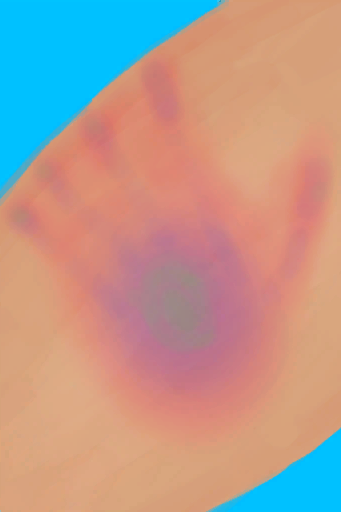

# I failed!  
> The Enemy has bested you! Your souls starts to unravel.  
  
<table class="table table-bordered" data-toggle="table"  data-show-header="false"><thead style="display:none"><tr ><th  style="width:50%;text-align:left;vertical-align:top;"  data-sortable="true"  >title</th><th  style="width:50%;text-align:left;vertical-align:top;"  ></th></tr></thead><tr ><td  style="width:50%;text-align:left;vertical-align:top;"  ></td><td  style="width:50%;text-align:left;vertical-align:top;"  >

<a href="Event_EnemyFightFailure.md" style="color:black">I failed!</a>

</td></tr></tbody></table>  
  
## Got From  

Attack with Spear!

[The Enemy is here!(Event)](Event_EnemyFight.md)

Attack with Bow!

[The Enemy is here!(Event)](Event_EnemyFight.md)

Attack with Gun!

[The Enemy is here!(Event)](Event_EnemyFight.md)

Attack with Sling!

[The Enemy is here!(Event)](Event_EnemyFight.md)

  
  
## Action  

<table><tr><td rowspan="2" style="width:200px;text-align:center;font-size:1.3em;font-weight:bold">

Close your eyes

1h

</td><td></td></tr><tr><td><b>Self：</b>→Dismiss</td></tr><tr><td colspan="2"><b>CardChanges：</b>装备中的[Glasses](Glasses.md)Usage  <b>-10</b></td></tr><tr><td colspan="2"><b>StatChange：</b>[

[Morale](Morale.md)](Morale.md)<b>-20</b>, [

[Enemy Prescence](EnemyDefeated.md)](EnemyDefeated.md)<b>-1</b></td></tr><tr><td colspan="2">[

[Unravelling Mark](W_UnravellingMark.md)](W_UnravellingMark.md)(<b>+1</b>)</td></tr></table>
  
  
  

