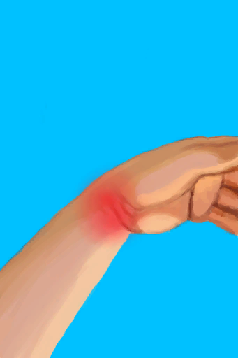
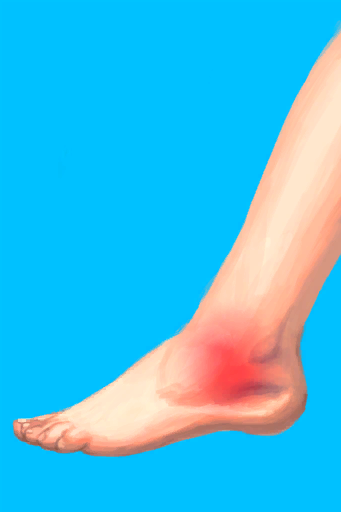

# Fall!  
> You fell and got yourself a sprain... it hurts.  
  
<table class="table table-bordered" data-toggle="table"  data-show-header="false"><thead style="display:none"><tr ><th  style="width:50%;text-align:left;vertical-align:top;"  data-sortable="true"  >title</th><th  style="width:50%;text-align:left;vertical-align:top;"  ></th></tr></thead><tr ><td  style="width:50%;text-align:left;vertical-align:top;"  ></td><td  style="width:50%;text-align:left;vertical-align:top;"  >

<a href="Event_FallSprains.md" style="color:black">Fall!</a>

</td></tr></tbody></table>  
  
## Got From  

...

[Slipped!(Event)](Event_SlipRocks.md)(未实装)

Climb Down

[Shaft](ShaftCrystalChamberToFloodedChamber.md)

Climb Up

[Shaft](ShaftFloodedChamberToCrystalChamber.md)

Climb Down

[Shaft(High Chamber)](ShaftHighChamberToMidChamber.md)

Climb Up

[Shaft](ShaftLowChamberToMidChamber.md)

Climb Up

[Shaft](ShaftMidChamberToHighChamber.md)

Climb Down

[Shaft(High Chamber)](ShaftMidChamberToLowChamber.md)

Climb down

[Hole](HighlandHoleEntrance.md)

Climb Up

[Exit](HighlandHoleExit.md)

Climb Up

[To Jungle Highlands(Secret Cove)](Path_CoveToJungleHighlands.md)

Climb Down

[To Secret Cove(Jungle Highlands)](Path_JungleHighlandsToCove.md)

Climb Down

[To Valley Cliffs](Path_JungleHighlandsToValley.md)(未实装)

Climb

[To Wetlands Cliff](Path_JungleHighlandsToWetlands.md)

Climb Up

[To Jungle Highlands](Path_ValleyToJungleHighlands.md)(未实装)

Climb Up

[To Jungle Highlands(Wetlands)](Path_WetlandsToJungleHighlands.md)

Climb

[Palm Tree](PalmTreeNew.md)

Climb

[Palm Tree](PalmTreeNewMultiEventOld.md)

Climb

[Palm Tree](PalmTreeOld.md)(未实装)

Climb

[Sap Station](PalmTreeSapStation.md)(未实装)

Climb

[Empty Sap Station(Empty)](PalmTreeSapStationEmpty.md)(未实装)

  
  
## Action  

<table><tr><td rowspan="2" style="width:200px;text-align:center;font-size:1.3em;font-weight:bold">

Nice

</td><td></td></tr><tr><td><b>Self：</b>→Dismiss</td></tr><tr><td colspan="2"><b>CardChanges：</b>装备中的[Glasses](Glasses.md)Usage  <b>-10</b></td></tr><tr><td colspan="2"><b>StatChange：</b>[

[Filth](Filth.md)](Filth.md)<b>+30</b></td></tr><tr><td colspan="2">

<table style="margin-bottom:3px;"><tr><td rowspan=2 style="text-align:center" width="80px">
Base Weight

2
</td><td style="font-size:0.6em;line-height:0.6em;font-weight:bold">Arm L</td></tr><tr><td>[

[Sprained Wrist](W_ArmSprainedL.md)](W_ArmSprainedL.md)(<b>+1</b>)</td></tr></table>

<table style="margin-bottom:3px;"><tr><td rowspan=2 style="text-align:center" width="80px">
Base Weight

2
</td><td style="font-size:0.6em;line-height:0.6em;font-weight:bold">Arm R</td></tr><tr><td>[

[Sprained Wrist](W_ArmSprainedR.md)](W_ArmSprainedR.md)(<b>+1</b>)</td></tr></table>

<table style="margin-bottom:3px;"><tr><td rowspan=2 style="text-align:center" width="80px">
Base Weight

1
</td><td style="font-size:0.6em;line-height:0.6em;font-weight:bold">Leg R</td></tr><tr><td>[

[Sprained Ankle](W_LegSprainedR.md)](W_LegSprainedR.md)(<b>+1</b>)</td></tr></table>

<table style="margin-bottom:3px;"><tr><td rowspan=2 style="text-align:center" width="80px">
Base Weight

1
</td><td style="font-size:0.6em;line-height:0.6em;font-weight:bold">Leg L</td></tr><tr><td>[

[Sprained Ankle](W_LegSprainedL.md)](W_LegSprainedL.md)(<b>+1</b>)</td></tr></table>

</td></tr></table>
  
  
  

