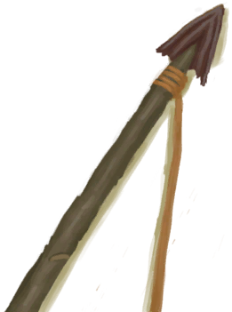

# A Goat!  
> Should I try to catch it?  
  
<table class="table table-bordered" data-toggle="table"  data-show-header="false"><thead style="display:none"><tr ><th  style="width:50%;text-align:left;vertical-align:top;"  data-sortable="true"  >title</th><th  style="width:50%;text-align:left;vertical-align:top;"  ></th></tr></thead><tr ><td  style="width:50%;text-align:left;vertical-align:top;"  ></td><td  style="width:50%;text-align:left;vertical-align:top;"  >

<a href="Event_GoatFight.md" style="color:black">A Goat!</a>

</td></tr></tbody></table>  
  
## Got From  

Explore

[Eastern Grasslands](GrasslandsE.md)

Explore

[Western Grasslands](GrasslandsW.md)

Explore

[Eastern Highlands](HighlandsEastern.md)

Explore

[Western Highlands](HighlandsWestern.md)

  
  
## Action  

<table><tr><td rowspan="2" style="width:200px;text-align:center;font-size:1.3em;font-weight:bold">

Throw Rock at it

15m

</td><td></td></tr><tr><td><b>Self：</b>→Dismiss</td></tr><tr><td colspan="2"><b>StatChange：</b>[

[Rock Throwing(Skill)](Skill_RockThrowing.md)](Skill_RockThrowing.md)<b>+1</b></td></tr><tr><td colspan="2">

<table style="margin-bottom:3px;"><tr><td rowspan=2 style="text-align:center" width="80px">
Base Weight

0
</td><td style="font-size:0.6em;line-height:0.6em;font-weight:bold">Success</td></tr><tr><td>[

[Got it!(Event)](Event_GoatFightSuccess.md)](Event_GoatFightSuccess.md)(<b>+1</b>)</td></tr><tr><td colspan=2><li>[

[Rock Throwing(Skill)](Skill_RockThrowing.md)](Skill_RockThrowing.md) in <b>1～150</b>, weight <b>+0～+50</b></li><li>[Hand Modifier](ModifierHand.md) in <b>0～3</b>, weight <b>+0～-125</b></li><li>[

[Dog Friend](DogFriend.md)](DogFriend.md) On *Hand/Board*，Weight<b>+25</b>,</li></td></tr></table>

<table style="margin-bottom:3px;"><tr><td rowspan=2 style="text-align:center" width="80px">
Base Weight

50
</td><td style="font-size:0.6em;line-height:0.6em;font-weight:bold">Failure</td></tr><tr><td>[

[It Escaped!(Event)](Event_GoatFightFailure.md)](Event_GoatFightFailure.md)(<b>+1</b>)</td></tr></table>
<button class="btn btn-secondary btn-sm" style="" data-toggle="modal" onclick="setCollectionDataBase64('eyJ0aXRsZSI6IlNpbXVsYXRvcjogVGhyb3cgUm9jayBhdCBpdCAoQSBHb2F0ISkiLCJjb2xsZWN0aW9ucyI6W3siZHJvcCI6IjxkaXYgc3R5bGU9XCJ3aWR0aDoyNXB4O2Rpc3BsYXk6aW5saW5lLWJsb2NrO3RleHQtYWxpZ246Y2VudGVyXCI+PGltZyBkZWNvZGluZz1cImFzeW5jXCIgc3JjPVwiU3ByaXRlL0dvYXRDYXJjYXNzLnBuZ1wiIGhyZWY9XCJhLm1kXCIgc3R5bGU9XCJtYXgtd2lkdGg6MjVweDttYXgtaGVpZ2h0OjI1cHg7XCI+PC9kaXY+R290IGl0IShFdmVudCkiLCJiYXNlIjowLCJjb25kaXRpb24iOlt7ImtleSI6IlNraWxsX1JvY2tUaHJvd2luZyIsInRpdGxlIjoiUm9jayBUaHJvd2luZyhTa2lsbCkiLCJ0eXBlIjoicmFuZ2UiLCJtYXgiOlswLDE1MF0sInJhbmdlIjpbMSwxNTBdLCJ3ZWlnaHQiOlswLDUwXSwiZGVmYXVsdFZhbHVlIjowLCJ3aGVuT3V0T2ZSYW5nZSI6MX0seyJrZXkiOiJNb2RpZmllckhhbmQiLCJ0aXRsZSI6IkhhbmQgTW9kaWZpZXIiLCJ0eXBlIjoicmFuZ2UiLCJtYXgiOlswLDNdLCJyYW5nZSI6WzAsM10sIndlaWdodCI6WzAsLTEyNV0sImRlZmF1bHRWYWx1ZSI6MCwid2hlbk91dE9mUmFuZ2UiOjF9LHsia2V5IjoiRG9nRnJpZW5kIiwidGl0bGUiOiI8ZGl2IHN0eWxlPVwid2lkdGg6MjBweDtkaXNwbGF5OmlubGluZS1ibG9jazt0ZXh0LWFsaWduOmNlbnRlclwiPjxpbWcgZGVjb2Rpbmc9XCJhc3luY1wiIHNyYz1cIlNwcml0ZS9Eb2cucG5nXCIgaHJlZj1cImEubWRcIiBzdHlsZT1cIm1heC13aWR0aDoyMHB4O21heC1oZWlnaHQ6MjBweDtcIj48L2Rpdj5Eb2cgRnJpZW5kIE9uICpIYW5kL0JvYXJkKu+8jCIsInR5cGUiOiJ0b2dnbGUiLCJyYW5nZSI6WzAsMV0sIm1heCI6WzAsMV0sIndlaWdodCI6WzAsMjVdLCJkZWZhdWx0VmFsdWUiOjAsIndoZW5PdXRPZlJhbmdlIjowLCJtYXhTdGFja0dyb3VwIjoiIn1dfSx7ImRyb3AiOiI8ZGl2IHN0eWxlPVwid2lkdGg6MjVweDtkaXNwbGF5OmlubGluZS1ibG9jazt0ZXh0LWFsaWduOmNlbnRlclwiPjxpbWcgZGVjb2Rpbmc9XCJhc3luY1wiIHNyYz1cIlNwcml0ZS9IaWdobGFuZHMucG5nXCIgaHJlZj1cImEubWRcIiBzdHlsZT1cIm1heC13aWR0aDoyNXB4O21heC1oZWlnaHQ6MjVweDtcIj48L2Rpdj5JdCBFc2NhcGVkIShFdmVudCkiLCJiYXNlIjo1MCwiY29uZGl0aW9uIjpbXX1dfQ==')" data-target="#modelCollectionSimulator">Simulator</button>
</td></tr></table>
  

<table><tr><td rowspan="2" style="width:200px;text-align:center;font-size:1.3em;font-weight:bold">

Use Spear

15m

</td><td></td></tr><tr><td><b>Self：</b>→Dismiss</td></tr><tr><td colspan="2"><b>Require：</b>[“Spear T1”](tag_Spear.md) On Hand/Equip(Partial)</td></tr><tr><td colspan="2"><b>CardChanges：</b>手牌中的一个[“Spear T1”](tag_Spear.md)Usage  <b>-1</b></td></tr><tr><td colspan="2"><b>StatChange：</b>[

[Spear Fighting(Skill)](Skill_SpearFighting.md)](Skill_SpearFighting.md)<b>+1</b></td></tr><tr><td colspan="2">

<table style="margin-bottom:3px;"><tr><td rowspan=2 style="text-align:center" width="80px">
Base Weight

0
</td><td style="font-size:0.6em;line-height:0.6em;font-weight:bold">Success</td></tr><tr><td>[

[Got it!(Event)](Event_GoatFightSuccess.md)](Event_GoatFightSuccess.md)(<b>+1</b>)</td></tr><tr><td colspan=2><li>[

[Spear Fighting(Skill)](Skill_SpearFighting.md)](Skill_SpearFighting.md) in <b>1～150</b>, weight <b>+0～+150</b></li><li>[

[Eyesight](Myopia.md)](Myopia.md) in <b>0～3</b>, weight <b>+0～-100</b></li><li>[Hand Modifier](ModifierHand.md) in <b>0～3</b>, weight <b>+0～-125</b></li>Max 1 of：<li>[

[Flint Spear](SpearFlint.md)](SpearFlint.md) On *Hand/Equip*，Weight<b>+10</b>,</li><li>[

[Copper Spear](SpearCopper.md)](SpearCopper.md) On *Hand/Equip*，Weight<b>+30</b>,</li><li>[

[Scrap Spear](SpearScrap.md)](SpearScrap.md) On *Hand/Equip*，Weight<b>+20</b>,</li><li>[

[Obsidian Spear](SpearObsidian.md)](SpearObsidian.md) On *Hand/Equip*，Weight<b>+25</b>,</li><li>[

[Dog Friend](DogFriend.md)](DogFriend.md) On *Hand/Board*，Weight<b>+25</b>,</li></td></tr></table>

<table style="margin-bottom:3px;"><tr><td rowspan=2 style="text-align:center" width="80px">
Base Weight

30
</td><td style="font-size:0.6em;line-height:0.6em;font-weight:bold">Failure</td></tr><tr><td>[

[It Escaped!(Event)](Event_GoatFightFailure.md)](Event_GoatFightFailure.md)(<b>+1</b>)</td></tr></table>
<button class="btn btn-secondary btn-sm" style="" data-toggle="modal" onclick="setCollectionDataBase64('eyJ0aXRsZSI6IlNpbXVsYXRvcjogVXNlIFNwZWFyIChBIEdvYXQhKSIsImNvbGxlY3Rpb25zIjpbeyJkcm9wIjoiPGRpdiBzdHlsZT1cIndpZHRoOjI1cHg7ZGlzcGxheTppbmxpbmUtYmxvY2s7dGV4dC1hbGlnbjpjZW50ZXJcIj48aW1nIGRlY29kaW5nPVwiYXN5bmNcIiBzcmM9XCJTcHJpdGUvR29hdENhcmNhc3MucG5nXCIgaHJlZj1cImEubWRcIiBzdHlsZT1cIm1heC13aWR0aDoyNXB4O21heC1oZWlnaHQ6MjVweDtcIj48L2Rpdj5Hb3QgaXQhKEV2ZW50KSIsImJhc2UiOjAsImNvbmRpdGlvbiI6W3sia2V5IjoiU2tpbGxfU3BlYXJGaWdodGluZyIsInRpdGxlIjoiU3BlYXIgRmlnaHRpbmcoU2tpbGwpIiwidHlwZSI6InJhbmdlIiwibWF4IjpbMCwxNTBdLCJyYW5nZSI6WzEsMTUwXSwid2VpZ2h0IjpbMCwxNTBdLCJkZWZhdWx0VmFsdWUiOjAsIndoZW5PdXRPZlJhbmdlIjoxfSx7ImtleSI6Ik15b3BpYSIsInRpdGxlIjoiRXllc2lnaHQiLCJ0eXBlIjoicmFuZ2UiLCJtYXgiOlswLDNdLCJyYW5nZSI6WzAsM10sIndlaWdodCI6WzAsLTEwMF0sImRlZmF1bHRWYWx1ZSI6MCwid2hlbk91dE9mUmFuZ2UiOjF9LHsia2V5IjoiTW9kaWZpZXJIYW5kIiwidGl0bGUiOiJIYW5kIE1vZGlmaWVyIiwidHlwZSI6InJhbmdlIiwibWF4IjpbMCwzXSwicmFuZ2UiOlswLDNdLCJ3ZWlnaHQiOlswLC0xMjVdLCJkZWZhdWx0VmFsdWUiOjAsIndoZW5PdXRPZlJhbmdlIjoxfSx7ImtleSI6IlNwZWFyRmxpbnQiLCJ0aXRsZSI6IjxkaXYgc3R5bGU9XCJ3aWR0aDoyMHB4O2Rpc3BsYXk6aW5saW5lLWJsb2NrO3RleHQtYWxpZ246Y2VudGVyXCI+PGltZyBkZWNvZGluZz1cImFzeW5jXCIgc3JjPVwiU3ByaXRlL1NwZWFyRmxpbnQucG5nXCIgaHJlZj1cImEubWRcIiBzdHlsZT1cIm1heC13aWR0aDoyMHB4O21heC1oZWlnaHQ6MjBweDtcIj48L2Rpdj5GbGludCBTcGVhciBPbiAqSGFuZC9FcXVpcCrvvIwiLCJ0eXBlIjoidG9nZ2xlIiwicmFuZ2UiOlswLDFdLCJtYXgiOlswLDFdLCJ3ZWlnaHQiOlswLDEwXSwiZGVmYXVsdFZhbHVlIjowLCJ3aGVuT3V0T2ZSYW5nZSI6MCwibWF4U3RhY2tHcm91cCI6Ik1BWF9TVEFDS19TdWNjZXNzIn0seyJrZXkiOiJTcGVhckNvcHBlciIsInRpdGxlIjoiPGRpdiBzdHlsZT1cIndpZHRoOjIwcHg7ZGlzcGxheTppbmxpbmUtYmxvY2s7dGV4dC1hbGlnbjpjZW50ZXJcIj48aW1nIGRlY29kaW5nPVwiYXN5bmNcIiBzcmM9XCJTcHJpdGUvU3BlYXJDb3BwZXIucG5nXCIgaHJlZj1cImEubWRcIiBzdHlsZT1cIm1heC13aWR0aDoyMHB4O21heC1oZWlnaHQ6MjBweDtcIj48L2Rpdj5Db3BwZXIgU3BlYXIgT24gKkhhbmQvRXF1aXAq77yMIiwidHlwZSI6InRvZ2dsZSIsInJhbmdlIjpbMCwxXSwibWF4IjpbMCwxXSwid2VpZ2h0IjpbMCwzMF0sImRlZmF1bHRWYWx1ZSI6MCwid2hlbk91dE9mUmFuZ2UiOjAsIm1heFN0YWNrR3JvdXAiOiJNQVhfU1RBQ0tfU3VjY2VzcyJ9LHsia2V5IjoiU3BlYXJTY3JhcCIsInRpdGxlIjoiPGRpdiBzdHlsZT1cIndpZHRoOjIwcHg7ZGlzcGxheTppbmxpbmUtYmxvY2s7dGV4dC1hbGlnbjpjZW50ZXJcIj48aW1nIGRlY29kaW5nPVwiYXN5bmNcIiBzcmM9XCJTcHJpdGUvU3BlYXJTY3JhcC5wbmdcIiBocmVmPVwiYS5tZFwiIHN0eWxlPVwibWF4LXdpZHRoOjIwcHg7bWF4LWhlaWdodDoyMHB4O1wiPjwvZGl2PlNjcmFwIFNwZWFyIE9uICpIYW5kL0VxdWlwKu+8jCIsInR5cGUiOiJ0b2dnbGUiLCJyYW5nZSI6WzAsMV0sIm1heCI6WzAsMV0sIndlaWdodCI6WzAsMjBdLCJkZWZhdWx0VmFsdWUiOjAsIndoZW5PdXRPZlJhbmdlIjowLCJtYXhTdGFja0dyb3VwIjoiTUFYX1NUQUNLX1N1Y2Nlc3MifSx7ImtleSI6IlNwZWFyT2JzaWRpYW4iLCJ0aXRsZSI6IjxkaXYgc3R5bGU9XCJ3aWR0aDoyMHB4O2Rpc3BsYXk6aW5saW5lLWJsb2NrO3RleHQtYWxpZ246Y2VudGVyXCI+PGltZyBkZWNvZGluZz1cImFzeW5jXCIgc3JjPVwiU3ByaXRlL1NwZWFyT2JzaWRpYW4ucG5nXCIgaHJlZj1cImEubWRcIiBzdHlsZT1cIm1heC13aWR0aDoyMHB4O21heC1oZWlnaHQ6MjBweDtcIj48L2Rpdj5PYnNpZGlhbiBTcGVhciBPbiAqSGFuZC9FcXVpcCrvvIwiLCJ0eXBlIjoidG9nZ2xlIiwicmFuZ2UiOlswLDFdLCJtYXgiOlswLDFdLCJ3ZWlnaHQiOlswLDI1XSwiZGVmYXVsdFZhbHVlIjowLCJ3aGVuT3V0T2ZSYW5nZSI6MCwibWF4U3RhY2tHcm91cCI6Ik1BWF9TVEFDS19TdWNjZXNzIn0seyJrZXkiOiJEb2dGcmllbmQiLCJ0aXRsZSI6IjxkaXYgc3R5bGU9XCJ3aWR0aDoyMHB4O2Rpc3BsYXk6aW5saW5lLWJsb2NrO3RleHQtYWxpZ246Y2VudGVyXCI+PGltZyBkZWNvZGluZz1cImFzeW5jXCIgc3JjPVwiU3ByaXRlL0RvZy5wbmdcIiBocmVmPVwiYS5tZFwiIHN0eWxlPVwibWF4LXdpZHRoOjIwcHg7bWF4LWhlaWdodDoyMHB4O1wiPjwvZGl2PkRvZyBGcmllbmQgT24gKkhhbmQvQm9hcmQq77yMIiwidHlwZSI6InRvZ2dsZSIsInJhbmdlIjpbMCwxXSwibWF4IjpbMCwxXSwid2VpZ2h0IjpbMCwyNV0sImRlZmF1bHRWYWx1ZSI6MCwid2hlbk91dE9mUmFuZ2UiOjAsIm1heFN0YWNrR3JvdXAiOiJNQVhfU1RBQ0tfU3VjY2VzcyJ9XX0seyJkcm9wIjoiPGRpdiBzdHlsZT1cIndpZHRoOjI1cHg7ZGlzcGxheTppbmxpbmUtYmxvY2s7dGV4dC1hbGlnbjpjZW50ZXJcIj48aW1nIGRlY29kaW5nPVwiYXN5bmNcIiBzcmM9XCJTcHJpdGUvSGlnaGxhbmRzLnBuZ1wiIGhyZWY9XCJhLm1kXCIgc3R5bGU9XCJtYXgtd2lkdGg6MjVweDttYXgtaGVpZ2h0OjI1cHg7XCI+PC9kaXY+SXQgRXNjYXBlZCEoRXZlbnQpIiwiYmFzZSI6MzAsImNvbmRpdGlvbiI6W119XX0=')" data-target="#modelCollectionSimulator">Simulator</button>
</td></tr></table>
  

<table><tr><td rowspan="2" style="width:200px;text-align:center;font-size:1.3em;font-weight:bold">

Use Sling

15m

</td><td></td></tr><tr><td><b>Self：</b>→Dismiss</td></tr><tr><td colspan="2"><b>Require：</b>[

[Sling](Sling.md)](Sling.md) On Hand</td></tr><tr><td colspan="2"><b>CardChanges：</b>手牌中的一个[Sling](Sling.md)Usage  <b>-1</b></td></tr><tr><td colspan="2"><b>StatChange：</b>[

[Sling(Skill)](Skill_Sling.md)](Skill_Sling.md)<b>+1</b></td></tr><tr><td colspan="2">

<table style="margin-bottom:3px;"><tr><td rowspan=2 style="text-align:center" width="80px">
Base Weight

0
</td><td style="font-size:0.6em;line-height:0.6em;font-weight:bold">Success</td></tr><tr><td>[

[Got it!(Event)](Event_GoatFightSuccess.md)](Event_GoatFightSuccess.md)(<b>+1</b>)</td></tr><tr><td colspan=2><li>[

[Sling(Skill)](Skill_Sling.md)](Skill_Sling.md) in <b>1～150</b>, weight <b>+0～+150</b></li><li>[

[Eyesight](Myopia.md)](Myopia.md) in <b>0～3</b>, weight <b>+0～-100</b></li><li>[Hand Modifier](ModifierHand.md) in <b>0～3</b>, weight <b>+0～-125</b></li><li>[

[Dog Friend](DogFriend.md)](DogFriend.md) On *Hand/Board*，Weight<b>+25</b>,</li></td></tr></table>

<table style="margin-bottom:3px;"><tr><td rowspan=2 style="text-align:center" width="80px">
Base Weight

75
</td><td style="font-size:0.6em;line-height:0.6em;font-weight:bold">Failure</td></tr><tr><td>[

[It Escaped!(Event)](Event_GoatFightFailure.md)](Event_GoatFightFailure.md)(<b>+1</b>)</td></tr></table>
<button class="btn btn-secondary btn-sm" style="" data-toggle="modal" onclick="setCollectionDataBase64('eyJ0aXRsZSI6IlNpbXVsYXRvcjogVXNlIFNsaW5nIChBIEdvYXQhKSIsImNvbGxlY3Rpb25zIjpbeyJkcm9wIjoiPGRpdiBzdHlsZT1cIndpZHRoOjI1cHg7ZGlzcGxheTppbmxpbmUtYmxvY2s7dGV4dC1hbGlnbjpjZW50ZXJcIj48aW1nIGRlY29kaW5nPVwiYXN5bmNcIiBzcmM9XCJTcHJpdGUvR29hdENhcmNhc3MucG5nXCIgaHJlZj1cImEubWRcIiBzdHlsZT1cIm1heC13aWR0aDoyNXB4O21heC1oZWlnaHQ6MjVweDtcIj48L2Rpdj5Hb3QgaXQhKEV2ZW50KSIsImJhc2UiOjAsImNvbmRpdGlvbiI6W3sia2V5IjoiU2tpbGxfU2xpbmciLCJ0aXRsZSI6IlNsaW5nKFNraWxsKSIsInR5cGUiOiJyYW5nZSIsIm1heCI6WzAsMTUwXSwicmFuZ2UiOlsxLDE1MF0sIndlaWdodCI6WzAsMTUwXSwiZGVmYXVsdFZhbHVlIjowLCJ3aGVuT3V0T2ZSYW5nZSI6MX0seyJrZXkiOiJNeW9waWEiLCJ0aXRsZSI6IkV5ZXNpZ2h0IiwidHlwZSI6InJhbmdlIiwibWF4IjpbMCwzXSwicmFuZ2UiOlswLDNdLCJ3ZWlnaHQiOlswLC0xMDBdLCJkZWZhdWx0VmFsdWUiOjAsIndoZW5PdXRPZlJhbmdlIjoxfSx7ImtleSI6Ik1vZGlmaWVySGFuZCIsInRpdGxlIjoiSGFuZCBNb2RpZmllciIsInR5cGUiOiJyYW5nZSIsIm1heCI6WzAsM10sInJhbmdlIjpbMCwzXSwid2VpZ2h0IjpbMCwtMTI1XSwiZGVmYXVsdFZhbHVlIjowLCJ3aGVuT3V0T2ZSYW5nZSI6MX0seyJrZXkiOiJEb2dGcmllbmQiLCJ0aXRsZSI6IjxkaXYgc3R5bGU9XCJ3aWR0aDoyMHB4O2Rpc3BsYXk6aW5saW5lLWJsb2NrO3RleHQtYWxpZ246Y2VudGVyXCI+PGltZyBkZWNvZGluZz1cImFzeW5jXCIgc3JjPVwiU3ByaXRlL0RvZy5wbmdcIiBocmVmPVwiYS5tZFwiIHN0eWxlPVwibWF4LXdpZHRoOjIwcHg7bWF4LWhlaWdodDoyMHB4O1wiPjwvZGl2PkRvZyBGcmllbmQgT24gKkhhbmQvQm9hcmQq77yMIiwidHlwZSI6InRvZ2dsZSIsInJhbmdlIjpbMCwxXSwibWF4IjpbMCwxXSwid2VpZ2h0IjpbMCwyNV0sImRlZmF1bHRWYWx1ZSI6MCwid2hlbk91dE9mUmFuZ2UiOjAsIm1heFN0YWNrR3JvdXAiOiIifV19LHsiZHJvcCI6IjxkaXYgc3R5bGU9XCJ3aWR0aDoyNXB4O2Rpc3BsYXk6aW5saW5lLWJsb2NrO3RleHQtYWxpZ246Y2VudGVyXCI+PGltZyBkZWNvZGluZz1cImFzeW5jXCIgc3JjPVwiU3ByaXRlL0hpZ2hsYW5kcy5wbmdcIiBocmVmPVwiYS5tZFwiIHN0eWxlPVwibWF4LXdpZHRoOjI1cHg7bWF4LWhlaWdodDoyNXB4O1wiPjwvZGl2Pkl0IEVzY2FwZWQhKEV2ZW50KSIsImJhc2UiOjc1LCJjb25kaXRpb24iOltdfV19')" data-target="#modelCollectionSimulator">Simulator</button>
</td></tr></table>
  

<table><tr><td rowspan="2" style="width:200px;text-align:center;font-size:1.3em;font-weight:bold">

Attack with Bow

15m

</td><td></td></tr><tr><td><b>Self：</b>→Dismiss</td></tr><tr><td colspan="2"><b>Require：</b>[

[Rustic Bow](BowRustic.md)](BowRustic.md) On Hand/Equip, [

[Simple Arrow](ArrowSimple.md)](ArrowSimple.md) On Hand</td></tr><tr><td colspan="2"><b>CardChanges：</b>手牌中的一个[Rustic Bow](BowRustic.md)Usage  <b>-1</b>, 手牌中的一个[Simple Arrow](ArrowSimple.md)Usage  <b>-3～-1</b></td></tr><tr><td colspan="2"><b>StatChange：</b>[

[Archery(Skill)](Skill_Archery.md)](Skill_Archery.md)<b>+1</b></td></tr><tr><td colspan="2">

<table style="margin-bottom:3px;"><tr><td rowspan=2 style="text-align:center" width="80px">
Base Weight

0
</td><td style="font-size:0.6em;line-height:0.6em;font-weight:bold">Success</td></tr><tr><td>[

[Got it!(Event)](Event_GoatFightSuccess.md)](Event_GoatFightSuccess.md)(<b>+1</b>)</td></tr><tr><td colspan=2><li>[

[Archery(Skill)](Skill_Archery.md)](Skill_Archery.md) in <b>1～150</b>, weight <b>+0～+150</b></li><li>[

[Eyesight](Myopia.md)](Myopia.md) in <b>0～3</b>, weight <b>+0～-100</b></li><li>[Hand Modifier](ModifierHand.md) in <b>0～3</b>, weight <b>+0～-125</b></li></td></tr></table>

<table style="margin-bottom:3px;"><tr><td rowspan=2 style="text-align:center" width="80px">
Base Weight

30
</td><td style="font-size:0.6em;line-height:0.6em;font-weight:bold">Failure</td></tr><tr><td>[

[It Escaped!(Event)](Event_GoatFightFailure.md)](Event_GoatFightFailure.md)(<b>+1</b>)</td></tr></table>
<button class="btn btn-secondary btn-sm" style="" data-toggle="modal" onclick="setCollectionDataBase64('eyJ0aXRsZSI6IlNpbXVsYXRvcjogQXR0YWNrIHdpdGggQm93IChBIEdvYXQhKSIsImNvbGxlY3Rpb25zIjpbeyJkcm9wIjoiPGRpdiBzdHlsZT1cIndpZHRoOjI1cHg7ZGlzcGxheTppbmxpbmUtYmxvY2s7dGV4dC1hbGlnbjpjZW50ZXJcIj48aW1nIGRlY29kaW5nPVwiYXN5bmNcIiBzcmM9XCJTcHJpdGUvR29hdENhcmNhc3MucG5nXCIgaHJlZj1cImEubWRcIiBzdHlsZT1cIm1heC13aWR0aDoyNXB4O21heC1oZWlnaHQ6MjVweDtcIj48L2Rpdj5Hb3QgaXQhKEV2ZW50KSIsImJhc2UiOjAsImNvbmRpdGlvbiI6W3sia2V5IjoiU2tpbGxfQXJjaGVyeSIsInRpdGxlIjoiQXJjaGVyeShTa2lsbCkiLCJ0eXBlIjoicmFuZ2UiLCJtYXgiOlswLDE1MF0sInJhbmdlIjpbMSwxNTBdLCJ3ZWlnaHQiOlswLDE1MF0sImRlZmF1bHRWYWx1ZSI6MCwid2hlbk91dE9mUmFuZ2UiOjF9LHsia2V5IjoiTXlvcGlhIiwidGl0bGUiOiJFeWVzaWdodCIsInR5cGUiOiJyYW5nZSIsIm1heCI6WzAsM10sInJhbmdlIjpbMCwzXSwid2VpZ2h0IjpbMCwtMTAwXSwiZGVmYXVsdFZhbHVlIjowLCJ3aGVuT3V0T2ZSYW5nZSI6MX0seyJrZXkiOiJNb2RpZmllckhhbmQiLCJ0aXRsZSI6IkhhbmQgTW9kaWZpZXIiLCJ0eXBlIjoicmFuZ2UiLCJtYXgiOlswLDNdLCJyYW5nZSI6WzAsM10sIndlaWdodCI6WzAsLTEyNV0sImRlZmF1bHRWYWx1ZSI6MCwid2hlbk91dE9mUmFuZ2UiOjF9XX0seyJkcm9wIjoiPGRpdiBzdHlsZT1cIndpZHRoOjI1cHg7ZGlzcGxheTppbmxpbmUtYmxvY2s7dGV4dC1hbGlnbjpjZW50ZXJcIj48aW1nIGRlY29kaW5nPVwiYXN5bmNcIiBzcmM9XCJTcHJpdGUvSGlnaGxhbmRzLnBuZ1wiIGhyZWY9XCJhLm1kXCIgc3R5bGU9XCJtYXgtd2lkdGg6MjVweDttYXgtaGVpZ2h0OjI1cHg7XCI+PC9kaXY+SXQgRXNjYXBlZCEoRXZlbnQpIiwiYmFzZSI6MzAsImNvbmRpdGlvbiI6W119XX0=')" data-target="#modelCollectionSimulator">Simulator</button>
</td></tr></table>
  

<table><tr><td rowspan="2" style="width:200px;text-align:center;font-size:1.3em;font-weight:bold">

Attack with Gun!

30m

</td><td></td></tr><tr><td><b>Self：</b>→Dismiss</td></tr><tr><td colspan="2"><b>Require：</b>[

[Gun](Gun.md)](Gun.md) On Hand</td></tr><tr><td colspan="2"><b>CardChanges：</b>手牌中的一个[Gun](Gun.md)Usage  <b>-1</b></td></tr><tr><td colspan="2"><b>StatChange：</b>[

[Handguns(Skill)](Skill_Handguns.md)](Skill_Handguns.md)<b>+1</b></td></tr><tr><td colspan="2">

<table style="margin-bottom:3px;"><tr><td rowspan=2 style="text-align:center" width="80px">
Base Weight

50
</td><td style="font-size:0.6em;line-height:0.6em;font-weight:bold">Success</td></tr><tr><td>[

[Got it!(Event)](Event_GoatFightSuccess.md)](Event_GoatFightSuccess.md)(<b>+1</b>)</td></tr><tr><td colspan=2><li>[

[Handguns(Skill)](Skill_Handguns.md)](Skill_Handguns.md) in <b>0～150</b>, weight <b>+1～+150</b></li><li>[

[Eyesight](Myopia.md)](Myopia.md) in <b>0～3</b>, weight <b>+0～-100</b></li><li>[Hand Modifier](ModifierHand.md) in <b>0～3</b>, weight <b>+0～-125</b></li></td></tr></table>

<table style="margin-bottom:3px;"><tr><td rowspan=2 style="text-align:center" width="80px">
Base Weight

25
</td><td style="font-size:0.6em;line-height:0.6em;font-weight:bold">Failure</td></tr><tr><td>[

[It Escaped!(Event)](Event_GoatFightFailure.md)](Event_GoatFightFailure.md)(<b>+1</b>)</td></tr></table>
<button class="btn btn-secondary btn-sm" style="" data-toggle="modal" onclick="setCollectionDataBase64('eyJ0aXRsZSI6IlNpbXVsYXRvcjogQXR0YWNrIHdpdGggR3VuISAoQSBHb2F0ISkiLCJjb2xsZWN0aW9ucyI6W3siZHJvcCI6IjxkaXYgc3R5bGU9XCJ3aWR0aDoyNXB4O2Rpc3BsYXk6aW5saW5lLWJsb2NrO3RleHQtYWxpZ246Y2VudGVyXCI+PGltZyBkZWNvZGluZz1cImFzeW5jXCIgc3JjPVwiU3ByaXRlL0dvYXRDYXJjYXNzLnBuZ1wiIGhyZWY9XCJhLm1kXCIgc3R5bGU9XCJtYXgtd2lkdGg6MjVweDttYXgtaGVpZ2h0OjI1cHg7XCI+PC9kaXY+R290IGl0IShFdmVudCkiLCJiYXNlIjo1MCwiY29uZGl0aW9uIjpbeyJrZXkiOiJTa2lsbF9IYW5kZ3VucyIsInRpdGxlIjoiSGFuZGd1bnMoU2tpbGwpIiwidHlwZSI6InJhbmdlIiwibWF4IjpbMCwxNTBdLCJyYW5nZSI6WzAsMTUwXSwid2VpZ2h0IjpbMSwxNTBdLCJkZWZhdWx0VmFsdWUiOjAsIndoZW5PdXRPZlJhbmdlIjoxfSx7ImtleSI6Ik15b3BpYSIsInRpdGxlIjoiRXllc2lnaHQiLCJ0eXBlIjoicmFuZ2UiLCJtYXgiOlswLDNdLCJyYW5nZSI6WzAsM10sIndlaWdodCI6WzAsLTEwMF0sImRlZmF1bHRWYWx1ZSI6MCwid2hlbk91dE9mUmFuZ2UiOjF9LHsia2V5IjoiTW9kaWZpZXJIYW5kIiwidGl0bGUiOiJIYW5kIE1vZGlmaWVyIiwidHlwZSI6InJhbmdlIiwibWF4IjpbMCwzXSwicmFuZ2UiOlswLDNdLCJ3ZWlnaHQiOlswLC0xMjVdLCJkZWZhdWx0VmFsdWUiOjAsIndoZW5PdXRPZlJhbmdlIjoxfV19LHsiZHJvcCI6IjxkaXYgc3R5bGU9XCJ3aWR0aDoyNXB4O2Rpc3BsYXk6aW5saW5lLWJsb2NrO3RleHQtYWxpZ246Y2VudGVyXCI+PGltZyBkZWNvZGluZz1cImFzeW5jXCIgc3JjPVwiU3ByaXRlL0hpZ2hsYW5kcy5wbmdcIiBocmVmPVwiYS5tZFwiIHN0eWxlPVwibWF4LXdpZHRoOjI1cHg7bWF4LWhlaWdodDoyNXB4O1wiPjwvZGl2Pkl0IEVzY2FwZWQhKEV2ZW50KSIsImJhc2UiOjI1LCJjb25kaXRpb24iOltdfV19')" data-target="#modelCollectionSimulator">Simulator</button>
</td></tr></table>
  

<table><tr><td rowspan="2" style="width:200px;text-align:center;font-size:1.3em;font-weight:bold">

Ignore

</td><td></td></tr><tr><td><b>Self：</b>→Dismiss</td></tr></table>
  
  
  

