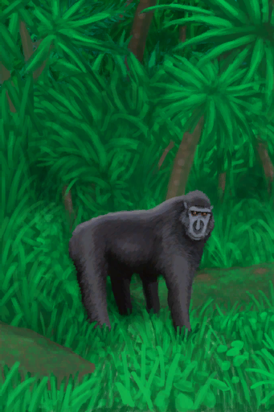

# Plane Crash  
> ... wait a moment. Is that a macaque holding your belt bag over there?  Yes it is! And it's running away now! Your passport's in there!  
  
<table class="table table-bordered" data-toggle="table"  data-show-header="false"><thead style="display:none"><tr ><th  style="width:50%;text-align:left;vertical-align:top;"  data-sortable="true"  >title</th><th  style="width:50%;text-align:left;vertical-align:top;"  ></th></tr></thead><tr ><td  style="width:50%;text-align:left;vertical-align:top;"  ></td><td  style="width:50%;text-align:left;vertical-align:top;"  >

<a href="Event_IntroTourist2.md" style="color:black">Plane Crash</a>

</td></tr></tbody></table>  
  
## Got From  

Continue

[Plane Crash(Event)](Event_IntroTourist1.md)

  
  
## Action  

<table><tr><td rowspan="2" style="width:200px;text-align:center;font-size:1.3em;font-weight:bold">

Get up!

</td><td></td></tr><tr><td><b>Self：</b>→Dismiss</td></tr><tr><td colspan="2"><b>CardChanges：</b>所有[Belt Bag](BeltBag.md)</td></tr></table>
  
  
  

