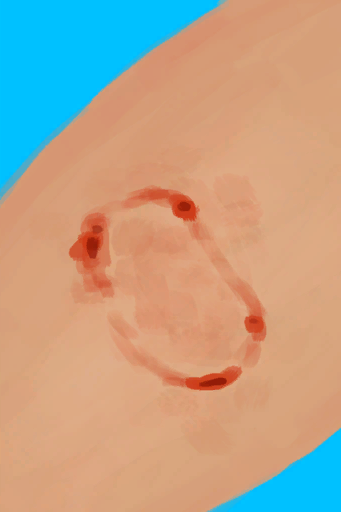

# "I made it  
> "The macaques are retreating  
  
<table class="table table-bordered" data-toggle="table"  data-show-header="false"><thead style="display:none"><tr ><th  style="width:50%;text-align:left;vertical-align:top;"  data-sortable="true"  >title</th><th  style="width:50%;text-align:left;vertical-align:top;"  ></th></tr></thead><tr ><td  style="width:50%;text-align:left;vertical-align:top;"  ></td><td  style="width:50%;text-align:left;vertical-align:top;"  >

<a href="Event_MacaqueDenFightMixedSuccess.md" style="color:black">"I made it</a>

</td></tr></tbody></table>  
  
## Got From  

Attack with Spear!

[The Macaques attack!(Event)](Event_MacaqueDenFight.md)

Attack with Bow!

[The Macaques attack!(Event)](Event_MacaqueDenFight.md)

Attack with Gun!

[The Macaques attack!(Event)](Event_MacaqueDenFight.md)

Attack with Sling!

[The Macaques attack!(Event)](Event_MacaqueDenFight.md)

  
  
## Action  

<table><tr><td rowspan="2" style="width:200px;text-align:center;font-size:1.3em;font-weight:bold">

Continue

</td><td></td></tr><tr><td><b>Self：</b>→Dismiss</td></tr><tr><td colspan="2"><b>CardChanges：</b>装备中的[Glasses](Glasses.md)Usage  <b>-10</b></td></tr><tr><td colspan="2"><b>StatChange：</b>[Population Macaques](Pop_Macaque.md)<b>-1000</b>, [Macaque Fear](MacaqueFear.md)<b>+250</b></td></tr><tr><td colspan="2">[

[Macaque Bite](W_MacaqueBite.md)](W_MacaqueBite.md)(<b>+1～+3</b>), [

[Abrasion](W_Abrasion.md)](W_Abrasion.md)(<b>+0～+2</b>), [

[Macaque Carcass](MacaqueCarcass.md)](MacaqueCarcass.md)(<b>+1</b>), [

[Macaque Den(Environment)](Env_MacaqueDen.md)](Env_MacaqueDen.md)(<b>+1</b>)</td></tr></table>
  
  
  

