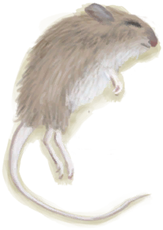

# A gift!  
> Your friend seems to have brought you a gift!  
  
<table class="table table-bordered" data-toggle="table"  data-show-header="false"><thead style="display:none"><tr ><th  style="width:50%;text-align:left;vertical-align:top;"  data-sortable="true"  >title</th><th  style="width:50%;text-align:left;vertical-align:top;"  ></th></tr></thead><tr ><td  style="width:50%;text-align:left;vertical-align:top;"  ></td><td  style="width:50%;text-align:left;vertical-align:top;"  >

<a href="Event_MacaqueFriendGift.md" style="color:black">A gift!</a>

</td></tr></tbody></table>  
  
## Got From  

Transform

[Macaque Friend](MacaqueFriend.md)

  
  
## Action  

<table><tr><td rowspan="2" style="width:200px;text-align:center;font-size:1.3em;font-weight:bold">

Check Gift

</td><td></td></tr><tr><td><b>Self：</b>→Dismiss</td></tr><tr><td colspan="2"><b>StatChange：</b>[

[Morale](Morale.md)](Morale.md)<b>+10</b></td></tr><tr><td colspan="2">

<table style="margin-bottom:3px;"><tr><td rowspan=2 style="text-align:center" width="80px">
Base Weight

2
</td><td style="font-size:0.6em;line-height:0.6em;font-weight:bold">Gift</td></tr><tr><td>[

[Bugs](Bugs.md)](Bugs.md)(<b>+1～+2</b>)</td></tr></table>

<table style="margin-bottom:3px;"><tr><td rowspan=2 style="text-align:center" width="80px">
Base Weight

1
</td><td style="font-size:0.6em;line-height:0.6em;font-weight:bold">Gift</td></tr><tr><td>[

[Dry Leaves](LeavesDry.md)](LeavesDry.md)(<b>+1</b>)</td></tr></table>

<table style="margin-bottom:3px;"><tr><td rowspan=2 style="text-align:center" width="80px">
Base Weight

1
</td><td style="font-size:0.6em;line-height:0.6em;font-weight:bold">Gift</td></tr><tr><td>[

[Egg](Egg.md)](Egg.md)(<b>+1</b>)</td></tr></table>

<table style="margin-bottom:3px;"><tr><td rowspan=2 style="text-align:center" width="80px">
Base Weight

1
</td><td style="font-size:0.6em;line-height:0.6em;font-weight:bold">Gift</td></tr><tr><td>[

[Feathers](Feathers.md)](Feathers.md)(<b>+1</b>)</td></tr></table>

<table style="margin-bottom:3px;"><tr><td rowspan=2 style="text-align:center" width="80px">
Base Weight

1
</td><td style="font-size:0.6em;line-height:0.6em;font-weight:bold">Gift</td></tr><tr><td>[

[Banana](Banana.md)](Banana.md)(<b>+1～+2</b>)</td></tr></table>

<table style="margin-bottom:3px;"><tr><td rowspan=2 style="text-align:center" width="80px">
Base Weight

1
</td><td style="font-size:0.6em;line-height:0.6em;font-weight:bold">Gift</td></tr><tr><td>[

[Tropical Almonds](TropicalAlmonds.md)](TropicalAlmonds.md)(<b>+1</b>)</td></tr></table>

<table style="margin-bottom:3px;"><tr><td rowspan=2 style="text-align:center" width="80px">
Base Weight

1
</td><td style="font-size:0.6em;line-height:0.6em;font-weight:bold">Gift</td></tr><tr><td>[

[Manure](Manure.md)](Manure.md)(<b>+1</b>)</td></tr></table>

<table style="margin-bottom:3px;"><tr><td rowspan=2 style="text-align:center" width="80px">
Base Weight

1
</td><td style="font-size:0.6em;line-height:0.6em;font-weight:bold">Gift</td></tr><tr><td>[

[Dead Mouse](Mouse.md)](Mouse.md)(<b>+1</b>)</td></tr></table>

<table style="margin-bottom:3px;"><tr><td rowspan=2 style="text-align:center" width="80px">
Base Weight

1
</td><td style="font-size:0.6em;line-height:0.6em;font-weight:bold">Gift</td></tr><tr><td>[

[Lizard](Lizard.md)](Lizard.md)(<b>+1</b>)</td></tr></table>

<table style="margin-bottom:3px;"><tr><td rowspan=2 style="text-align:center" width="80px">
Base Weight

1
</td><td style="font-size:0.6em;line-height:0.6em;font-weight:bold">Gift</td></tr><tr><td>[

[Stone](Stone.md)](Stone.md)(<b>+1</b>)</td></tr></table>

<table style="margin-bottom:3px;"><tr><td rowspan=2 style="text-align:center" width="80px">
Base Weight

1
</td><td style="font-size:0.6em;line-height:0.6em;font-weight:bold">Gift</td></tr><tr><td>[

[Coconut](Coconut.md)](Coconut.md)(<b>+1</b>)</td></tr></table>

</td></tr></table>
  
  
  

